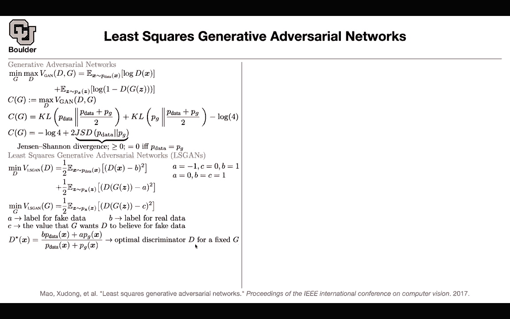
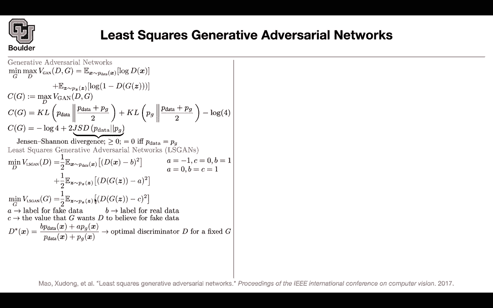

# 【双语字幕+资料下载】科罗拉多 APPLY-DL ｜ 应用深度学习-全知识点覆盖(2021最新·完整版） - P144：L67.1- 最小二乘GAN - ShowMeAI - BV1Dg411F71G

So last session we stopped with this paper and this was very similar to B BRT was for languages。

 this is for images basically you mask some part of your image and then you want your generative neural network to predict what is happening in that regime that you mask so here you are masking pixels over there you are masking birds or actually subwards and this is able to give you features that are reasonable you are doing representation learning that you can do some transfer learning to some other tasks such as classification object detection segmentation etc so let's continue with another type of generative adversarial neural network and that is least squares cans so generative adversarial neural networks a lot of contributions are happening at the loss level so you are changing your loss let's see what happens if。

Change of loss Do we get a better behavior or we don't A quick review of GNs。

 This is the objective function for GNs。 You have a discriminator trying to discriminate between real and fake and you have a generator that is generating images that are as good as real images so that the discriminator is confused and then we know that if you maximize if you maximize the objective of GN if you fix G and then you maximize that objective that's going to give you a D that's going to give you D star。

 If you take that D star and put it in this objective function given the star you can solve for G so you're going to get an objective function in terms of your generator but then after doing some math。

 this math we did in the first paper that we covered on GNs。

 you're going to end up with the Kl divergence of P of data and half of P of data。

Plus P ofg and the reverse of that And this is just a definition of genen channel divergence。

 This is always bigger than or recall to0 and this is gonna be zero if the P of data matches the generated data generated distribution So why did I go through that to remind you that you can have a divergence is showing up it's not like it's a simple game that is going on between a generator and a discriminator there is actually mass behind it and what's going to happen is in the end you're going to end up with the genen channelnon divergence So you are trying to minimize a distance between the generated data and the real data and the job of the discriminator is to make this happen give you an objective function that you can work with perfect what is this squares or LS scans doing you're gonna to say that I'm going have B A and C these are the labels for B is for the real data and then you're doing。

is squares so you want to match D to be equal to B d of x to be equal to B A is a label for the generated data and I'm going to tell you what is B。

 what is a and what is C and then C is for the generated data when you are minimizing with respect to G。

 your generator。

so you have to objective one is minimizing D one is minimizing with respect to G and why indeed D why does it make sense why is it a good objective first of all what numbers can you choose for A C and B A could be negative one C could be zero B could be1 or a could be zero and B and C could be1 because the generator once its samples to look as real as possible so you want G of Z to have the same label as B so that's why B and C you set them to be equal and a to be0 okay it is very similar to what you did up there but why is it useful is there any math behind this framework let's see and as I mentioned a is the label for fake data B is the label for real data and C is the value that the generator once D to believe for fake data that's why you can have three different numbers and。

just numbers these are scrs the same way that up there you could solve for DS star here you can solve for DSSR as well given G what is gonna be your DSR。

 you turn these expectations into integrals and then you take the derivative of these objective functions with respect to D and set them to be0 and this is what you're gonna get your DSsR is going be P。

 So this is a simple algebra。 you take a derivative of that objective function with respect to D set it to zero and this is what is gonna be your DSR and solve for DSR and this I'm sure you're going remember when we were doing label is smoothing this was what was happening。

 you could have a B here， you could have an a here or the other way around you had alpha here you had beta here but this formula you remember if a and B are different from0 and1 then you're going get label is smoothing out of this framework so if you fix。

That's going to be your optimal D Now you take d star and you put it here and solve for G that's going to give you an objective function C ofg this is where you are putting DS star in that objective but then there is gonna be a math for the proof I want you to refer to the paper the proof is not hard it just tedious so you're doing a lot of arithmetics but in the end what do you get if you set b minus c to be1 and B minus a to be2 and this is exactly this case B minus C is1 and B minus a is2 if you set them such that these property holes then you can actually compute your Cg there is going to be some integral over your x etc but then in the end what you're going to get is another divergence you're going get chiia squared pis and divergence and these divergence has a name over there you have genen Sha and divergence here you。

Ps and chi squared divergence and that's just the distance between two distributions and this is going to be zero the distance is going to be0 when P ofG is actually your p of data like what you had up there and that is why I was mentioning that gen and channel divergence is not the only divergence that you can work with if you change your objective you're going to end up with different distances okay any questions so far so in practice what you're going to do is you're gonna set a to be0 B to be C to be equal to1 but the theorem is about when you have these property when B minus c is1 and B minus a is2 So it's about the first guy but who cares even if you set it to be0 and B and c to be the same and equal to1 you' are going end up with a different divergence if you do that math and you don't have any name for that divergence so you don't have any famous person to name it after but it is a st divergence it is a st distance between two。

Distributions and the idea of least squares cans is that you want to get rid of these logs and maybe then it is easier to train than because if you remember if your discriminator is really good between discriminating the generated images and the real images then this term is going to saturate it's going to become zero and if something is zero or is a constant it derivative is going be zero and there is no learning going to happen for the generator okay maybe that's the reason for the difficulty of cans to be trained and maybe this is a better objective any questions quick question the discriminator is supposed to put out a probability that X comes from the data distributioning Yes。

 but this is no more probability this is just a function that is outputting a real number Okay so that's my question was about like the a equals negative one doesn't seem to make any sense but if we。

You just kind of treat it as some real number if it's close to negative one it means something and if close to one it means something else Yes so you change the structure of your discriminator over there your discriminator is outputting values that are between zero and1 because you want them to be probabilities but here is just free to be whatever value that they want so there is no sigmoid anymore at the end of this D you just treat them as scores instead of probabilities exactly。

Thank you yeah， any other questions Yeah so in practice would we start with the regular one and see how it works and then tie the list or should we just go to the list because it's easier to compute these are practical questions so sometimes for some data set the original Gs is going to converge and you're going to be fine but for some other data set you're going run into trouble and it's going to take you I don't know one week two week or one month of your life to try to make them converge but then this is another idea in your arsenal that you can use Okay and then maybe this works on that particular data this works better I don't have definitive answer for because I don't know out of these two divergenceencies which one is the best Okay perfect。

Now let's see some qualitative results， these are the generated images that are coming out of LS scans so LSGs the neural network structure is very similar to DCGN the one that we covered so it has the same generator and discriminator structure so you are not changing the structure of your neural network the only thing that you are changing is the way that you're training it and I don't know maybe this LSGs is giving you better texture in terms of images compared to DCG and DCG is not that bad as well。

 but as you can see the data set is L sun L sun bedroom so these are for bedrooms。

And this one is showing you some window which is nice and as you can see these are qualitative it's very hard to say which one is better than the other yeah you gave me some math。

 you gave me a new divergence and now you are telling me qualitatively that this one looks better and yes it looks better slightly but can you give me a single number so that I can measure that this network is better than the other one and that is where the inception score is going to help us and we cover the inception score okay rather than looking at images you're going to take your generated images push them through a pretrained classifier and that classifier then you're going to look at the labels rather than the images you want to generate diverse images at the same time you want your images to have meanings and that's what is giving you the inception score and this is giving you a better inception score so for inception score the higher is better and I kept mentioning the mod collapse problem。

And that is exactly the reason we went through this trouble is there a simple example show that I can show you that describes the mod collapse problem and that is this example。

 let's say this is your target distribution and you want to approximate that this is two dimensionmenional images are high dimensionmenional for instance。

 for images it is112 by 112 dimensional times three actually so this are high dimensionmenional this is two dimensionional that distribution during training this is a step1 step 5000 step 15000 etc upon4 d。

 this is how the least is squares G is going to converge and this is how a regular G objective is going to converge so a regulargan is going converge to one mode and then as you keep training and training is going to pick the other mode as you keep training and training is going to pick another mode and this is what is called mode collapse。

And this distribution has a lot of modes okay， any questions and maybe the reason for that is because of the softmax and you taking the sorry because of the sigma 8 and because you are taking a log of the sigmoid maybe that is causing some trouble and giving the mod collapse behavior and when you do images it keeps generating the same images or the same looking images during training and that is what is called mod collapse okay if there are no questions I can move to the next。

