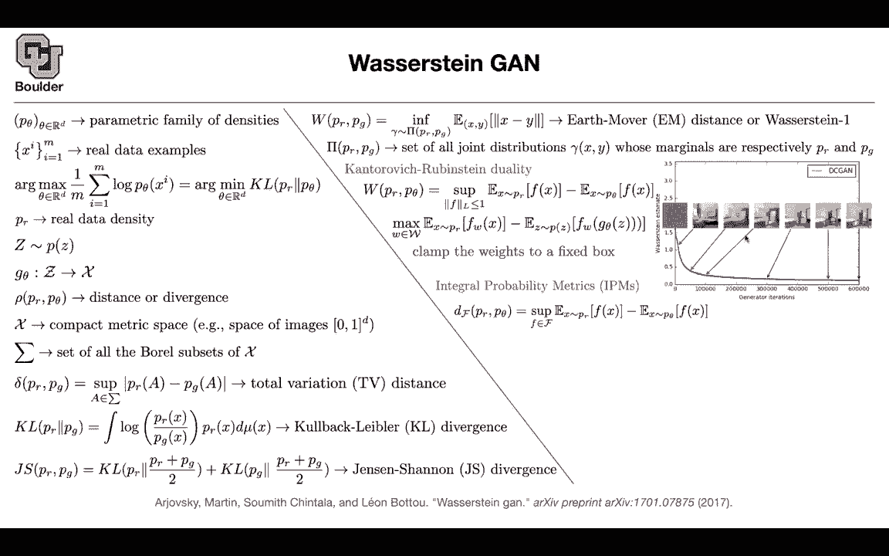
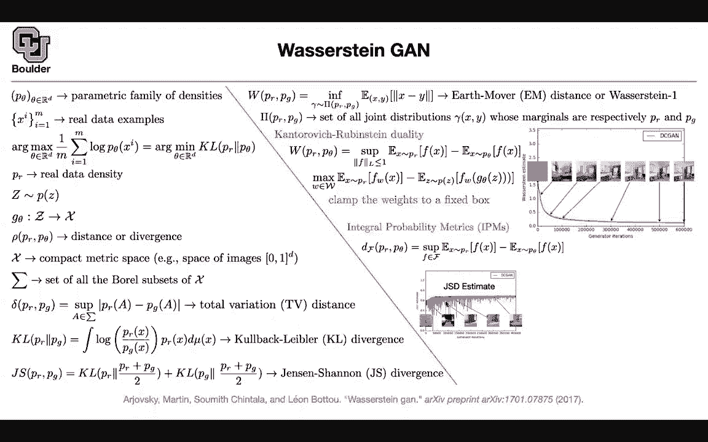

# P147：L68.1- Wasserstein GAN - ShowMeAI - BV1Dg411F71G

In that case let's move on so we learned about a regulargan we learned about least squares G and these were giving us different distances。

 different divergenceencies there is another one once there strandganNs and let's go through that This is gonna to be a little bit mathematical and this is on the last side of things if you have a parametric family of densities basically you're parametricizing your density function then your life would be very easy you would just use the likelihood you can do maximum likelihood because now you know your P you can use it to do maximum likelihood estimation and find the best thetas you have some real examples you have some parametric family of distributions and then you can try to make this data more likely by updating your parameters basically you take your data you push it through your distribution and then you want to maximize the likelihood or equivalently maximize the log of your likelihood that's going to give you a maximum likelihood。

And people love it because whenever you have a likelihood， things are going to be very easy。😊。

But mathematically if you write down the definition of the kl divergence and you get rid of some constants that don't depend on your parameter。

 the arc max of this objective is equal to the arc max of the kL dirgs which two distribution So whenever you are doing maxim likelihood your distance is the k dirgence if you have the luxury of having your distribution and here just for the sake of notation PRr is the real data density but for Gs what do we do we don't have the luxury of having this parametric family of density but what do we have。

 we can sample from a noise distribution， let's say this is normal zero identity you sample the vector you push it through a complex function and that's going to give you generated images for instance this is going to give you a generated distribution and here you cannot write down your density anymore you can just generate samples from your density。

You don't know what your density is， your density is gone， you don't have P anymore。

 you just have this G which is a function， you sample from a simple distribution and then push it through some complex function。

 which is parameterized by some neural network， and then that's going to give you generated images or generated text。

 whatever。

And this could have complex distribution and usually you put a distance between their real data and they generated it and remember there is no P theta anymore here it's just an abstract object。

 it doesn't exist， you cannot write its formula， just doesn't exist， it can just sample from it。

X what is x x could be the space of images so it could be any compact metric space such as the space of images and these are normalized so your pixels have values between zero and1 don't worry about this this is just a set of Brell subsets of x Brell subsets you can create them by countable unions and intersections of open sets or intervals but don't worry about it sigma is not a summation this is just a set of all of the subsets of x and you need it to be Brell because you want to put them measure on it so here you need to know your real analysis but even if you don't' don't worry about it it's not a big deal you can define different measures。

 different distances you can define a total variation distance you take a set a in this set of subsets of X you can look at the probability of the real。

We can look at the probability of the generated， you can compare the distance。

 you take the superpreom and that's going to give you a total variation distance that's going to give you a distance you can do kL divergence that's another distance and that's just a definition of kL divergence and mu is some measure that's why you needed this to be a bore set but don't worry about it this is just for the math to work so you can have the kl divergence as your divergence this was your total variation distance kl divergence you can have the Jansen channel you can have the chiia squared piarson divergence or you can have this divergence the earth mover distance or the Va strain one so what is it what is this divergence or distance telling us if you have a distribution of your real and you have a distribution of your generated images this distance is telling you what is the minimum。

cost for you to transfer distribution R to distribution G。

 You can think of the distributions in terms of a pile of dirt。

 the distribution Pg is another pile of dirt how much would it cost you to carry the pile of dirt that is real to the pile of dirt that is generated and that's going to give you a distance and what is the cost here。

 it depends on the distance between the entries， how much distance you're going。

 how much distance you're transferring times there is an integral here with respect to these probabilities Basically how much mass are you transferring so it depends on how much mass you're transferring at the same time it depends on the distance that you are transferring and that's going to give you this is the cost the infium is similar to minimum that's going to give you the minimum cost and you're asking what is pi pi is the set of all joint。

diistributions so you're going to have a joint distribution in your space of x and y these are all of the joint distributions with a condition that if you integrate out y you're going to end up with PR so the marginal distribution is PR if you integrate out x that's going to give you P of J so this capital pi is the set of all such marginals all such distributions whose marginals are PR and PG。

So there is a catch here you cannot work with this objective function， you cannot differentiate it。

 you cannot compute it， it's not easy and that's the topic of next session how do you actually make it useful in practice how do you actually make it differentiable and computable I think I'm one minute over time for those of you want to leave you can leave and for those of you want to stay and ask questions I'll be around have a quick question Sure when were coding this expectation value I'm wondering is it actually a mean when we're doing like actual coding has look like yeah what you're asking is a very good question that one I need to answer next session it's this objective function is not computable okay you don't know what is the set of all distributions with marginal or that you have a lot of freedom in the choice of pi that one I'm going answer next session so for now this is just a definition of the waserstein one。

Bisttance okay okay， so that' one I'm going to answer next issue。

Thanks yes， any questions about last session and questions about this L2 loss that we're using with GNs Okay I know in general like in other optimization scenario we use L2 loss often to like relax a problem and then make the optimization process simpler is that really the only objective here or is it is it leaning to like different quality solutions So we went through the math last session and we saw that if you do the at least a squares loss you're going to get another measure of the distance between two distributions I guess I guess it was here you're going to get peer onchia square divergence so I would say this makes as much sense as they generated the original generative adversar and neural networks objective function because that's giving you a divergence use gen and channel divergence？

Is there another divergence？To me they make equal sense and all you want from your discriminator is to separate your data one of them is doing it using probabilities and the other one is doing it using a function that is trying to output three numbers A B and C and at the same time you're getting rid of the sigmoid function maybe that is causing some trouble it's causing these mod collapse problems any other questions so last session we stopped actually we cover this paper and we are going back and forth between unconditionalganNs and GNs because I don't want to I don't want the class to become boring if you go if you do all the time unconditional then youre not going to see applications you're just going to see some methodology。

 some changes in the loss function without knowing what the applications are so let's still go back and forth now we are going to do unconditional。

was the a trying G。We covered most of it last session， so I'm going to go through that really quick。

 so classically if you want to learn the underlying distribution of some data and and if you're a classical statistician what you would do is you would put a parametric family of densities so you're going say I'm going to work with normal distributions or I'm going to work with exponential family of distributions etc and they're going to be paraized and because you know the functional form of your distribution you're going to have a likelihood so you're going to know the form of K of theta for an instance it is normal and therefore you can write down your likelihood and maximize it。

But then this is limited because you're going to be able to work with only simple distributions。

 but the distribution on your images， on your text， on your speech could be complicated。

 it could be high dimensional。So maybe it's time to go beyond that framework。

 but there is a good observation here as well， even maximum likelihood estimation。

Is going to give you some divergence it's going to give you some distance between two distributions between the real and the distribution that you want to learn okay P ofR only the nature knows P of theta you parameterize it and then you're minimizing the kl divergence well again working with theale divergence is hard so you're working with max black okay。

For Gs we said there is this simple observation that if you sample from a simple distribution and you push those observations through a complex function parameterized by neural network then you're going to be able to generate samples from a complicated distribution What did you lose you lost the likelihood now you cannot use the likelihood anymore if you want to use it it's okay。

 you're going to be able to use it but then you're going to do variational you're going have to do variational inferencefers and go back to variational auto encoders so and that's going to be approximation approximation okay so how about working directly with divergenceencies we know that the likelihood is doing some is minimizing some distance。

What if you play around with the distance or your divergence？

Between real and fake and remember now you don't know the functional form of pure theta anymore we can just generate samples from it and let's say your x is the space of images it could be the space of text it could be the space of speech that could be your x you can define subset set of subsets of x and then the first measure that's going to come to your mind is total variation distance and that's just saying that take elements of this set which are going to be subsets of your x so these are going to be subsets of your images。

And see how probable they are under the real distribution and under the generator distribution and just subtract it to and look at the absolute value and pick a supre over all of the over all side sets that's going to give you a distance。

The kL divergence which is going to give you the likelihood is gonna this is its distribution this is its definition。

 you can use that， you can use genen channelnon divergence and this was the original Gs and remember all of these are not computable for instance the genen channelnon divergence because you don't know PfG you cannot use it in its original form。

 that's why you are introducing some auxiliary function。

 the discriminator to help you write down your last function。

 okay you cannot work with this directly because you don't know PFG。

 you cannot work with KL divergence directly because you don't know PfG etc， in a similar fashion。

 you cannot write down the earth mover distance and maybe that's a better distance and we are going to see empirically and the paper goes through some math which I'm not going to go through here trying to justify Y Earth mover distance is a good distance。

But the idea here is that you are going to treat your distributions as pile of dirt。

 so you have one pile of dirt here。 you have another pile of dirt over there in some other place and the Earth mover distance it's going to tell you what is the minimum cost of moving pile R to pile G and what is the cost here is going to depend on the distance traveling and it's going to depend on the mass on the probability mass that you are moving from one distribution to the other distribution and then as I mentioned these are this set pi is the set of all joint distribution。

 So a joint distribution is going to be a function of X and Y and now if you take if you marginalize out Y it should give you P of R and if you marginalize out X it should give you P ofG So it's all of such distribution So I gave you this definition this is the def。

of earth mover distance to give you the intuition of what it is doing。

 but then this is not practical the same way that gensen channel divergence is not practical and this is impractical for two reasons one is that you don't know what is your PFG you don't know its functional form and the other one is that this is a huge set and then trying to model those distributions is going to be hard okay so this set you cannot model it that easily。

But the good news is that some smart people wrote down Ethereum to make our lives much simpler and what does the Ethereum say it says that equivalently you can compute was a strain distance using this formula what is it saying rather than working with all the joint distributions just go ahead and work with all of the lipsshed functions so all of the functions that our lipshed continuous with a lipsheds constant of one just go ahead and work with that so rather than working with that you're going to work with here the infium is going to turn into a supreme and now you can see that you had a similar behavior when you were doing the original G over there had a classifier here now here F could be your critic and now this is going to be your objective you're going sample。

From the real distribution question through a function， it doesn't have to be a probability function。

 it doesn't have to give you as output probabilities it's just a function and that's for real samples and that's where the generated samples these are samples that are being generated by the generator so the generator is going to go inside here。

It turns out。That it's a good idea whenever you see a function to approximate it with a neural network。

 so we are going to approximate F by a neural network。

 so it's going to be parameterized and you're maximizing this because you have a superprem there well there is a catch if you use the family of neural networks here it's very hard to enforce the Le shit continuity so we are going to work in a couple of other future papers on how to satisfy the Le sheet continuity but this paper had a heuristic for doing that it says that if you clamp your weights to a fixed box then you're going to manage to at least make your F Lehe con with some constant it's not going to be one it's going to be some constant which doesn't really matter so if you clamp your weights to a fixed box it means that you are doing if your weight during training is exiting that box。

're going force it to be inside that box you're gonna cut it okay any questions over okay perfect it turns out that this definition or this equality and the way that you are using v restrain restrain distance actually belongs to a bigger family it belongs to the family of integral probability metrics IPms Why is that the integral probability metrics or of this form or exactly the form that you have up there but then you have a different family here it doesn't have to be the lipsiates continuous it could be any other family so now we are gonna to work with that you're going to work with the with this definition of the v restrain distance Why is it helpful you can work with DCgan and now the cool thing is that during training you have an objective function that is going down which is great you're going to see the performance of your method and then you can see that the image quality。

At different locations during training is getting better and better so this Washer strain estimate is highly correlated with the quality of the images that you're going to see this is unlike the original objective function so for the original objective function these are just going to go up and down up and down during training and you're not going to know are you making progress or you not making progress what is happening so you have to wait until the end of the training and see how good their generated images are okay so it's very hard to interpret those results。

What else why at least intuitively there is a heavy math in the paper that I don't want to go through but what is at least the intuition of why things are working let's say you have a onedial distribution for your generated examples so this is your real density actually so these are your real examples and these are the generated examples generated by the generator so let's say this is what is happening and these two distributions are far apart from each other what does it mean it means that if you have a classifier it's going associate a probability of one to this part of the domain and it's going to associate a probability of zero to that part of the domain because these are fake these are real and you have a very good discriminator now what's going to happen this is just the constant the derivative of a constant is zero it means that your generator is not going to get updated okay your never。

reGoing to see its parameters or they're going to be very close to zero。

 So your gradients are vanishing。 What happens with this new objective function。

 This is the function F that you have here。 That one was the function D， the discriminator。

 This is the critique。And you can see that you're going to have gradients all the time and once you have gradients。

 you're going to be able to update the parameters of your generator。

 you're going to see those parameters they're not going to vanish。

 their gradients are not going to vanish。Okay is everything clear I have I think a couple questions so in this case FW like we're replacing our discriminator with this critic which is F subW exactly yes and what is this family script W so that one it could be any family maybe the family of differentiable functions maybe the family of continuous functions okay。

 a particular for is the family of Leid continuous functions and you model that family as a neural network。

And you model that family， the members of that family as a neural network parameterized by Omega in this case Okay okay yeah。

 that makes sense thanks okay any other questions so this graph of the the almost linear f is just the realization of one such neural network It's giving us that linear function or it's not quite linear but pseudoing yes。

 so during training， this is the type of networks that you're gonna see you don't so this is a realization of F okay for a particular parameter Yes。

 but then for most of you're gonna to have a similar shape and then it means that there is learning going on Okay it's not like here that it's zero it's a constant Okay。

 any other questions perfect so we saw a couple of examples for distances one is KL dirgence。

 one is total variation。The other one was genen Shannon divergence and for and we also saw piceson Kaia square distance when you were doing lease squares scans and this is another one that was a retry。

