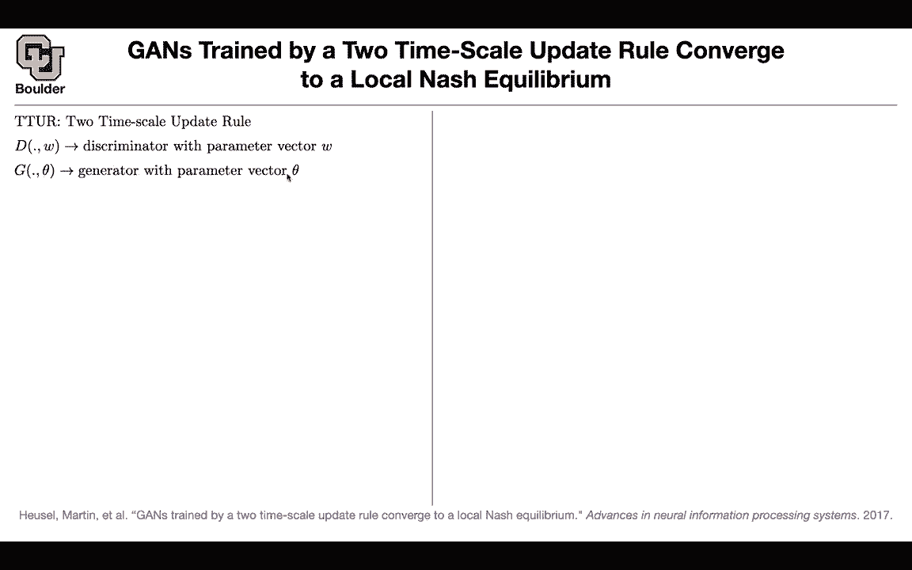
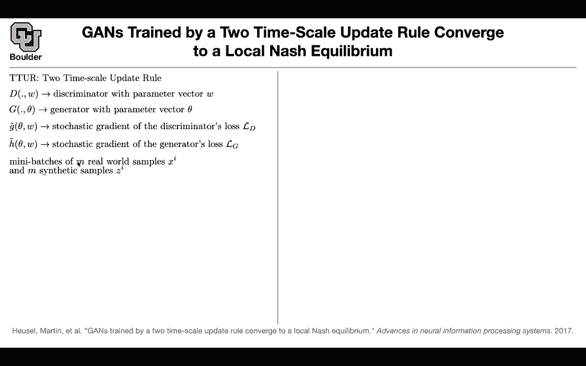

# 【双语字幕+资料下载】科罗拉多 APPLY-DL ｜ 应用深度学习-全知识点覆盖(2021最新·完整版） - P152：L69.3- Frechet Inception Distance ( FID ) - ShowMeAI - BV1Dg411F71G

So let's go back， that was one application let's go back and try to improve GNs。

 so if you hear the word TTR that's two times scale update rule。

 this is a theoretical paper you have your discriminator it is parameterized by W you have your generator it is parameterized by theta so all of your parameters weights and biases you're putting them in a list and that's your theta that's your w you're going to write a loss function for the discriminator you're going to write a loss function for the generator you take a derivative of the loss function for the discriminator on a mini batch of your data and that's going to give you a stochastic gradient let's call that G tilde so G tilda is a derivative of the loss function for D so please don't confuse this capital G by this G so G tilda is going to correspond to D and H tilda is going to correspond to the derivatives of the generators loss。

So it's going to correspond to G Htla is for G Gtla is for D。

 Okay The way that you're going to compute your loss is using a mini batch of your real samples and some generated samples if you had your true gradients if you had the luxury of being able to compute your loss on your entire data set then that would be noiseless that would be your gradients。

 these are going to be your true gradients the gradient of the loss for D。

 the gradient of the loss for G but we don't have that luxury we process our data in mini batches because of memory constraints because of speed constraints So we are going to deal with mini batches that's why your Gtla is going to be your G your true gradient plus some randomness some random variable Sam thing for Htla we know that when youre traininggans you take a couple of steps updating the parameters of your。

minator and then one step updating the parameters of your generator。 So maybe five steps of that。

 one a step of that。 This is equivalent to having two learning rate one of them is updating faster the discriminator it means that your learning rate is bigger and then you can have a learning rate for your generator that is slower So your learning rate is a smaller and this is equivalent to having multiple steps now you can do one step of that another step of the other guy。

 one step of generator， one step of discriminator updating those parameters。

 So it's gonna to boil down to having different learning rates so there is athereorem in the paper that is going to tell you having two time scales is going to help you converge to a local Nsh equilibrium So your algorithm is actually going converge and the proof of that is going to rely on this observation that eventually during your training there is a point when the per2。

Of the slow update rule so when you're updating your generator is small enough because remember at the same time your gradients are getting smaller and smaller and your learning rate is also small it means that you're updating the parameters of your generator slightly this is a small enough for the fast update rule for the discriminator to converge so once the discriminator converge the generator is going to converge as well so that's the intuition behind the theorem and if you want to look at the proof read the paper okay that's a strong paper and the proof is going to rely on some machinery in applied mathematics and that's called perturbation theory so you're going to do some perturbation analysis on thisOD so you're going to take your ordinary differential equation and this is going to correspond to gradient decent and why is it perturbation because you have not random perturbations to your true gradients and your true gradient。

A these F function here actually your last function is here and these gradients are exactly what you have up there but then you are going to be perure because you have some random variables some randomness's going on now the question is okay you gave me a theorem but can I use another type of optimization algorithm like Adam does Adam converge if I have two learning grades for you？

The answer is yes， you're still going to use perturbation theory。

 but on a different or differential equation okay but what is Adamom the atom optimizer is here you compute your gradients of the loss function you put them in Gn the M term here is a moving average of your gradients it serves two purposes it's going to dennoise your gradients and the same time it's going to act as momentum okay so this is going to act as momentum and then you're going to compute this is just G squared and this Adam art product so it's going to be be pointwise G is a vector this G is another vector and you multiply those entries one after another so this is sort of like the norm of your gradient and the role of this moving average is for you to have adaptive learning rate so your learning rate which is going to be a divided by the square root of Vn plus some。

Seyon that is for you not to divide by zero its1 to the power negative8 it's a small number。

 so a divided by the square root of VM is going to give you your adaptive learning rate so your learning grade is getting adapted by the magnitude of your gradients and then you're going to have some momentum as well。

So that's Adam we know that for stochastic gradient descent or gradient descent。

 you are going to have this OD， but what is the corresponding OdeE for Adam optimizer is's going to be the dynamics of a heavy ball with friction So it's gonna to be these dynamics And if you want to see why read the paper okay so the Adam optimizer is going to correspond to this OD the stochastic gradient descent is going to correspond to this OD and this is actually a nice intuition around Adam and why it is converging。

And why is itscaping local mini let's look at this if you have a heavy ball and you're trying to find a minimum without this momentum and having adaptive gradient you might get a stock at this local mini but now your Adam optimizer is going to be able to escape that local mini okay because of the momentum and because of the friction but to be honest the main reason that I'm covering this paper is not these observations is not the theory behind why you converge to a local Nsh equilibrium or the intuition behind Adam optimizer is because of this you're going to have another way of measuring the quality of generated images we learned about inception score this is another score that you can use and that's fresh air inception distance so we're going to learn about this。

What is the idea here you have some real data distribution PRR you have some generating model real generator you want to know are these two distributions equal for those of you who know partial differential equations and finite element methods you know that you can multiply your distributions by some test functions compute the integral if these two integrals are equal for all of the fs that are spanning your space then your distributions are going to be equal as well so F is going to be a basis function or multiple basis functions that are going to span your space okay this is just theory for now one type of basis functions are the polynomials the constant xx squared x cubed etc but let's cut it you cannot compute it for everything let's cut it at some point let's say you're going to look at polynomials。

Order 0 and one。 So constants and x。 okay if you do that。

 that's going to give you the first and second moment of your distribution。

 One is the expected value and the other one is going to be the second moment。

 So sorry you're going to look at x and x is squared。

 So one of them is going give you the second moment and the other one is going to give you your first moment and we know that the only distribution that you're going to know its entire properties by knowing only the mean and the variance is a Gaussian distribution So we are going to work with Gaussian distributions。

 Okay whatever we're going to do， we are going to take our images real or fake。

 we push them through a neural network that is already pretrained like the inception model。

 you push it through your neural network and it's going to give you two codes for your images。

 now you're going to look at the statistics of those features。

 So now you're featureurizing your images first using the inception model。

You compute the mean of your generated images， you compute the variance of your generated images。

 the mean of your real images， the variance of your real images and then compute the distance between two Gaussians and that's how you're going to compute this is the fresher distance between two Gaussians So inception is coming from the inception model distance because it's a distance fresher because this is the fresher distance and going back to this having two learning grades if you have only one learning rate that is10 to the power negative51 to the power negative5 negative4 these are how they are going to behave in terms of the fresher inception distance。

 but if you use two time scale update rule with two scales slow and fast this is how it's going to convert I think I'm going to stop here。

