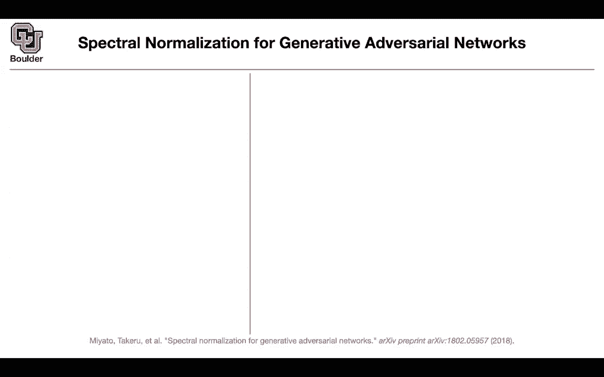
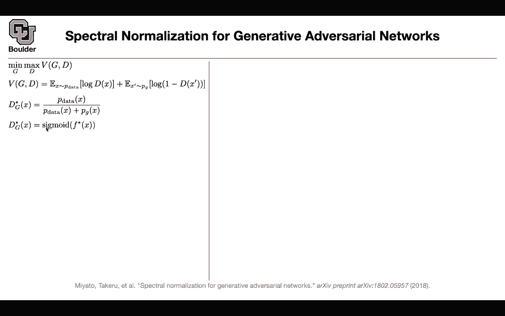
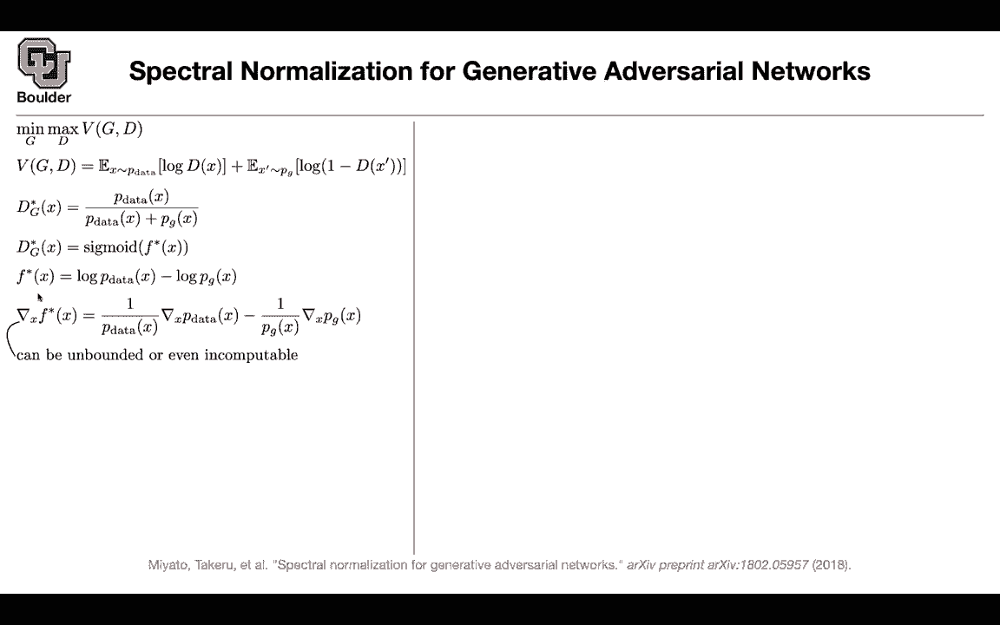
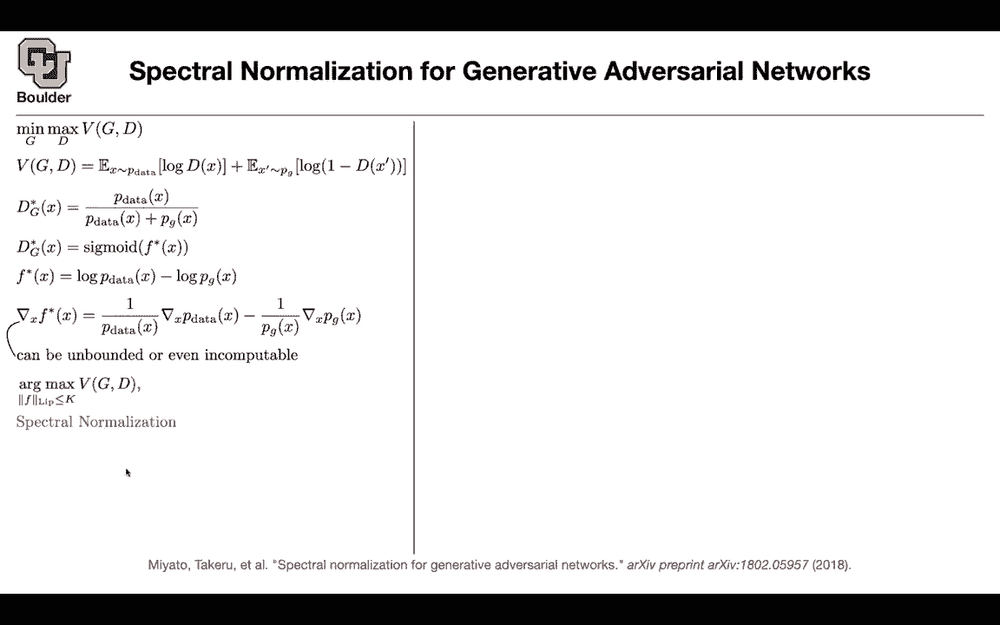
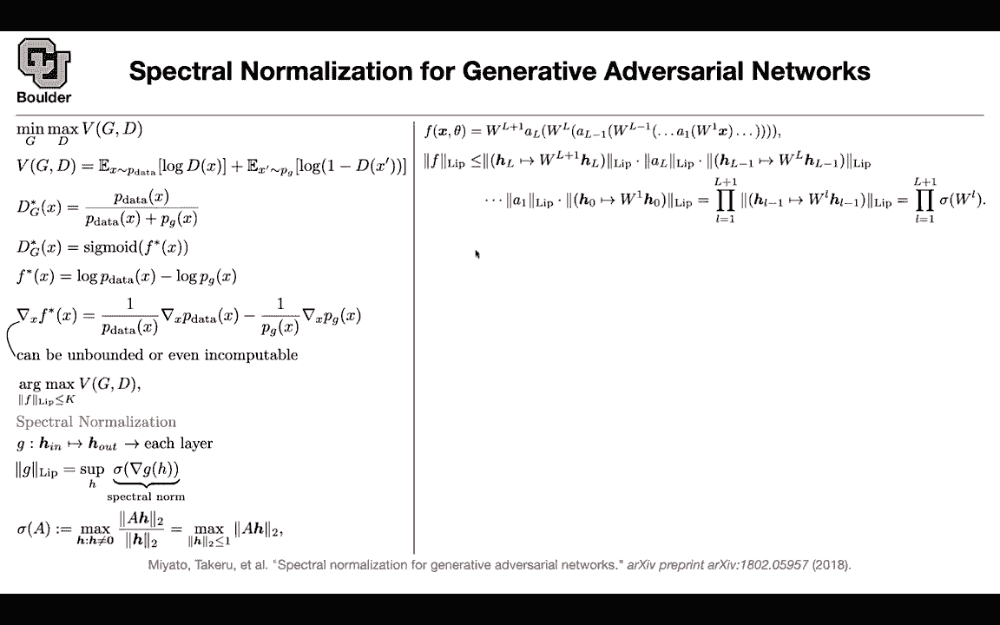
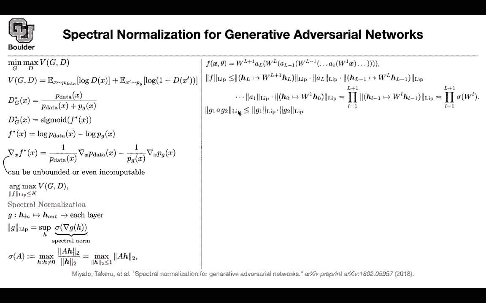
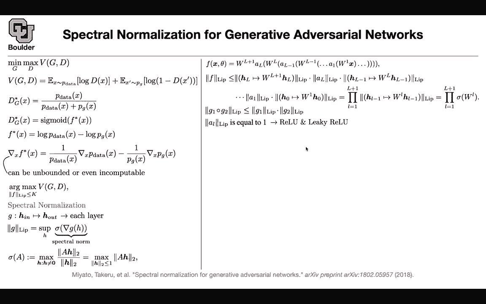
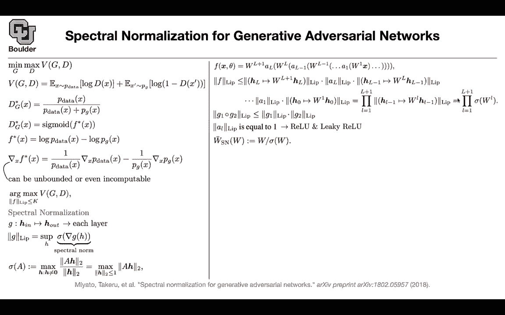
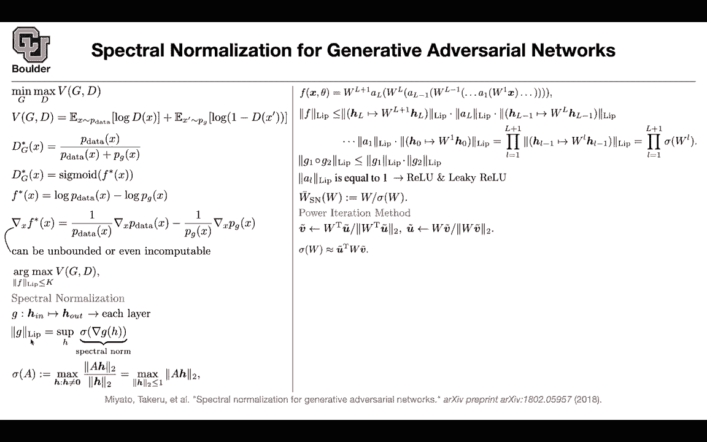
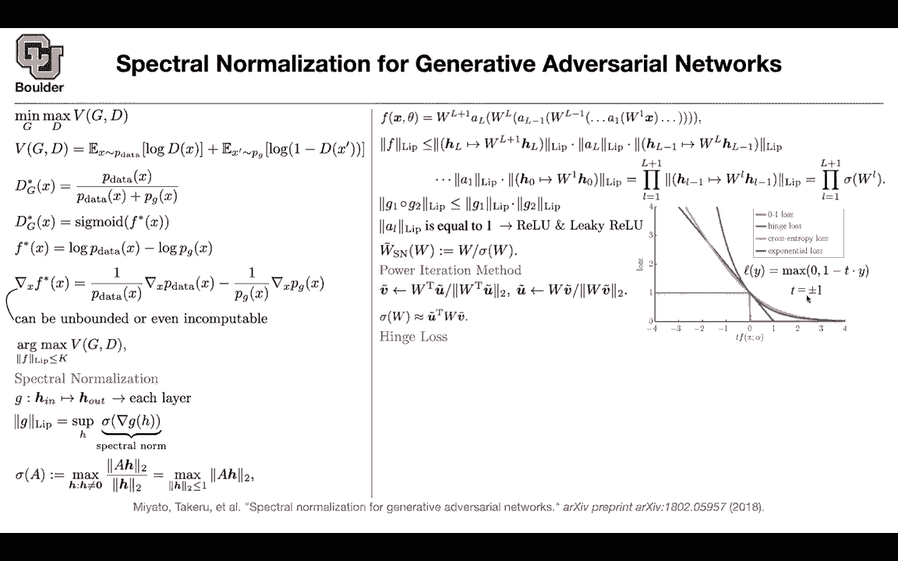

# 【双语字幕+资料下载】科罗拉多 APPLY-DL ｜ 应用深度学习-全知识点覆盖(2021最新·完整版） - P153：L70.1- 谱归一化 - ShowMeAI - BV1Dg411F71G

Let's get us started Last session we stopped here with two timescale update rule so we covered it and we said that there is actually a theory behind having two update rules one for the discriminator and one for the generator basically you have two learning grades we had a nice observation that the aam optimizer you can think of it as giving you the dynamics of a heavy ball with friction and that's the reason it is able to jump over some of these local minima but the most important part was the fresh inception distance and as the name suggests you have the inception model which is going to take you from the space of images to the space of codes so it's going to take you to RD for instance and these is a dimension it's going to take an image it's going to give you a vector and now on those vectors you can work with polynomials and。

If you work with the polynomials of first order and second order。

 those are going to give you first and second moments。

Which are going to correspond to some Gaussian distribution。

Now you're going to put two Gaussians on the real data and on the generated data and measure the distance between the two and the distance that you see here is exactly the definition of the fresher distance。

So unlike the inception score that was a score the higher was better。

 the fresher inception distance is a distance so the lower is better as you can see the lower is giving you a better model any questions about this paper so now you have two methods for measuring the quality of generated images I think one of you had a question yeah I was just going ask about this so I understand up to where we just use x and x squared is our polynomials and then I'm a little confused about like how M is defined in C in some of these things okay so you have a data set of generated images you have a data set of real images you can take all of those images push them through your inception model and that's going to give you a bunch of vectors。

Okay in the X domain now this is not the image domain this is the x domain these are after they're being pushed through your inception model now you have a data set of real examples a data set of generated examples in RD so these are the vector representations of them you can take a mean and a standard deviation for each of these two sets so you have a set of real examples a set of generated examples the real ones are going to have m and CR and the generated ones are going to have the mean of Mg and CG this is a vector of the same side as X which is just averaging out those data that you just generated and C is a matrix。

Does that answer your question Yep that answer my question Thank you and then you can now compare the distance between the two okay now we can move on to the next one the next one is also a theoretical paper we know that for Vo restraintraingan we needed our critic to belong to the space of one liphes continuous functions for was restrain G to work and we had two ways of doing it one was clipping the weights the other one was the gradient penalty this is a third way of doing that this is the third way of making your function slip sheets that's good actually if you go back to the original GNs as well and you study its objective function you're going see that you're going to need such a condition or such a condition is going help you Le sheets continuity let's see why this is the original Gs objective function generated images real images and then you're discriminating。

Between the two。And we know that our optimal discriminator is going to look something like this it' P data divided by P datata plus Pg。

 if you fix Pg， that's how if you fix your generator that's the optimal discriminator and we know that there is a softm going on for Dg that's just write it down so Dg is is the sorry is the sigmoid of something of some function now let's go ahead and solve for Fs star So Dg star of x is equal to sigmoid of FS star and this has to be equal to P of data divided by P of data plus P ofg sigmoid has exponential in it and then you can take the log and then solve for FS star so this one I'm going to leave as an exercise。

 it's a very easy exercise， but then it's going to give you FS star is the log of P of data minus log of P ofg So if you solve for FS star that's what you're going to get This is the optimal。

F a star before the sigmoid Okay perfect。 Now let's take the derivative of this guy and see what happens because the derivatives we are going to need for are optimization let's take the derivative with respect to x of a star because of this log term you're gonna have one over P data times the gradient of P data same thing here one over Pg times the gradient of Pg now Pg could become close to zero for some for some point or actually zero。

 so it could vanish it means that this term is becoming infinity or even you cannot computed if you're dividing by zero So this term can become unbounded because you have a lot of flexibility here okay and that's exactly because of the sigmoid and taking the lot So what we are going to say is that we want to avoid this guy becoming unbounded or incomputable how we can say that if this guy。

Lips sheets continuous then you're going to have a Le sheet constant so it's not going to let it become unbounded so we are somehow regularizing F star so even Le sheets continuity is going to help the original GNs objective function so now you're going to do an art max of V have G and D over the family of Le sheets continuous functions so now your D is a little bit regularized。

So does this make sense so far that makes sense Okay perfect So now let's go ahead and try to make things sheets make neural networks Le sheets continuous The idea is a spectral normalization as the name of the paper suggests but how can we do that these are neural networks and they are composition of functions and actually the name deep neural networks is because you have compositions of functions so your composing functions let's take one layer it has H in that's your input and then it's going to give you an output vector now let's go ahead and take a look at the definition of the leaf sheet constant for this particular function G you can compute the spectral norm of the gradient of G and remember gradient of G the gradient depends on where you are taking derivatives so if you change H you're gonna to have a different gradient and each one of them is going to have a spectral norm and i'm going to tell you。

What is a spectral norm This is just the L2 norm of these matrices and then you are going to take a supre over all of these h because the gradient depends on where you are taking the derivative that's going to give you theips constant or theipiates norm what is the spectral norm the norm of a matrix you can define it in terms of the norm of vectors so you take a multiplied by a vector now a times H is a vector and you can have the L2 norm of that and then you can normalize it by the norm of that vector so you're going to divide it by that that's going to give you the definition of the norm of a and that's actually the definition of a spectral norm and this has to be not equal to zero because if it is zero then you're dividing by zero and you're in trouble and some simple mathematic x because you can now take this norm of h2 and put it inside the other norm now you can assume that。

You're normalizing your ages it means that you are working with H all of the vectors whose norm is less than one so you can either work with this definition or the other definition but this is just if you take a linear algebra course and that's the prerequisity for this course this is another definition for a spectral norm perfect now let's go ahead and write on in neural network whatever we're going to have x is going to go in you're going to multiply it by be and let's forget about biases for now and then you can do an activation on that so this is an linear function like R you take the outcome multiplied by W2 you do another nonlinearity and then you keep doing that and then a linear layer at the end so this is a neural network a bunch of function function compositions。

Now let's write down the liput norm of that the lipho norm of F there is a function that is taking you from the hidden state L to the next hidden state by multiplying by a matrix this is this guy and we are renaming everything here to be HL then youre going have the norm of your activation function then you're going to have a function a linear function that is taking you from HL minus1 to HL by multiplying by WL that's your the norm lip sheets and then you can do that all the way around and there are some properties that I'm using for this inequality I'm using this property so if you have the composition of two functions。

 the liphos norm is the product of the liputs norm of those two functions so that is what you're using for this inequality and these are the function composition。

Now they are turning into products so far so good Now for this equality why are we getting rid of the lipshes norm of these activation functions Because for R and leaky value the lips sheets norm is one so you can just drop them perfect Now you're only left with these linear functions and that's going to give you the product of the spectral norm of these ws of your weights so far so good Now what can you do you have a problem here。

 this is not gonna to be one or it's not going to be bounded because you can have different ws what you can do is you can normalize。

 you can define a new set of parameters W had a spectral normalized which is a function of your original ws and you're just dividediding by sigma w Now the spectral norm of these is going to be one because it's going to be the spectral norm W divided by the spectral norm of。

It is one， so if you normalize your weight， you're going to be able to control the lips norm of your neuraln network。

Awesome， any questions so far do we not worry about singular matrices because we initialize with random data for W and so we're not going it's going be impossible to end up with a singular W so yes your question is this guy could become zero but then the probability of that happening is very low because you're initializing as you said your weights randomly okay the probability of that phenomena happening is very low it's basically zero it's never going happen any other question okay this is theory but how are we going to do it in practice Comp the spectral norm is not easy okay this is nice this is a nice theory but the cool thing is that linear algebra is going to come to our rescue now how you can use the power iteration method to compute these sigma ws on the fly so remember for each layer you have a bunch of weights。

And you need to compute sigma W for each layer， So whatever you're going to do initially during training。

 in addition to your parameters of your neural network。

 you're going to introduce some other parameters so u tilda and you initialize them randomly okay so you initialize these guys randomly and per each layer you're going to have you tilda so this utilda is for is a function of the layer that youre at so for each layer you're gonna have some extra parameters you some extra vectors you multiply by W transpose divide by the norm that's going to give you Vtilde you take Vtilda you multiply by w divide by the norm that's going to give you your updated utilda and then you keep repeating that while optimizing for W you can keep updating utilda so utilda you are not optimizing over it you are just using this iteration Why is it useful because then you can。

Computute sigma W pretty easily Now you have utilda you have w。

 you have Vtilda you multiply them together that's going to give you a norm of that matrix and this is just power iteration method well you're doing it while training so initially your utilda and Vtilda are going to be really bad what once the training is done towards the end of the training these guys are going to be in good location and and if they are in good location。

 they are going to give you correct spectral norms So is everything clear I just have one question Sure so the spectral norm is the max singular value and is this power iteration like modified so that it finds the max singular value and not the max eigenvalue Yes it is actually doing that so it's going to give it a maximum it's going to give it a norm of this matrix Okay Okay here we need to know linear algebra So what is the spectrum。

Nor the definition of the lipss norm and the power iteration。

 but assuming that we know our linear algebra， then computing this guy is not hard。

 There is an algorithm for that Okay So this is smart in terms of the loss function whatever were gonna use So far we learned a bunch of a family of loss functions that we could use one was the original loss function。

 one was the was is triangle again loss function This is squares loss function here is another one the hinge loss what is the hingela telling us let's forget about this one So this is the definition of a hinge loss。

 let's forget about this one for a second。 and let's change our labels previously our labels very zero or one we can have your labels to be negative one or one This is the ground truth So each data is gonna have its own label and then our model is going do some prediction Sometimes the predictions of the model are。

Positive， sometimes the prediction of the model is negative。

 let's say the prediction is positive and the ground truth is one。

 you are multiplying one by a positive number that's going to give you a positive number you multiply by a negative sign that's a negative number and the maximum of zero and negative is negative is zero so you're never going to update your parameters so it means that you are not penalizing your model is doing correct and in the other case if the ground truth is negative one and your model is correctly predicting y to be negative。

 youre multiply two negative numbers together， that's going to give you a positive number you make that negative by it is negative sign the maximum of0 and the negative number is0 so you're not going penalize your model so your model is doing the correct thing but as soon as it does the wrong prediction if you're underlying truth is one and your model。

Predicting negative then that's going to be a negative number， you multiply by a negative。

 it's going to give you a positive maximum of0 and a positive number is going to be the positive one so you're going to penalize your model that's your objective function。

But then not only you want it to happen for that particular case。

 you want it to happen with some margin， you want your model to be correct by a margin。

 you don't want it to be at the boundary which is zero you want it to be correct by a margin so visually speaking this is your loss function whenever the multiplication of the prediction of the model and the ground truth is bigger than one。

 you're not going to penalized otherwise you're going to keep penalizing your model。

And the rest of the objective here are for you to see the land of the type of objective functions that you can use one of them is this01 loss as soon as it is positive。

 you're okay as soon as it becomes negative penalized by a constant that's going to give you zero1 loss the blue line is the hinge loss the crossantropy loss is trying to approximate approximate this hinge loss this is what you are using for the originalgan and then you can have exponential loss and all sorts of other losses and you're going to use hinge loss in your for your discriminator and the generator okay for the data that are actually data you are doing the correct thing the underlying label is one so t is one here and then remember this is a minimum that's a maximum so you're multiplying by negative to give you to give you the minimum here that's why this one is turned into a negative one and there was a。

Negative sign here， which is now a positive and for the data that are being that are coming from your generator you have a label that is negative one and that's where this negative is coming in and the generator loss is just a function of this loss so you're just going to drop these negative and this is going to turn into a positive is trying to full the discriminator and in terms of numbers how things are going to work these A BC D E and F are different configurations for your learning rate the parameters of the Adamom optimizer and then this is the number of iterations that you're going to use for your discriminator so these are different hyperparameters that you choose and this are going to give you these colors here and you can see this is bait clip this is more sensitive to the choice of your hyperparameters。

Gans with gradient penalty， was the tryinggan with gradient penalty， batchge norm， layer norm。

 weight norm， ortho normalmal， there's a penalty on making your weights ortho normalmal and this is a spectrum norm so this is less sensitive to the choice of your hyperparameters and it's giving you better inception score because now you are able to control the lipsits constant of your neuron network is everything clear。

Any questions before I move on？

