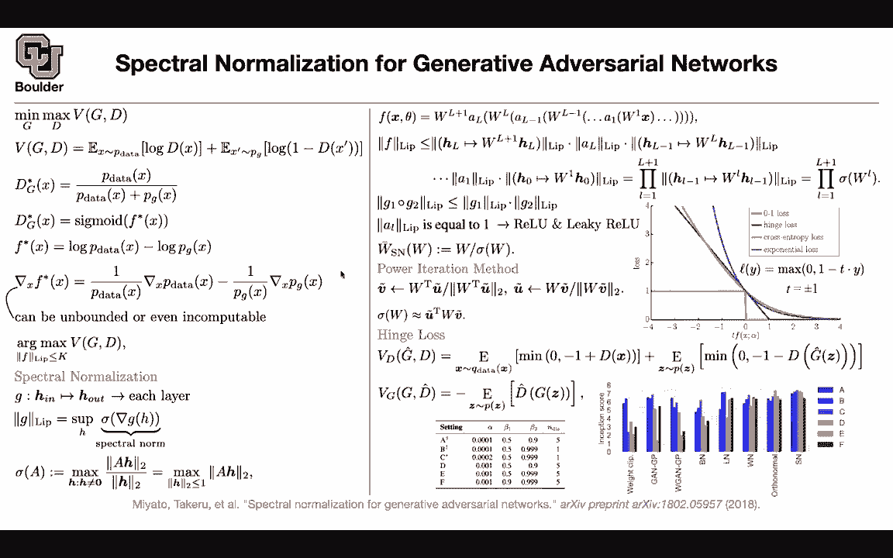
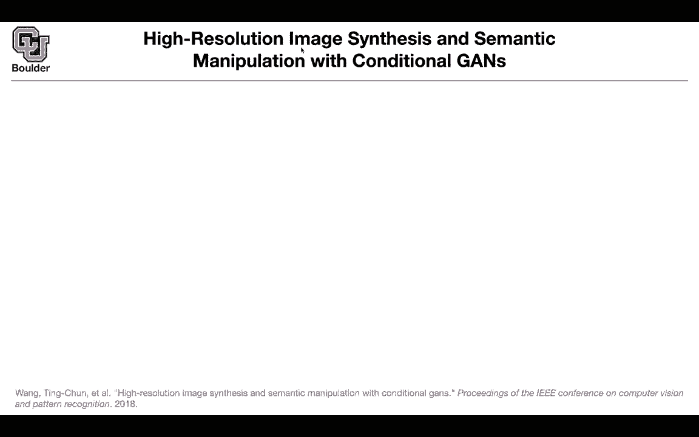
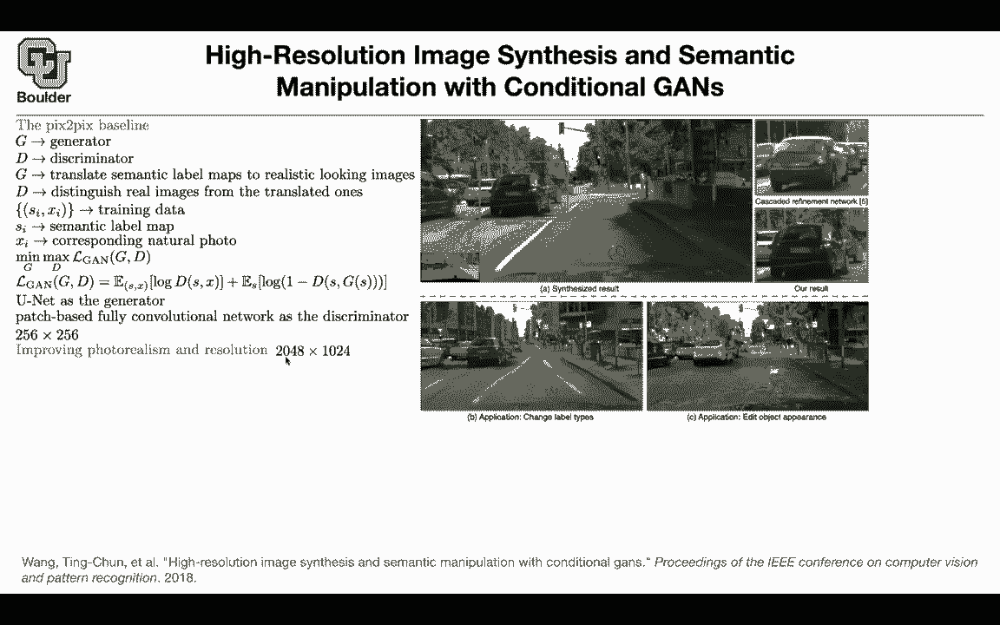

# 【双语字幕+资料下载】科罗拉多 APPLY-DL ｜ 应用深度学习-全知识点覆盖(2021最新·完整版） - P154：L70.2- Pix2pixHD - ShowMeAI - BV1Dg411F71G

Okay perfect， I guess we covered enough theory about GNS that now we are able to focus on applications most of the time。

 so let's try to do that from this point on it's going to be mostly applications。

So let's start with high resolution image synthesises and semantic manipulation and then we are going to go back to conditional eventss what do we want to do there is a semantic label that we want to map it into generated images so this is a one too many mapping scenario the competing method is giving you these blurry images they look good but you can actually improve improve upon them because these are low resolution we want to make them high resolution。

And these are the results of this paper more crisp what are some of the applications you can change the label types for instance here you can see some trees and if your application is self drivingriving car as I mentioned the selfdring car is going to need a lot of data so it's going to be good to be able to generate new data and new scenes new images using the same data that you already had you can actually go ahead and remove the trees and replace them with buildings so you're just changing the label of these tree to be a building and that's going to replace it with buildings so this is one of the applications or you can change the road type but how are we going to do it the problem is making these types of networks high resolution and be able to generate high resolution images previously we had this image to image framework we're going to use we're going to use the same framework but now you want to make things high resolution you have a generator。

You have a discriminator， the generator is translating semantic label maps。

 so these guys to images to realistic looking images。

 and the discriminator is distinguishing between real and fake， between real and translated ones。

Your data are in the form of pairs of semantic labels like this and images so that's a semantic label map。

 this is the corresponding natural photo and that's our can objective function and because it is conditional your conditioning your discriminator on S and your generator is conditioned on S as well in terms of your neural network you're going to use a new unit architecture with some it's a neural network encodeder decoder with some residual connections and then your discriminator is going to look at patches of your image so it's going to focus on this patch discriminate between real and fake it's going to focus on the other patch discriminate between real and fake etc and then the final probabilities is just the average of these probabilities over the patches that's your discriminator but then using that framework you're going to go up until 256 by 256。

as you increase the resolution beyond that it's going to fail and these are one of the images generated using this framework so you want to improve upon that and you want to make them high resolution 2048 by 1024 What are the tricks that you're going to need you're going to change the neural network architecture you're going to design a neural network that is easier to train let's see you can have your G1 this is the generator that you're going to start with and it's going to work with images that are 256 by 256 it's going to take a semantic label map and it's going to map it to a low resolution image you can train that using a discriminator you can train that and the same framework as as above you can train that now you're going to take a higher resolution input and you want to out with a high resolution output this is G1 that is G2 you take a higher resolution input。

And then you encode it a little bit using a bunch of convolutions until this blocks here and this tensor here have the same size now you can add them and that's going to be the input to the other residual blocks that's doing the deconvolution the transpose convolution and this is just two times down sampling Now you're going to use another set of discriminators to distinguish between real and fake images in the space of high resolution images Now you're going train these new parameters in addition to fine tuning these smaller parameters the parameters of the smaller network G1。

you change your architecture to give you a course to find generator。

 you're going to change your loss function rather than having a single discriminator you're going to have multiple discriminators I'm going to tell you the exact loss and then you're going to change your adversarial loss slightly so whatever you're going to do you're going to have three discriminators D1 D2 D3 and each one is looking at different resolutions basically if you have a real image and then you have a corresponding generated image you can downs sampleample both of them and give that to D1。

We can increase the resolution slightly， give it to D2 increase the resolution to the full scale and give it to D3。

 Now you have three discriminators helping you write down your loss function for the generator so that part is there。

 you have multiscale discriminator and then we learned about the feature matching before rather than looking at the final output of your discriminators。

 you can look at the feature maps at some intermediate layer and put L2 loss there So the techniques that we learned previously are actually helping us here and then this is actually the feature match feature matching loss function so you cut your neural network。

 your discriminator at some layer and use the layer。

 the pixels at that layer you compute the L1 norm rather than L2 norm because L1 norm is less sensitive to outliers and then you can use that feature matching loss function and this is exactly what they explained。

You look at discriminator the second discriminator for instance and I don't know the tenth layer features so you are cutting your network and t is a total number of layers up until that point of your discriminator and an I is the number of elements in each layer so it's going to be the number of pixels and there is also another trick not only you need to input the semantic labels as you can see some of these cars they are occluding each other so you're going to go from blue to blue and it's going to make the job of your generator a little bit difficult so it's going to be really helpful if you can give it the boundaries of these objects otherwise this is going to be the same color now you're going to have some boundaries so these are one hot vectors so it's going to be one here and zeros everywhere else and then you're just kind of catnating these boundary map with a semantic map and that's going to be the input to your generator and the discriminator。

Without boundary map things are blurry at the boundary but as you include the boundary map。

 things are gonna to become sharp and as you can see this is sharp here and these are generated images。

 by the way， they look really good and in terms of numbers you can look at two metrics so I don't want to go into that there is the pixel accuracy and then mean intersection over union these ones we cover in part one of the course when we do semantic segmentation and the moral of the stories that these are doing really good okay and they're actually close to having the original images Any questions yeah quantity if。

In G2 the generator into we' given the high resolution image what are we doing in testing if we only have that small image no in testing this is exactly what you're going to do you have a generator that's going to take us input a high resolution seman map and it's going to output a high resolution image。

Whatever that I'm writing here everything else is just for you to train this model once this model is trained then the rest of it is just sampling from it and you can do these applications for instance you can recallcolor the trees to be buildings and it's going to give you buildings any other questions for conditional gainss it seems like people typically don't add the noise factor is it just empirically not helpful to do so as soon as you have an input that's a great question as soon as you have an input the dropout is going to act as the noise okay so you don't need to add extra noise to your model the dropout layers are going to act as the noise for you that's an answer your question yes that extent thank you。

