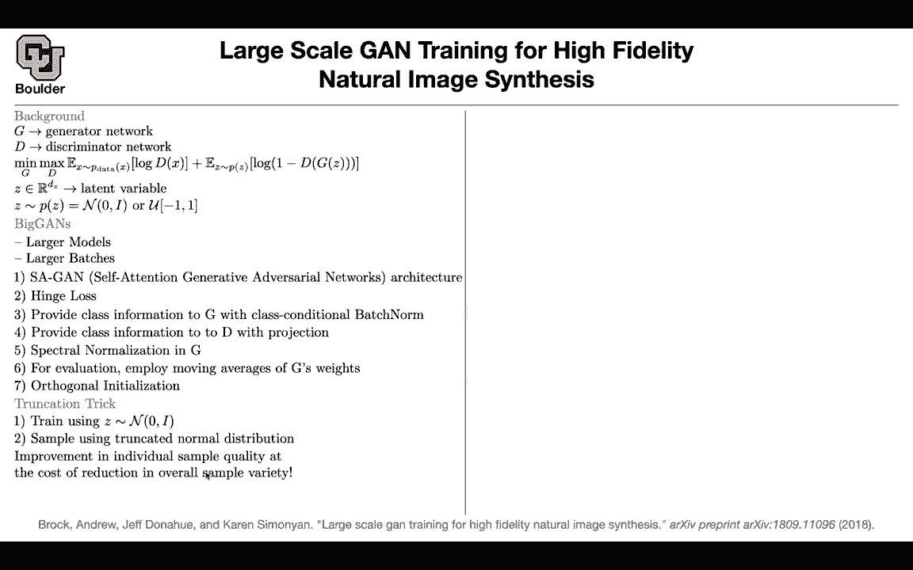
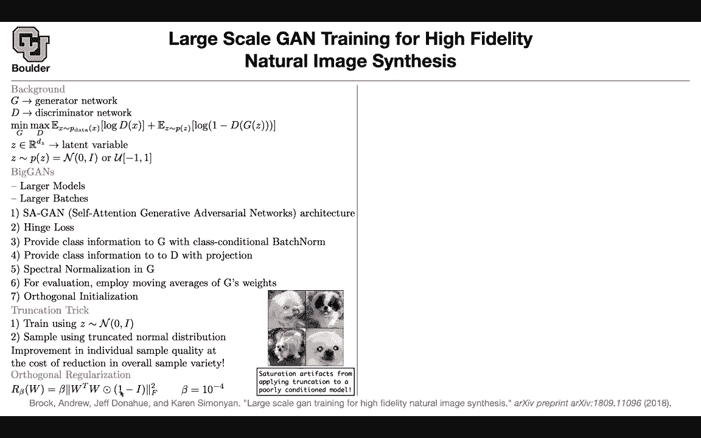
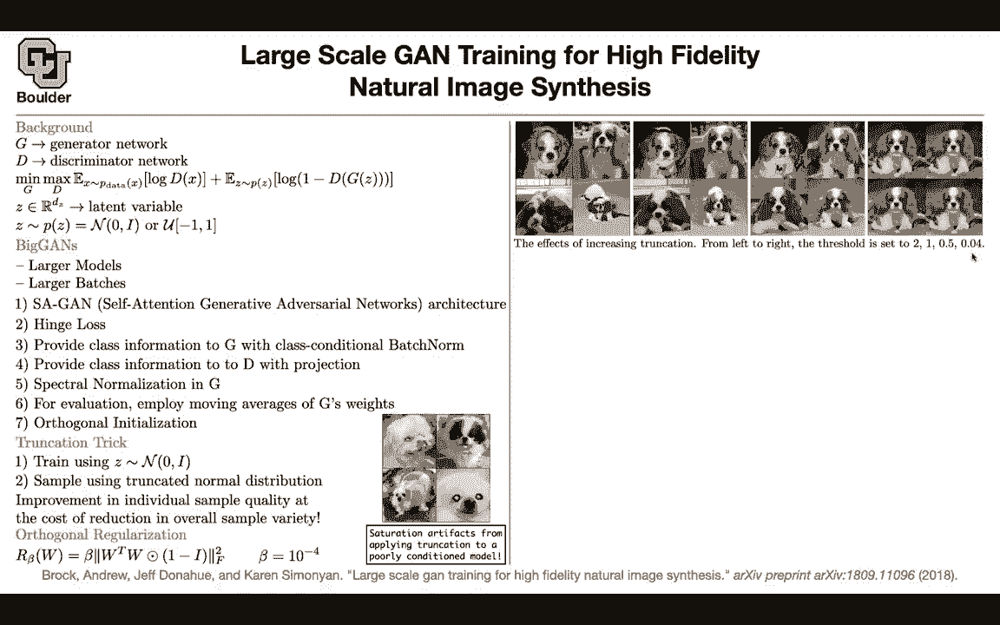

# P155：L70.3- BigGANs - ShowMeAI - BV1Dg411F71G

Okay perfect let's move on to another application again we want to do high resolution high fidelity natural image generation a little bit of the background you have a generator。

 you have a discriminator this is going help me write down the notation this is your last function or GNs you have some latent variable you're latent you're sampling it from normal or uniform so this is not conditionitional this is unconditional that's why you need to have a noise now we want to introduce biggan we want to scale it and generate realistic looking images high resolution this is an engineering paper so there is gonna be a lot of details that I'm not going to be able to go through but I'm going to be able to tell you the highlights but the moral of the story is that you're going have a larger model and larger batches one of the techniques is self-atten Gs I'm going to go through that next session so don't worry about the first item if you don't understand。

It it's again that you're changing the architecture we are going use hinge loss and we saw that that you can actually use hinge loss and you are going to provide fast information to your generator now your data are going to be imagenet type data and then you're going to have millions of data and you're going to have thousands of classes so it's going to be a good idea to condition on your labels but the way that you're gonna to condition on them is different here you can actually if you remember in batch norm you have to extra parameters one was recaling after the normalization and one was adding that bias so this is how you are conditioning you're changing your batch norm but for the discriminator you're going to provide the class information using those one hot vectors and doing the projection projection is matrix vector multiplication so you can think of them as word vectors and then your conditioning。

You are putting that as an extra input to your discriminator We are going to do a spectral normalization on the generator we just learned about it and for the generator。

 we also learned about moving averages so you keep a moving average of the weights of your generator and then that's what is you're going to use for generating images in production for evaluation and then in terms of initialization you're going to do orthogonal initialization So your weights you're going to initialize them in a way that they are orthogonal there is another trick the truncation trick that is going to help you generate images that look more realistic what is the trick you can train using these that are sampled from normal but then in generation in production actually。

 you're going to trunnccate your normal distribution to be in an interval you sample from trunccateated normal whether the tradeoffs this is going to improve。

Individual sample quality so the quality of your images are going to improve but there is a cost to it you are going to reduce the variety of the images that you're going to see and this trick only works if you have orthogonal normalization I'm going to tell you what that is if you don't do it and if your model is any other model without orthogonal normalization of the weights you're going to see some artifacts some saturation artifacts for instance the eyes of this do is messed up the colors are messed up in the background etc so you're going to do orthogonal regularization during training you're going to add this to your last function you're going to say that my weights need to be orthogonal but then you are removing the diagonal of that so it's an approximation to your weights being orthogonal what do you get let's study the effect of this trincation if you increase the truncation if you truncate more。

It means that if you shrink the interval that you're trincating from 2 to 0。

4 initially you have a variety of images of dogs because now your conditioning on the class of dogs so you're going to only generate dogs but it's a variety of dogs and then the variety is going to go down but the quality of the images is going to go up as you trinccate more in terms of numbers。

 you can look at two numbers， fresh air inception distance and inception score for fresher inception distance。

 the lower is better so the lower is better and for the inception score the higher is better and then these are different configurations like what should be your batch size。

 how what is the channel multiplier how many parameters your model has because remember larger batches。

 larger models at what iteration you're going stop and this is their score but there is also another observation this paper that I want。

To know about if you look at the top singular value of the weights in your neural networks these are weights for different layers you usually see the symptom of mod collapse where one of those singular values is going to explode so that's for the generator and that's for the discriminator it is exploding at this iteration so the discriminator is less sensitive to that but the generator is more sensitive and that's why a spectral normalization is helping ge I think i'm going to stop here and for those of you who have questions i'll be around and for those of you want to leave you can leave。

