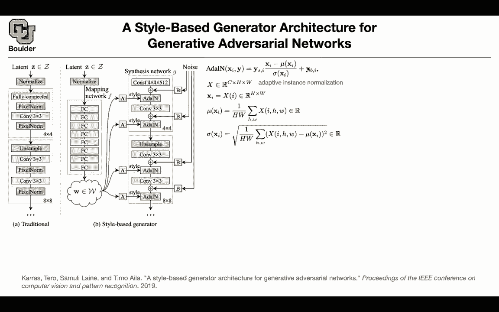
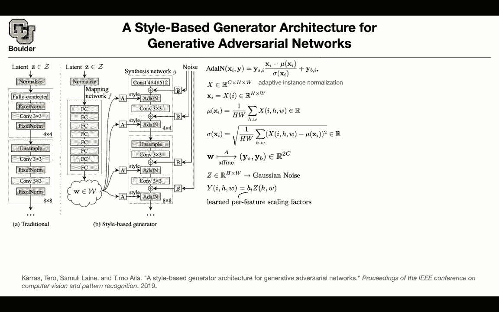
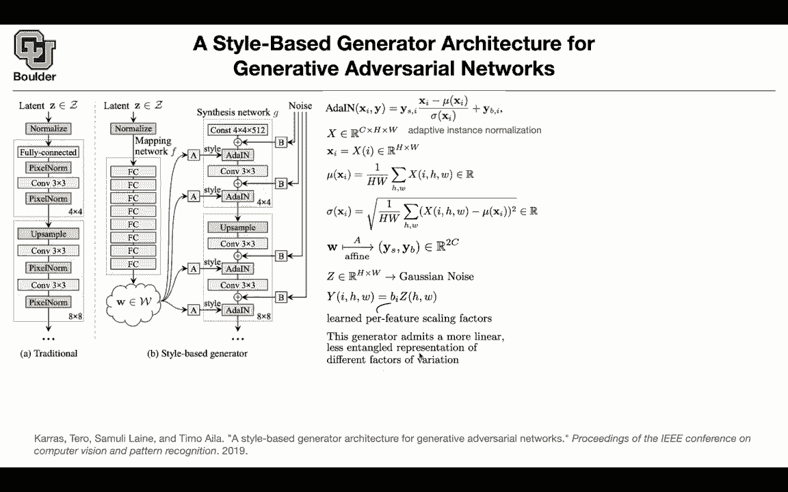
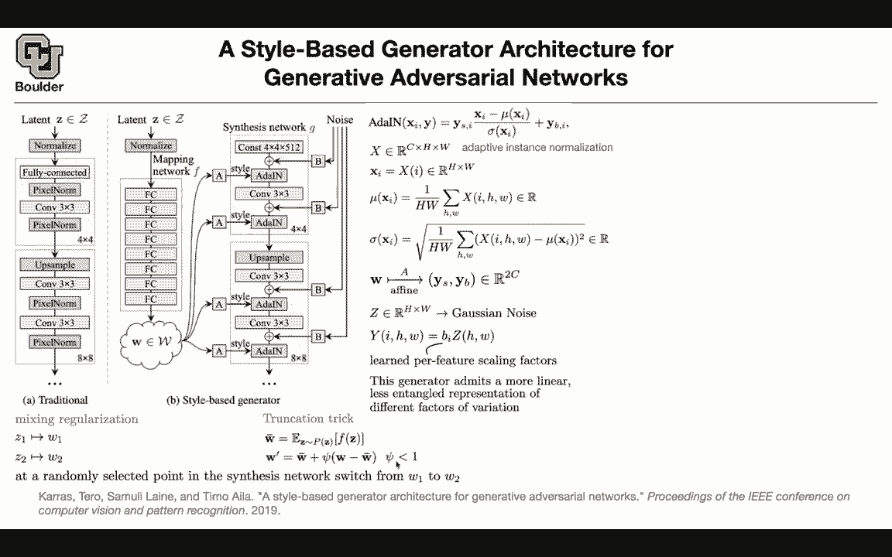

# 【双语字幕+资料下载】科罗拉多 APPLY-DL ｜ 应用深度学习-全知识点覆盖(2021最新·完整版） - P156：L71.1- StyleGan - ShowMeAI - BV1Dg411F71G

Let's get us started so last session we stopped here we covered big GNs so if you remember we started with GNs that were able to generate low resolution images like 32 by 32 64 by 64 256 by 256 and we kept improving upon that and now our images are looking more realistic it's not yet perfect we cannot generate the entire image net but we made a lot of progress and we saw that there were a lot of tricks that you needed to do change the structure of your neural network change your loss function change the way that youre training your neural network some other tricks how you're gonna to condition on the class labels using batch norm so for batch norm it has two parameters if you remember that are learnable one of them is recal。

Whatever that is coming out of subtracting the mean and dividing by and a deviation very each layer we usually call that gamma plus biaser so per each class you can have a dedicated bias and gamma is scaling character and that's how your condition you are doing class conditional I promise that we are going to go through selfattention gap so we are going to do it today and one also one other trick that I want you to remember from this paper is this triation trick because we are going to encounter it in the next slide as well and we saw that and a sign of mod collapse is that if you look at the top singular value of your weight matrices for all of your layers most of them are going to be fine but then an early sign is that one of your weights actually the singular value of one of your weights is going to infinity so it starts to。

Get larger and larger。 So this is a sign of collapse。 Any question So perfect。 In that case。

 let's move to a style again。 I'm sure you have heard the name。

 but what is the methodology behind Again， the objective is that you want to generate realistic looking high resolution images previously for traditionally before this paper。

 this is how you would generate images， you take a latent code Z。

 you sample it from a normal distribution， you normalize it。

 you push it through fully connected layer， then you do pixel norm and pixel norm was local response normalization So you are normalizing channel voice Then you would do transpose con and you do pixel norm。

 and you keep increasing your resolution。

until you reach the resolution of the final image what happens here is that these latent code the representations are going to be entangled so it's not like you're going to be able to pick one of the coordinate and try to study it we learn about info for again but that was a different story you want to be able to control the details of the images that they' going get generated like change the hair style etc you cannot do it by changing Z in an easy fashion the representations are going to be entangled so what is this paper saying is that maybe the problem is because Z is a simple distribution what happens if you start with a W rather than Z that has a complex distribution and then these are going to be your latent variables and the trigger is exactly the trick of cans you generate from a simple distribution you push it through fully connected network。

And then in the end that's going to give you w Z can have a simple distribution。

 but W could be complicated and now w is the one that is going to go into your generator is generating image so I'm going to start here with the synthesis network G。

It's going to take us input some ws some data and some noise and i'm going to go through the details so this figure is there for helping us and i'm going to keep referring to this figure what you're going to start with is initially with some constants and these are trainable constant it's going to be four by four by five2 that's your starting point for your neural network but then the rest of it I need to explain most of them you probably don't know what they are but these part is simple it's just a constant of that size。

What is this layer a aim it's adaptive instance normalization so instance normalization is batch normalization when your batch is one so don't worry about this y and the other y here I need to tell you what is X and what is mu and what is sma let's say you have X which is a tensor it has C channels and it has a high dynamic X is going to be the I channel which is going to be H by w as X mu of X is you are computing the mean over H and w so over your pixels and you're doing it per h I so per each channel you're gonna have a number and then you can compute standard deviation as well so these are going to be scals Now this should be clear you take X you subtract and mean and divide by the standard deviation This is exactly what you do in batch normalization but now your batch is one that's why it's called。

Okay that's an organization。

Now what are these guys this is where you're gonna be able to control the details of the images that are going to get generated We learned that these could represent your classes and then you can do class conditional by the same time it can help you transfer style or modify the style of the images that are going to get generated so we're going play around with those two vectors where are they coming from they're coming from this part in your neural network let's see so w goes in they're going to do an aine transformation basically multiply by a matrix add a bias and in the end it's going to give you a vector that has twice the size of your channel half of it is going to give you YS and the other half of these vector is going to give you Yp so now we are modifying these constants and they're going to depend on W your representation Very perfect what is this noise so I explain what these part is I explain what other in is but what is this noise。

You start the noise it's coming from Gaussian distribution so each entry of that is just independent。

 you're sampling from Gausgian distribution and you put it in a matrix that has size H by double that's your noise So for each data that you're generating you have a new noise so these is gonna change and I'm going to tell you why you need the noise but then because this is Gaussian you're gonna to have unique standard deviation you can modify the standard deviation and that is this B operation here and this is going to be a learnable standard deviation that's going to be a learnable scaling fact now you know what what this is and now this is going to have the correct size per each channel you have 512 channels you're gonna have different pis and now you can just add them together and as you can see the size of these noise is smaller than the size of these other noise and the other noises here because these are eight by8 features or feature maps you add them element y。

And then you compute at in， you do your decomvolution or transpose convolution and then you keep doing that the rest of it you not actually these are just simple convolutions and then youre the up sampling probably neighbor up sampling but whatever that you do you're increasing the resolution from one layer to the next layer but the contributions are here the way that you're injecting style and the way that you're injecting notes Why is it useful this generator that we just created has a more linear structure we can interpret these random parts or these latent details of the images that you want to generate so these are interpretable they are going to be less enangled changing one is going to be having a different effect and compared to changing another one of these style if you change the style here is going to be a different thing than changing the style here and the complexity of generator。

complex images is now encoded here in this complex neural network and basically your W is gonna a complex distribution There is another trait。

 There is a mixing regularization so during training you want to regularize this neural network so that it doesn't depend too much on what is going inside it so you're going have to latents Z1 and Z2 and you sample them from normal distribution you push them through your neural network。

 you're going to give you W1 and W2 and then somewhere randomly during training in your synthesis network。

 you're gonna to cut your network， you're going use W1 for this part of your network and W2 perhaps for the other work This is just to regularize this neural network What else we know that transaction traits is important it's going to help you generate sharper images at the cost of less variations in the images that you're going to generate but。

Tation trick was for normal distribution was for Z。 The distribution of W is going to be complicated。

 How are you going to do trincation there， So this is what you're going to do you're going to compute the mean of these ws So you're going to compute the mean of Fs and F is here that's going to be W bar and then you can deviate from W bar by a parameter and this is a hyperparameter that you choose this is going to tell you how trinccate you want your distribution to be ifsi is0 you're always taking the mean value out of this distribution if you increasesi you're going to see more variations in your distribution So this is how you're going to do the trincation but I told you that these are interpretable let's see really are they really interpretable。

So you can generate images， these are images that are generated and they look really good and they are generated by this framework。

 you generated a Z， we have fully connected your neural network。

 you're gonna to get W and then you're gonna pass it as a style to generate and it's going to generate images at the same time you're gonna memorize what you are put in here you're gonna remember what W you used and then you can also generated images here so the row these columns are your images that you generated these rows are the images that you generated but now you want to transfer style from source B to source A。

 what can you do， you can go in one of these course layers and let's say you're generating this space for now you' go in one of these course layers and you use the style basically the parameters that generated this space you take that and copy it here so you are just modifying this part of your neural network。

And if you do it at the course levels， you can see that for instance。

 the gender is getting transferred so this is the man this is the woman that's a child the pose is gonna to get translated so these are the big features of your images that are getting transferred if you go ahead and do it at the finer level you just modify these styles here at the finer level you keep the rest of them fixed we just modify here you can I think the gender is kept the same but then the details more details of the face are getting transferred for instance the forehead is bigger because the forehead of that guy is bigger that baby face is going to give the baby face etc even if you go in finer layers of your neural network this was four by48 by 816 by 16 and you go up until I don't know 1024 by 1020 if you change it。

What is going to change is gonna be the details for instance。

 maybe the hair color is getting transferred this baby here is blonde so you're making that face blondnt etc So that was the effect of these style and as you can see these are disentangled you can change them one other time and they're gonna have meaning unlike see these style transfers they have meanings these representations they have meanings they are disentangled what is the effect of noise how is that helpful it's going to give you very fine details after image these a generated image and if you change the noise you're gonna to see variations in the hair style and these are tiny variation and this is basically the standard deviation of multiple images so you can see that the hair is changing these parts of the image are changing in a tiny fashion another observation for the noise is that with noise you're gonna have a cur hair with big。

that are small curls and if you remove that if you remove the entire noise you're going to get blurry hair and then this is the effect of having noise at different scales the noise here is going to give you big curls and the noise being added here is going to give you smaller curls in the hair style Okay any questions Does the fully connected backbone that goes from Z or W does that preserve the dimensionality or does it increase the dimensionality or is that kind of up to your whatever choice I don't know the details but for that you can refer to the paper。

but in the end it doesn't really matter if it preserves or it doesn't preserve it's going to be a nonlinear function so W could have the same dimension as z and you're going to be just funny but whatever that goes in your style is going to be2 C so you're going to have two two times a number of channels here any other questions perfect。

