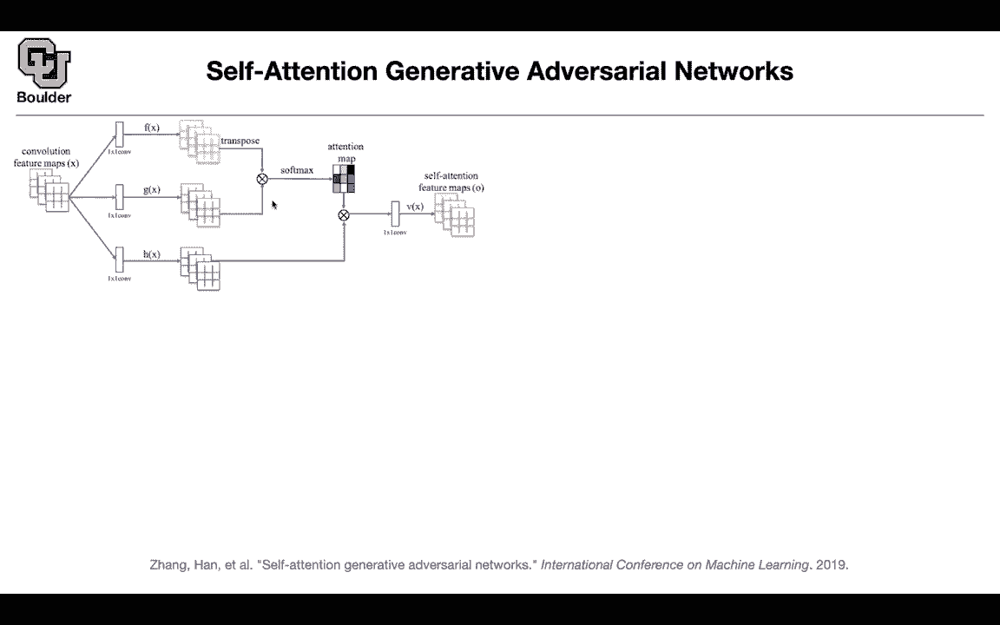
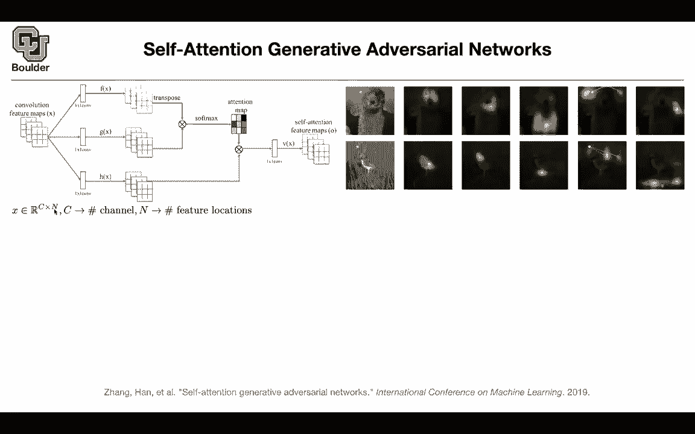
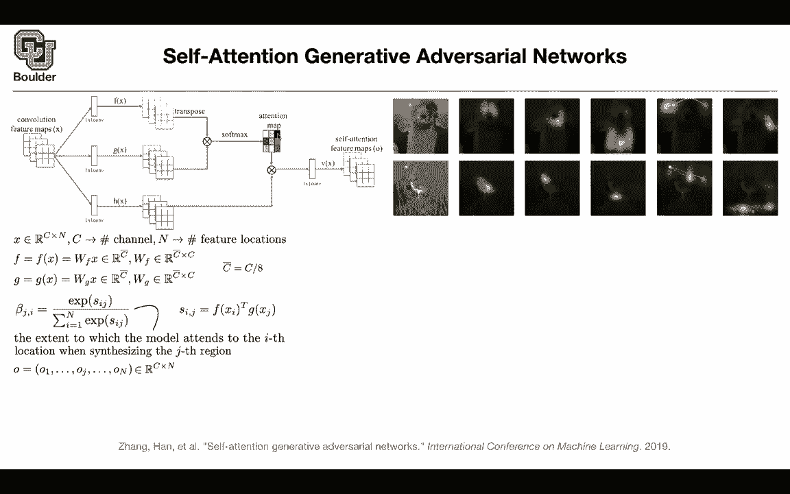
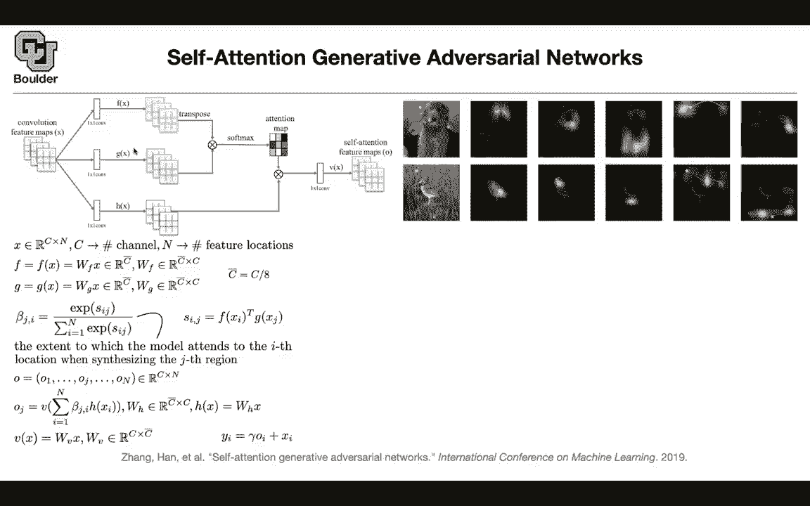
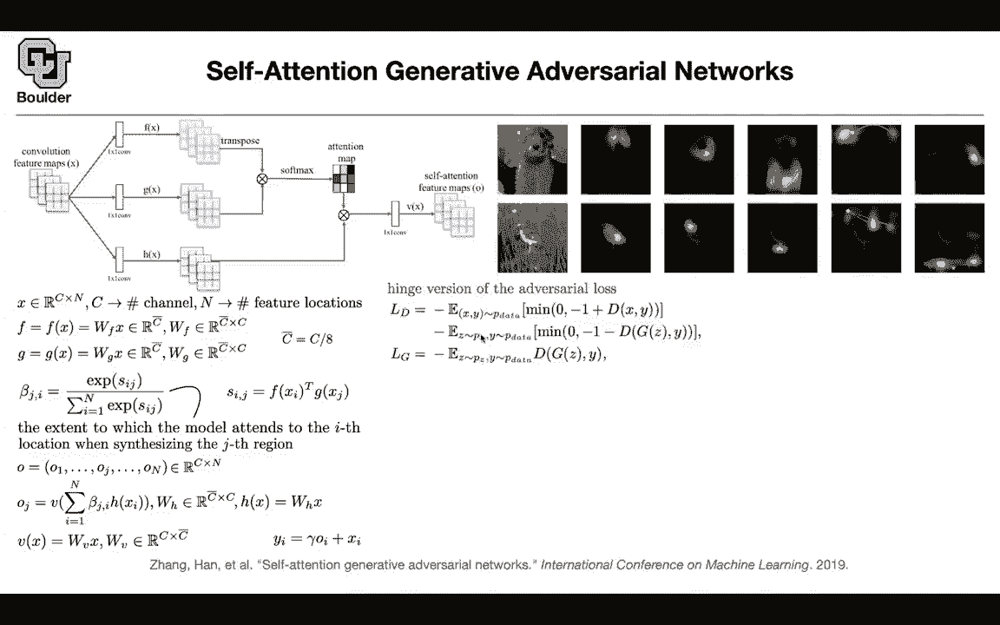
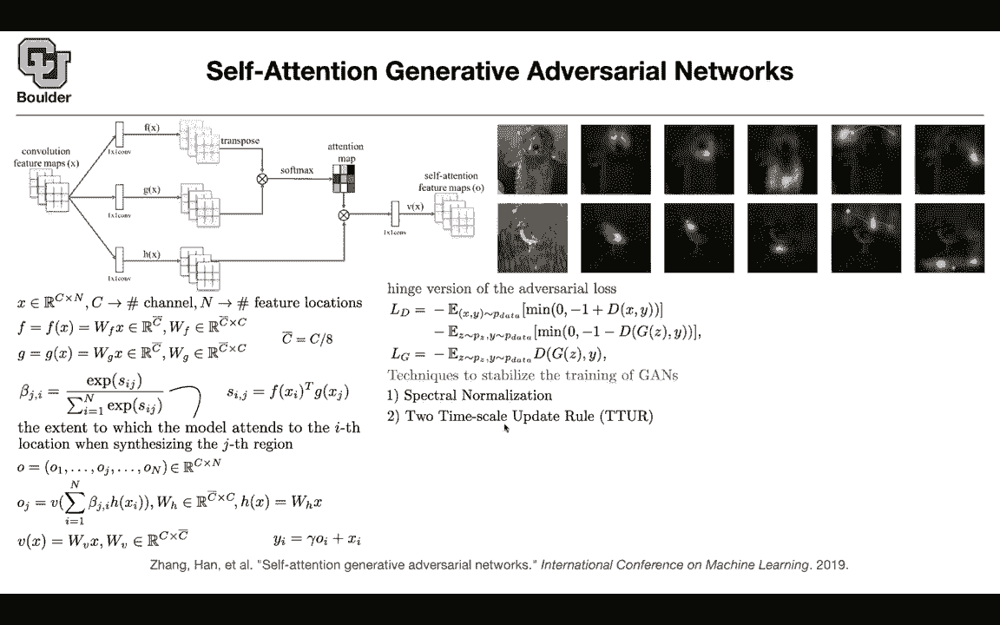
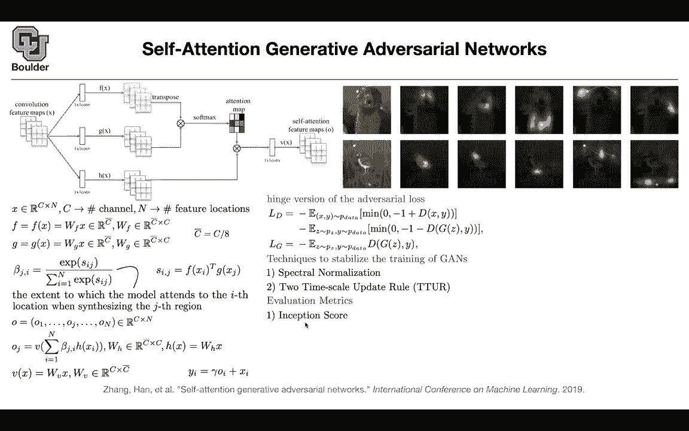

# 【双语字幕+资料下载】科罗拉多 APPLY-DL ｜ 应用深度学习-全知识点覆盖(2021最新·完整版） - P157：L71.2- 自注意力生成对抗网络 - ShowMeAI - BV1Dg411F71G

In that case， let one， I promise that I'm going to give you self-attention Gs but what is that this figure don't worry about it I'm going to keep referring to it while going through the math but why self-atten important because let's say you're generating a bird there was a problem before this paper with Gs that it would generate images but the images werentconsistent for instance the peak of the bird could be located somewhere else that it didn't make sense where the leg of the bird was messed up it it's either missing or it's not in the correct location so these sorts of inconsistencies on imagenet were showing up and maybe one reason for that was that because convolutions are local they're not going to be able to look at the other part of your image at this distance away so maybe introducing attention is going to help they generated images to be more consistent。

For instance let let's take these points these are coming out of training this framework where is this point here the red point。

 the green point， the blue point etc you can see that the red point is paying attention to the to the other eye and a little bit of the face and up and down maybe to the eyebrow etc the noise the nose is or it's the mouth it's looking at the face。

 other parts of the face this blue dot here is paying attention to the body this blue dot here is looking at the background and I guess this is I don't know what that is maybe that's an ear it's looking at the neighborhood and the same thing for this bird the legs is looking at the first leg and the second leg or the background is looking at the background and this is supposed to help you generate images that are more consistent but let's go through the framework you have an X so you're gonna take your image you're gonna to push it through。

A bunch of convolutions and in the end another image is going to come out it's going to have more channels and it's gonna to have less pixels Why is it important to have less pixels because attention is costly we know that attention is costly if you want to pay attention to every single other pixel your model is going to take forever to train so you increase a number of channels that's fine and then you reduce the number of pixels and this is the total number of pixels X and Y so youre just flattening the other dimension so N is H times W you take x and then you multiplied by a matrix so these are one by one convolution so each pixel is going to get multiplied by the same matrix and it's going to give you wF times X this is actually in R C bar times n so I'm removing n so it's going to be in R C bar by n and C bar you are reducing the dimension。

efficiency so you can use one by one convolutions to reduce the dimension channel wise。

 but then you're gonna to have the same number of pixels， you take G。

 you take x multiply by Wg and that's going to give you a feature map that is C bar by N and these are the sizes of your matrices so I cover this part this is X then what is going to come out or these F and G feature maps so that's just f and G and you're going to do the attention when you are going to implement it you're just going to do a transpose and then multiply to the dot product but mathematically what's going to happen is that you're going to take the feature at this location and pixel location I the other feature at pixel location J you're going to forperform the dot product and this is where the transpose is coming in that's the same transpose as here and that's going to give you a scalar that is scalar is from negative infinity。

Positive infinity you normalize it so that they all add up to one and this is basically telling you the extent to which the model attends to the I location to the I pixel like here when generating these pixel or it's actually region because a pixel in your feature map is going to correspond to multiple pixels in your original image and then now you' got your attention map what you're going to do is you're going to need to compute these O the self-attention feature maps that's going to be having the same size as your original input it's going to be c by N and each one of these is a vector that is paying attention to different locations of your feature map after a transformation and that transformation is just very simple it's like what you did up there it's just one by one convolutions and then that's going to give you your O and these is another one by one convolution so it's not。

Liarity is just multiplying by matrixrices the same matrix everywhere and now this is the self-attention feature and in the end you do a residual connection you take X because they have the same size you multiply it by a gamma it's a scaling number and then that's going to give you the outputs and this is just a module that you're going to take and put it on top of your generator or at some location in your generator or at multiple layers of your generator so this is a module that you can just plug it inside another neural network and then in terms of loss function we are going to use the hinge loss this we covered I guess previous sessions and then we are going to use some techniques to a stabilizer training of Gs one is the spectral normalization the two times scale update rule and then we are going to use some evaluation matrix like inception score fresh inception distance and let's look at the reason。

During training with spectral normalization on the discriminator adding the spectral norm on the generator and the discriminator is going to help your model converge better in terms of ratio insert distance and insertception score and using the two times scale update rule is going to make your model converge even better and then this is the same figure as a above so each pixel for predicting this dog is paying attention to different parts of the do for instance。

 this green one is paying attention to the background and this blue dot is paying attention to the leg and the body any questions Are we using the attention map differently than we were before wasn't it before used kind of as a pointwise mask instead of being added in not really there are some papers for。

CNNs for convolutional neural networks and images that use attention in a different way that we're using it for text。

 but this is the same this is the same as what we saw for text that's going to be your query key and value if you flatten it then N is' gonna to be the number of the sequence length and we know that each sequence is a sequence of vectors that after I mentioned C and this is exactly what you were doing query key value that makes sense I think it's the last the last step that seems different to me but maybe a'm misunderstanding where you have Y I equals gamma O plus x or this is the residual connection even for a transformer block you also had these residual connections Okay so this is the plus x is just the residual part and the gamma Oi is like the original output I'm not sure what is the effect of gamma you can set it。

be one but no it's the residual connection and the rest of it is just what we are used to for selfattention Thank you and it's better to do this to plug the selfattention modules at lower resolutions for lower resolution features otherwise it's going to be too costly and because you have a generator it's better to put it near your latent code it's it's better in the sense that in the sense of computational reasons not mathematically。

