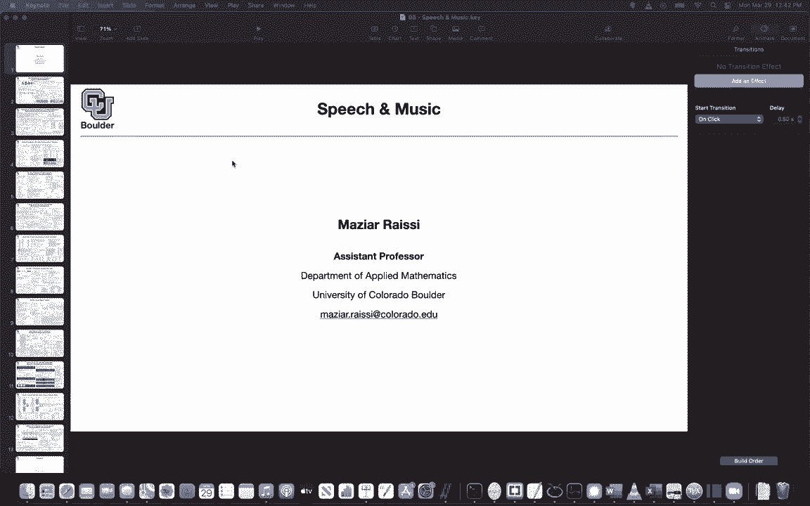
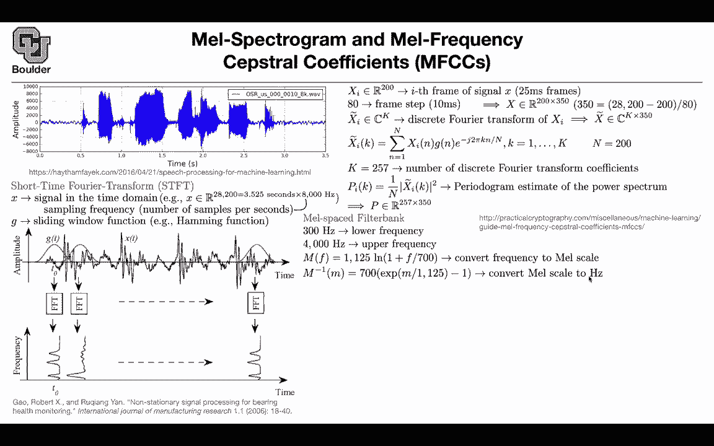

# P159：L72.1- Mel谱图与MFCCs - ShowMeAI - BV1Dg411F71G

So far we saw data in the form of text， we saw data in the form of images and we learned both discriminative models and generative models for both of them now let's go ahead and see a new type of data speech and music and try to do discriminative analyses and generative process using such data but what is a data like when you' are dealing with the speech how are you going to represent your data so everything in deep learning starts with the data you are going to hear these words a lot mepecttrogram log mepecttroogram and mail frequency se coefficients when you are doing machine learning and deep learning in general and I think it's a good idea to see them and how you actually go ahead and construct them if you have a file if you have a sound file which could be either music or speech。

We're going to in the form of dotva or any other form and let's say you have a soundtrack that is around three and a half seconds this is the raw wave form and now we want to turn that into my spectroogram and MFCCs。

The first step is doing Fourier transform， but if you do Fourier transform on this signal you're just going to change the time to be frequency and you're going to get the magnitude of your frequencies basically you're expanding your signal in terms of signs and cosine you're going to get some complex values but then you're going to take the absolute value of your complex Fourier coefficients and that's going to give you some magnitude so it didn't help us we want to keep both the time and the frequency we want to keep both of them how we're going to do it you're going to use short time Fourier transform STFT what is the signal in the time domain you can think of it as a long vector where is this number coming from it is coming from let's say your speed is 3。

5 seconds around that many seconds and your sampling rate or the number。

Of samples per second is 8000 you're using 8000 samples to represent your signal per each second。

 So in total youre gonna get 28200 dimension for your X for this signal don't worry about this windowing function I'm going go back to it but visually speaking what are we doing we have a signal in time。

 this is the same signal as above you have a signal in time， we are gonna to create windows。

 we are gonna look at windows。 this is the first window。 this is the second window。

 the third window up until the last window So first you need to tell me what is your window size so we are gonna make those more specific later on when we write a math and at the same time your windows are gonna be overlap so there is some overlap between the two let's say you're in this window you take this signal and you want to take the full transformer。

That because this is a discrete great signal you're going to use fast Fourier transform。

 but there is a problem with Fourier transform and the type of signals that they can work with the signals need to go to zero that's why you're going to multiply them by this windowing function that's a hamming function the hamming function is coming from cosine this could come from exponential so you can have different types of sliding window functions but here it's the hamming function it's the cosine。

And then you're going do fast Fourier transform。 This is a short signal。

 You're gonna do a fast Fourier transform on that you're going keep the time and this is going be in terms of your frequency So the other axis is going be frequency This is time that is frequency then you're gonna have another one here until the last guy but mathematically what are you doing and why are you doing this let's take the I frame let's say let's take the second frame and let's say the window that you're choosing is 25 milliseconds This is going be 0。

025 secondsd you take that many seconds you multiplied by your sampling ratio and that's going to give you a vector that is 200 dimensional So each one of these windows are going be 200 dimensional and then there is gonna be some overlap or actually equivalently you can specify your frame step which could be 10 milliseconds So you're taking this step from here to。

Here then there is going to be another step from here to there and these are 10 millisecond steps to give you the overlap and 10 milliseconds if you multiply it by 8000 that's going to give you 8 so there is going be 8 over actually  a is your step size in the end what did we do the entire signal you can represent it as a matrix it has 200 dimensions because this is where youre getting the 200 and you have 350 of them so you have 350 of these time steps or frames so you have 350 frames and each one is 200 dimensional where we're getting this 350 from this is coming out of your step size you can think of is as your stride so you're striding by 8 and then because the Alaska guy is going to be 200 anyways you're going to subtract that from your entire。

The size of your entire signal and then you are going to divide by 80 because you are taking step sizes of 80 that's where you are getting 350 from perfect now you're going to do the Fourier transform or the discrete Fourier transform of each one of these Xs each one of these windows we know that the Fourier transform is going to take you from real numbers to complex numbers and let's say you are keeping K Fourier coefficients whether you're going to get in the end you're going to get a matrix that is complex valued and it has size k by 350 what is the Fourier transform the discrete Fourier transform this is a formula and there is a fast algorithm for computing it。

And this is complex value because of this complex number and then you are keeping k of them and what is n whatever you summing over your n is going to be the size of your signal per each frame and that's going to be 200 and these are independent you do Fourier transform here another one here up until the last guy and let's say you are keeping 257 for your discrete great Fourier transform coefficients these are the number of coefficients then we don't like working with complex numbers you are going to take the absolute value a complex number that's going to give you a real number you are squared divided by the total number of samples per each frame of your signal and that's going to give you something that is called perial diagram estimate for your power spectrum and p is now in R 257 by 350 because K was 257 and you have 350 frames so far so。

But now these are in terms of frequency these numbers that you have they are going to be in terms of frequency and frequency is something mathematical we would like to work with something that has a these are in terms of hertz you want to work with something that has a meaning or a scale that is relative to how the human ear operates that's why we are going to change the scale and we are going to go to mescale but what is that let's choose a lower frequency this is a lower bound this could be0 this could be 300 hertz let's choose an upper frequency this could be 4000 hertz or 4000 is coming from dividing 8000 by 2 because for those of you who know Fourier transform you know that after you do the absolute value you are going to get some symmetries around your aes and they can divide your frequency by two you can't just get。

Of their rest of it because it is just the duplicate。

 So 4000 is coming from 8000 divided by two Now you want to convert frequency in terms of hertz to meisscale。

 this is the formula for it you can think of it as going from centigrade to Fahrenheit some people are more comfortable with centigrade some people are more comfortable with Fahrenheit but to human ear the meisscale is the one that we understand so our human ear worse in terms of meisscale and as you can see there's a log here so you're taking a log of your hertz and then you can go backward by taking exponential you can convert from mescale to hertz but why are we doing this because now you can take your hertz you can go to the meisscale。

 you can take the upper bound， you go to meisscale and then here you can operate linearly you can do a linear linear space between this lower bound and that upper bound and let's say you want to create。

26 filter banks so 26 is the number of filter filters that we're going to use and they're gonna to be triangular What did we just do We created this figure things are gonna to be linear see here it appears that these are non nonlinear because you're taking the inverse and going back to hertz but in the me scale things are linear the distance between this point and the other point are linear It's the same as a distance from here to here and so on you can put this in a matrix you have 26 triangles this is one to three and if we counted the ones that are above 300 they should be 26 of them So you have 26 triangles these are the rows of your matrix and the columns are most of the times0 and then suddenly they are non-zero they go up until one and they come back and they become zero so these is a sparse matrix。

And you might say you should have 4000 numbers there Why do you have 257 because you are just reading of your frequencies from here K goes from one up until 257 and those are the ones that you're going read of from these triangles you don't read all of these numbers on your triangle you just read some of them and put that in that matrix Why are you doing that because now you can multiply P which was your power spectrum by T and that's going to enable you to compute total energy so EIL is going to be the amount of energy in filterbank L at timeframe I so the timeframe you are keeping is going be 350 it's the energy because you are doing a summation whenever you are doing matrix multiplication there is going to be a summation on 257 numbers most of them are0。

Some of them are nonzero the ones that are non-ze are giving you the energy inside this triangle and then you take a log some people take the log some people don't take the log but if you take the log that's going to give you a log mespectrogram and this is usually what your deep neural neural network is going to see you can work with raw data or you can work with log mespectrograms if you don't take the log that's going to be mespectrogram this is for deep learning and if you're doing machine learning like Gaussian mixture models and hidden markov models you're going to take another step preprocessing your data you're going to compute MFCC coefficients how you're going to take a discrete cosine transform after mespectrogram and what is discrete cosine transform it is like discrete Fourier transform but you're getting rid of the signs you're only keeping the cosines so these are the coefficients in front of your cosines Any questions。

And if you want to play around with some code， there is this nice YouTube video that you can watch how to actually turn your signals into Mels Spectrogram and MFCCs。

 Any questions Was everything clear， I need to hear a couple of yeses。

I think everything's clear for me， I guess is there like an easy motivation for wanting to do this？

Yes， so one motivation is working with vectors that are these huge 2 an8200 is not as good as idea as working with 350 sequences a sequence that has 350 for its length and the other motivation is these are going to be scalrs these are going to be vectors and we know that deep learning like vectors and the other motivation is you're going to read papers and they're going to talk about maleS spectroogram and mail frequency stepsstr coefficient and then this is a starting point if you don't notice you're not going to be able to read that paper okay。

Yeah questionYep， thank you。And the other thing is that you are not losing much information here after this process you can just go back and forth between your wave and your mespectrogram because we know that Fourier transformation is efficient Okay so I feel I understand the me spectrogram but for the me frequency sexual coefficients it's the only difference I replace my DftT with the DCT and do the exact same thing No no no you you still follow all of these steps you do STFT and then you create your filter banks。

 then you compute your mespectrogram you need to make sure that you're taking a log so it needs to be log mespectrogram and then you do another Fourier transform it's not actually Fourier transform it's discrete cosine transform to give you these coefficients so you do it on this Okay so you do the okay that makes sense It's just one extra step okay。

And yes， and some of you might wonder， is this an English word or no it is actually you can read Setro as the inverse of spectral because now you're doing another Fourier transform here and that is spec okay so Setro can divide it into two and say this is spectral and this is how scientists name this okay any other questions yeah I have a question short think is it possible to go back from say me spec or the Stro back to the regular audio we just read that so you can you can go back and forth this step it's gonna lose some information but you can go back and forth between raw audio and meise Specgram so youre not losing much information the only assumption that you're making is that in this short period of to any five milliseconds。

Your wave is a stationary and it's a good assumption for a speech and actually hidden Markov models are based on that that in the short interval things are going to be a stationary so yes you can go back and forth between the two you're not losing information any other questions so it's a different representation of the same data which is convenient for deep learning so this is really convenient for deep learning most of the papers that you're going read are going to use meispattroogram and some of them recently are using rawU and we're going to see examples。

