# P15：L7.2- Inception-V3 - ShowMeAI - BV1Dg411F71G

so i guess you remember the inception，architecture，it's the paper that we covered。

from google and it was being called，they introduce batch normalization，because that was a。

novel technique that was discovered，after they wrote a paper，therefore they are just going to use。

batch normalization technique in that。

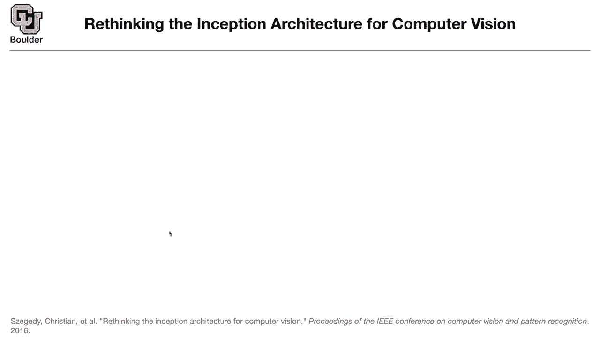

paper and what are some other changes，that they make to their architecture。

things are only three by three，convolutions，with different strides so whenever your。

stride is bigger than，one you're reducing your number of，pixels。

from one layer to the other that's why，this is gonna have a different pixel，from uh it's 147。

yes so it has to do with the boundary，of your image or the boundary of your，layer so you're losing。

two points one from left one from right，and there is a bunch of other，convolutions。

and here is where the contributions are，they are going to use three inception，modules。

on top of that five other type of，inception modules，then another two inception modules。

so global average pulling and if you，remember it was introduced in the，networking network paper。

then there are these logits and then you，do a soft max，to give you the classifiers to turn your。

numbers your logics。

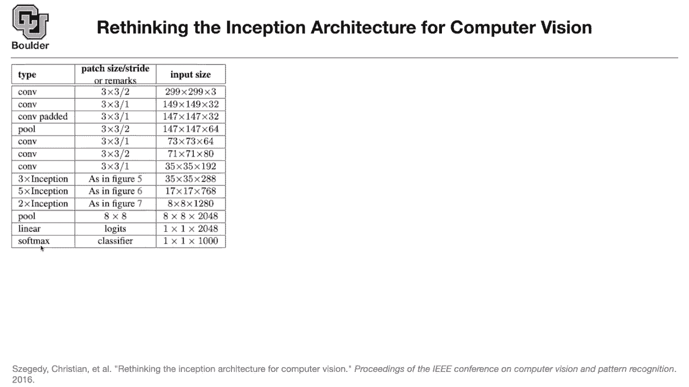

into probabilities you do a soft max，so what are these inception modules。

this is the first one and this，in the first，sessions we said that a five by five，convolution。

has the same receptive field，as two three by three convolutions，stacked on top of each other。

in a deep fashion so this is the first，three by three convolution。

and each one of these guys are gonna be，strided by one，so it's gonna give you this is the first。

number this is the second number as you，stride it to the，right this is the third number as you。

stride it to the right，stride it right and up that's what you，get and so on。

and then on top of that you have another，three by three convolution with filter，size three。

so they have the same receptive field，and that's the size of the。

receptive field it's gonna be five by，five one，so the idea is that you can。

replace a five by five convolution，by two three by three convolutions is。

stacked on top of each other，so you're just adding the number of。

layers that you have and that's what，and the rest of it we know from the，previous architectures。

and these one by one convolutions are，just to reduce the dimension，and in the end you're just gonna。

concatenate the filters，and you have three of them three，and the idea is that you want to，decrease。

the amount of computations that you make。

two three by three convolutions is，cheaper than，one five by five convolution。

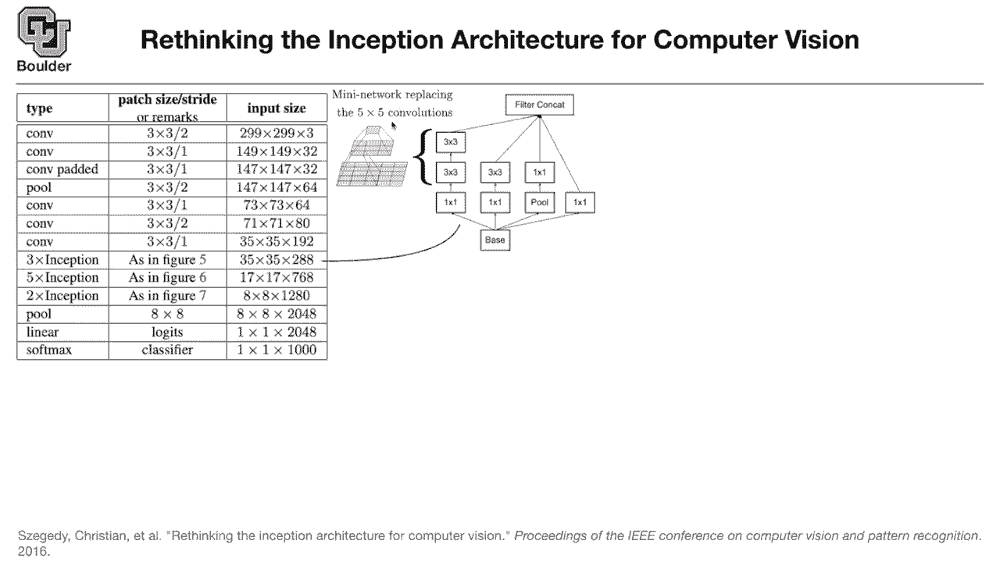

computationally，so what is the other change this is。

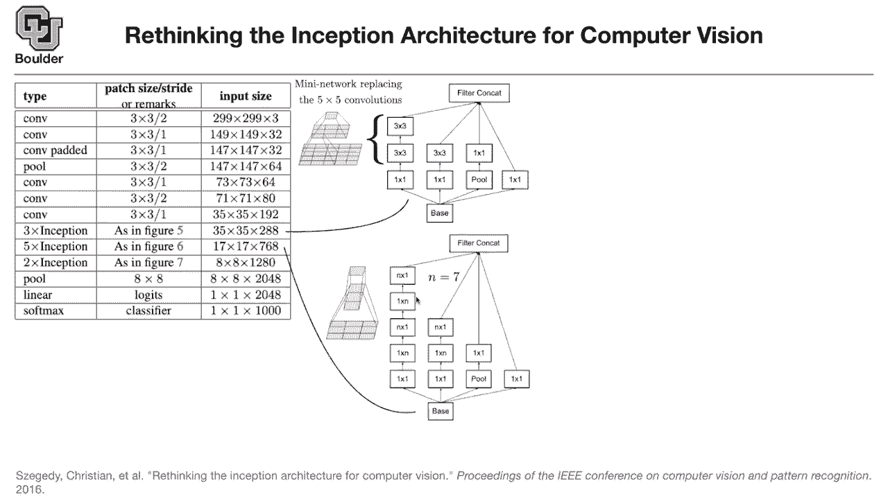

happening towards the end of the network。

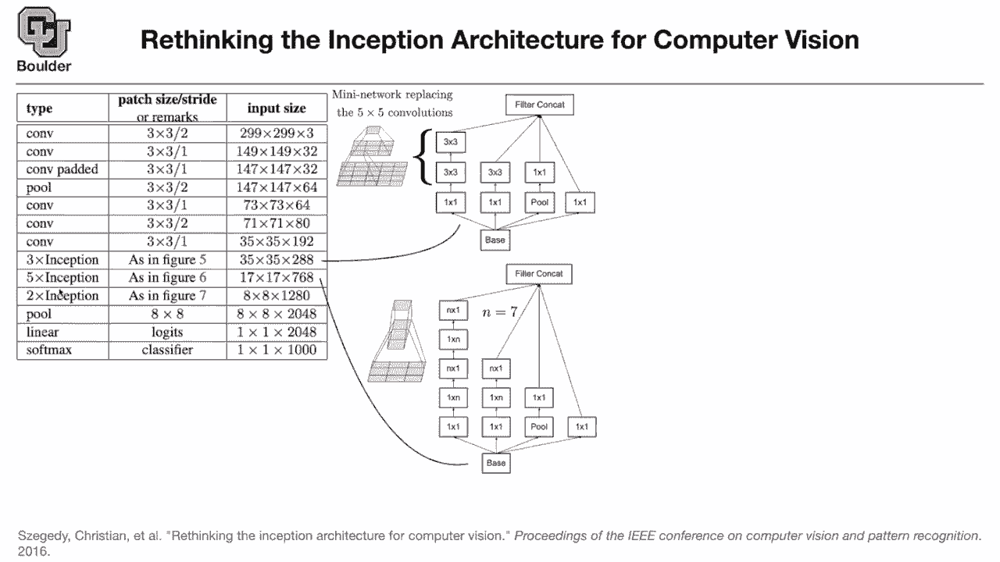

and then you are going to use five of，these inception modules，and the idea is that a seven by seven。

conclusion，you can replace it by one by seven，seven by one one by seven and。

seven by one so this is just，a seven by seven convolution it has the，same receptive field。

but it has less parameters，the fig the plot that you see here is。

for a one by three and then on top of，that is three by one，and in the end you have three by three。

as your receptive field，any questions so far so a bunch of your。

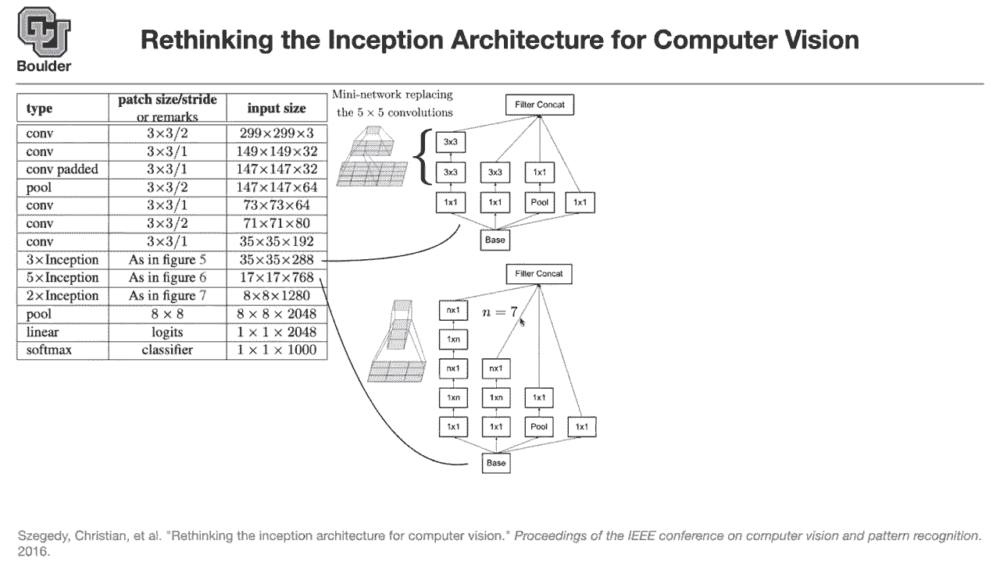

seven by seven convolutions you are，replacing them。

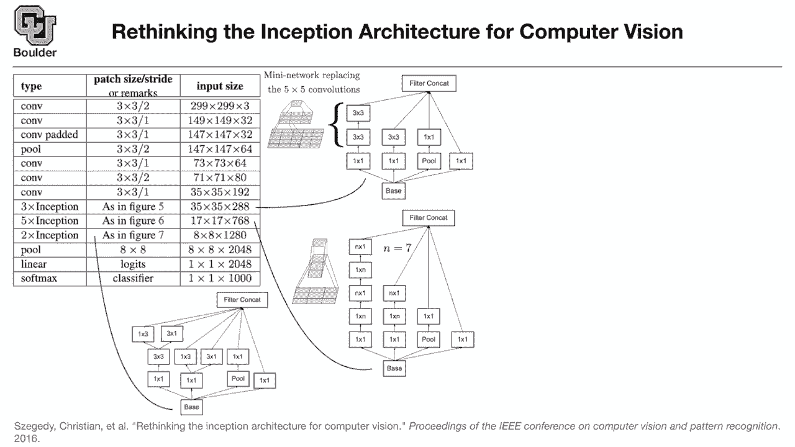

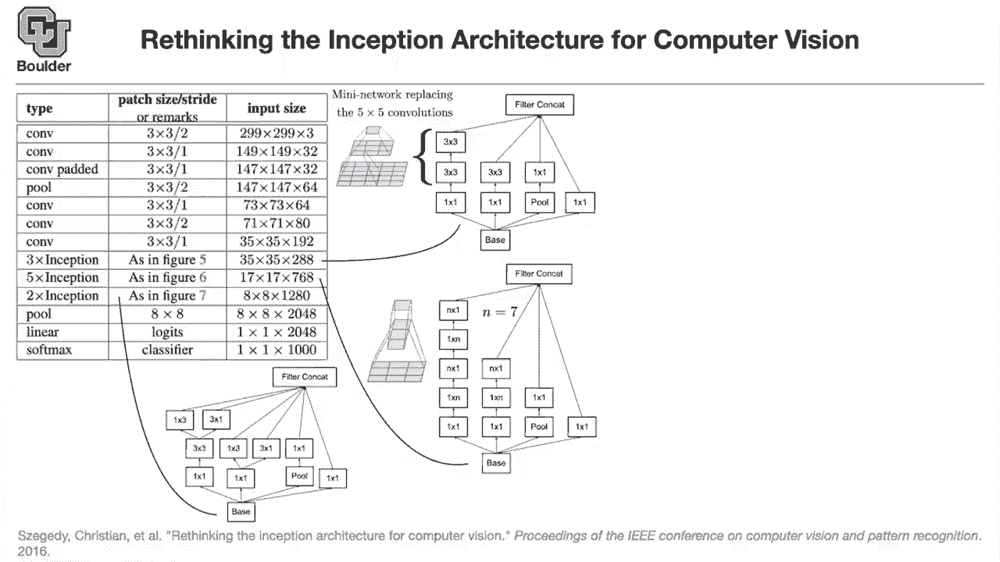

is two of these types of。

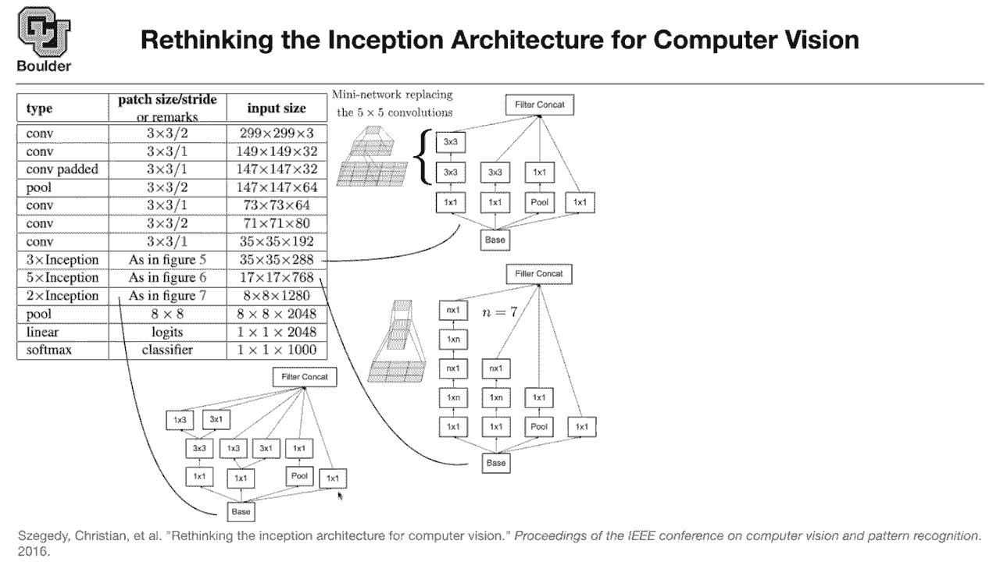

you keep，one by three three by one and you have，three by three and then you do one by。

three and three by one on top of that，rather than stacking them on top of each。

other you can put them next to each。

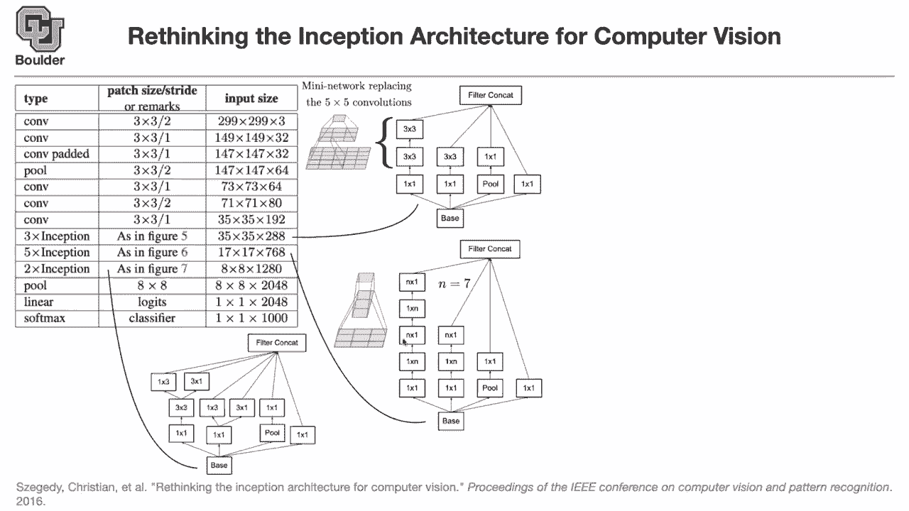

here you are stacking two a one by three。

and then a three by one convolution，on top of each other now you are putting，them next to each other。

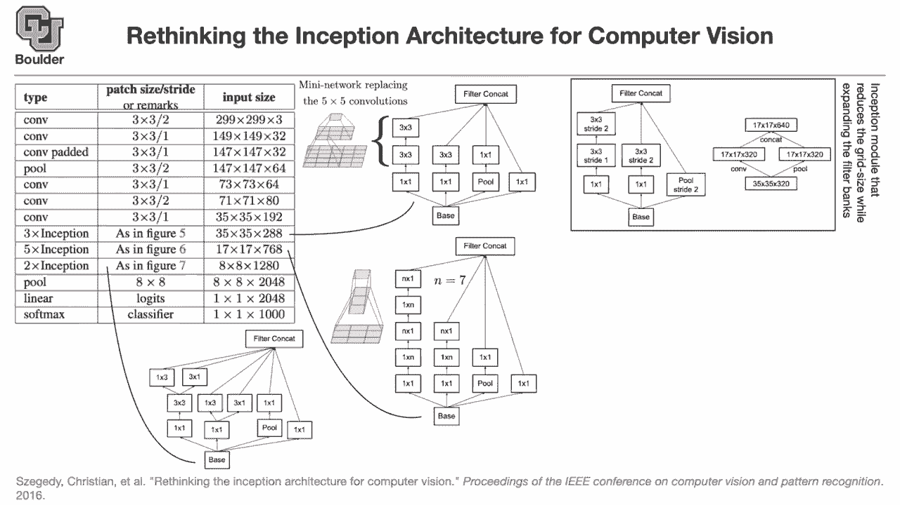

what happens to striding and pulling。

when you want to reduce the number of，your pixels。

this is how you do it these two are the，same things，but you are looking at them from。

different perspective，so this is where you put your strides。

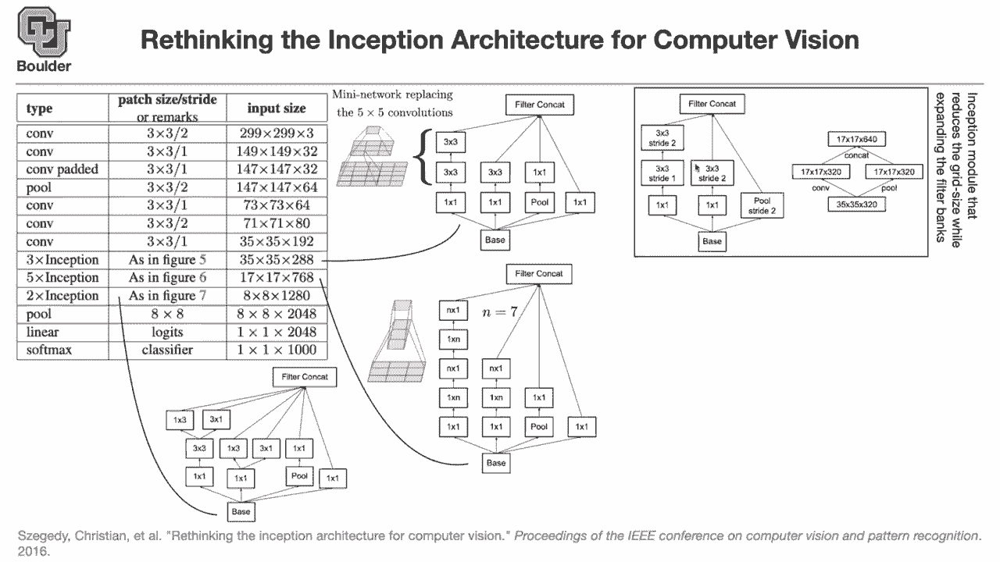

there's a strike two there's a strike。

i think we are one minute over time for，those of you want to leave。

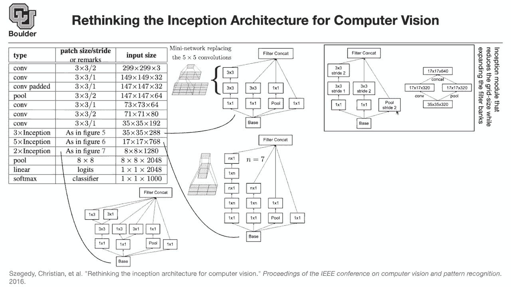

you are more than welcome to leave i'm，gonna be around for those who have a。

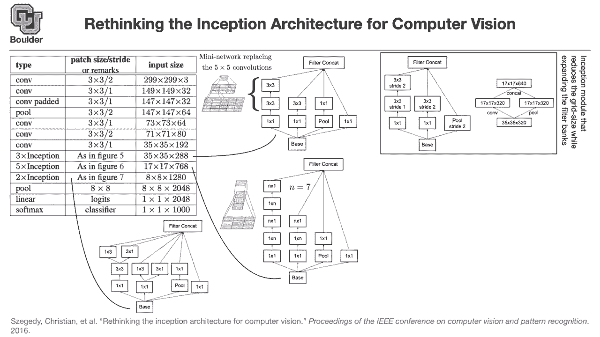

i had a quick unrelated question。

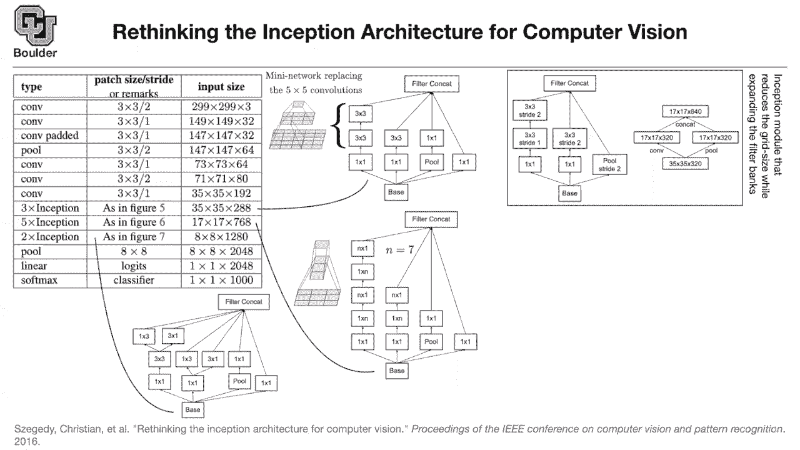

last，architecture for the uh one of the，models that we studied，the layer before the output layer。

was like a one by one by 1024。

or so so i was just wondering is there a，difference with like。

number，of classes that you're trying to predict，or it doesn't pose a problem if you're。

like trying to predict three classes，but then the layer before that has like。

4 000，uh in length so you mean for instance。

here，48 and then you have 1 000。

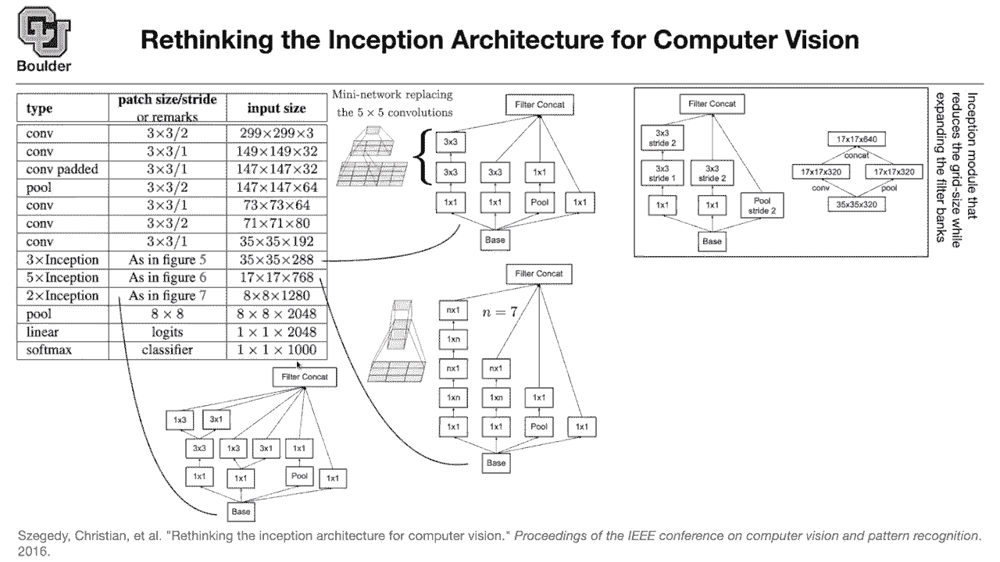

yeah so no it doesn't matter。

what you're gonna do in in the end it's，just a matrix multiplication。

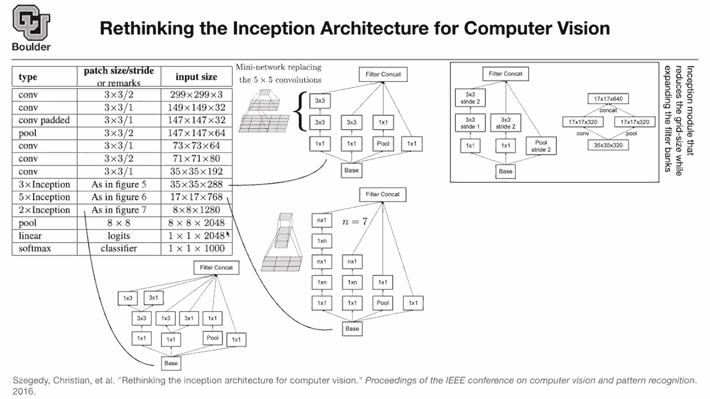

to change from this huge dimension to，maybe three here。

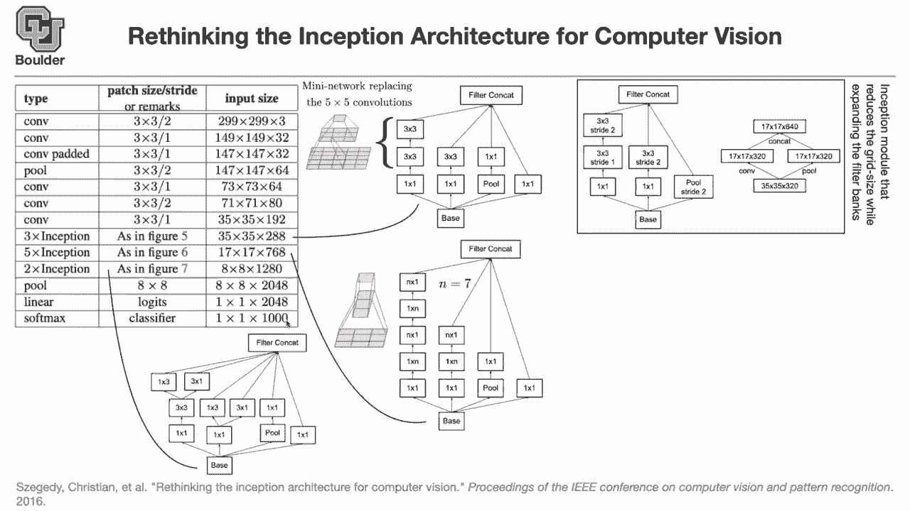