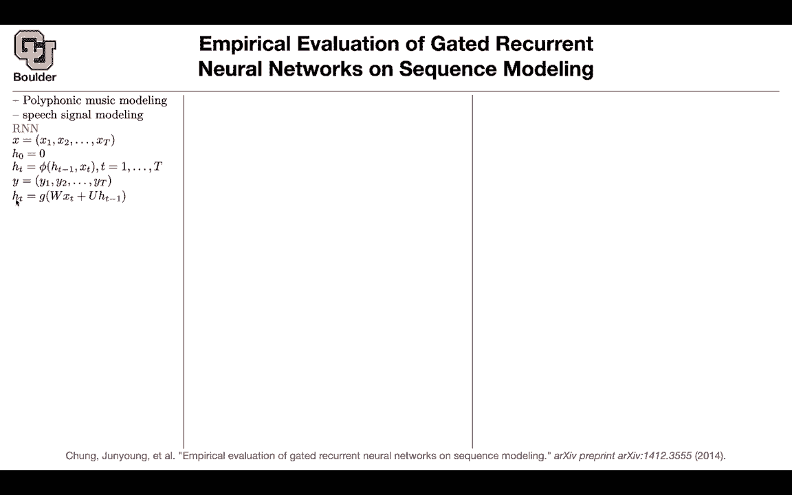
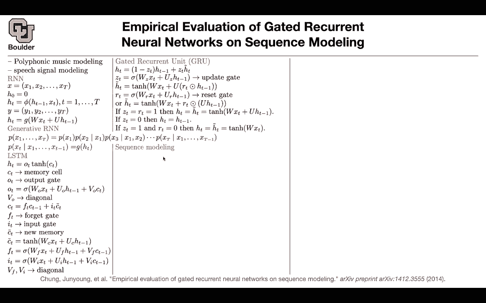
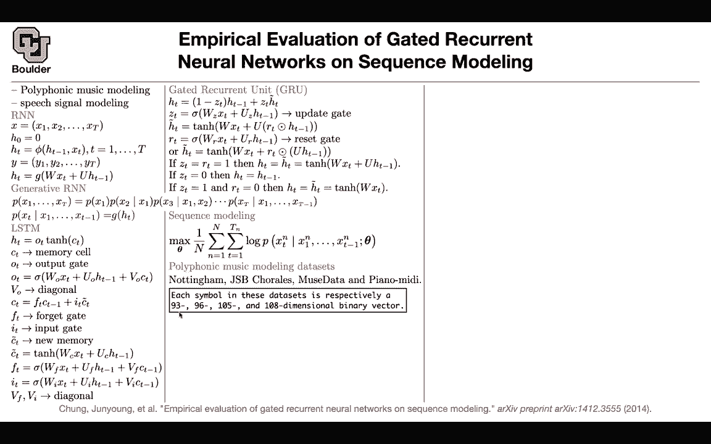
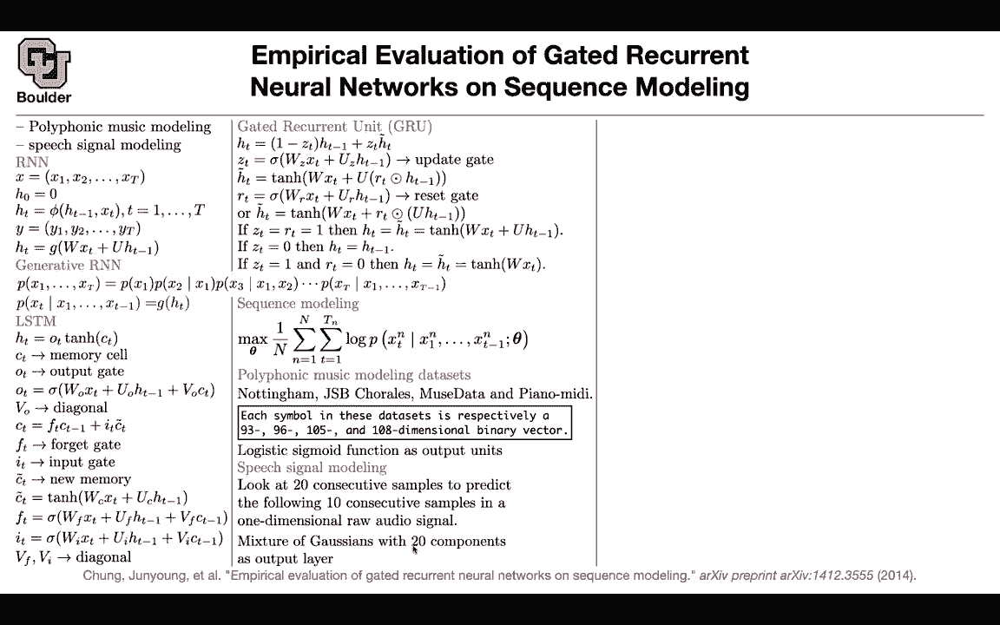

# 【双语字幕+资料下载】科罗拉多 APPLY-DL ｜ 应用深度学习-全知识点覆盖(2021最新·完整版） - P162：L73.2- GRU模型 - ShowMeAI - BV1Dg411F71G

This paper is also an easy one compared to what we covered last session it's about our neural networks。

 but this is the first paper that introduced GRUs and we are going to compare them to LSTMs and see which one is better for speech and music so are we are gonna have a data set for polyphonic music modeling and you're going to have another data set for a speech signal modeling and this is different from a speech recognition these two you can think of them as language model so you are just predicting the next outcome that's your task and then you want to compare GRUs to LSTMs we know what an RN is for RN this feehi function is just your10H and then you are multiplying by X and HD HD minus1 to update your hidden state that's our RN for generative RN this is what you're going to have your modeling the probability of the entire。

Whens。And you' are using the chain rule for probabilities and you're expanding those terms and now the way that you're going model P of Xt given the previous history is that you're gonna summarize the history in H hidden state and that's how you're conditioning for LSTM they're going to be a little bit more fancy there is an output gate you are multiplying by1h of your cell gate this is your memory cell you have output gate and this is your gate whenever you have a gate you have a sigmoid and vs diagonal and your cell gate you are going update it by forgetting some parts of the previous history and inputting some new information that's your forget gate input gate and this is the new memory this is the new information that you want to memorize and that's just a function of your input and your hidden state and our for gate is also a sigmoid and input gate is a sigmoid and VNF are also diagonal so this is an L。

And it has three gates input gate for get gate output gate for GRs you're gonna have only one gate and that's called update gate and it's a beed combination of the new information and some weight of the previous hidden states and then you also are going to have a reset gate so some of this information you're gonna forget and if you remember I mentioned that you have two versions of GRUs one is that you first reset your hidden state and then multiply by matrix another version is first you multiply by matrix and you reset it you reset the information to make an intuition if Zt is equal to Rt is equal to1 what do we get if Zt is one your Ht is going to be Ht tilde so that's what you have here and let's look at Ht tilde if r is1 you're going to get wxt plus Uht minus1 and this is going to give you your rerent run network。

If Zt is0， your H is just going be the previous Ht minus1 and the Rt is going to be gone you're not gonna to ever see so if Zt is one and Rt is0 your H is going to be H tilde and that's going be 10h of Wxt that's going to be independent so each input is going to give you an output independently so the hidden is not going get updated slide one by one convolutions for your sequence modeling task we know that we are gonna to write down our likelihood take a log of it and then do maximum likelihood and this probability we are gonna model with either an a SM or a GRU or an R and we are gonna compare the performance and two types of data sets。

 one type is for music modeling and the other one is for speed signal modeling for music modeling these are the dataset sets that I want。

You to explore nothing。JSP choral muse data and piano Midi the cool thing here is that you symbols your music symbols you can think of them as characters or words or whatever that you want to think about them and these guys are gonna to have different dimensions the first one is 93 JSB is 96 dimensional this is one05 this is one08 and these are binary vectors this is where polyphonic is coming into play for a single phic what's going to happen is that if you output a probability those probability if you output the probability vector that probability vector needs to add up to one it's elements but here there is no guarantee for that happening because two node two node could happen at the same time That's why rather than using a softmax we are going to use a sigitete these are just going to give you numbers that are from zero to one they don't。

Ely add of to one and then you're going to write down your last function and then you're going to do your predictions so these are discrete this is a discrete data set speech is continuous okay。

This is this grid， this is like your text， this is going to be continuous。😊。

What is the task， you're going to take your raw audio。

 you're going to look at 20 samples and condition on those 20 samples。

 you want to predict the next 10 samples， so condition on these2 any condition on the context。

 predict the next 10 audio samples in your one dimensionsional raw audio signal。

But this is continuous this is gonna to give you a continuous distribution why because that raw audio is a wave it's going to go up and down and that wave is a continuous variable for each time step and and you need to model it somehow you are not going to be able to use softmax anymore you can probably model it with a Gaussian distribution but then if you put a Gaussian distribution that's going to be single model if you want to have a multimod distribution a more complex distribution you're going to use a mixture of Gaussians to any Gaussian distributions so this could give you multiple modes and a complex distribution and then this is the one that's going to give you likelihood So this guy was using a sigmoid to give you probabilities because these were discrete these are continuous any questions so far are these samples being considered at the the original sampling rate of whatever audio Yes so it's the original sample。

Of your audio what you're doing here is a generative process given the previous 20 samples give me the next samples。

 the next 10 samples so this is like a language model that's going to be super super high frequency because like 2020 samples in a audio is like microseconds right Yes。

 the details maybe you're downsamp a little bit but that's the idea given 20 consecutive samples predict the next10。

So it's a generative process and one other thing that I forgot to mention。

 we are going to see applications of this or processes like this when we are going to convert text to speech so far we were converting speech to text in the previous paper the methodology that you have here is going to enable you to convert text to a speech so you're going the reverse route。

And if you know about Alex and Siri etc， they're doing this process so that's a generative process for speech and the way that you're going to do it is not only you condition on the previous samples you're going to condition on your text as well so you can put that as additional conditioning information we are going to see examples of that later on but let's the focus office paper is comparing GRUs to LSTMs in the eyes of these two datas these two types of datas to have a fair comparison you're going select your number of units。

 the hidden dimensions in a way that your10H network which is your RN network is going to have approximately the same number of parameters as your GRU and as your LSDM so they have approximately the same number of parameters and this is what you're changing that's for muing this is for speech they have almost the same number of parameters。

So if you gain any performance it's not going to be because of more parameters。

 it's because of maybe because your model is a better model。

 let's see whether you get that what you're going to report is the average negative log probabilities on the training and test on the training you are reporting it to make sure that you are not overfitting and at the same time you are reporting those numbers on your test and this you can think of it as a perplexity of the model it's relative to that。

This is your RN， GRUs and LM help on most of the data except for the first guy。

 and sometimes GRUs are better and sometimes the LSDMs are better。According to those numbers。

 what happens during the training process and a good measure to be fair is to look at the wall clock time in seconds rather than looking at the epoch or the number of iterations it's better to look at the wall clock time how much time did it at this point in time during training what was the training and test performance in terms of those log probilities this is your10age RNN the green ones are your GRUs。

 these are your LSDMs， so it looks like LSDM is doing a better job here then you change your data set these are a speech I want you to explore those data the other one is it turns out that the GRs are doing better than the LSDM and on another data set the not income this is for the music。

You see a more fuzzy picture so it's not that clear which one is better so in the end the results are not conclusive whether LSDMs are better or GRUs are better and that's why you saw sometimes people were using LSDM sometimes people were using GRs okay at least they are as good as each other Any questions so far so you're comparing the performance on seven different data sets and while trying to be fair you're trying to be fair here and you're trying to be fair here as well rather than looking at the iteration you're going to look at the wild clock time so you just check your time at this point in time this was the performance of these three models on a test and training data okay perfect。

