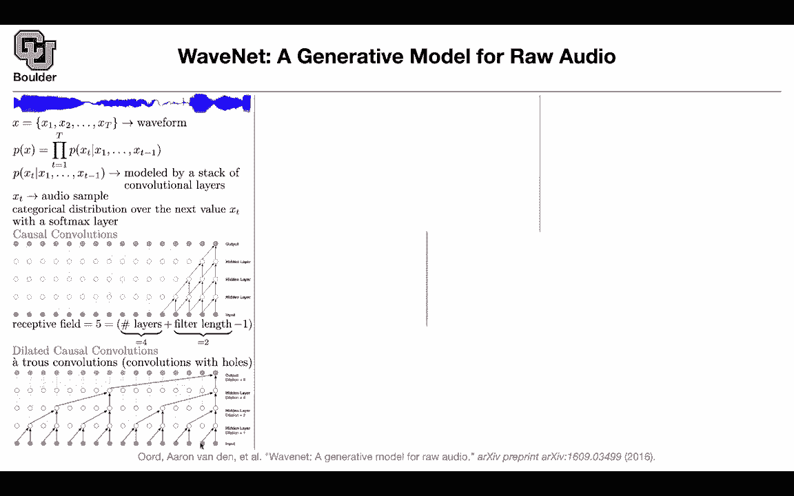
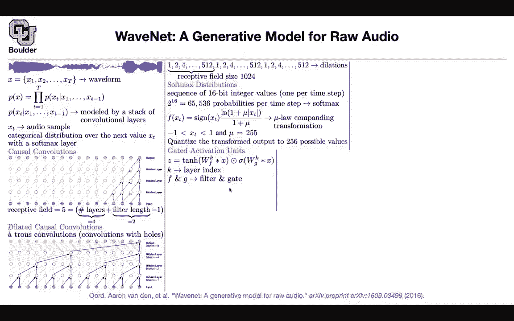

# 【双语字幕+资料下载】科罗拉多 APPLY-DL ｜ 应用深度学习-全知识点覆盖(2021最新·完整版） - P166：L75.1- WaveNet - ShowMeAI - BV1Dg411F71G

So far we were doing discriminative models somebody would give us speech and the task was turning that speech into transcription。

 transcribe your audio we saw only one example for generative type of models generating speech or speech synthesis this is another one previously we were using a Gaussian mixture model when we were working with GRU gated recurrent units the idea here is can you actually treat wave in a discrete fashion and use softmax that's the big idea this is your wave Per time step like the time step here you have a continuous variable and that's why people said maybe a Gausian mixture model is a good model for this can we actually treat these continuous signal and discrete and use Somax that's your waveform and your task is generative given the history gene the next。

This one we are gonna model by a stack of convolutional layers Xt is a sample from your audio and we want to put a categorical distribution over the next value you cannot use any type of convolution because this is a predict next word predict next sample we are going to use causal convolution which is not going to look into the future is's always going to look into the past and this is going to have a receptive field of five why because one。

2，3，4，5 samples in your input are impacting your output and where is this5 coming from you have one。

2，3，4 layers your filter size is two for each one of these guys your filter size is two and that's how you're going to get five I there a way to look far into the past is there a way to increase the receptive field and for those of you who took part one you know that for。

Semantic segmentation， we were using a technique called dilated convolutions or At convolution。

