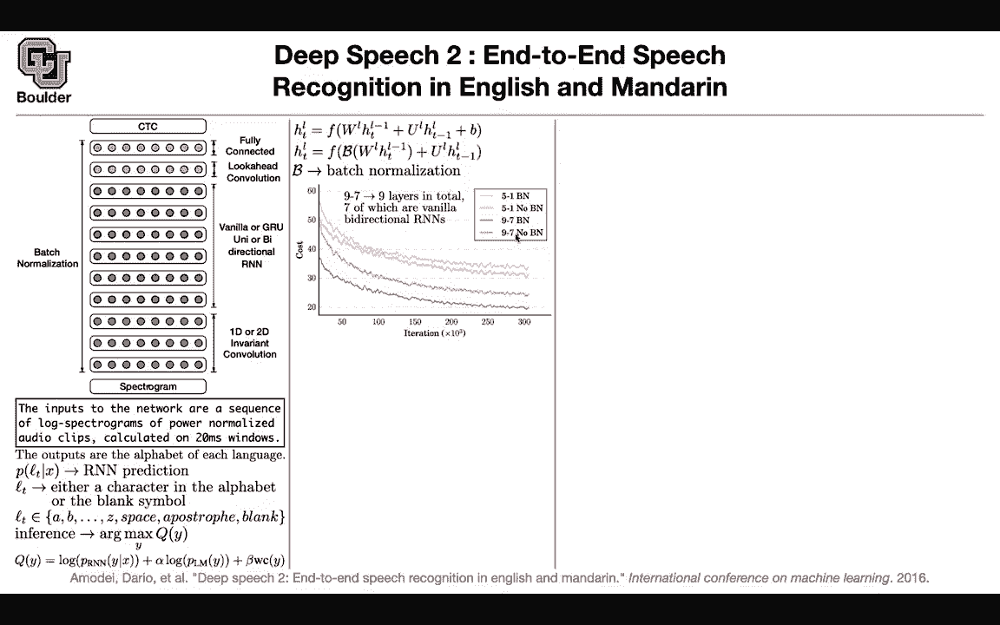
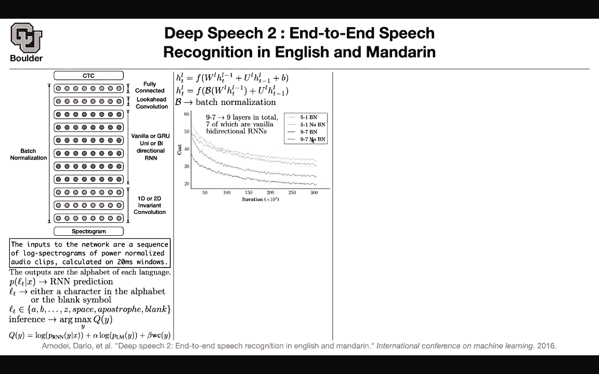
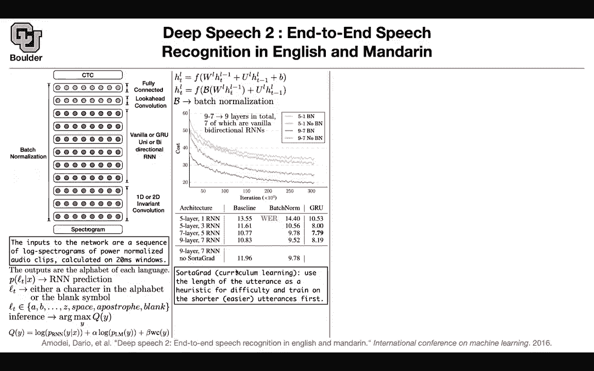
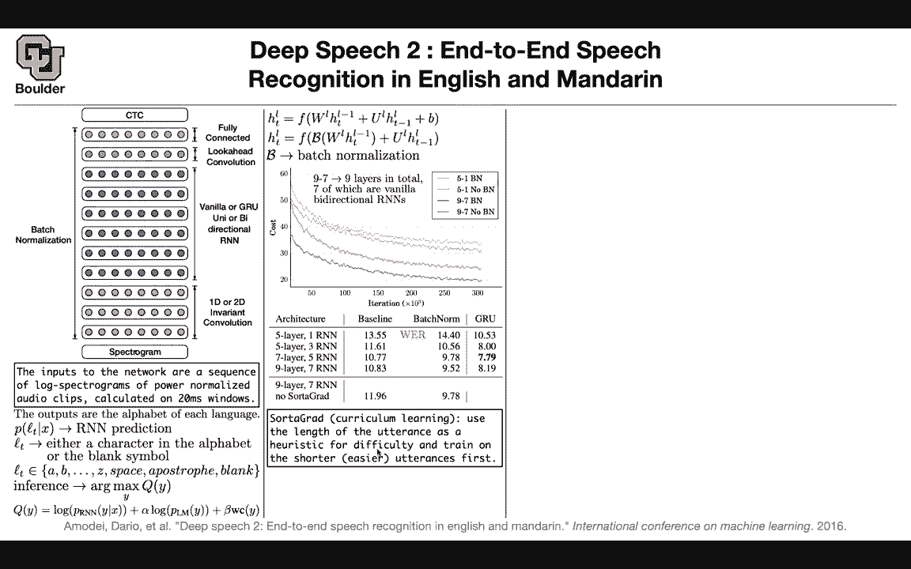
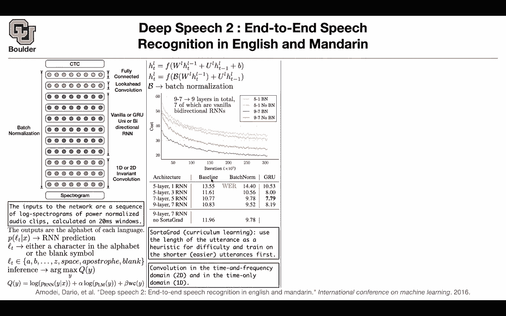
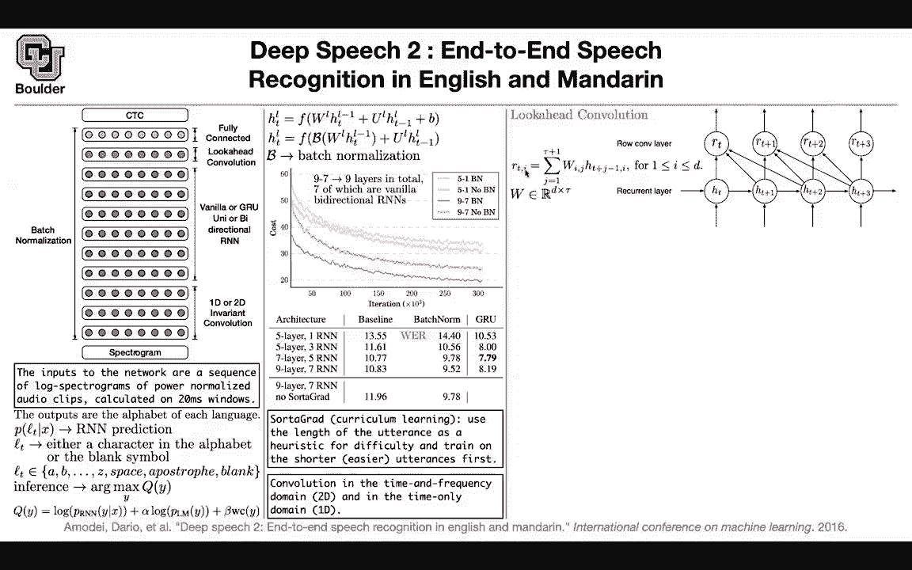
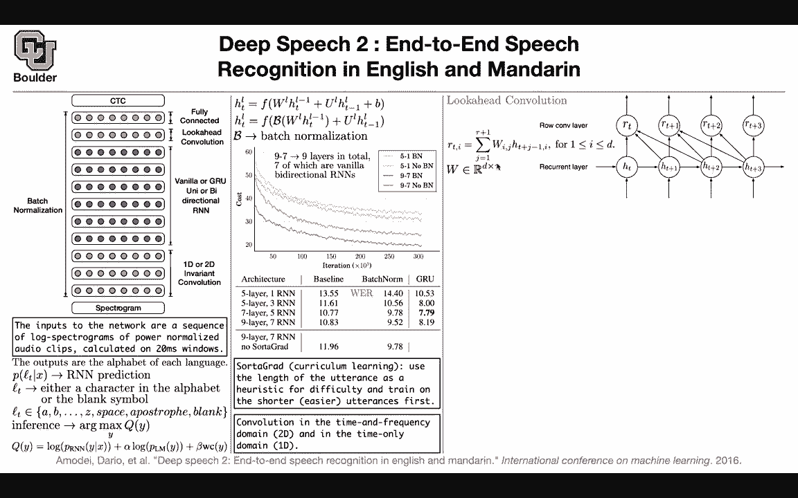
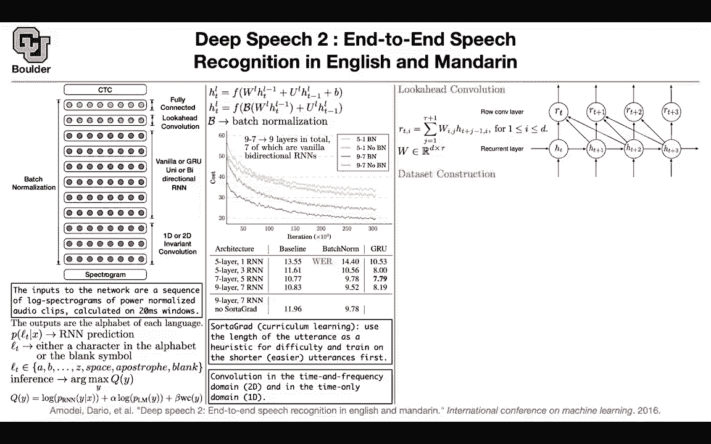

# 【双语字幕+资料下载】科罗拉多 APPLY-DL ｜ 应用深度学习-全知识点覆盖(2021最新·完整版） - P168：L75.3- Deep Speech 2 - ShowMeAI - BV1Dg411F71G

We covered deep speech last session now we are going to cover a deep speech2 it's version 2 of deep speech with some minor modifications and some better data set to give you better performance by in terms of modeling there is not much new to cover what do I mean a spectraltroogram is going to go in you can either have 1D convolution which is convolution in time or you can have 2D convolution which is convolution in time and frequency domain basically you are treating your spectraltroogram as an image it's either a 1D image or a 2D image then you're going to have a couple of layers of convolutions then you're going to do a vanilla a STM or a vanilla RNN or a GRU which could be unidirectal or bi-directal and then can you need to have a look ahead convolution this is one of the contribution of this paper a fully connected layer and then a CTC loss on top。

To train this model and then it turns out that batch normalization is very important also so batch normalization along with the look ahead convolution are two contributions of this paper compared to what we covered so far and the input to your network This is just a recap is a sequence of log spectraltrograms we usually normalize our data So if you do normalization on your spectrogram basically subtract the mean divide by dec standard deviation that's going to give you power normalized audioclipse so this is basically normalizedizing your spectrogram there is nothing hard about it and then the window size that you use for turning your raw audio into a spectrogram is 20 millisecond because if you remember you needed to do shorttime Fourier transform and these are the frame sizes the output is going be a bunch of alphabets so this is going to be end to end training speech goes in text is going to come out what is going come。

Out of the model you can call it the RNN prediction is Lt L at that time and this could be your characters ABC up until Z apostropphy and nothing and then that's why you needed the CTC loss in terms of inference we are going to do beam search not only you include your RN which is this model your cC probabilities you're going keep a language model and then you're going to penalize long output in terms of word count so so far this part recovered in the previous papers How do you do batch normalization for an R are you going do are you gonna to first multiply your w by H your U by H t minus1 So one of them is from the previous layer so this is the input you can think of it as your x and this is your H your hidden state are you just going to multiply and then compute the。

And variance of this vector or are you going to put it around only the input so you have two choices they tried both of them and it turns out that this type of batch normalization is helping them more it's converging better and we know that for RNNs perhaps you shouldn't do batch normalization perhaps doing layer normalization is better so but for now let's stick to batch normalization and let's its effect what does this 97 no Bn mean9 is for the layers number of layers in total in your neural network7 of which are these blue vanilla bidirectional Rns so that's 97 no Bn is no batchsh normalization and then you're going to have batch normalization so no Bn is this curve and if you do batch normalization it's helping you a lot the batch normalization is going to help more if your network。

IDe you can see here if your network is less deep the gap between these two is smaller than the gap between these two curves here Actually sometimes it is hurting batch normalization for less deep networks it turns out that it is hurting is the blue curve the light blue curve should be lower than the light red curve but it's not so it's sort of hurting and it's also an observation that other papers made before this one so batch normalization is going help you a lot when your model has more capacity now let's look at some numbers in terms of word error rate you're gonna have your baseline they are all trained by sort I grad I'm going to tell you what that is so don't worry about that these numbers are trained with sort I grad5 layer one RnN5 layer3 RNNs 7 layers 5 RnNs9 layers7 of each RNNs these are the baseline performance that you get from from a。

Current neural network if you use GRUs， they're going to be much better and if you add batch Nor it it's also going to help a lot so batch Nor is important and sort of grad is also important so you're losing some performance if you don't do it and what is that it's a curriculum learning type of algorithm training procedure you're going to use the length of the utterance which is the length of the output from your neural network or the length of the labels in your data this is a heuristic for you to say that this label is more difficult this is a difficult measure of your data this data is more difficult than the other data because it has a longer utterance and then now that you have a difficulty measure you can sort your data。

 a query and then you can train on the shorter ones first first your model is going to learn the easy cases。

And then once it learns the easy cases you're going to show it more harder cases and it's helping it's helping train your network better and then you can have two types of convolutions 1D versus 2D 2D is going to help also so treating the entire spectrogram as a 2D image is going to help your network any questions so far before I cover look ahead convolution so this was about batch normalization and a curriculum learning schedule any questions about those okay in that case we can move on what is the look ahead convolution it's very simple it's like any other convolution this is actually depthwise convolution because your R here is going be a vector the H the hidden states here are going be vectors of the same size and the size you can think of them as the number of channels these vector sizes is your number of channels so channel I。

Of your output is going to depend on the channel I of your input and whenever that happens that is a depthwise convolution that's just a definition of a depthwise convolution it means that you're not doing a matrix multiplication to convert one vector to the other one these are just a scalrs if this is a scalar that's a scalar then w is also going to be a scalar wj I is going to correspond to the entry that your outputting T is going to be the time so because the size of your vectors is d this is going w is going to be d by something and tau is your look ahead this is for instance your tau in this case is going to be3 so you're looking at three observations in front of you12 actually itself one and two and that's going to give you your matrix and that's a look ahead convolution it's a depthwise convolution and why。

Why do you do look ahead convolutions because sometimes when you're speaking when you see speech。

 you need to look a little bit ahead of yourself， you need to listen a little bit more so that you can guess the correct output the correct letter the correct word so you need to be patient a little bit listen listen a little bit more before you make a decision that's why you're looking ahead you're waiting a little bit before outputting the utterance and they're going to use big data sets and they construct data they collect it from the internet but they have a catch they have a problem the problem is usually they are going to end up with very long speech and very long text corresponding to that speech and we would like to work with shorter we want to cut the data cut the length of the data the way that you're going to do it is let's say you have an audio pair X and Y。

And you can actually compute the most likely alignment basically you're going to cut your data in different ways now you want to know what is the most likely alignment how should I align the speech to the text and the idea is you need to somehow have a performance measure Yes cutting is easy but measuring the performance is hard how do you measure the performance how do you find what is the most likely you can use a neural network it's a recurrent neural network that is already trained on another data you can use that to score over all of these alignment and then choose the best one choose the one that has the maximum alignment according to the pre-trained neural network and this is just a pre-processing step for you to cut and align your data and once that is done the rest of it is training training this model using that data so like any other。

Paper there is going to be a question of how important is the size of your data。

 what if you use 50% of your data， to20% of your data to train the model 1%。

 and these are going to correspond to 1 and2 many hours， 1000 and 200 hours and more hours。

We can look at the noisy data collected in noisy environments and data collected in controlled environments。

 you can look at the word error rate yes， you lose some performance as you lose as you use smaller fractions of your data but that's actually not that bad for instance using 100% of your data versus 50% is actually not that bad。

 the performance that you're going to lose there are some other numbers and other types of data sets for instance the reading type of data。

 the accented type of data， noisy type of data in noisy environments。

 these are the performance of a human transncscribeber this is the performance of the method DP2 and they do a lot of experiments in the end the best model for English has two layers of convolutions so this is gonna to be two layers of convolutions。

 three layers of un。Direional RN with GRU cells of this size and Luc head convolution tau is another hyperparameter that you can choose with 80 this is your patience you need to wait that long to make a decision and it should be trained with bachelor and sort of graph for Chinese the best model is given here and you can compare the performance to a human for different types of architectures that you have here okay any questions。

I had one quick question， going back to the look ahead convolution。

 I just wanted to make sure I understood correctly and that the depth in our depth wise convolution is this tau term that would be like our channels。

Tau is your kernel size。 This is how many pixels you are gonna collapse into a single pixel。 Okay。

 so tau is your kernel size。 and I is your channel is the vector size。 Okay。

 so we're doing depth y across the channel across the channel across the vector， Okay cool yeah。

