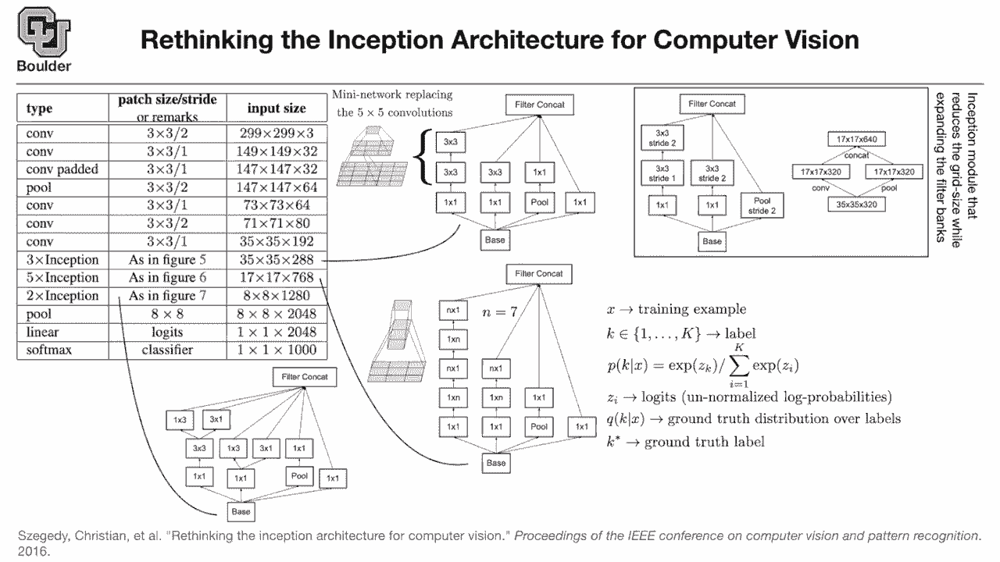
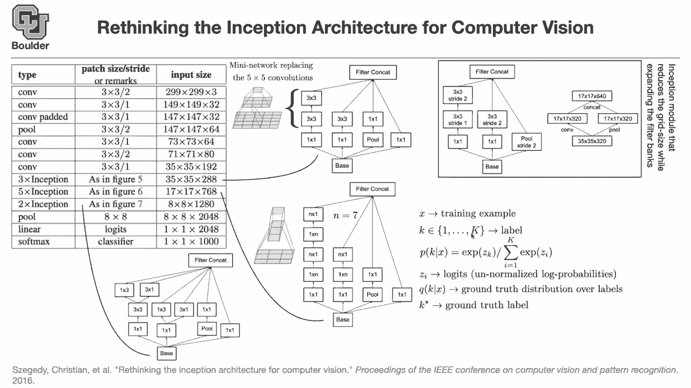
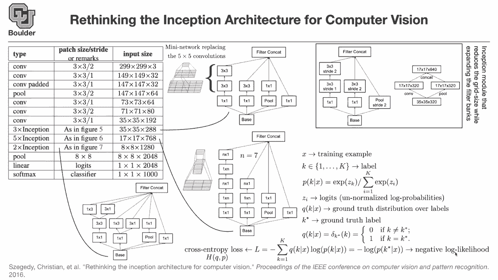
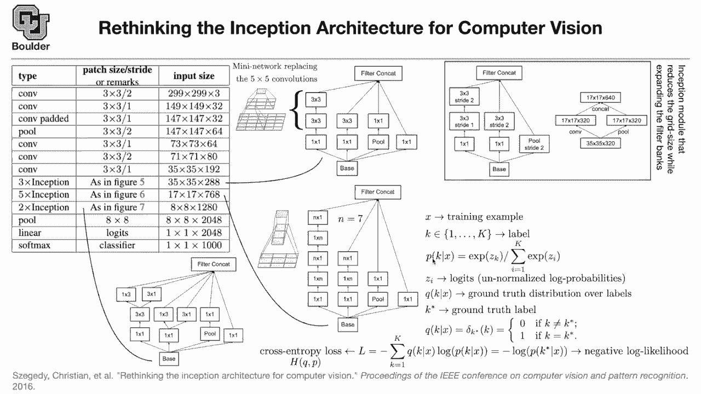

# P16：L8.1- Inception-V3 [续] - ShowMeAI - BV1Dg411F71G

so last session we covered。

uh a little bit of the inception。

architecture and different types of。

or different variants of doing inception。

for instance two three by three，convolutions，stacked on top of each other is gonna。

have，same。

size of a receptive field as a five by，five convolution。

but it's gonna be cheaper so why not use。

so you you can just stack three by three，convolutions on top of each other and，just use that。

for more efficient neural networks。

the other one is one by。

n and n by ones are gonna turn out，to have the same receptive field as n by，m's。

and these are also cheaper because you，have one less for loop。

you have one for loop here another one，here but it then it's stack on top of，each other。

and the other one was that now that you，know，that you can use one by n and n by one。

convolutions，it means that you can just rather than。

stacking on top of each other you can，just put them next to each other and，they concatenate them。

so these were the observations that they。

made in that paper，to improve the accuracy of their model。

then the question is，how are we going to deal with layers。

like this，where you are reducing the number of。

their resolution size or basically your，grid size，how are we gonna deal with that how are。

we gonna change 17 to eight then。

the idea is you can use it this way，there are two ways these two are just。

two ways of looking at the same thing，basically the one on the right says that，you are going from。

resolution 35 by 35 to 17 by 17。but how do you actually do it you you do。

it using strikes，your pulling is gonna have a stride of，two。

then you do a one by one convolution to，reduce the dimension。

basically reduce the number of channels，and then you do a stride of two。

you do the same thing here so this is a，typical example，of how do you how you would reduce the。

grid size from one layer to the other，one，and if you compare to the one on the。

left these are basically very similar。

stride two，here strike two and then there is no one。

by one convolution，so this branch is just left out。

any questions so far there is another，modification。

and that has nothing to do with the with，the structure。

of the neural network it has to do with，the loss，it has to do with the way that you。

formulate your loss function，but let's remind how a typical loss，function works。

for a deep neural network let's say，x is your training example that's the。

input that's one image，and k is the corresponding label。

which could be one up until k capital k。

so in the case of imagenet，you're gonna have 1000 labels capital k。

is 1000。and what you do is in the last layer，there is a linear。

layer that is turning your 2048。

dimensions，and projecting it into 1000。

and then on top of that you're going to，apply a softmax。

so this is the input to the softmax and，the output is going to have the same，size。

but what is a soft max so far we were，not covering it and i think now it's a，good time to cover it。

so the softmax is going to take。

these logics z k's which are，the outputs of your linear layer the。

last linear layer，and then it's going to turn that into，probabilities it's going to take z k。

take the exponential and divide it by，the summation so this guy is going to，normalize。

it exponential is going to make sure，that，things are positive and then once you。

divide by the x，the summation over the exponentials of。

all the other classes，you are turning the output into a。

probability，now they're gonna sum to one if you put，a summation here over。

k the numerator and denominator are，gonna cancel out and then you're gonna。

get a one，so now this is a probability is that，clear yes no。

okay perfect and let's say q，is gonna denote your ground truth。

distribution，what is the ground truth you know what。

is the corresponding k，if it's。

the image of a tiger you know that。

the corresponding label is gonna be a，tiger，so you're gonna pick one of these let's，say the 100th。

type。

tiger and let's call that kstar that's，your ground truth okay a star is the，ground truth。

is one of these numbers for instance for，the case of tiger it's 100th one。

your k is gonna be a delta d。

rock function what is that if k，is equal to k star if you are at the，true label。

you get a one otherwise it's zero and if，you add it over k's you see that that's。

that adds to one so that's actually a，distribution。

and it's peaking at one of your correct，labels at k star so what is our loss。

function then，this part you know from the first slide，you know that。

you are going to maximize the likelihood，this is the likelihood。

maximizing the likelihood is equivalent。

to maximizing the log of the likelihood。

because log is increasing is uniformly，increasing function。

so it doesn't change the maximum value，and then in machine learning we usually，like to minimize。

that's why you multiply by a negative，sign that's going to give your。

negative log likelihood basically you，want to increase the likelihood of the，correct label。

so that part we know from the first，slide，and this and this is pretty intuitive if。

you increase the probability of the，correct one，because everything has to add up to one。

you're decreasing the probability of the，other ones。

so there is that constraint implicitly，in your model，so that's doing the correct thing and if。

you write。

the cross-entropy diff definition this，is just a notation for cross-entropy。

between two distributions h of q，and p and what i'm writing here is just。

the definition，of cross-entropy so you take the，expected value。

basically this is your expected value of，the log of the。

distribution log of p and because。

q is a delta function most of the times，it's zero，it's only one when k is equal to k star。

this summation is going to collapse into，the term that you have on the right。

so cross entropy loss function is，equivalent to。

negative log likelihood so do you have，any questions，a。

single you have multiple labels per，image，you mean you have multiple correct。

labels yes，yes that's right objects in your maybe。

there's a tiger there's a dog and a，cat simultaneously in your image that's，what you're saying。

yes the answer is no you cannot use this，even if you change q it doesn't sort of。

work，no because of this assumption that。

you're saying that the probabilities，have to add up to one，but then your probabilities are not。

going to add up to one because there are。

two objects，the way that you fix that the fix is，very simple you use a seek point。

ah okay thank you because the，probability of your dog and cat。

if you have two of them in your image，they don't have to necessarily add up to。

one because with probability。

i don't know 0。9，the object on the left could be either a。

dog，or a window okay。

and then the probability of the object，on the lower left of your image。

could be either a cat or a bird，so they don't have to add up to one so。

this assumption doesn't work anymore，but that's a great question and there。

are actually sometimes that you want to，identify multiple objects in your image。

we're going to cover that later on in，the course any other questions。

loss，sometimes you hear the negative，likelihood loss。

but these are equivalent why because。

your ground truth has a delta dirac，distribution okay so far so good。

the paper didn't do anything special，it's just。

what has been around forever what，changed，did they make they observed that。

sometimes，these neural networks are gonna overfit，because。

the way that this loss function is，working is that it's pushing。

the correct label or the logit，of the correct label to go to infinity。

and the other ones go to zero。

so there is a huge gap in the，logit space between z k。

z k star and other z k's so one of them，is going to go to infinity and the other。

ones are gonna go to zero，so this has two problems one is that。

it's gonna make the learning difficult，when you take the gradients the other。

one is that，it helps your model overfit。

if you give enough capacity to your，neural network。

as you are doing here it might actually，push zk to be infinity。

and then it turns out that it's，overfitting it's memorizing your，training data。

so the idea is that you can replace the，label。

the correct label with something random，maybe a uniform distribution so what。

this does，is that let's say you pick the image of，a，tiger most of the times epsilon is a。

small number。

most of the times the correct label，associated with this is going to be the，underlying truth。

the ground truth it's gonna be tiger but，then sometimes。

you say that's not a tiger。

you say my ground truth is，just something random that's a bird or，that's a。

that's a window that's a door so，sometimes you trick your model。

you give it the wrong data so let's just，do that，basically with probability epsilon。

you're replacing the，ground truth with something random and u。

is uniform，it's a uniform distribution so equally，probably you're gonna associate a random。

label to your data your input image，so let's just do that let's take q prime。

and put it here in place of q，this is called label smoothing it's sort，of regularizing。

your neural network but the，regularization is happening at the end。

at the last layer of your neural network，so we know how to regularize the other，layers。

sometimes we are using dropouts，sometimes we are using batch，normalization。

this is the last layer that you're，regularizing it，so if you take q prime and put it。

here in place of，q you have one minus epsilon，q so that's gonna give you 1 minus，epsilon。

h of q and p and h，we know that's the definition plus，epsilon h of u and p。

so sometimes it's q sometimes it's u，with epsilon，being a small number now let's use the。

definition of，h u and p h u m p，the cross entropy is just the kl，divergence。

of the uniform distribution and the，underlying，probability basically the probability，that the model。

predicts plus h of u，but let's look at this objective，function what are we minimizing。

with respect to can anybody answer，we are minimizing this loss with respect，to what。

the parameters of your neural network，and the parameters of the neural network。

are affecting what term here is it，affecting q or is it affecting p so it's，affecting p。

so you are minimizing this loss with，respect to p，correct yes that's correct so you're。

doing it with respect to p，now your objective function if you are，minimizing with respect to p。

this term depends on p this term doesn't，depend on p，it means that its derivatives are zero。

with respect to p，it means that this term doesn't have any，effect on your loss function。

so we can simply drop that and as i said，u is a uniform distribution。

so what you're doing is just trying to，regularize p to move towards the。

uniform distribution it means that，you're trying to avoid，some of your z k's to be going towards。

infinity and the other one's going，towards zero，so you're trying to push everything，towards normal。

but you don't do it aggressively you do，it for a very small epsilon。

so that's how you're regularizing and kl，divergence is just，measuring the distance between two。

distributions，so you're trying to minimize the，distance between two distributions。

so that's another change that the paper，makes，and then they are going to report some。

very good results in their paper，any questions and h is just the entropy，h of u is just h of u and u。

so we learned about a lot of concepts，one is how cross-entropy what is the。

definition of cross-entropy，that's the definition how is it related，to。

likelihood that's how it's related under，this assumption，and how we're gonna do label smoothing。

and what's the definition of kl，basically kl you can define it to be h，of u and p。

minus h of u and h of u is just，h of u and u so everything is consistent，is everything clear。

and any questions regularization is very，important，in round networks and we saw that all。

over the place，starting from alex net paper up until，even this one。

so from the beginning of your neural，network until the end you're doing，regularization。

okay if there are no questions so the，structure is clear yes，sometimes you're making some。

contributions，on the neural network，construction side of things sometimes，you're doing。

contributions if you write a paper on，the loss。