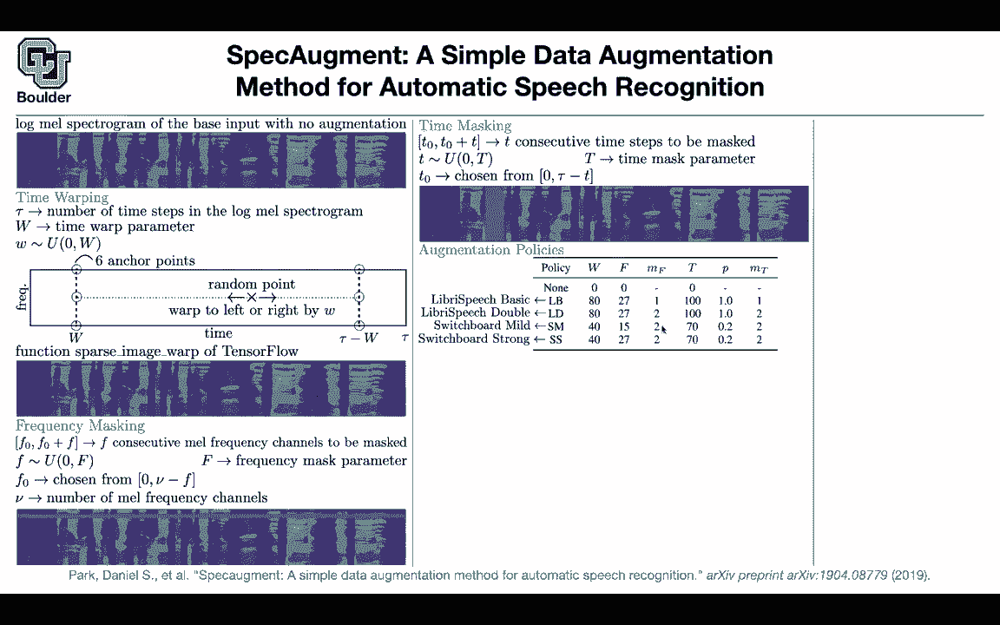

# 【双语字幕+资料下载】科罗拉多 APPLY-DL ｜ 应用深度学习-全知识点覆盖(2021最新·完整版） - P170：L76.1- Listen, Attend, and Spell - ShowMeAI - BV1Dg411F71G

Last session we stopped here with spec augment which is a simple data augmentation technique for speech We know that data augmentation helps images。

 it helps text does it help speech when you have smaller sized data and if yes。

 how are you going do it are you going warp the time for instance pick six anchor points and then randomly shift everything else to the left or to the right basically pick a point and shift it to the left and to the right and correspondingly adjust the others this you can implement in termssorflow using sparse image warp so you're warping your images in this case your image is your log on spectro graph should we do time warping or should we do frequency masking。

She's basically picture a frequency and then you mask a couple of them should you mask your time like what is happening here or should you do a combination of all of them maybe mask to perform two frequency masking a couple of time masking and time workinging and this is exactly where we stop last session so you could do multiple of them any questions about data augmentation so data augmentation is very important because you can take a single sample and then turn it into multiple samples maybe five and then this way you are increasing the size of your data set by five and we know that neural networks like bigger data sets。

And then the rest of it is choosing a loss function and doing your training you can do CTC so I was hoping when I was showing you that usually the length of your input to the neural network or the length of your input data is usually less than the length of your text I was hoping one of you guys to ask a question like this why don't you just take the signal encoded in a single vector and then decode that single vector like what you were doing for languages I was hoping one of you to ask me this question why don't you just do that we had the same problem for languages you had you had an input sentence which had a different length compared to your outputs for instance English versus French they could have different length and the solution that we had over there was encode and then decode we had a similar thing for images and image would go in and then。

We would require a text to come out and over there we had this idea of again encoder decoder or even more advanced show attend and tell I'm sure you remember that paper first take a look at your image and then encode it and then you decode it and then you can put some attention in between can you do a similar thing for speech the answer is yes。

 of course so there is this paper we don't have time to go through it's called listen attend and then spec and it's very similar to the other paper that we covered show attend and tell here we are listening whatever you're going to do you're going to take your log Spectroogram you're gonna push it through your neuraln network which could be two layers of CNN with some max pullinging and some strip and let's say your strip is too and then it's gonna encode it and then for the encoder you're gonna have a bunch of LSDNs D of them stacked on top of each other。

And each LSTM its hidden size is W and then that's going to give you a bunch of vectors that you can attend to when you're decoding your when you're decoding and outputting your text and then you can take those attention vectors you can push them through two layers of R&N in addition to that attention that candesem that you had and then it's going to give you the tokens for your transcription this way there is no need to do the CTC loss anymore you can do a regular the type of losses that you are using for text you can use them here and your text you can represent it with word pieces for instance like what you are doing with with text this is exactly what you are doing with a model like Bt you can add a language model and then the decoding is a simple decoding scheme beam search for text it's not a beam search for speech anymore and then you do your decoding the usual way and then you can。

And report your results。So one advantage。That CTC has over these types of models。

 these types of attention models is that for CTC loss。

 you have some you're using some extra information and the extraform is that your input sequence is always or yes you can say it's always longer than your output sequence and you're using that assumption to come up with your CTC loss and that's maybe one of the reasons that CTC is efficient and the other thing is you don't need to work inr work with encoder decoder architectures anymore and there is no need for a fancy attention mechanism。

 you could actually put attention and transformers here and we are going to see an example of it later on and use CTC loss but in terms of comparing the performance they're going to give you similar performance one of them you're doing you're working harder when you're writing your loss function and for the other one。

You're working harder when you're writing where you are designing your neural network to add listen at 10 NS spell here you're gonna have a simple structure for cC so this is how you're going to compare the two let's go back to the data augmentation the main theme of this is slide and try to study what are the effects of each one of these types of augmentation how do you compare term work time warping versus frequency masking versus time masking how do they compare let's use all of them that's going to give you 3。

7 in terms of test error test word error rate these numbers are in person and then whenever you want to know how important something is you can just remove it and see how much you lose in terms of your performance so let's remove the time workingping you're losing very little in terms of your performance your word error rate is going to increase slightly but if you remove time masking。

You're going to lose a lot or frequency masking so time warping is not that important。

 but time masking and frequency masking are very important and in terms of data sets that I want you guys to explore there is library speed。

 it's 960 hours of speed and then switchboard it's 300 hours of audio。Any questions so far， Okay。

 perfect。