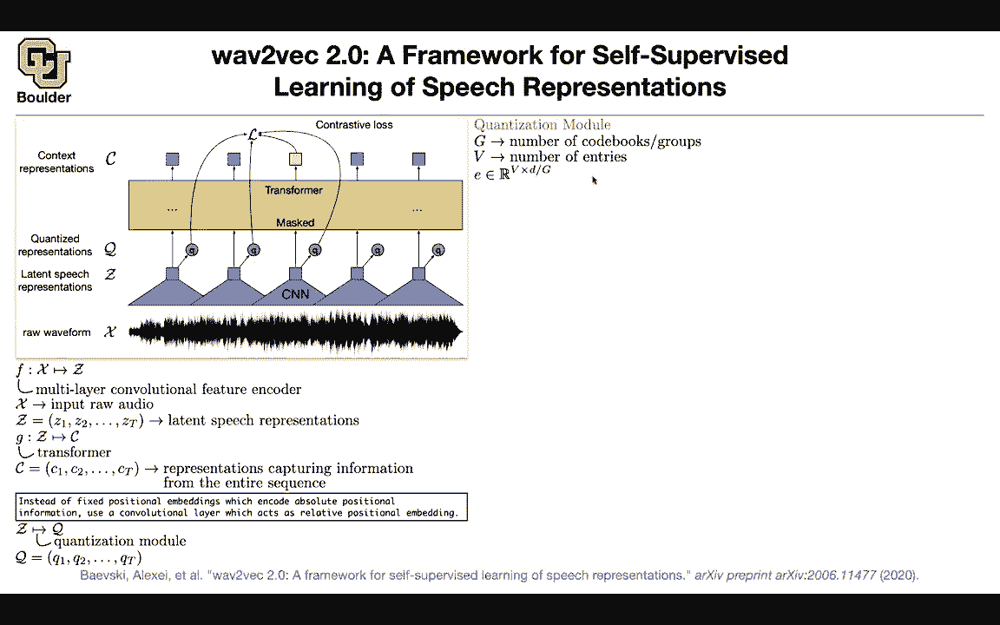

# P172：L76.3- Wav2vec 2.0 - ShowMeAI - BV1Dg411F71G

This is 2019 let's go 2020 What is the trend for language models or natural language processing these days you do pretraining fine tuning or sometimes you don't even do fine tuning like what you are doing with GP2 and three but the paradigm for text is pretraining fine tuning on downstream tasks the question is can you do a similar thing for speech can you do pre-training and then fine tune and at the same time。

 what is the trend these days people are using transformers let it be for images let it be for text can we use transformers for speech as well the answer is yes。

 you can use transformers and you can have a loss function that is for pretraining and you're learning from unlabeled data these are you're learning from speech it's as if a child first learns to speak and listen and then it learns to。

Write and read so can we actually learn by listening so we are trying to learn representations by listening only similar to what a human would do。

 but there is a catch if you want to put a transformer on a signal that has a lot of samples in it we know that transformers are not cheap the cost is going be the length of your signal squared just to process one signal okay we can get around that by first down sampling and the way that you're going to down sample is using a bunch of convolutions so you put a bunch of cnns and then you're gonna to summarize this window of your speech perfect so you go from x to z using a bunch of convolutions and these are going to give you a bunch of vectors now on top of those vectors you take them and you push them through a transformer so on top of those you are putting a transformer okay that's feasible that we can do now and then the transformer is going to output。

A bunch of other vectors， a sequence of vectors C1， C2 C3。

 C4 C5 and this is Z1 Z2 Z3 Z4 C5 The question is what is going to be your loss function what is the difference between speech and text for text you had word vectors here you have raw audio or encoded vectors here and then you are masking some part of your text and then you wanted to see you wanted to reconstruct that but when you are reconstructing you had finite choices for instance you had the number of choices that was your vocabulary size so we need to address those problems we need to write down a good loss function the masking this is still the same so these arrows that you're saying is just for writing the loss function but your architecture is gonna be a transformer and convolutions the rest of it is a good loss function let's try to do that the easy part。

First you put a convolution that takes raw audio as input and it's going to give you some latent speech representation。

 a sequence of vectors then you take those vectors you push them through a transformer and then that's going to give you some representations these are again a bunch of vectors C1 up until CT because this sequence even after getting these representations is going to be very long you cannot do positional encoding in absolute sense。

 we saw the same idea when we were doing transformer X we had to look at the relative positions basically the difference between two positions that matters so another way to implement that idea is that the first layer of your transformer could be a convolution with a long kernel size and that's going to give you the relative positions the positional encoding the rest of it is just your transformer so that was your architecture Now let's write on our last function。

these cues we are gonna see whether it is actually important but for now let's understand what these cues are and then we are gonna to try to understand why they are important and whenever you want to understand why something is important you remove it and then see what the effect is but for now let's try to construct these cues what are they how are they going to give us our last function you take your Z these these and then you want to quantize them because we know that our text was quantized maybe it's a good idea to quantize this and then after the quantization is done it's going to give you Q1 up until QT but how are you gonna to quantize what is the quantization module you create a bunch of groups or codebooks and let's say this is the number of groups that you're gonna to have this could be one this could be two So let's say you have two groups or one group and then you're gonna to create you're gonna have each group is going have the entries V members and then you're gonna have。

A matrix you can think of this as your word embeddings Okay you have a matrix that has these many rows。

 these many number of entries， and these is a dimension divided by G divided by your number of groups and now you're going to see why you're dividing your dimension How are you going construct these Qs you do a for loop on the number of groups and then in each for loop。

 you're gonna to randomly choose a row from this matrix okay so now you're gonna to end up with G vectors and each one is going have a size of d divided by g you concatenate them and then that's going to give you a vector that is in Rd and then to obtain  Q you just multiply whatever that you have here after concatenation by a matrix to give you an F dimensional vector that's your Q and it is quantized because you have only a finite number of options here your number of options is V times。

Actually v squared if g is2 it's gonna be v to the power G that's your quantization size because you first choose E1 and then you choose E2 for E1。

 you have v choices for E2 you have the other choices and in total you're gonna have v squared so now you see why you're doing the grouping because it's going to help you use your quantization more efficiently it's going to give you more options more quantized vectors Okay perfect now you have your Q How are you going to back propagate through this and how arere going to use Q to write down your last function for now let's assume you have a loss function and then you want to back propagate derivatives This choice that you are making here is discrete you choose the I throw of this guy The choice is a discrete operation How are you going take derivatives through a discrete operation you use gamble softmax this we use before this is a great technique。

That I want you guys to learn about but we don't have time to go through the details okay so I'm going to leave that as an exercise for you to read that paper about gamble Somax or read any online blocks but what is the job it's going to help you take derivatives through this choice because now youre what you're doing is smoothing your distribution rather than your distribution being in terms of one hot choices it's going be a smooth distribution that you can differentiate okay but how are going to write down your choice your gamble Somax upon least point you have your Z you can take Z multiplied by a matrix and then turn it into a bunch of logicits so you're just correcting the size of Z now the size of Z is the size of the number of choices that you have you first choose a group and then you choose a member in that group What is the probability of U choosing group G and member V that you're gonna model with a softmax。

Gamble selfmax so it's very similar to a usual selfmax but then you're adding some noise okay this is the probability of choosing the width codebook for group G and tau is a temperature parameter the bigger it is the smoother is gonna be your distribution and then what is the gumble noise you sample from uniform you take a log you multiply by a negative。

 you take another log you multiply by another negative and that's going to give you your noise so that's coming from the gumble distribution and you can get the idea of why you're using logs here because of these exponential terms so if we're so good for your forward pass now we are going this route we need to choose these entries these vectors how are we going to choose it we are going to look at these probabilities and choose the maxim or the art max and that's going to give you the choice that you're making I don't know choose the first row choose the1 row of that matrix the forward pass we are okay。

The backward pass is where you're gonna meet the differentiability。 This guy is not differentiable。

 but you're approximating it by your softmax， your gamble softmax that's going to give you your gradients this guy is differentiable while this guy is not okay perfect now we know how to differentiate through this operation but what is our loss function this is very important for pretraining you are for text。

 you had a couple of options here you have the size of your vocabulary to be the choices that you have here we need to make a similar choice but we don't have any vocabulary okay there is no vocabulary for speech we need to construct your vocabulary on the fly and this is where youre contrastive loss is going help you you're gonna create a vocabulary how you're gonna to look at some portions of your speech maybe this portion this portion and this portion one of these。

Among these three options is going give you the correct choice。

 the other ones are incorrect Okay now you have a discrete choice between three options，1，2， three。

 so that's what you're going to do here you're gonna the problem is to identify the quantized latent speech or latent the speech representation for a particular masked time within a bunch of distractors so these two are distractors and you want to identify this guy how we're going to do it there is a vector coming out of your transformer that's called CT you just created a vector Q you look at the similarity between these two in terms of the cosine similarity that's going to give you a score that's one score you have three other scores one for itself and one for this guy and one for the other guy and then you want to increase the probability of your CT being very similar to QT to the true masked one。

And then you want to decrease the other guys。 So that's why the other guys are in the denominator And that's going to give you yourselfex。

 Now you have a choice between three options or in reality。

 this could be multiple options Okay any questions so far okay perfect。

 there is another catch the catch is yes， you are making a choice here but can your choices be as diverse as possible So let's try to diversify our choices and whenever you have such an such an alternative objective in mind。

 you're gonna just do this， you're going to add it to your pretraining loss。

And what do I mean by diversity， you look at the entropy of each one of these vectors and then you want to maximize the entropy。

 you want your choices to be as diverse as possible because you want to explore the entire E you want to explore the entire quantization module and here you're not seeing why are you dividing by V here。

 the G you understand because you're taking a mean but what is this V here。

 you're gonna to see it only after expanding your entropy once you expand your entropy。

 you see that yes， you can see the capital V here and therefore you're dividing weight perfect now let's say you trained your model。

 you have your last function， you know how to differentiate your last function you give it a bunch of unlabeled speech and then you're just listening and learning just listening and learn like what a human would do this is brilliant youre just listening and learning once you learned you need to solve a particular task。

And your task could be speech recognition Can you apply can you change the head here and do a little bit of fine tuning and the head that you're gonna to change is you're gonna take these vectors Perhaps you're gonna multiply them by a bunch of matrices some linear operations and then you are gonna put CTC loss the CTC loss for a speech recognition so youre just going to put the CTC loss on top of this model and you can apply to tiid and youre gonna to get the best performance so pretraining helps a lot and this is Lib speech960 hours of speech and one last topic I promise that I'm going to give you the importance why is it important to quantize let's not quantize let's take the continuous input this is your baseline quantize inputs sorry continuous inputs and quantized targets that your best word error rate you do a couple。

Of experiments to do to obtain this on a deviation if you quantize the input here。

 if you quantize z's and you quantize your target you're gonna to lose a lot of performance if you quantize your input you quantize Z and your target are continuous you're going to lose a lot of performance but the other one is not that path if you don't even quantize okay any questions I think I'm going we have around one minute and then I'm going to stick around for question is the Q the target Q is a target Yes how do we choose E for learn E E is actually learnable if you think about it you can learn it on the flight Y because it is showing up in your Q your Q is a linear combination of of the concatenation of these E's it's like when you are learning your word vectors It's very similar as that answer your question I suppose I guess。

It maybe a little confuses me just that we。When we like extract these features we construct Q based on E and then we take these features and put them through the transformer and we want the output of the transformer to be like Q but that seems sort of circular to me and maybe I'm just misunderstanding a little bit but so there is this you're asking a couple of questions so I need to answer them one at a time Okay first of all how are the gradients updating these E's let's take a look at it your Q is a linear combination of concatetnation of those E's so your Q is going to show up here and therefore your E's are going to show up。

And then you can take the gradient of this guy okay and then the gradient for the next step is going to go through this backward pass。

 which is going through your gamal softmax and which is going to go through your Z again so the idea here is you're going take your Z you're going modify it a little bit otherwise the task is going be very simple for this objective function because if you don't modify it it's going be very similar if you don't quantize am I answering your second question。

So when we suppose we fine tuned this with some timestream task would so for your final task you're not going to have these arrows anymore so these are going to get removed from your architecture okay all of these are going to get removed what is going to be left is going to be these guys these vectors are going stay so you take your speech you push it through your architecture and then you're going to get a bunch of contextualized vectors similar to what you have for a language model but couldn't we get those vectors by constructing them via queue because that's what we want in our loss No so this is very similar to when we were doing generative adversarial networks okay in what sense you had a generator here you had a neural network here you have a neural network okay this is your neural network the question is how are you going to train？

moral network what is your loss function over there we said we are gonna write down our loss function using a discriminator here we are writing a loss function using a contrastive loss so we just need to know the contrast between what is masked and whatever that is not masked see writing the architecture is easy you write down our an architecture but then training it is difficult what is your loss function and this is unsupervised okay Yeah I guess that makes sense we just want we want to train the network to like distinguish the masked output essentially Yes。

 so you're essentially saying in this window I know you said something I encoded it but then how different is it how what is the contrast between this other portion of the speech or this other portion of the speech that you randomly choose and you want it to be different and you want it to be different that's why you are。

Increase the probability of these two guys being similar and decrease the probability of the other guys Okay I see I so you're including like a diverse amount of context and not just the same thing Yes okay okay yeah that makes sense and then in the end whatever vector that you get here it's actually listening to the other part it's paying attention because that's an attention mechanism transformer so not only you are paying attention to yourself you are paying attention to the speech that somebody said I don't know long time ago Okay that makes sense No this is brilliant this is an brilliant idea I mean all of the pieces of the puzzle are where around I mean we know about CN we know about transformers what we didn't know we know about we even know about contrastive loss people are now these days using it for images to do unsupervised pretraining on images So all of these we know and then putting it together and training it on。

Speech， large amounts of data is really impressive。

 and this is the current state of the art for a speech this network here， yes。Okay， well。

 thank you that explained it a lot better。