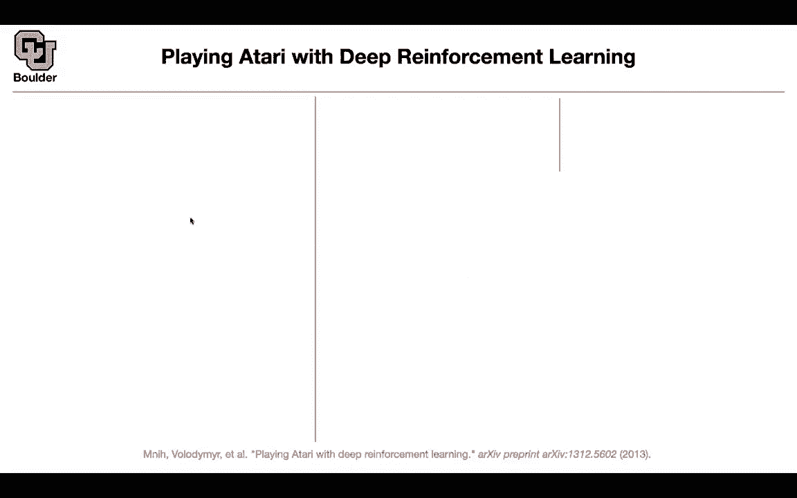
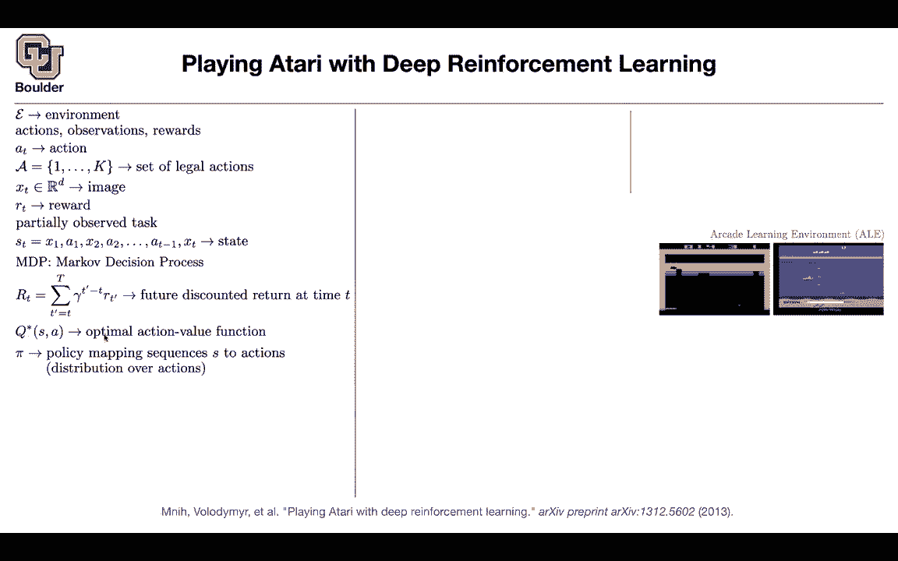
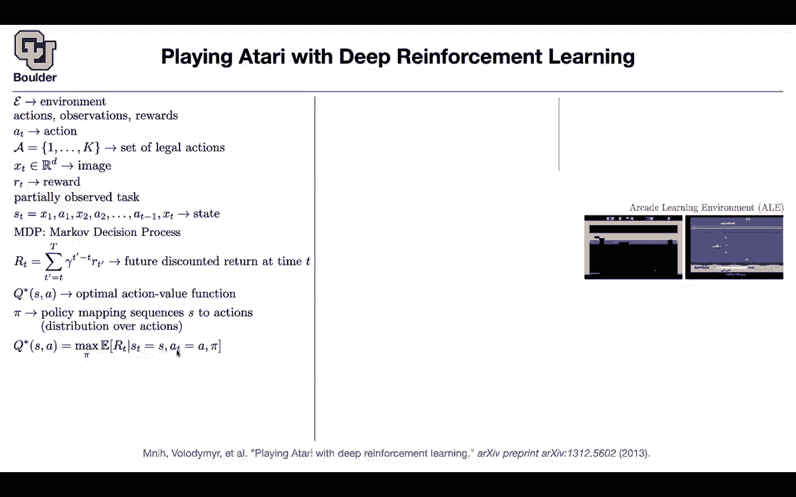
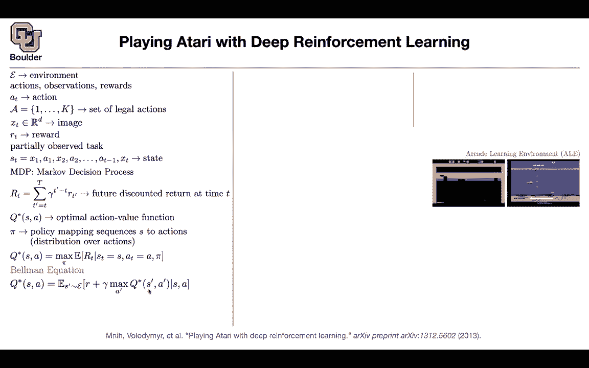
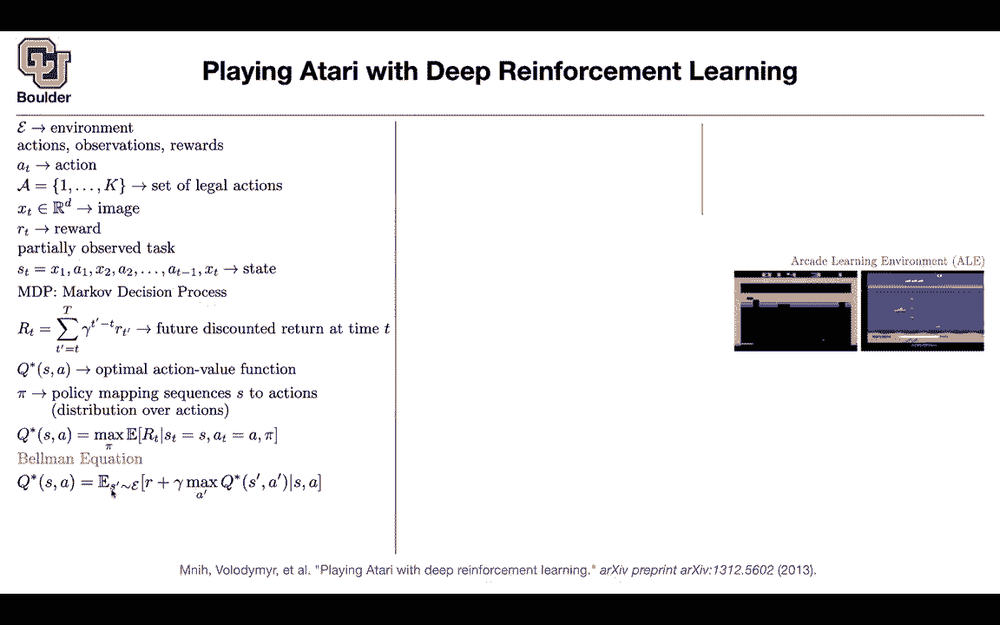
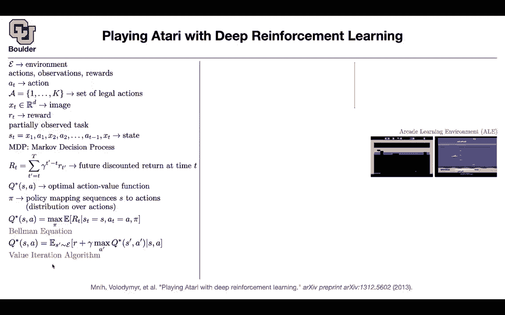
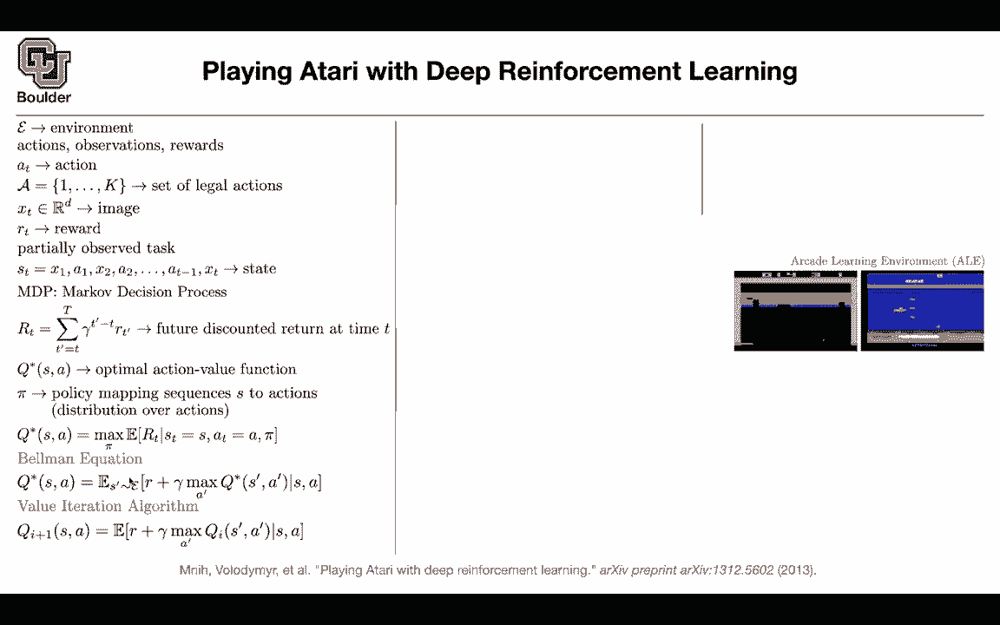
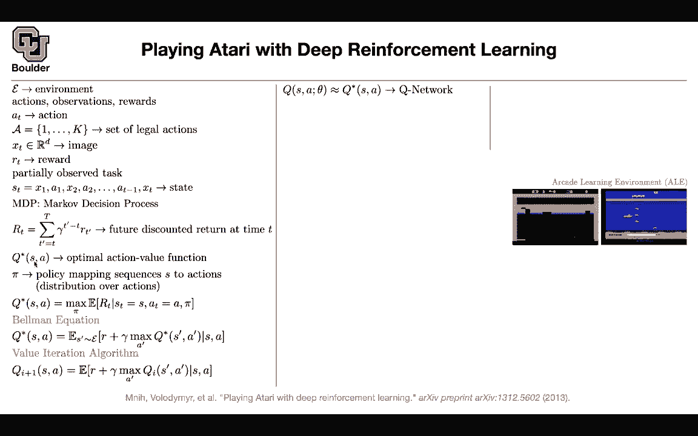
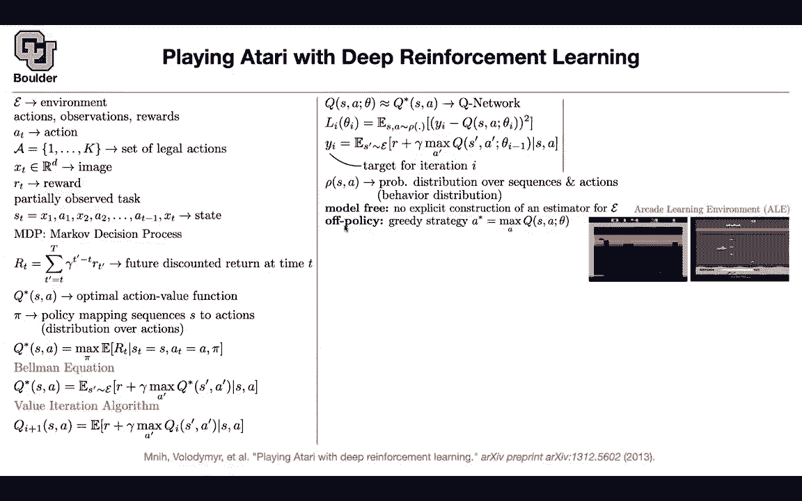

# 【双语字幕+资料下载】科罗拉多 APPLY-DL ｜ 应用深度学习-全知识点覆盖(2021最新·完整版） - P173：L77.1- 深度Q学习 - ShowMeAI - BV1Dg411F71G

Let's get this started with reinforcement learning。

So far what we have been doing was a data drivenve approach。

 so our data was either in the form of images or it was in the form of text or it was in the form of speech or even tabular type of data。

 but can we design a machine that is actually intelligent that can collect its own data whenever it needs to。

 and that's the topic of reinforcement learning？

You're going to have an agent that is going to interact with the environment collect its own data on the fly and then keep learning on its own without any supervision and let's start with playing Atari and what do I mean by environment so so far I was asking you to do data exploration now your exploration is going to be a little bit different so you need to explore the environment for instance arcade learning environment is a learning environment that is going to give you the simulations that you need for instance for this ping pong game or the other Atari game or many other Atari games so now you have an environment that your agent is going to interact with you can think of as your data or the place that you're going to go into to collect data okay you have an environment let's go into the math and try to formalize the problem so we have an environment that。

We are going interact with and then collect data from it on the fly and the data that we are going to see is going to depend on the type of actions that we are going to take in that environment so they are not going to be IID data anymore and the way that the agent is going to see the environment is going to see through the observations so it's not going to see all of the details of the environment it's going to see it's going to collect some observations and then because you want to write down an objective function you need to tell your agent how good it is doing so you need to give it some rewards or punish it sometimes so you need to either define a cost or a reward the agent is going to take actions in the environment like in this figure here it could decide to go left or to go right that's an action and the action is being chosen from a set of legal actions going left right up down etc and you can have a discrete set of actions。

And we're going to generalize this later on to more complex actions where this could be a continuous set of actions that you can' choose。

 but for now let's assume it's discrete because we are doing Atari what observations do we make our observations are in the form of images。

So exactly as a human would see this environment if they were playing it we are going simulate the same behavior so our agent is going to see this image and you can flatten it or not flatten it whatever that you do it's gonna to be an image at time T and then at time T made a decision and then it's going to collect some rewards this is a partially observed task what do I mean what is a definition for it it's not enough for your agent to know only what image it is currently at what is state it is currently at so it's not enough information because it's not going to know is this ball going up。

 is this ball going down is this ball coming from right of the screen or is this ball coming from the left of the screen so if if the only thing that your agent is seeing is an image there is no way for it to know where this ball is coming from and that's important information and because it's partially observed。

State of the system we are going to define it this way。

 We are going to keep the entire history of the images that it saw and the actions that it took or at least a portion of those。

 maybe the last few histories or the last few snapshots so that's going to be your state and this is gonna give the agent more information perhaps enough to operate in this environment this is going to be a markov decision process I'm going to give you more detailed definition later on。

 but for now these types of problems are markov decision process MP how are we going to work with this environment if you're at time T you're gonna to have a future discounted return So you're going collect your return today you're gonna follow some strategy collect some return tomorrow from the environment the day after tomorrow up until the end of the game until you see the game over or U in or something happens。

But then a reward today is more valuable to a reward tomorrow or 10 days from tomorrow that's why you're discounting the return from future so that's future discounted return at time T we are going to define an action value function which basically says and this is optimal action value so you have a policy that is mapping these sequences to actions so as soon as you see your state you should be able to decide and perform an action and this is usually in the form of distributions so we need a policy we define and we are going to define our optimal action value function but what is that you're currently at time T sitting in state S and you just took action A assuming that you're going to follow a policy because you need to know your policy because you're interacting with your environment。

 what action are you're taking because those actions。

are going to define your return， your future discounted return and then you're going to take an expected value and this expectation is being taken with respect to the data that your agent is observing from the environment so it sees an image it decides to go right。

 it sees another image it goes to the next state， it collects some rewards。

 goes to the left right left right， according to the policy and then it's collecting the rewards。

Well then I said this is optimal action value because you're optimizing you are finding a maximum return with respect to the policies so basically find the best policy that's going to give you the best return and then if remember we were doing dynamic programming a lot of the times when we have a complex problem we usually define two parameters or one parameter in this case S and a or our parameters and then we just take into account two times steps rather than the entire time steps into the future if you do that for this problem that's going to give you beman equation and that's your equation and this is a classical equation so there is no need for us to go into details of how you drive it we can just take it for its phase value there is Q star there is Q star here and then this is going to be a function of S and a so you're currently in state S and you just do action A and then you're going to look。

One step into the future so you collect your reward today and then you're going to estimate the rest of it by your optimal action value so you're going to say from that point on let's assume that we are going to take the optimal strategy and that's going give you Q star again but then this equation here the term on the left is a function of S and a B term here has SA a prime and S prime in it we need to get rid of them to get rid of S prime you're going to take into account all of the possibilities that could happen in your environment so you're doing an expectation we respect that so you're getting rid of S prime and then you' are getting rid of a prime by choosing the best action so you choose the best action so you do a maximization here and an expectation here we respect to S prime and that way you're getting rid of a prime and S prime so that's your beman equation in terms of the optimal action。

V function and the action value is related to the future discounted return given that you took action A in a state S and you're following the optimal policy this is classical value iteration algorithm and it's usually useful when your action space is finite dimensional and K shouldn't be too big and the other requirement is your state to be discrete and if it is like that it's going to give you some tabular function because now this function you can explain it in a X is spreadsheet for this state for this row this column what is Q and then you do value iteration it turns out that the fixed point of the BLman equation it actually exists and if you do value iteration it's gonna that function that you see up there is going to end up being contractive so it means that the fixed point is going exist and then you're going to do some it。

Some value function iteration， you start with QI， you start with one X spreadsheet。

 and then you do these operations， some additions and some maximization。

 and then that's going to give you another spreadsheet and then you take that spreadsheet you go to the next iteration and then you keep repeating that in the end you're converging to the optimal action value and as soon as you know your optimal action value your policy is just this the action that is going to maximize the action value is your policy so at each iteration you're going to look at your optimal action value you maximize with respect to a and you take that action that's your optimal policy but then we are living in the neural network era we don't want the assumption you don't want to make the assumption that K is small and you don't want to make the assumption that S is discrete。

 you want to make the assumption that is actually images and continuous so one idea is to app approximate Q。

Star what you have here with then run network and that's going to be called Q network because you are putting a network on your Q So that's the easy part as soon as you see a function。

 you're gonna to approximate it with run network perfect So many of the trouble in reinforcement learning comes from writing a good loss function So you want to optimize the parameters of this Q but what is the last function the last function is going to come from the beman equation So that's why we have to go through a lot of trouble to write down our beman equation as soon as you write down your beman equation your reinforcement learning algorithm is going to turn out to be a simple supervised learning algorithm how you want these term to be0 okay let's call the righthand side Y this is the output data S and a are going to give you your input data So you have S and y and then you want these two terms to be。

Very close to each other so you square them and then you compute the minus squared error on your state and actions and row is some abstract probability distribution row。

 you don't know its functional form you just know it based on sampling based on interacting with your environment based on going left and right so that one is going to become more clear as we right down the algorithm But in the end this is your last function we respect the parameters and it's a simple regression if you think about it but what is y I Yi is exactly this term on the right of your beman equation So it's the expected value is prime sampled from your environment your return plus gama your discount rate you choose the optimal action at that point in time based on some parameters and these parameters are the parameters of your neural network from the previous step because this guy here needs to be deterministic so you need to know what is the value at the end so。

You put theta I here the same thing that you have up there your algorithm is going to collapse because for supervised learning you need to know what is S。

 what is a， what is your input and what is your output so the output needs to be fixed fixed not trainable and this is one way of doing it and this is not the best way of doing it you're going to see later on improvements upon that。

So your loss function， the moral of the story is that it's coming from your beman equation that's why you wrote down your beman equation that's going to give you a loss function and as I mentioned this row here is just the probability distribution it's an abstract notation youre never going to see it when you implement your algorithms on your computer but you can sample from it from your environment that's why you need to know what is your environment so you need to know your environment so what are the properties of this framework it is model free by model free we mean that you are not modeling your environment so you' are not modeling the archive learning environment at all so you're not learning your environment you are not learning your dynamical system。

The only thing that you're learning is this optimal action value function and it's off policy you are not putting a neural network on your policy function。

 you are putting a neural network on your action value function。

 but then the policy is going to be a greedy strategy policy if I know my cu I can take actions based on Q how you just maximize Q with respect to action at this current state so given the state if you maximize this you're going to know the action and that's going be your policy。

There is a problem with supervised learning for it to work。

 why eyes need to be sampled identically and independently from your distribution so they need to be IID in reinforcement learning these samples are not going to be IID because they depend on the parameters of your neural network from the previous stage。

 and they depend on the actions that you took。

Yesterday or two days from today， etc。 So they are not going to be ID they're going to be highly correlated they're going to depend on whatever actions that you took and they're going to be highly correlated to reduce the correlation you're going create a replay buffer and at each point in time while praying this game。

 you have a state， you took an action， you collected some reward and then you went to the next state and this is your agent's experience so your agent experience this behavior the agent was in state S。

 it took action A， it collected some reward， and then the environment gave it a new state for it to work with these are going to be your data so you're collecteding your data on the fly so you're going to create a replay buffer。

 you put that data inside this data set and then each time that you want to optimize this。

 you just sample from this distribution from。

Replay buffer to train this and this way you hope that these are more IID data and why is that Because when the agent was experiencing this experience。

 they have different parameters so the queue was different because it was different parameters and maybe that's going to help these data set to be more diverse and IID the question is how we're going to design your neural network there is one way that the state is continuous so the state we are fine these are just images。

 the state is the image or a couple of images concateated channel wise so that is easy the action is a discrete variable。

 we have two choices we can either do one hot encodecoding for these actions and then put that as one hot encoded input to your neural network or alternatively this is going to become more clear when I go to the next slide but alternatively。

If if we don't do that what do we have an image goes in a one hot vector is going to go in and a single number is going to come out so alternatively you can take an image and then output a vector rather than a scalar and each dimension of that vector is going to correspond to a particular action maybe you went left you went right so now you have multiple input and multiple output basically you are turning your inputs into outputs of the neural network and it is okay because these are discrete and it's feasible and that's going to give you a Q network that was the input to the neural network is going be the state a bunch of images the output is going to be vector valued and these are going to be each entry of that vector is going to correspond to a particular action in terms of the algorithm this is going to give you your entire algorithm it's going to it's going to be called deep Q learning so if you hear that that is these algorithm with experience replay that these experience。

Re how does the algorithm proceed， you initialize your replay memory randomly so initially you have a random policy you're exploring your space randomly you are basically shooting in the dark and then you're going collect a replay memory and it's gonna have a capacity of N you collected some initial data theyre gonna be garbage but you collected some data and then you're gonna initialize your Q network because Q is the only network that you have and as soon as you know your network your problem is solved and the whole trouble is training that neural network training and you're gonna initialize it again randomly so again you are shooting in the dark initially but then you're gonna to play your game M times like a human would do so a human would sit behind the computer screen and then play this game multiple times and rounds sometimes the human is going to fail sometimes the human is gonna to succeed but。

It's going keep playing until the human gets a handle of the game and it starts winning So we are going to do the same thing。

 You're gonna have episodes you're gonna to have M episodes initially the only information that you have is the first screen of the game so the first screen of the game is going to show up on your computer and that's going to be an image and then we are gonna to process it so don't worry about p yet I'm going to tell you what that is for the first sequence it's very easy you take the first image and then your game is going to have t rounds or you're gonna stop your stop playing after t rounds you don't want to play forever you get bored after T times of playing or t rounds of one episode that's the maximum but in between you might fail basically the ball is gonna rather than hitting your object is going to go down out of the screen and it's game over so you could end before capital T。

okay for reinforcement learning， we need to collect data on the fly and we want our data to be as diverse as possible。

 We don't want always to do the same thing or have the same policy。

 we want to introduce randomness we want to explore so you want to balance the tradeoff between exploration and exploitation if you always do the same thing you're gonna collect rewards but maybe your stuck in a local mini and maybe you can go to a better place okay so with probability epsilon。

 you're gonna to select a random action， this is just random。

 Otherwise you're gonna take a look at your policy。

 You're actually your Q network and then you're going to take a greedy strategy So some percent of the time you're doing random stuff some percent of the time you're being on target you're choosing your actions based on the Q network and initially your queue network is also random So everything is random initially you're just exploring your space。

Your environment so we are gonna execute action A in the emulator。

 so you're going to go to your environment and execute your action。

 The environment is going give you some reward and then it's going to take you to the next screen Okay perfect。

 we are going to collect whatever information that we just got we were in a state S。

 we took action A and then we saw the next screen。 that's the next state。

 and this is where I'm going introduce the fee function because you need to know a little bit of the history otherwise you're not going to know whether this ball is coming from the right or the left。

 whether it's going up or down what is happening。 we are going to take as input the last four frames of our history。

 and you're just going to stack them on top of each other。

 So you're increasing the number of channels of your image that's the function of V。

 and then now you have your data。 you collected your data。

 the ones that you needed you have Vt this is your experience rather than it。

ST it's now FT you took an action。 you collected some reward and then you're going to create your next state because you just saw the exit screen you put that in your data and then you're going to go ahead and sample from that dataset and mini batch of examples。

 maybe 10 examples of previous experiences then you're going create your target now what you want to do is go back your last function here write down your last function。

 take its derivative with dis the parameters and do your optimization first you need to know what is Y if the game terminated for any random reason。

 maybe you won the game maybe you lost the game maybe it was game over maybe you hit the maximum number of iterations that you're allowed in the last iteration you just collect your reward if this is the terminal state of the system just collect a reward otherwise collect a reward and there is still gonna be some future going on so make an。

Ne for your future if you follow the optimal policy that's going to give you Rj as soon as you know your output data you know your input data because you just sampled it it's Vj Aj so Vj Aj are the input Rj and Vj plus1 are going to give you your output is going to give you Yj you write down your regression loss and now you can do gradient decent that's your algorithm so you're generating your data on the fly as you go any questions when we do the stacking for the S and the A I'm guess we to stack those as well like this fee function stacks the images as well as the actions as well as the I guess S So no the way the algorithm is gonna to work is I know this line is a little bit confusing but the way that is actually getting it implemented is you take the last four frames of your history so you ignore your action and this data。

So this is just a surrogate for your estate FT is a surrogate for ST that means okay。

 any other questions？I was curious if this I'm guessing this epsilon is something which they play around with a lot and it's kind of like the like simulated a kneeling or the。

The the step size decay that we do in in gradient decent it's going to change over time yes so there is a lot of hype around deep reinforcement learning for good reasons but then it is much harder to train them to train this neural network in practice then it is to train a supervis model it is much harder because you have a lot of fine tuning to do you have a lot of hyper parameters and you're right one of them is this epsilon so I don't want you to get stuck in the hype around deep reinforcement learning it has a fancy name but in practice it's very hard to get it to work okay any other questions。

