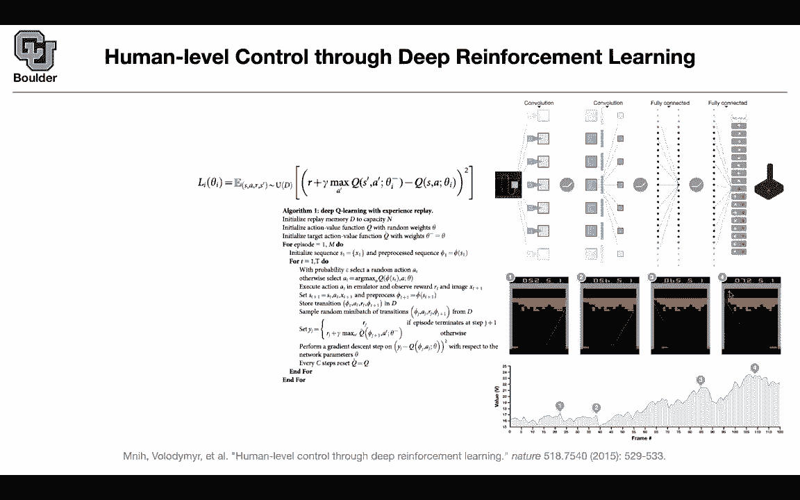

# 【双语字幕+资料下载】科罗拉多 APPLY-DL ｜ 应用深度学习-全知识点覆盖(2021最新·完整版） - P174：L77.2- 人体水平控制 - ShowMeAI - BV1Dg411F71G

in that case， let's move on to the next topic it's exactly the same algorithm as you just saw on the same data set with a minor tiny modification and we're going to see that this is our objective as before this is coming from the beman equation and the modification that you are making basically this was our why this was our neural network taking as input estate state and action and then we were sampling from our data repository that we were constructing on the fly the only modification is that this theta you are going to choose it from a couple of steps from before so not only from the previous round but from I don' know 100 rounds before when you are doing your optimization and the reason for that is to make the output more deterministic and perhaps closer to IID samples。

This is exactly the same algorithm as before Nothing is going to change the only thing that's going to change is going to have is that you're going have a Q hat which is basically very similar to Q it's going to give you your target but it's evaluated at a bunch of other set of parameters from before and how do you come up with theta minus the way that you're going to come up with it is every C steps you're going to modify you're going to store your parameter you're going to store theta bar it is clear so it's exactly the same algorithm as before it's deep Q learning with experience replay you're collecting experience every single line of this algorithm is what we just went through except for where you have Q hat rather than Q and Q hat is basically Q it's the same network evaluated at a bunch of other a set of other parameters from before okay I promise that if I。

Go to the next slide You're gonna see the architecture better for Q so the actions could have been inputs to the Q network or it could be the outputs because a is discrete if it's an input your Q is gonna be one dimensional if it's the output。

 your Q is gonna be K dimensional and k is the size of your action space you take an image you do a bunch of convolutions So this is just schematic there is no exact form of your convolutions here you don't know what is is right。

 what is the kernel size， none of that we know it's just a bunch of convolutions a bunch of fully connected value activation in the end your outputting a vector go up go I don't know down go to your right left etc。

 plus press this button here while going up and so on So that's your action space and if you want to know the value of your state and action what you're going。

Do is you're gonna put an input image and then you're just going to read off the corresponding output maybe you do nothing。

 maybe you go up and these are your scalar values so these are equivalent but neural networks are good with high dimensional stuff so it's better to implement it this way some cool things happen when you train this on a gamelan ping pong what's going to happen if you follow your value at this stage the policy that is coming out of your Q the greedy policy is solving the problem and it's estimate for the value of the state for the estimate for the value of this state is this number it's 70 for this screen it's two it's around here and then you can see that it's finding some nice strategies like trying to break this part of the wall and has a reason for doing that and as soon as it starts doing that it's estimate for the value。

I going to go up and the value is basically the integral role over all of the actions that are possible here from your policy so you're integrating cube with respect to a that's going to give you V and then it's estimate is going to get much better as soon as it breaks the wall because it knows that as soon as the ball is up there it's going to keep bouncing and then it's going to correct a lot of rewards so it's finding the type of strategies that a human would find while while playing this game so that's impressive and that's why this paper is in nature because the results are really impressive and for there are a lot of games of Atari for a lot of them this framework is operating at or above human level so they are going beyond human expertise。

Any questions so far are these reward functions exactly like just the points that you would get in the game or do they have to be kind of engineered likeness you're saying like it realizes the reward is increased when it gets behind that wall and bounces back and forth are those rewards just like the points that you would collecting the game that's a very good question but not in the context of this paper so youre you're asking a very important question one problem with reinforcement learning is designing good rewards that's very important because for some games like a game like go or ches what's going to happen is that you're gonna don't you're not gonna see your reward while making your moves until the end so your rewards are really spark those types of games but here you're collecting rewards on the fly that number here is your reward it's 5256。

6 here you're collecting rewards on the fly and this is actually a much simpler problem to solve with the more sparse reward systems they end up having the like engineering words like protecting ponds and controlling the middle and like strategic rewards instead of like the end result rewards right Yes and those strategies you don't collect any rewards for them that's just your policy that's how you play chess and you want that to be discovered by your model by your agent so you have to sometimes you have to leave with sparse rewards anyways and that's just a harder problem and sometimes in your reward you can also encourage diversity of actions so all sorts of you can encourage pessimism optimism etc so your question is very important but for the sake of this paper the problem is not that hard if you think about it for each state and action you're going to give get a reward and again it's not that hard for yet。

Another reason， mathematically， it's not at all hard because you have a finite set of actions。

