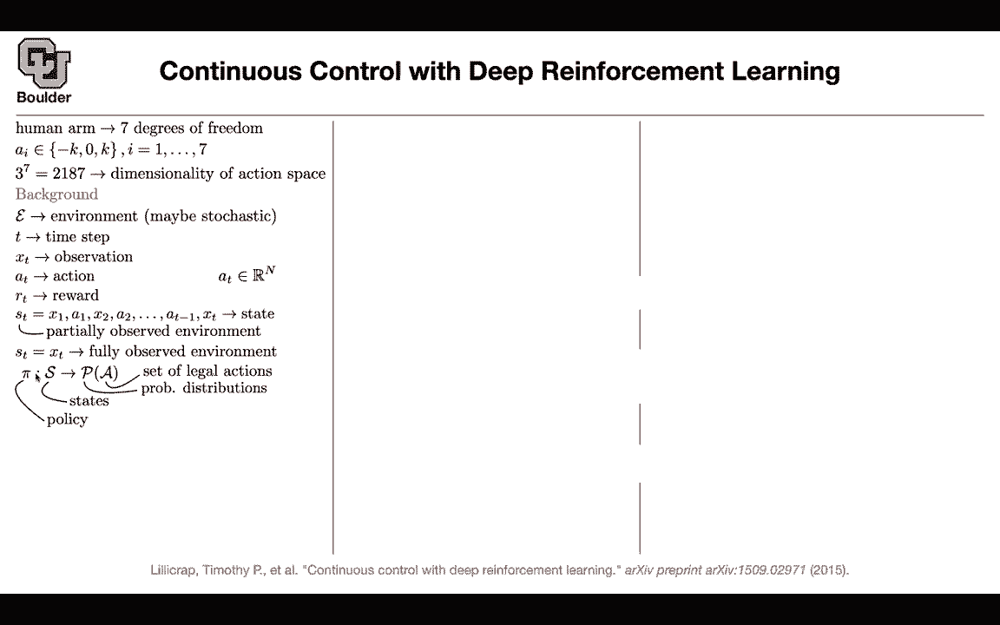
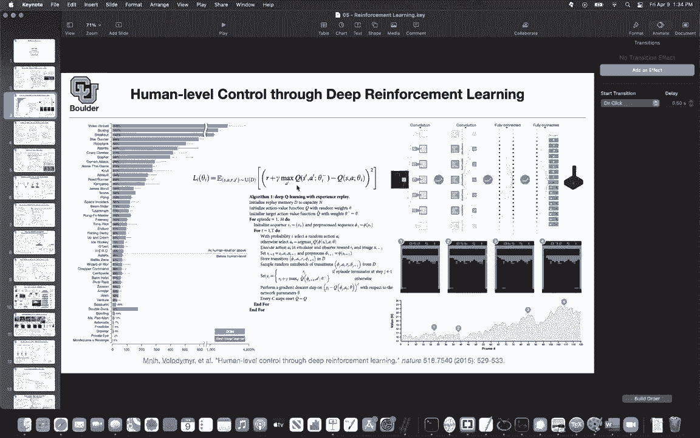

# 【双语字幕+资料下载】科罗拉多 APPLY-DL ｜ 应用深度学习-全知识点覆盖(2021最新·完整版） - P175：L77.3- 深确定性策略梯度 - ShowMeAI - BV1Dg411F71G

In real world， when you want to do robotics and you want to design a human arm or a humanoid arm these are going to be continuous space and let's say your arm has seven degrees of freedom So for each joint you're going to have a couple of degrees of freedom and let's say in total you have seven degrees of freedom simplify your model a lot the space is continuous because you can continuously twist your wrist that's a continuous variable it's not discrete it's not your actions are not discrete anymore。

Even if you quantize it， even if you say I'm going to pick a k and quantize it and let's say I just do those robotic moves that are quantized only three states for my wrist negative don't move positive you're going to get three to the power of seven for the dimensionality of the action space so it's going to become high dimensional and basically is's going to become high dimensional output and it's going to turn into more parameters much more parameters because the last layer of your neural network is usually fully connected and that's going to depend on the dimensionality of the action space so that's not feasible we need to look for an alternative and I'm going give the background today and then the rest of it will going to cover next week you have an environment and your environment could be stochastic you're currently a time step T you have an observation from the environment you take an action and then you。

Action， we don't want to quantize it。 We want to live in a continuous space。

 So it's gonna to be a vector。 so this is now n dimensional compared to。

 for instance this is going to be seven dimensional compared to 2187 dimensions if you manage to somehow live in continuous space you're going collect a reward you're going to see your state which is a concatenation of your observation action observation action etc。

 because you have a partially observed environment if it were fully observed if the current observation was enough information for you。

 then S would just be the last entry So this is just a definition of fully observed environment and then you're going have a policy that going to depend on a state that you're currently at given that I'm currently at this state。

 the policy is going to define a probability distribution over the set of actions that could happen So another way to think about it is。

This is a conditional distribution condition on the state you have a distribution and you are gonna to sample from this policy and make your decisions according to sampling from this policy I think I'm gonna stop here and continue and ask the rest of it next session for those of you who have questions I'll be around I have a question Sure can you go back to previous people before we go there are there any questions from this slide or no okay perfect one thing I'm not 100% on is I guess the experience slip play in general so I get that for every state which is a collection of images we get a vector of actions and then with some excellentps probability we take the nonquty action and then we are landing in I guess the next state I didn't quite understand the the reason for the experience slip play what we do we it so that's actually。

Good question What happens if you want to know the value of something。

 what is the value of experience replay just remove it and see what's going to happen if you don't do experience replay the data that you're sampling are going to depend heavily on the parameters of your Q function okay but then we know that when you're doing optimization you' are taking tiny gradient steps it means that theta I is very close to theta I minus1 okay it means that these sample that you're generating basically you're going to take an action and then you're and you're taking your actions based on the parameters that are already similar to the parameters that you're currently at and you want to optimize so it means that these actions are going to be highly correlated。

 they're going all get scattered in a tiny region of your space because are they' are getting generated by Q。

It means that they are not IID samples from a distribution they are not diverse so your dataset set is not diverse but then the question is do you really care about diversity and the answer is yes。

 why because usually supervised learning the type of learning that we were doing so far in this course or even the unsupervised learning your data needs to be sampled a main assumption was that your data is sampled IID from some distribution and if it is not sample IID your learning is not going to progress so you're not going to learn your neural network so it's very important for these samples to be IID otherwise the entire supervised learning and unsupervised learning is going to go up in the air it's not going to converge Okay I hope that answers your question so so reason we're doing it its just yeah basically what you said makes sense。

