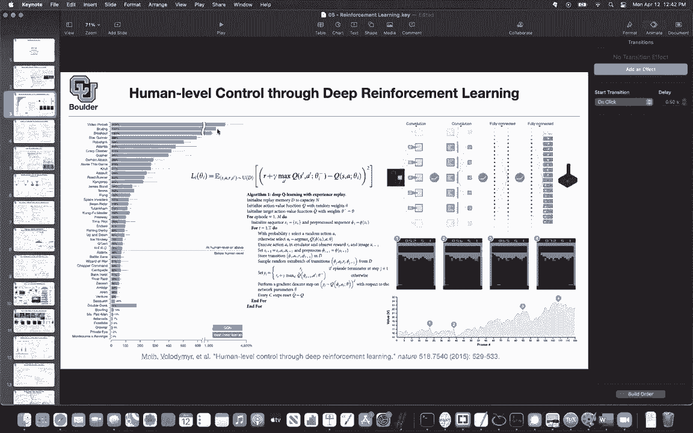
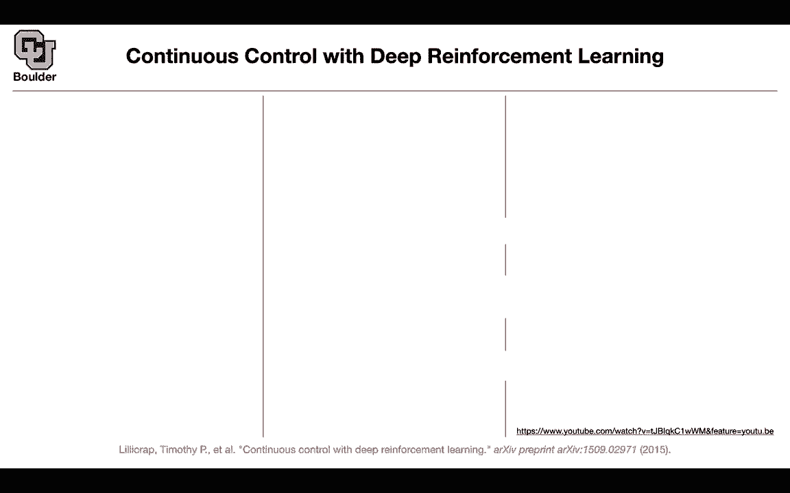
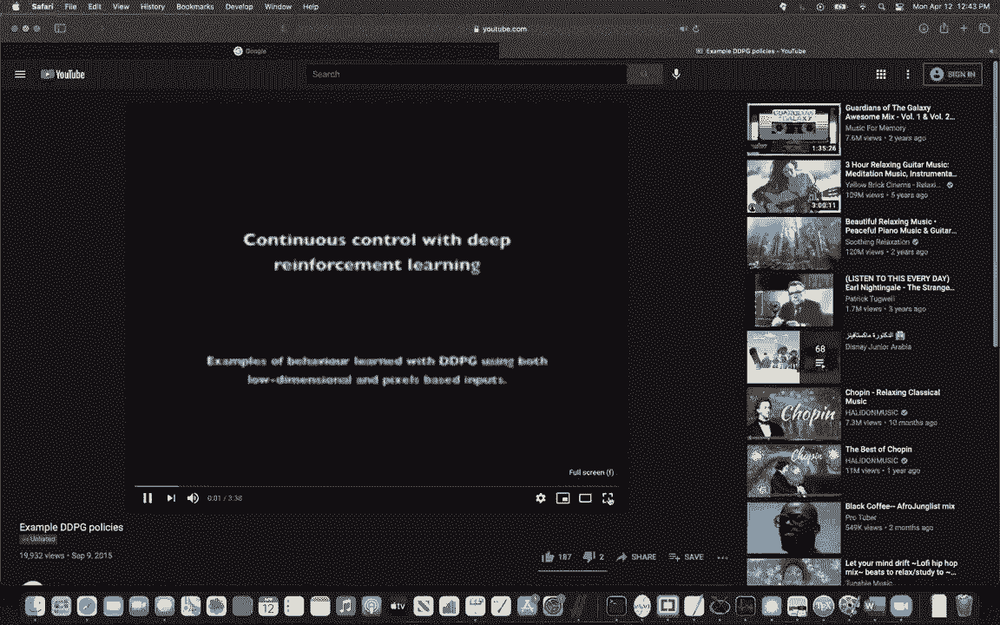
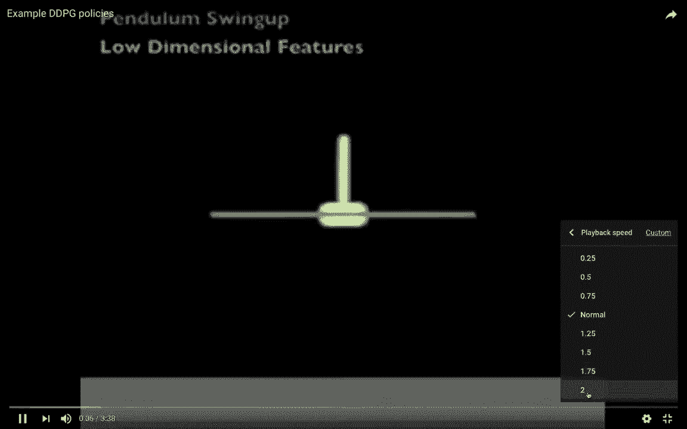
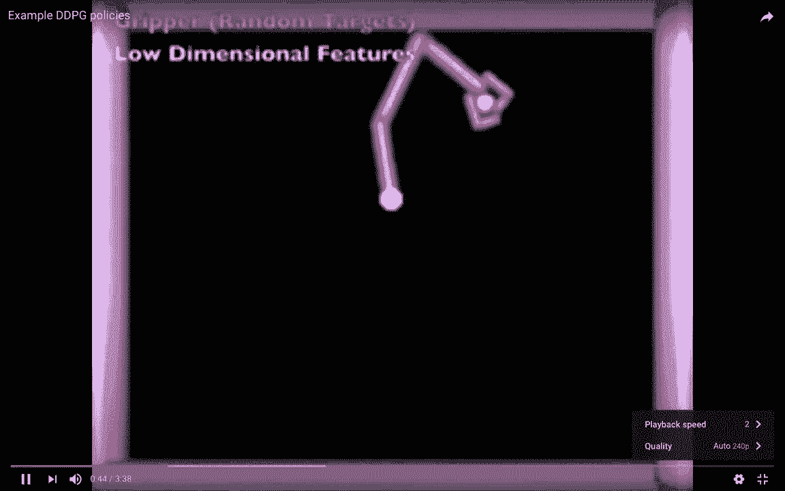
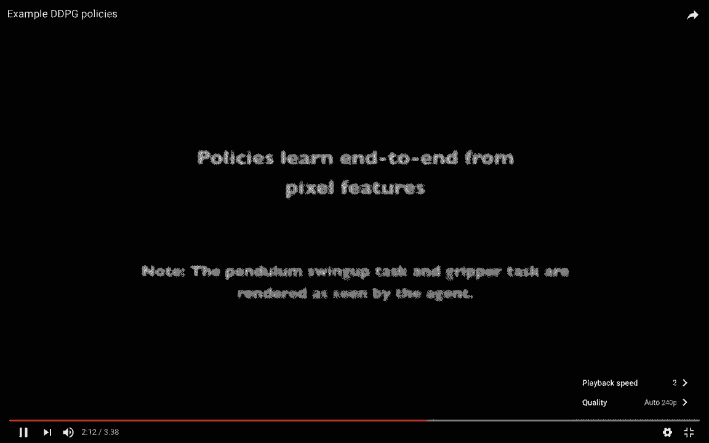
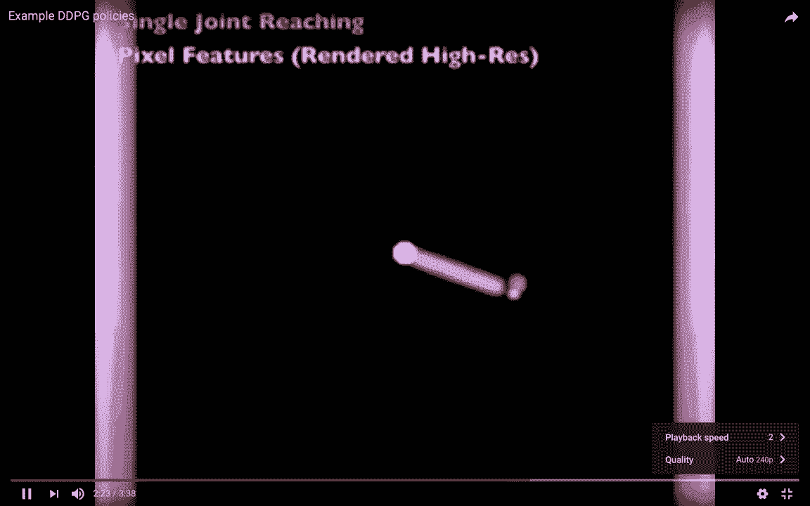
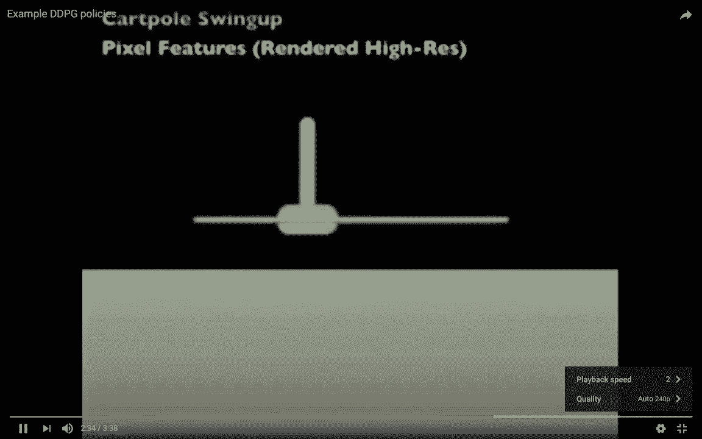
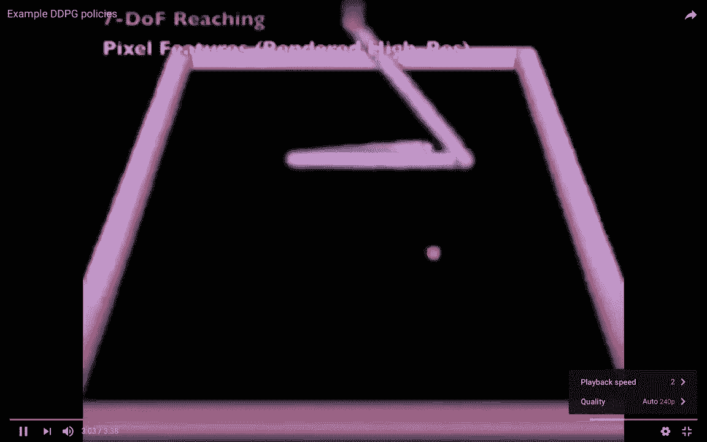
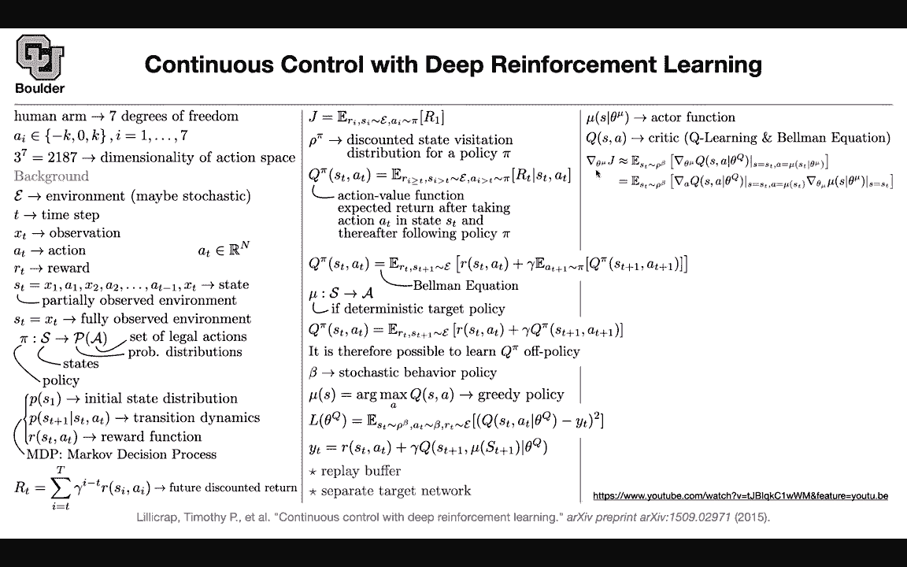

# 【双语字幕+资料下载】科罗拉多 APPLY-DL ｜ 应用深度学习-全知识点覆盖(2021最新·完整版） - P176：L78.1- 深确定性策略梯度 - ShowMeAI - BV1Dg411F71G

Last session we started with reinforcement learning。

 We learned about how to play Atari and in particular。

 we learned about BQ learning with experience replay basically have a replay buffer and we learned that such an algorithm if you apply to the games of Atari and many of them you're going to be able to achieve superhuman performance。

 But then for such cases， our state of actions where discrete So you had K choices to make while playing Atari。

 when you want to make things more realistic and go towards robotics later on things are going to become continuous your decisions。

 So your control is going to become continuous。 And let's see an example of the type of problems that we want to solve So I'm going make this a little bit faster So this is a reaching task this is a griper。

You have a random target and then you want to take the pocket and put it in the correct location and these are low dimensionsional features by lowdiional。

 I mean you're parameterizing your model with the torques at the joints So you're featureurizing your model This is a moving grouper task again low dimensionsional features This is a walker task and this environment is a physics simulator and you're gonna have multiple different types of physics simulators。

 for instance， you can use the physics simulators given to you by unity or by NviD or by open AI This are usually called openaiI gym for instance。

 or Tensorflow gym or even Mojuku and these are highdimenional these are supposed to mimic the way that a human would operate it's going to see see an image and work on the P level So now this is the DdPG algorithm。

And the type of policies that the algorithm has learned now I can go back to the slides and talk about the algorithm behind it so these are high dimensional and continuous for instance a human arm can have seven degrees of freedom if you want to quantize it make it discrete great and let's say you have three choices only that's going to give you three to the powers7 for your dimensionality of the action space and it's huge is there a way to work with continuous variables to begin with。

A littleally of the background this recovered last session you have an environment。

 that environment could be a stochastic， you have some time some observations at that particular time。

 you're going to take some actions and your actions now are not discrete youre continuous and theyre in ourN so they are n dimensionsional in this case it is seven degrees of freedom so n is going to be7 rather than it being 2187 you have some reward you interact with your environment and the environment is going to give you some reward you have some state which could be a concatenation of the observations and actions that you took up until that point in time and if the final observation is not enough for you to know the entire state of your system it means that you need to concatenate your previous decisions and observations that's going to be called a partially observed environment on the other hand if you have if Xt。

ough to give you enough information about the current state of the system that's going to be called fully observed environment and then we say that we usually have a policy that takes you from the space of states from the state of your system to the probabilities and then you can think of this policy as a conditional distribution conditioned on the fact that you know what state youre currently at condition on the fact that you knowD you have a distribution over the type of actions that you can take so last session I promise that I'm going to give you a more detailed definition of markov decision process and MDP。

So this is the definition you have some initial state distribution。

 you have some transition dynamics that not only depends on the previous state but it depends on the action that you took this is markov because the only input that you're conditioning on is a previous time step so you're not conditioning on ST minus1 ST minus two etc so you're conditioning on the immediate past that's why it's a markov process and it's a markov decision process because your decisions are going to change the state that you're going to see into the future and then you have some reward to help you make better informed decisions of what actions to take and then we define this also last session the future discounted return so you're just accumulating your returns into the future and let's say you're currently at time T and you're looking into the future but then a return。

Today is more valuable than a return tomorrow than the same return tomorrow and actually this gamma somehow models the fact that there is a probability that the agent is not going to survive until tomorrow so you're discounting it and you have the same concept in economy it says that money today is more valuable than money tomorrow so you're discounting it then the same money tomorrow okay that's the definition of future discounted return so so far we have done nothing is special it's just we are writing the definition and introducing the notation but what objective function do we want to maximize because it's a reward you're maximizing it you want to maximize your reward this is the expected reward because everything here is a stochastic your decisions your policy is a stochastic your it's actually a random variable your environment is a random variable it's a stochastic。

Proces so you' are taking expectations with respect to your environment and your rewards are also not deterministic so your reward and estates are going to come from your environment and the actions that you take this is your objective function and you want to maximize this with respect to pi and we saw this concept last session also this is an abstract concept so youre never going to see it when you're implementing your algorithm behind a computer but mathematically you're going to see it so each state has some visitation probability according to the policy that you're taking and depending on your environment so we are associating a distribution to that and this is a discounted distribution and you're discounting it by this discount factor again the same fact that you have to discount the future previously we defined the optimal action value function so we were defining pi star actually。

Q star where you were maximizing this with respect your pi but now let's keep pi in the same location we shall keep it and define an action value for that particular pi so this says this is basically the expected return after taking action A in a state S and thereafter following policy pi so your actions are going to be in the future you just took an action at time T you're taking an expectation over the actions that you're going to take according to your policy into the future so I is bigger than T your state of the environment you just saw the state today but then for the future your sampling from your environment but today's return is also a random variable so this is bigger than or equal to T and this is our action value function。

And then we can write down a beman equation for it This beman equation is different from what we saw last session so last session you had Q star here and then you are doing a maximization here over the actions now you're replacing that maximization bit an expectation that you're taking the expectation with respect to your policy and this is not necessarily the optimal policy and but the rest of it is very similar to before this should be a function of ST and A the term on the right is a function of Rt88 plus one and S plus one so we have to get rid of S plus 1 and8 plus 1 and Rt so you do an expectation with respect to your environment and then to get rid of A you do another expectation with respect to your policy but working with a stochastic policies is a little bit hard because then as you take the expectation and if you want to max。

your policy there is no way to sample from this policy and then maximize it because you're taking an expectation with respect to the policy okay because in the end of the day。

 you want to do Monte Carlo estimates of these it's okay you are going to be able to do it and then use that trick that we use when you are doing the hard attention paper it is doable but then that's going to be an approximation using the fact that the derivative of a function is the function itself times the derivative of its log。

 so I'm sure you remember that but we are not going to use that here we are going to make a simplifying assumption here we are gonna make an assumption that our policy is deterministic okay if it is deterministic you can just get rid of its expectation right away and then we are going to add randomness on the fly to it okay if pi is deterministic you can get rid of that expectation and then you can set8 plus one to be coming from your policy which is now deterministic and remember what。

We are doing here is we want to get back we want to write down a loss function in the end so all of these trouble is to give us a good loss function so we made a simplifying assumption here that this is deterministic and if it is deterministic you can get rid of that expectation now you can do Q learning like what we were doing in the previous two slides okay because this is now going to give you a loss function that you can optimize okay we can do Q learning on that and by the way on the fly yes we assume that our policy is deterministic there is a deterministic policy function。

But then on the fly you can add noise or encourage noisy behavior， encourage exploration。

 but the cool thing is that there are no derivatives going through this is stochastic behavior that one i'm going to go into more details this is just for notation just keep that in mind that beta is a stochastic behavior。

But as soon as you know your cu， like what we were doing last session。

 you are gonna know your policy by some maximization given as do a maximum over all of the actions and the best one is going to give you your mu but there is a catch previously solving this maximization problem was very easy why because you had finitely many choices on your actions and you can choose the best one right away。

 compare all of them choose the best one but now solving this maximization problem is not easy why because you don't want to wait for an optimizer perhaps based on gradient decentscent to convertge so that it just gives you the correct action for one state so that's just too costly okay but for now let's say you have a mu function let's go in the theory route that you are somehow magically able to solve this maximization problem just for the sake of making some progress。

If you assume you know mu， you're going to be able to write down your last function。

 it is very similar to Q learning that we did last session。

 the thing that you're maximizing over are the parameters of your Q function you're at a state S you're taking action A and then you're comparing it to Yt and Yt is going to come from your be equation okay so Yt is the return plus a discounted Q but let's go a little bit into two more details in this notation you see ST here you see ST plus one up there S plus one down here and then your actions are the ones that are based on a mu So writing down this last function requires you to know your mu to know your policy So as soon as you know your mu you're going to be able to write down this last function but that's a big if finding mu is not easy you don't want to solve that maximization problem but in the end of the day。

What you have is a function as soon as you know S mu S is just a function and whenever you see a function and you learned about deep learning already you are going to approximate that function with a neural network and that's what we are going do we are going to put a neural network and mu we have yet another neural network for Q and they are going to help each other out it's very similar to what you were doing with generative adversar neural network so you have two functions helping each other out one of them was helping to write a loss function for the other guy So it's the same thing mu is going to help us write a loss function for Q and as soon as you have a loss function for Q you can do replay buffer you can separate a target network with some parameters theta Q or theta Q prime and then you can optimize this this depends on you knowing mu but how we're going to learn the parameters of。

A neuron network that you're putting on your policy so now you' are putting two neural networks。

 one on your policy， one on Q and the neuraln network that you're putting on mu is going to have its own parameters and it's going to be an actor function okay this is an actor critic framework now so this is actor the other way is the cr Q okay so far so good the critic we know how to learn it as soon as you know mu as soon as you know theta mu the parameters of your actor you're going to plug that inside this loss and you're gonna have a loss function that you can optimize and that loss function is based on the beman equation like the math that we went through up there under some assumptions that this is deterministic the equation is how we're going to learn mu so far mu was helping us learn Q in a similar way Q is going to help us learn mu so the critic is going to help us learn the actor but where is the loss function going to come from。

So the last function for mu mu is basically your deterministic policy and there should be something that you want to maximize and if we go back here in the math that we started with。

 we want to maximize is J but you're going to maximize approximate that J with your Q function okay because the Q function if you look at its formula it's in direct relationship with your return with your future discounted return okay let's see。

So we want to take the derivative of this J with respect to the parameters of our actor。

 we are going to use Q to approximate Rt so Q is approximating Rt and then your in a state ST so your S is going to be equal to ST and your actions are going to be based on your actor so the actions that you're going to take are going to depend on your mu and then taking the derivative of this guy is not that hard why because  Q is differentiable so you can pass the gradients through Q so you are taking the derivative of Q with respect to parameters of your mu。

You can just take a from this formula， plug it inside here and use the chain rule so it's going to be the derivative of Q with respect to a evaluated at our actor at that state times the derivative of our actor so this is just the chain rule so as soon as you know the gradients you're going to be able to optimize your actor and what is the objective function here maybe looking at the gradients is hard and in modern deep learning frameworks like Tensor flow or pythtor you usually don't write down your gradients you just write down a loss function and then turnurflow is going to take care of the back propagation and chain rule so you don't have to do that chain rule on yourself。

What are we doing forget about this negative sign and let's say this is not a last function you are maximizing this so you are maximizing J and let's say this is j at time t and you're going approximate that j at time t by your Q function you are in a state S because you are at time T you saw the state and then your actions are based on your actor and now this is your last function as soon as you multiply it by negative sign that's going to give you a loss function so you have two last functions here now one for Q and one for mu to write down the last function for Q you need to know your mu to write down the last function for mu you need to know your Q so Q and mu are helping each other out optimize like what you are doing with Gs the discriminator and the generator for this guy theta Q is known so you stop the gradients and theta Q and here theta mu are known but in the end of the day after all of these trouble。

This is nothing but a famous classical algorithm in reinforcement learning that is deterministic policy gradient algorithm and it is deterministic because you're assuming your policy to be deterministic to get rid of this expectation but this algorithm is going to be called deep deterministic policy algorithm so if you hear about that this is DDPG how does it work you initialize your C network Q you initialize your actor network with some initial weight so initially everything is random so your Q and mu are very stupid initially you're going to initialize some target Q prime and mu prime and the target you need it because you want to write down the target for your loss functions and you want to make your data look as IID as possible so you're separating you're making copies of theta Q and theta mu you initialize a。

buffer， so you're gonna collect data in that buffer like we did last session we are gonna do M simulations in our simulated environment。

 the ones that I just showed you， okay they're gonna to be M rounds of episodes they're gonna to be M episodes you're gonna have a random process so you're gonna take some random actions at each time。

 you're going make some random actions and this is where beta is coming in So you're gonna have some stochastic behavior to help you explore your space So sometimes you make some random actions and then initially you're going to observe your initial state of the system S1 and then you are going to do an iteration you're going to interact with your environment for T time steps a maximum of T time steps maybe in the process if you have a walker that walker is going fall down and your algorithm is going to stop before reaching the maximum T or you're gonna force you to stop at capital T。

You are going to select an action， you select the action based on your policy plus some random behavior and mu because we are modeling it within neural network。

 we can evaluate it given the state it's going to give us an action we are going execute the action in the environment get some reward go to the next state and this is going to be the data that we are storing the current state。

 the action that we took the reward that we collected and the next state and were going to put that in our buffer now it's time to do gradient descent and do optimization we are going to sample a random mini batchge from our from our data set these are a state action reward next state two pulse。

 we need a target for the loss function here we are going to need Yt and we are going construct it here it's going to be R I plus gama Q prime this is where the target network is going to come in S I plus one assuming that you know mu you can write。

Town your y and as soon as you write down your y this is just minus squared error and this is this last function here coming from your beman equation that's going to give you some gradients we respect the theta Q that you can optimize now it's the actors turn to be optimized whatever are we going to do we are going to look at this objective here this gradients here and we are just going to evaluate them under the batch that we just sample from our data so it's going to be1 over n sumation over I this is for the expected value now you see why I don't emphasize row beta that much or row pi that much because you never see them when you implement your algorithm you' are going to implement them using sampling using Monte Carlo and you're sampling from your dataset and they're going to turn into sumations you take the gradient of Q because of this term here and then the gradient of mu and that's going to give you the gradient of your loss with this。

To the parameters of your actor and you're going to use that to optimize your actor but in the end previously our target network。

 we were updating it every couple of steps here you're going to keep updating them on the fly and these are the average networks so you're doing a moving average of your the parameters of Q and the parameters of mu and these are going to give you your targets I think this is a good time to ask questions any questions。

I have just one quick question Sure so when we update the actor and the critic those become our theta Q and theta mu and then we update thetaq prime and theta mu prime here and exactly so you' are going to use this gradient here and the gradient of this last function to update to take a tin step and update thetaq and theta mu and then you're going to use those two to update thetaq prime and theta mu prime and these are just moving averages any other questions so yes go ahead the main reason we need this mu mass in this case is because the search space over actions is too high so we need do approximate with the neural network exactly so because this optimization is very expensive so。

In simple terms you are making a target for this optimization problem so that it's cheaper to evaluate whereas before we just kind of evaluate like left right up down and that's very small and we just do it deterministically Yes so you have a finite set of choices you just evaluate your network once and then if you remember we were turning the actions to the output so you're going to read your output and then select a maximum one if your action and space is discrete but here your action space is continuous that makes sense sure any other questions so yeah here so far I know that you are used to doing data exploration like speech text images your data exploration task here or your homework is to explore the simulator environment to explore the environment the environment is the thing that's giving you the data and。

Multiple choices， just Google for open AI G or TensorflowG。

 you're going to find some very good simulators or Mojuku just play around with those。

