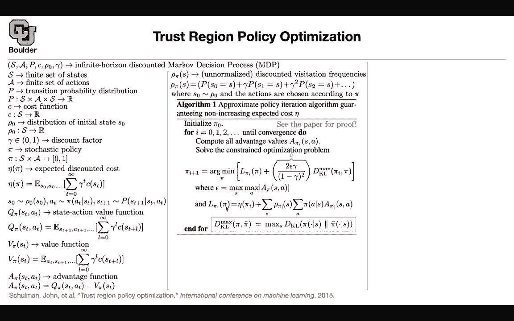
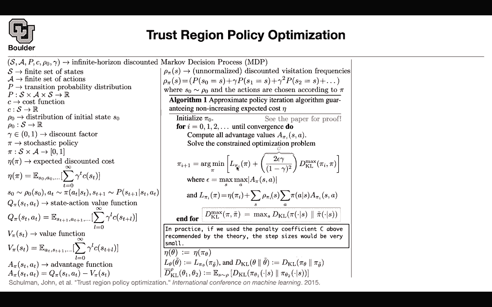
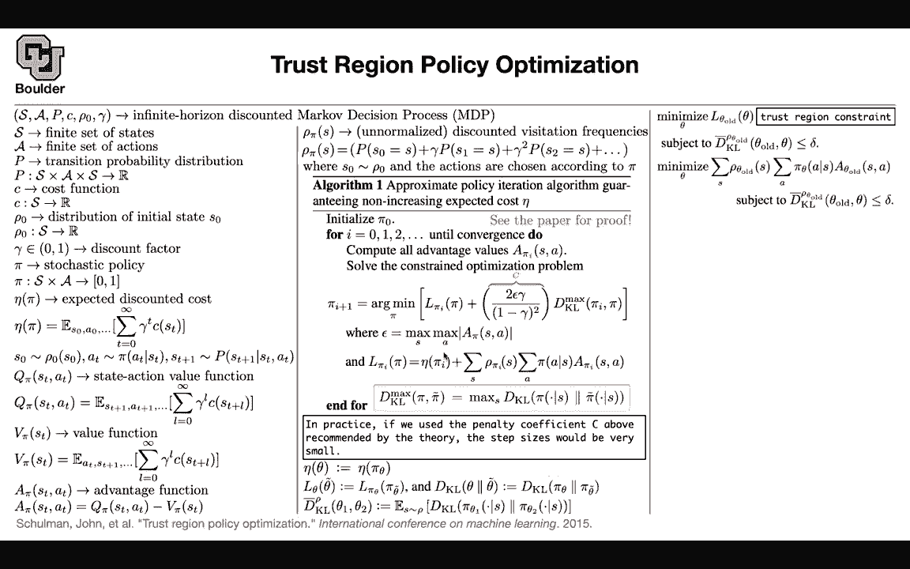

# P177：L79.1- 信赖域策略优化 - ShowMeAI - BV1Dg411F71G

Okay， perfect。 Now we can move on。So far， we were basing our decisions。

On a Q learning strategy so we were relying heavily on the Belman equation to write down our loss function and this is good because it's more data efficient you can create a replay buffer sample from the replay buffer etc but these types of methods are a little bit hard to get them to work why because there are a lot of parameters that you need to tweak a lot of hyperpara so you have a lot of choices to make can we actually work in a direct way with a direct objective of reinforcement learning which is maximizing your expected return can we work with that and these types of algorithms that are going to rely on a policy they are going to be called policy optimization and now we are going to cover a famous version of policy optimization and that's called trust region and it's TrRPO algorithm if you hear it that way let's introduce some notation you have some infinite horizon discounted Markco precision。

S is your finite set of states it doesn't have to be finite so the algorithm is going to work for that your action doesn't have to be finite but we are starting with finite set of actions and finite set of states because we are gonna as an intermediate step write a theorem that is guaranteed to improve to give you better and better expected return so these assumptions are just for that theorem but once you write down your algorithm it could be continuous set of actions and continuous states then we have a transition probability which is going to take you from state at time T the action that you just do to the next state state T plus one and this is basically a probability distribution so sometimes people approach reinforcement learning from different backgrounds some people had a controlled theory background and their engineers and they could be from the mechanic。

engineering department or electrical engineering they usually they are more comfortable with writing a cost function rather than a reward if you're coming from a background in reinforcement learning the modern way you are going to write a reward if you are coming from economics you are going write a utility function and maximize your utility okay but so these people are coming at it from from the perspective of control theory so they're going write a cost function this is the negative of your reward the reward you want to maximize the cost you want to minimize potato potato okay you have an initial distribution you have some discount factor you have some sptochastic policy which is given the state it's going to give you some action we are going to have expected discounted cost previously you had expected discounted return this is now expected discounted cost so you have a new notation Eta and it's going to depend on。

Your policy because your policy is going to determine the next state so you choose your actions based on your policy。

 you take that action， your condition on it and then it's gonna to give you the next state same as before we are going to define our state action value function each state and each action given the policy is gonna to have a value and its definition is very similar to what you have up there your value function is when you are getting rid of A So you're doing an expectation over A as well that's going to give you your value function so far so good this we knew about so nothing new up until here what's new is a definition of an advantage function What is the advantage of taking this action compared to the average actions while you're doing an average over the actions Why is this action advantages and how advantageous is this So that's your advantage function a new definition。

This is one of those unnormalized discounted visitation frequencies that we are never going to see in practice。

 but we need it for the sake of the mathematics and this is just telling you if you start at initial state zero and then you take your actions based on your policy what is the probability of visiting state S and you're discounting it and it's unnormalized because this is not going to give you a probability distribution so you have to divide it by something so I'm not going to go into the details of the proof for this approximation this approximate policyeration algorithm you can read the paper but something nice there is a message from this algorithm and what's the message what are we trying to do the message from this algorithm first of all is that this algorithm is guaranteed to decrease your cost so there is。

Pro that this algorithm is going to decrease your cost perfect。

 so there is mathematical reasons for this being rigorous and you can see that proof。

 what else What are we doing here you are minimizing with respect to some policy of an objective function this objective function is just a local approximation to the expected cost basically this guy the expected cost of policy pi when you are writing it in terms of p prime so when you're writing it in terms of pi prime you're going to have the cost of pi prime plus some additional terms。

 some adjustments and this is where the advantage function is going to come in So this is the advantage of taking policy pi over pi prime so this is the advantage of taking policy pi over pi prime so it's very close to the expected discounted cost of policy pi prime plus some adjustment。

So this objective up until here makes sense， but there is something nice happening in the theorem and that is the fact that the KL divergence between pi I and pi is showing up so I want you to take this into account that there is a KL divergence popping out of this algorithm popping out of this theorem but this algorithm is not practical it's not practical because if you use this coefficient here and you do the maximization which is impossible for you if your state is not finite so this is impossible to compute that。

 this is impractical for two reasons one computing this guy is not easy the other one is choosing C according to the theorem is going to give you a step size that is very small it's tiny so your algorithm is going to take forever to converge this an impractical algorithm with rigorous mathematical just。

Behind it But what I want you to take home is the fact that the KL divergence is showing up and then we are going to make that algorithm practical next session so we are going to introduce neural networks we are going to change this maxim to an expectation and that's going to give us a practical algorithm it's not going to be as rigorous as mathematically rigorous as this algorithm but it's going to be useful in practice and that's going to give us the trust region policy optimization algorithm I think it's a good time to stop and then cover the rest of its next session for those of you who have questions I'll be around I have a question Sure So within this algorithm one I understand that pi I pi sub I is like our current policy that we're iterating on but what is pi So pi is the new algorithm that you want to come up with。

So far you arrive that policy pi I that's your base policy and now you want to improve upon that to do that you need to solve a minimization problem to give you pi from the for the next step Oh okay I see yes okay so we're minimizing over all possible policies exactly so this is gonna be all possible policies and that's going to give you the next one because that can grow that's huge as your state space grows and you're like action space grows Yes。

 but solving that shouldn't be a problem the problem is these maximization here and the fact that C needs to be very small actually C is not a small C is that coefficient here but then your steps are gonna be very small So it won't be like even if we have like I mean if we have the number of states on an order in in the number of actions on order in then we have in squared Well I guess。

Maybe that is make。So there is this is going be belonging to reinforcement learning so it's not going this algorithm is not deep reinforcement learning because there is no deep learning going on here so youre not approximating your functions by any neural network yet and that's why we need to start with the assumption of finite state and finite action so that you can put your policy on a grid you can put exactly your policies on grid and then keep maximizing same thing here you are going to put your advantage function on a grid so it's going to be a tabular ExcelS spreadsheet so these are matrices and then yes you can apply that algorithm to type of that type of an environment but going beyond that when you have your state being continuous your actions being continuous this algorithm。

it's not gonna work Yeah because maximization here is not easy and here you need to parameterize your pipe by neural network otherwise there's no way for you to put a grid on your state space which is high dimensional I guess it seems to me that it would also be in feasible even if you had a finite number of states and actions but if those were very big Yes so that's the computational cost and some people might say maybe you can paralyze it maybe you can scale it but as your action and state becomes continuous then forget about it you cannot use a table or a matrix to do your work and the reason for it is very simple in 1D if you put a grid on your space let's say your interval is from zero to1 if you put a grid you can put 10 points in 2D you need to put 10 is squared in 3D you need to put 10 cube and then that's the。

Of dimensionality okay so that's why neural network you need to work with neural networks because their degrees of freedom is not tied to any grids in your space the degrees of freedom on your are your weights and biases Okay so they are good for high dimensional stuff Okay a question just about the these mappings like。

Pi pi is a probability of taking a certain action given a certain state Yes okay so that I was thinking like a policy should map from state to action。

 but in this case it's saying like same thing as soon as you choose an S pi of S is gonna give you a probability distribution over your a got it yeah it's the same thing and then if you're more if you're more certain on a certain action being the good one then it'll be closer to one and if it's not really if there's no good option then it'll just be a kind of uniform or random exactly yes and then same thing with the capital P that's that's the same idea like given a current state and a current action there's some probability of it putting us in a new state yes so in the previous paper you saw this it was taking you from S and a to the space of probability distribution。

over S okay and over there you also had pi that was giving you from S taking you from S to the space of probilities over the action space。

 but then you can reformulate that this way now your output is just R and your output here is just an interval。

But then it's just the same concept Yeah that makes sense Yeah sure Last session we started the trust region policy optimization actually I'm going to quickly go through a setup again。

 you have the finite set of states finite set of actions you have your transition probability that only your environment node you have your cost function that you want to minimize you have some initial distribution for the initial state of the system you have some discount factor to discount the future then you want to know what is your policy because you are doing policy optimization you want to come up with a good policy so the main objective that we want to。

Optimize you have to write an objective to optimize our policies and then in terms of notation and for us to remember what the notation was we have the expected discounted cost。

 which is going to be Eta of your policy， so it's a function of your policy。

The discounted future cost then we have our state and action value function which is very similar to expected discounted cost。

 but now your expectation is a slightly different we respect different stuff so at this point in time you know what action you took what the state you're at and then the rest of it you're taking an expectation with respect to your value function is very similar to your state action value function where you average out the action so you're doing your expectation over the action as well。

And then we define the advantage function， which is the advantage of the action that you are thinking about。

 the action that you want to take over the average actions and then we usually introduce this discounted visitation frequency。

 it's an abstract mathematical concept and we never sit in practice when we implement our algorithms but it's a good thing to carry it around with us to do the math and it's unnormalized because you are not normalized this is not going to give you a probability distribution unless you normalize it okay so far so good。

And then we said there is this algorithm， it's a theoretical algorithm。

 it's called App policy iteration and the nice thing about this algorithm is that it is guaranteed to give you non-increasing expected cost so your expected cost from one iteration to the next iteration is going improve sometimes it's going to improve sometimes it's going to stay the same but there is a guarantee that it's going to be non-increasing and then the way that the iterations are going to go you're going do your iterations over your eye so it's a policy iteration algorithm you' are doing iterations over your policy this algorithm is useful where you have finite state and finite actions because then you're going to have tabular data you can put them in a matrix。

 your policy is going to be in a matrix form and then you are going。

Solve this minimization problem but then what are you minimizing what is this L of pi and then over pi prime pi I this is a local approximation I'm going to tell you why this local approximation to the expected cost so the expected costs is this guy so it's a local approximation to this guy when you are writing your expected cost in terms of pi I so you are just rewriting this formula in terms of the advantage of pi over another policy but then in the end this is an approximation to this expected cost so you' are basically minimizing your expected cost to some approximations。

And to see that let's set pi here to be pi I So if this is pi I this term is going to be still the same you have pi I here。

 the only thing that's going to change here is going to be pi I pi is going to become pi I this advantage we are going to use this definition one of them doesn't depend on a these term doesn't depend on a and the summation of a bunch of probabilities is going to be one so that term is still going to be v of pi I and then you are here averaging over a So this is basically doing an averaging we're doing the expectation of the Q and we know that the expectation of the Q is just V that's why these two terms are going to cancel after this expectation so these term is going to become zero and you are just getting L of pi I of pi I is your expected discounted cost so this objective function make sense up until this point but what you're doing is。

rewriting it， you are rewriting your expected cost in terms of its advantage over a policy that you already know。

 so you know pi I and you're optimizing over pi and then that's going to give you an X pi I plus one。

But that formula is going to be exact where is this local approximation concept coming in if you write down that formula it's going to be exact if row here is row of pi rather than row of pi I so here you are just replacing row of pi with row of pi I and that's why it's an approximation so L of pi with respect to pi I is a local approximation to your expected discounted cost and if you want to read more details about the details of the mathematics of it you can refer to the appendix section of that paper actually this paper here。

Okay so first so good the cool thing here is that through the proof of this algorithm and why it is not increasing a nice term is going to show up and that nice term if you ignore these coefficients and call that just C rename it to be C is this KL divergence between your policy。

 the previous policy and the new policy that you're looking for this is cool why first of all。

 what is this max there when you know that you have conditional distribution。

 so your conditioning on your state and as soon as you condition on your state your policy is going to give you a distribution over the actions。

That you can take。 So that's just your K dirgs。 And then you are maximizing over S。

 So you're getting rid of S。 Okay， but this algorithm is not useful in practice。

 Maybe it's useful for solving simple problems when you have finite states and finite actions。

While it's not useful when you have continuous actions and continuous states there is another drawback that in practice。

 yes in theory you're going to convert， but in practice because of the form of this constant C here。

 this algorithm is going to be super slow so your your step sizes are very tiny。

So far it was reinforcement learning now we want to do deep reinforcement learning and whenever you want to do deep you're going approximate your policy with a neural network and that's what we are going to do and our neuraln network is going to have some parameters and let's say those parameters are theta now let's rewrite our math in a new notation so that it's more convenient rather than carrying pi of theta all the time and then computing Eta you can say that this is just the function of your parameters so it's Eta of theta so that's just the definition of a new notation you might have a policy we respect to some parameters this is an old policy and then you have this local approximation to your expected discounted cost that one you can also reform youulate in terms of theta and theta kilda so it's another notation and then rather than writing the KL divergence between two distributions that are parameterized you can just。

Rduce a new notation that is in terms of your parameters。 What else。

 And then there is another modification to this algorithm that we are going to make and the modification is rather than using the maximum kL divergence you're going to use the average kL divergence so you're replacing this maximum with an expectation and then at the same time youre rewriting your notation you're rewriting everything in terms of the parameters So this should be this shouldn't be a problem you're just rewriting your notation So let's take another look at this algorithm。

 the theoretical one for those of you who no optimization you know that you can reformulate this in terms of a constrain optimization you want to minimize your expected discounted cost or actually a local approximation to it subject to your kL divergence between the new policy that you're looking for and the old policy。

Being less than a constant so you can reformulate your problem this way and this is going to be trust region constraint and this term here。

 a of theta old theta is basically this term here and then this penalty is going to go into your constraint subject to that constraint happening for some choice of delta and delta is a hyperparameter that you choose。

And the other modification is you're replacing the maximum by the average。

 so that's another modification and you're going to see why you are replacing it with average because it's easier to work with the average than the maximum。

Now let's rewrite our formula and let's use the definition of a of theta old and theta the definition is here we are this term here is theta of theta old so this is old stuff and you are not taking any derivatives because your minimization problem is with respect to your new theta so you are not taking any derivatives we respect to the theta old and therefore you can drop this term that's not going to affect your optimization so we can just drop it we are left with this summation the summation over our states of the old policy which you have here the summation over your actions you are taking your actions based on your policy this is where the theta is coming in and then this is just the advantage of the old policy so that term is basically what you have here when you are dropping this term。

Subject to your constraint。 And then I mentioned here that this discounted visitation frequency is unnormalized。

 if you normalize it， it's going to give you the visitation frequencies it's going to become a distribution and the normalization constant is just one over one minus delta and you can see this term there is one gamma。

 gamma squared， etc。 So it's going to be one minus gamma and then you can replace that summation here with an expectation after you properly normalize your visitation frequencies Okay so far so good。

 the other trick that you're going to use is computing this expectation we respect your policy and by the way。

 this one over one minus gamma you can drop it because it's not going to affect your optimization so you can basically drop that that's not important There is this trick that whenever you want to do your expectation and assuming that you don't know。

The functional form of your pi or it's too complicated to evaluate。 you can do important sampling。

 You can do your expectation with respect to your an auxiliary distribution Q rather than taking your expectation with respect to pi you're taking your expectation with respect to an auxiliary Q and then rewriting your formula This is basically the same It's the same This an equality for any Q。

 you can rewrite this you're just dividing and multiplying by Q and if Q is actually your pi of theta that's going be one and you're back in the same regime as before where this summation in addition to this probability is your expectation So this is just an identity but remember you want to do Monte Carlo and it's easier to sample from Q and sample from pi one other modification that you' are going to make is you're going to look at this advantage the advantage you can。

Write it in terms of Q and V V doesn't depend on A you are taking an expectation with respect to a constant if you're including V and the expectation with respect to a constant is just that constant because the summation of these probabilities is going to add up to one it means that in your objective function you can actually get rid of you can replace a by Q it's going to give you the same objective it's going to simply change your objective by a constant and constant don't matter when you're optimizing。

So far so we are almost done and that's going to give us our TrRPO algorithm What we are doing now is just replacing everything up there there is this expectation there is one expectation with respect to S you have one expectation here with respect to S you have one expectation with respect to a that's here you are replacing this term here with the important sampling and then you are replacing your KL divergence you are actually writing it down here and because it was average KL divergence when you're taking an average with respect to state that's going to be your formula and then the question is whether you're going to use for Q for Q you're going to use your old policy intuitively what this algorithm is doing is you are looking for a policy that is close to the old policy so you don't want suddenly an optimization step to take you from one regime of your policy to another totally different regimes of policy。

So you're sort of regularizing your policy and that's called TrRPO algorithm and how do you actually solve this you're going to do a linear approximation to your objective you're going to do a quadratic approximation to your constraint and then you're going to do conjugate gradient optimization but the idea is that it's very simple to opt this model over the parameters theta and this is policy optimization because you' are optimizing your policy there is no proof that it's going to converge or not converge but we know that it is theoretically grounded there is some theory behind it so it's an approximation to some theory and then these are the types of problems that you're going to be able to solve so I'm going to ask you to click click on this link and watch the video when I share the slides with you。

Any questions can you say a couple more details about the linear and quadratic approximation we're proximating a neural network now with a linear No so you are approximating this expectation this objective function and approximating it linearly so these are the details of how youre actually optimize your parameters theta and how you actually implement that and this is the way that you're going to optimize it okay that one we can go into more details。

linear and quadratic in theta okay it's a neural network this is actually where you're putting your neural network okay and as soon as basically here you need to define what is your pi old what is your pi new and you're putting a distribution on that depending on the problem for instance these are continuous so you need to have a continuous policy and then maybe the way that you're modeling it is using a Gaussian distribution where your policy is giving you some mean and some variance of that normal distribution okay。

And then as soon as you write down these KL divergence you are writing the KL divergence of two Gaussians and you know it's analytical form Does that answer your question yes yes it okay perfect any other questions so the exact realization of this objective depends on the problem and your environment depends on the type of tasks that you're doing depends on your action space it depends on your states are they finite are they infinite and for each one you're going have a different pi so you're going to have different types of neural networks and that's where the neural network is going to come in so what I'm focusing on when it comes to reinforcement learning is not the neural network anymore it's how you write an objective function to train your neural networks because so far we have been operating with a lot of different neural networks so that's where should be very easy for us parameterizing a。

Is not that hard you just look at your input if your input design image you put convolutions if your input is some low dimensional features that you had engineered that's going to be your S your actions if they are discrete we know that whenever the output of a neural network is discrete we are going to use softmax and whenever it is continuous maybe a normal distribution or a mixture of the auss is what you do with pi okay。

 any other questions okay in that case we are ready to move on。

