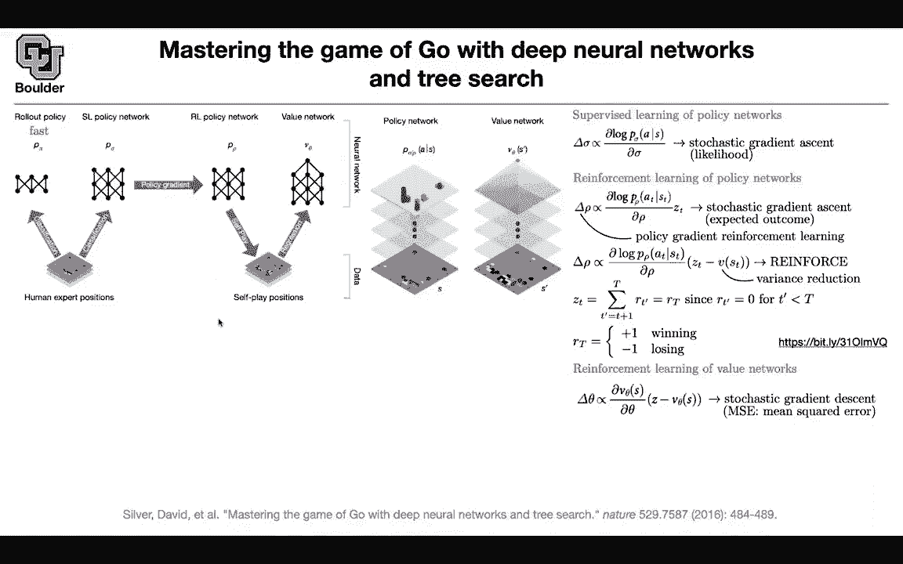

# P178：L79.2- AlphaGo - ShowMeAI - BV1Dg411F71G

So far we saw a couple of different frameworks we started with Q learning and deep Q learning because that was easier to explain and they were perhaps more data efficient but you needed to do a lot of fine tuning of your hyper parametersa you had a lot ofnobs to tweak we saw an example of a policy optimization and this is going to be another one here you are actually going to see your neural network and your action space is going to be discrete so it's very important you need to model your state your action space depending on the type of problem that you're solving but your loss is going be the same okay whatever are we going to do we are trying to master the game of go using neural networks and research there is another version of this when you don't need human expertise or you don't need human collected data or data collected from games played by human but let's start。

With this one and this is the first part is going to be imitation learning so you just collect data from a human expert playing the game of go and you have a supervised learning policy and its objective is to maximize the probability of human moves what is the human going to do next in this setup and soon as the human sees this board whether are they going to do what' their move the input are images or a stack of images and the output is a probability distribution over this board and actually you are getting rid of the moves that are not acceptable and that's going to be your action space and then you train this you train this P of sigma so sigma is your supervised learning policy and don't worry about the rest of them I'm going to tell you what they are and then i'm highlighting this fast here it's a rollout policy and you need it to be fast and then you can do feature engineering over there so that it is fast。

So that one we don't worry too much about。We worry about the supervised learning policy。

 the reinforcement learning policy and the value network these are our neural networks and your policy network regardless of whether it is supervised learning or reinforce reinforcement learning it's going to take an image or a stack of images as input and then it's going to out with the probability of this guy being the next move or this guy being the next move etc So you're putting a probability distribution over this space that's your action and that's your neural network your value network you want to know the value of this position if I'm in this position am I going to win am I going to lose what's going to happen and there is only one number that's coming out and it's how likely is it that I'm going to lose or win if I see this sport so let's do the supervised learning part because that's the easiest part we are going to write a loss function and usually your loss function is going to be maximum likelihood so you want to。

TakeThe next action more likely by tweaking the parameters of your neural network and for that you have label data。

 you know what is S。 you know what is a and your labels are coming from human experts and your network is just trying to imitate what the human would do in this scenario if they see this S what are they going to do and just max the probability of that happening and we are writing everything in terms of the derivatives。

 not loss function because that's just nicer it's going to tell you how much you are optimizing your sigma the reinforcement learning policy If you remember that hard attention paper we saw the reinforced algorithm this is basically the same algorithm and the idea behind that algorithm was that the main observation was that the derivative of a function is the function itself times the log times the derivative of the log of that function So the derivative of a function。

eququal to the function itself times the the derivative of the log of that function and this is where the derivative is going to come in but if you look at it and compare it to supervised learning you're still trying to maximize the probability of the next move but you don't have any labels for this you're just going to take your actions look at your reward and if Z。

 for instance， one or negative one， you're going to encourage those types of actions that gave you a positive outcome that gave you a positive reward and discourage the actions that gave you a negative outcome so your objective is very similar to supervised learning but now you're actually going to execute your actions in your environment and see your return。

 see the outcome and this is basically policy gradient intuitively speaking but we know that if you put Z here you might get stuck in a regime where you're collecting a lot of ones or a lot of negative。

So you're losing a lot or you're winning a lot It means that this objective is going have is going to be unbiased it's an unbiased estimate of your objective function or the gradient of your objective function。

 which is basically maximizing your future expected future rewards it's unbiased but because of those behaviors that you might get a stuck in good regimes and bad regimes for a while it has a high variance you can reduce the variance by subtracting any constant here that doesn't depend on your actions it can depend on your state but it doesn't depend on your actions and a good constant to subtract is your value and this is basically your baseline it says that yes I'm taking these actions they're giving me good results but at the same time I need to look at the deviations from a baseline I need to compare it to a base。

how good is this action and how bad it is it's not only a matter of being good and bad it's a matter of how good and how bad that action was and that's the way that you're reducing the variance and this is the reinforce algorithm you might say what is your Z to obtain your Z at this time this is one of those cases that you're not going to see your reward until the end of the game so you're not going to see any rewards when you're playing this game until once the game is finished you know that you lost or one so for a while you're not gonna to get any rewards until the last iteration which is either a one or a negative one so Zt in the end is going to be either a one or a negative one but you have to simulate into the future you have to play your game until the end and then see your return see the outcome so you have sparse rewards and that's a complication This is more complicated to Atari games because of this。

So we learned how to optimize our policy when you have supervised learning。

 when you have reinforcement learning so we learned how to optimize this guy we learn how to optimize this and by the way the way that you are optimizing your reinforcement learning policy is through selfplay so you're going to have two copies of your P of row one is an old copy another one is the new copy that you want to modify they're going to play against each other and then P of row is going to win or it's going to lose against that older version of itself and that's the way that you're getting your Z that's the only data that you have so your data here and are in the form of ST and ZTs okay perfect and that's the way that you're optimizing your policies during training how are you going to train your value because your value you're going to needed to put it here and your value and by the way if you want to learn about the reinforce and go into more details of them。

Mathematics of it this is a very good blog post that goes into the details。

 but the idea is basically what I mentioned the derivative of a function is the function times the derivative of its log that's the only trick that you're going to need let's go back to value how do we learn the value network we are going do mean squared error you're going say Z which is the outcome minus the value at the current location at the current state squared we are minimizing that but as you take the derivative you're going to get this is just a derivative of a square function and that's how you are optimizing your value network once the training is done through first supervised learning and then through selfplay your networks are trained now now you want to go ahead and actually play against either a human or previous software that are designed to play go and you want to win against them so it's now the e。

Time for training， one thing that I forgot to mention is that you are initializing your reinforcement learning policy with the network that you learned from the supervised learning so you first learn P of sigma they have the same structure P of sigma and P of row are the same networks you first learn this guy and then you do transfer learning you copy your weight and initialize this network and then train that through selfplay now our networks are trained how are we going to actually use it in practice the way that you're going to select your actions is going to have four steps and I know this is a confusing figure but I'm going break it apart so don't worry about it and this is just Monte Carlo research what are we doing for each state and action for each pair of state and action like these arrows this is your state this is your action This is your state as another action for each one of those edges in your graph。

In your tree， you're going to have the visitation count how many times while your neural network is thinking to make the next move。

 has it visited this edge so that's your visitation count and you can write it in terms of a summation but I think it's easier to think of it in terms of the visitation count so it's the summation of a bunch of identities sometimes you while you were thinking you went you consider this route or you consider this route and sometimes you didn't so this is an identity。

Sometimes it's zero， sometimes it's one and in the end it's going to give you a total visitation count and then for Q again for each edge in our graph you're going to have an action value what is the value of this action in this state this is just an average of the value of the leaf node and that's going to become more clear but this is the exact definition of Q and Q you're going to use it here the first step of the algorithm in evaluation when you're actually playing is selection which action or you're going to select so at this point in time you're thinking you have not yet committed to any moves youre just thinking you take your cu for each state and action you have a Q you can maximize that or you can maximize an upper confidence because you want your method to explore as well if you only maximize Q you're exploiting only so。

You have to balance the tradeoff between exploration。

 explorationation and exploration and what is this U。

 How is it helping you to explore the more you visit a route。

 the denominator here is going to go to infinity and then this term U is going to go to zero but the less you visit an edge this is going to be a lower number and then this is going to encourage your model to explore So you're adding youre increasing the probability here is's not a probability youre increasing the value of that action through the visitation count Now you might say what is this P How do you come up with this P So far the only network that we use was somehow hidden Q Q is here So perhaps the value network that we learned here is helping us evaluate this state but how do we get P we are going to get P from the supervised learning。

So that's where the supervised learned policy is going to help us and that's going to give us a prior You are in this state and let's take a look at the functional form of P sigma P sigma takes a state and then it's going to give you the probability of the action so you are in this state is going to give you the probability of this action and the other action and then you're just going to copy and paste those values that you read of from a pretrained network and you put them on these arrows and that's going to give you a prior probability that's the number that you're putting here so we covered selection we covered expansion where you're using your policy to expand for evaluation this is where this fast rollout policy is going come in Yes you can read off your value network here which is this guy and it's going to tell you what are the chances that I'm going to win this game or what are the chances that I'm going to lose this game but then to actually see whether you won or lost。

You can have a fast rollout policy that is going to take you to the end。

 You're just going to evaluate that policy， take this action that action， this action that action。

 reach the end of the game， you lost or you won。 and this is where V is coming in the V that we were using in action value for this leaf node is a weighted combination of the value that you're reading from your network your value network and the actual outcome of the game when you follow this fast rollout policy So this you're going to evaluate really fast and reach the end of the game。

 We covered selection expansion evaluation and now it's time to update your visitation counts Some of these guys youve visited through your path So you're going update your visitation count and you're going to update your action values So youre you're going to update these cues you're just going to take this value at the leaf node and then you you just add it to all of these arrows that you visited。

While making this decision Okay we are not done yet once your budget for thinking is done。

 let's say you have 10 minutes or one minute to think once one minute is done you have some visitation count you look at the visitation count for your arrow for next arrow and then you're just going select the one that you visited the most and that's how you make your next move I think now is a good time to stop and I'll be around to answer questions Yes。

 so there is a question that everything prior to Monte Carlo tree was just to initialize the network yes that's correct was just to train your networks so you are training P of sigma P of row and V of Vita and something that I forgot to mention and you might have noticed actually when you are thinking you are not using your reinforcement learned policy this is not P of row this is P of sigma so it's actually the moves that。

Good moves according to a human for this paper and the other cool But where is this reinforcement learning network helping us it is helping you train your value network So your value network is learning from your reinforcement learning policy so actually your VR theta depends on PR I guess somebody has a question Yeah I was just gonna ask so when we're doing the R policy network when we're training that because you don't know ZT until the end of the game do you only update at the end of the game then like you make a bunch of moves and then you update once you to determine the outcome of the game So that's a good question So you are saying when is this update happening so as soon as you see state S you are playing against somebody okay and that' somebody' is another PR and old。

So you're gonna play against that person， which is gonna be a selfplay until the end of the game until either you lose or win as soon as you lose your win。

 you're gonna know your Zt you take Zt and you're gonna put it here and then you're gonna optimize so as soon as you see your ST you need to go ahead and try to figure out what is going to be my Zt so youre gonna play against yourself until you either win or lose then you know the value of Zt and that's going to help you update Okay so do you work backwards once you know ZT do you work backwards and make updates for all of these state action actually you can do that Yes state you can also do that Yes so that the route that you took is not wasted yes you can do that because when you go to the next state you know what is your S and then you can just read off your ZT。

Yes， you're right I opposed's doing one update you saying yes okay okay cool thank you sure any other questions I was wondering I think if I in remember book correctly in some of the newment learning algorithms they only use selfplay rather than doing im learning is that and I't know if we'll get a I'm wondering if it's because the states are continuous or than discrete for other reasons that you're familiar with not really actually it turns out that the modern problems like actually today's a speaker was talking about Alpha star yes the next version of go you're going to solve it using only selfplay but then as you change your game and make it more complicated it turns out that having this supervised learning policy helps a lot so it's a good trick to learn。

So no it's not like this is obsolete or people don't use it actually they use it in 2020 and 2021 but then it's in combination with a reinforcement learning policy yeah it makes sense just to make it more efficient yes but yes the next version of this paper that we're going to go through in future it's going to be on solely based on selfplay and we're going to see how that works。

