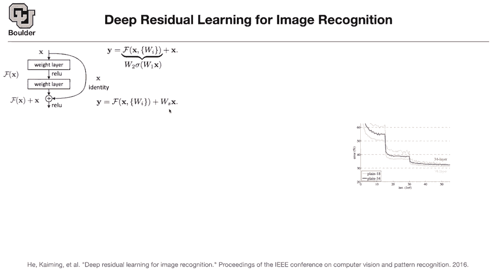
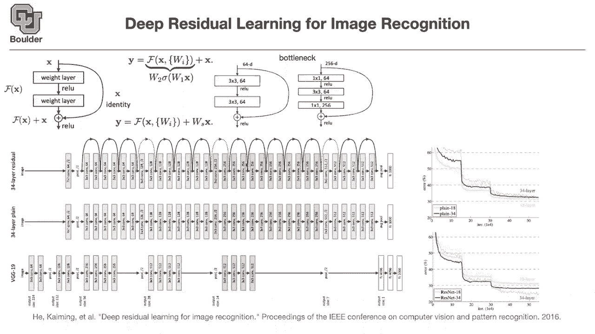

# 【双语字幕+资料下载】科罗拉多 APPLY-DL ｜ 应用深度学习-全知识点覆盖(2021最新·完整版） - P17：L8.2- resnet - ShowMeAI - BV1Dg411F71G

okay let's move on to deep residual，learning，basically resnet i'm sure you have heard，of it but。

let's go a little bit deeper into why，they are important，so the idea is that they want it to go。

as deep as possible so as you see there，is a trend here，so the deeper the better the papers that。

we are reading，they're just trying to make the neural，network deeper and。

something weird was happening you expect，as you make your neural network deeper。

for it to have a higher capacity，because you have more parameters and at，the same time。

it has a bigger receptive field it's，looking，at a larger batch of like at a larger，patch。

of your input image so it's looking，wider，so you expect your neural network。

to learn better as you make it deeper，because it has more parameters it has。

but in practice once you sit behind the，computer and，implement it and let's say。

you come up with two neural networks one，is 18 layer deep，and the other one is 34 layer deep。

the 18 layer is training like this，that's the training step whenever you，have a。

drop in your loss function in your error，rate，in your loss function and your error，rate。

that's that corresponds to uh，learning rate decay so if you remember。

if you're using a stochastic gradient，descent you have a learning rate。

and let's say at this point your，learning rate is 10 to the power。

negative 2 and then you suddenly drop it，to 10 to the power negative 3。

it means that you are now focusing on，during your optimization you are，focusing around your local。

minima that you found or you are trying，to find，that's when there is another drop here。

in the accuracy，that's interesting and counterintuitive，to me，it would seem like when your learning。

rate decreases your change in percent，error then would slow down as well。

and it's sort of doing if you see，there is a first drop and then here the，change is。

slower compared to the change here fair，enough yeah，but then initially as you this is。

external to your system，you suddenly drop your learning rate so。

it's gonna start focusing on your local，minima，really fast there's a huge drop and then。

it's gonna oscillate slowly，same thing here yeah that makes sense。

then but it's the same behavior for both，of the networks，one of them has less capacity。

compared to the other one you would，expect these two curves，to be switched you would expect。

the one that has a higher capacity to，give you，lower errors but then it's weird。

as you made your neural network more，powerful，the error went up it means that your。

neural network is making more errors，it's identifying more cats as dogs。

okay it's making more errors so you，might think that you're increasing the，capacity。

but then why is this happening it's，contradiction，the reason could be either two things。

it's either your neural network，not training properly or something weird。

happening with your gradients，so let's investigate that so to，fix that this paper。

which is a huge paper in deep learning，if you look at the number of citations，it's crazy。

so it has a huge influence on many other，works，they say that maybe there is a way。

for the network to ignore some of the，layers if it doesn't have to work with。

them that's why they add a，shortcut connection from one layer to，the other one。

and what the network does if it's too，complicated for the weights。

to go through these layers it's just，going to ignore that，it's just going to go through the。

shortcut it means that you're ignoring，one of your layers，your network might be 34 layers deep。

but then it has a bunch of shortcuts and，if it has to，go through these complicated。

non-linearities then it will，if it doesn't have to it's going to go。

through the shortcut and ignore that，layer and basically maybe your plane 34。

layer deep neural network is end up is，going to end up being，seven layers deep once the optimization。

is done，or initially during training maybe it，starts with going through the shortcuts。

most of the time，and then as it needs to focus on more，complicated examples then it's going to。

go through the more complicated part of，neural network，is there a parameter that uh controls if。

it goes through the shortcut，uh there are some other works，that do that but this work doesn't it's。

just，you add your input to whatever the，your neural network is telling you on，this。

uh on this block of your neural network，okay what i'm explaining here is a block。

of the neural network it's just think of，lego puzzles，in this work it's always going to go on。

both paths，and then just combine the result it's，not going to choose between them。

no it's going to go through both of them，but then if the weights are，zero and initially we are gonna。

initialize them to be very close to zero，do you remember the initialization from。

last session so it's most of the time，the standard deviation of the，the standard deviation of the。

initialization was square root of 2 over，n n was related to your，filter size and the number of input。

channels，and the number of input channels is，usually i don't know 256。

and let's say your kernel is three by，three it's 256，by nine so that's a big number。

square root of two over a big number，it's going to be a small number for your。

variance of your initialization okay so，initially the network is going to go。

most of the time through this route does，that make sense，yeah that makes sense another。

interpretation，is that it's easier，to learn the difference between one，layer and the other one。

compared to learning the entire thing we，are gonna go through，some super resolution paper。

later on if you're doing if you're super，resolving your，image the low resolution image。

is already a good approximation of the，high resolution one，okay think of this as the low resolution。

and the outcome，has the high resolution so the low，resolution one is a good。

estimate of the high resolution and the，other way around also，so these are good estimates but then。

you're learning only the difference，the neural network is doing the part of，learning the difference。

so in practice these are not going to be，too deep these blocks，here are going to be two layers deep。

one convolution and then another，convolution applied on a non-linearity。

really the question is what happens if，the input dimension is。

different from the output dimension then，you cannot just add。

two things with different dimensions and，we know how to fix that。

we use one by one convolutions so is，that clear so one by one convolutions，are useful for。

changing the dimensions dimensionality，of your input and outputs。

so my question now is thinking about，this it makes sense so，far is what about these。

maybe inputs or what about the outputs，of the layers，makes it so that the like you're saying。

as the learning goes on the weight，layers become，more important or larger they're。

initialized to zero and they grow later，on like what，by what process or by what phenomena，does that。

that change happen when when is the，identity the more important channel and，when is the。

f of x the more important channel，so there is this loss function。

from the previous slide you write that，loss function，then each time an example goes in your。

neural network，your loss function is showing you how，much error you made，okay how much loss you had。

then you have to back propagate that，loss，to adjust these weights so when the。

neural network is seeing that，it's committing a lot of errors going，through the identity path。

then it is forced to go through，part，for the errors to go smaller so it has。

to do with the way that training is done，in the background it's really。

interesting yeah that's fascinating，but so ws is initialized to identity and，then it's。

it can be driven like away from identity，like in order to，put more weight on the weighted layers。

so there are two scenarios that could，happen，one is that x and y have the same，dimensions。

if they have the same dimensions this is，what you use so there are no weights on，w on x。

okay that's exactly what you use you use，an identity without any weights。

but then the problem arises when you，want to go i don't know from 256，dimensions to。

512 dimensions for your output，then you cannot simply add them together，correct。

that's when you introduce a one by one，convolution，or just a simple matrix vector，multiplication。

to adjust the dimensions to go from 256，to 512。 and is that ws。

similar to like um these like injection，and projection，matrices that you'll use in like。

multi-grid so it's not supposed to，change any，size it's just trying to get like a one。

vector to become a one vector，in a different dimensional space，okay。

or expansions depending on what they are，doing，we're doing dimensionality reduction but。

sometimes you want to expand，there's no there's no learned variable。

waiting in that though no there is a，weight variable，w is the weight so there's a cat uh。

so at that point it becomes almost like，an inception module in the sense where。

you have these different，these different paths that you can take。

with different convolution layers in，them，but just less complicated you are sort，of correct，[Music]。

it's very similar to an inception module，yes there is one，one by one convolution here and then。

what you're doing is just，concatenating the output of your block，and x and then multiplying it by w。

it's very similar but there are some，differences as well，but the main idea is this this is the，one。

that the paper is going to use so we are，going to try to avoid this。

can somebody tell me why well because，then you still have to learn。

parameters for ws right and that's sort，of getting away from the point of this。

that's one aspect but then it's easy to，learn from one layer to the other one。

because there is no non-linearity，f is non-linear but this guy is nonlin，is linear。

so learning that is easy but，what is the catch what's the difference，between this and the other one。

not，adding any parameters so it's basically，the same cost if you take a vg g19。

you're gonna end up with just one more，addition，per layer so it's nothing in terms of，cost。

it's also nothing in terms of，memory so you don't you're not adding，more parameters。

to your network but this one is adding，more parameters。

to be learned so that's the difference，that's exactly what the paper does，it。

i think it was in our third slide you，take vgg 19，and you modify it and you're gonna get a，34 layer。

plain neural network and that's what we，had here，that's a 34 layer basically what are the。

changes you're changing these three by，three convolutions and you're replacing，them by a。

single seven by seven convolution for，your，first layer you're making it a little，bit deeper。

you're adding more layers same thing，here you're adding more layers。

more layers and then in the end you have，average pulling，from networking network paper compared。

to fully connected ones，so that's the change you make and then，to make it a residual。

you add these connections here these，shortcuts，the ones that we introduce up there you。

add them here let's see if the，so you're adding a 64-dimensional to the。

so you're adding a 64-dimensional to the，output，which is 64-dimensional so you're just。

adding you're using this，same thing here same thing here but then，let's take a look at here。

the output is going to be 64-dimensional，and then here the output is 128。

dimension so these dashed lines，these dash curves is where you're，actually using the second。

type of a connection so the same thing，here the dimension wherever the。

dimensions don't match you're using that，or you can choose not to use that。

because there are only three of them，so probably they're not going to make a。

huge difference you can just drop them，if you want so what is the actual change，so i'm here。

now you reverse the pattern previously，your 18 layer deep neural network was。

doing better than your 34 layer，are，working as you expected your third four，layer。

deep neural network is doing better than，the 80 layer 18 layer，is。

actual empirical argument that things，are actually working，any questions why is this called deep。

residual learning then，why is it called deep residual deep is，because it's deep。

you have multiple function compositions，on top of each other that's deep。

and it's really deep it's 34 layers deep，why is it called residual because of。

these residual connections，okay the cool thing is that these，residual res nets they don't have to be。

this deep，basically if they decide that they don't，need this，block they're just going to ignore it。

and set the race to zero，during training and go through these，ones okay and whenever you have a。

shortcut it's basically avoiding that，part of the network，was it essentially the same as a like a。

hyper parameter for，how many layers to have you can train，out some layers。

that's a cool way to think about it，yes sort of the network knows how deep。

it has to be you make it as deep as you，can fit，on your gpu and then you you let the，network decide。

how deep it wants to be clever way of，doing it yes，can you go in after the fact and sort of。

like prune the network，um in places where it's chosen the，shortcut。

over those layers yes there is actually，we are going to cover that okay when we，go to small networks。

so far the trend is we want to make our，network as deep as possible。

as wide as possible to get more accurate，and win image net competition，to claim first position。

whatever the cost sort of whatever the，cost except for，inception modules which are trying to，sort of。

take into account the cost but，other than that the general idea is。

we want our network to be our law as，large as possible，okay but then when we go to make make。

networks smaller，there are various ways of doing it after，the fact。

during training and so on we're gonna，cover that，there is actually another contribution。

of this paper，and that's bottleneck so rather than，going from，if you have if you are going from 256。

dimensions，to 256 then these convolutions are going，to be huge。

the cost is huge and we saw this trick，before，you use a one by one convolution we saw。

it in an inception now we are seeing it，here again，but now in the con。

i mean including the ideas of residual，connections，you first project from 256 dimensions，to 64。

 then this 3x3 convolution is，going to be really cheap，you do that and then you project back，into。

256 and then you add it and they use a，lot of bottleneck，connections for instance this 256 here。

is just the bottom neck connection and，these are the actual networks。

for 18 layer deep 34 layer deep 50 layer，for 50 layer deep you have。

they're introducing these bottlenecks，otherwise the cost is a lot。

they go up until 101 you hear these，words a lot，resnet 50 resnet 101 and this is resnet，152。

it is 150 layers deep and brandon has a，question for those of you who have，questions。

you are more than welcome to ask and for，those of you want to leave。

you are more than welcome to leave we，are right on time random is saying。

is there a certain minimum amount of，data，needed to utilize an ultra deep。

architecture these are good questions，but these are theoretical questions。

usually the thing that happens is that，somebody gives you a data and then you。

have to live with that data，so the data set has this size and then，you have to make your，data。

so usually the size of the data is given，but these are really good questions i，mean。

you can investigate them it could be the，topic of somebody's dissertation or a。

phd does it answer your question，perfect any other questions so i've seen，these sort of uh。

skip connections in things like u-net um，into，segmentation that sort of information。

from previous layers，is useful later on it is similar，but in unit uh we are gonna cover that。

later on the objective is slightly，different，and in segmentation the objective is，different。

here you want to get a number out a，probability out，over there your probabilities are going。

to be pixel-wise，when you do segmentation and you do，those shortcuts for different reasons。

over there is for you to get a better，estimate for the boundaries。

of the objects here the objective is，different，here you want to go as deep as possible。

and why do you want to go as deep as，possible，because the deeper you go the more。

features you're learning，the more abstract features does it，answer your question。

yeah cool thanks would there be an，advantage of doing this，over a depth of that's a great question。

there is actually a table in the paper，these，or three of these or one of these。

and then they are gonna compare the，learning rate i mean the，errors and they decide that。

no it's not worth it to add more than，two，and that's why they stick with two of。

them any other questions，can the depth be a variable like，two for certain layers and three for。

others，are，discrete variables，two versus three and then it's hard to，optimize over them。

because then your gradients doesn't make，any sense，and the other thing is uh these are not，learnable。

by your data this has to be a mechanism，outside of your learning process。

you can think of these as hyper，parameters these are not parameters。

the other problem is you're changing the，structure，i mean you need to write a different。

type of a neural network each time，and the computational graph is going to。

be different when you compile it，when you use tensorflow to compile your，neural network。

then each time it has to either use two，or a three，so there were a couple of problems one。

is technical，how do you implement it the other one is，mathematical how do you use gradient，descent。

and discrete stuff does it answer your，question but，we will see how to optimize over。

those sort of things like，two layers versus three layers we're，gonna learn how to do that。

later when we do automatic machine。