# 【双语字幕+资料下载】科罗拉多 APPLY-DL ｜ 应用深度学习-全知识点覆盖(2021最新·完整版） - P180：L80.2- RL算法大全 - ShowMeAI - BV1Dg411F71G

Before we continue and before we get lost into the type of algorithms that I'm going to go through in the rest of the lectures on reinforcement learning let's see where we are what are we doing what is the map what is it what is the big picture the reinforcement learning algorithms we can divide them into two major classes model free where you are not modeling the transition probability of your environment so you just interact with the environment but you don't model your environment and then there are some model based for model based if you know your model this is perfect。

 this is a perfect scenario in that case we are going to see an example of an algorithm for solving go ches and shoggy later on so we are going cover this for when you're learning your model you're going to rely too much on on an app。

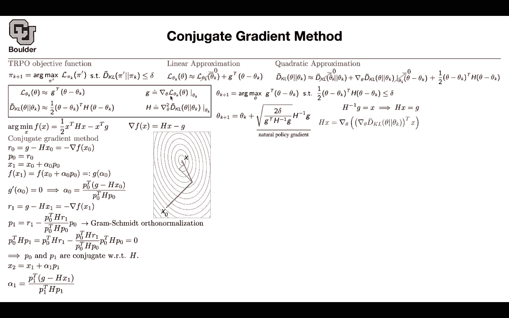

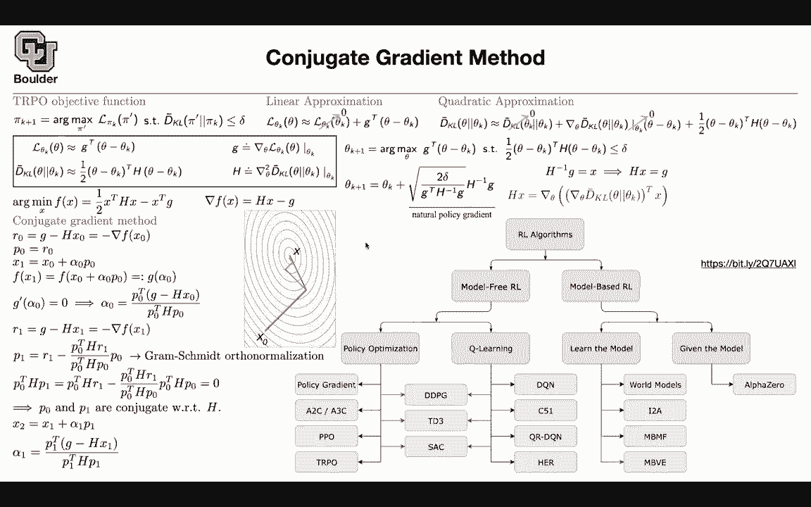

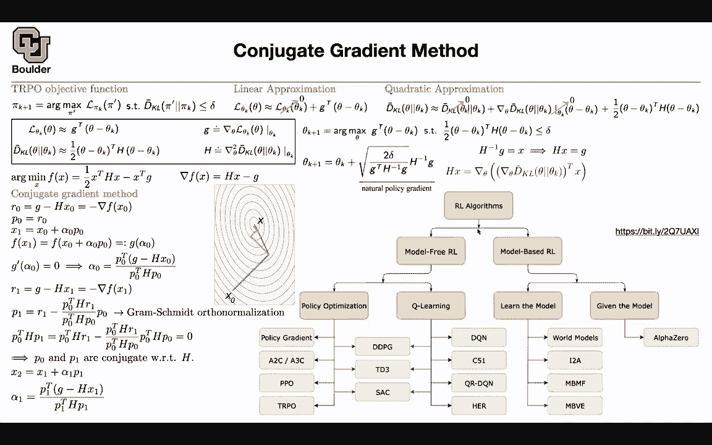

Proximation to your environment。 This is a good idea。 You try to learn the model。

 It's going to give you a more complex reinforcement learning framework。

But these days at least up until 2020 and 2021 they are not mainstream。

 maybe in the future things are going to change and people are going to start learning the model and do model based reinforcement learning and there are actually some works that are trying to do so but it is not yet mainstream so we are not going to cover that and for that I'm going to leave it as research as a research topic but we are not going to cover it in the course but we have been doing so far was model free。

 we don't write any models for the environment。

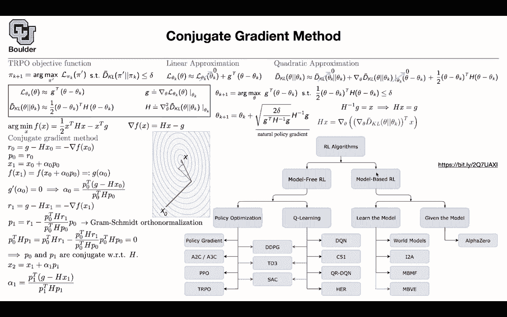

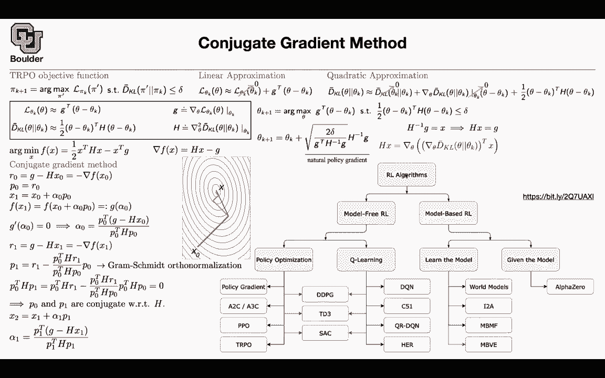

It turns out that these algorithms are actually easier to code。

 we started with Q learning we covered deep Q networks I'm not going to cover the rest of the papers that are getting excited here so we are not going to cover that this is going to give us a good flavor of what type of algorithms are going to deal with Q learning so we did deep Q learning and we play Atari with it and then we didn't want to let go of the Belman equation yet so we cover deep deterministic policy gradient so we covered this paper we covered this alpha zero we are going to cover in the future but then when we went to this regime to policy optimization we are sort of letting go of the Bellman equation not totally we are still using it but we are relying on maximizing the expected return or maximizing or minimizing the expected cost we covered TrRPO trust。

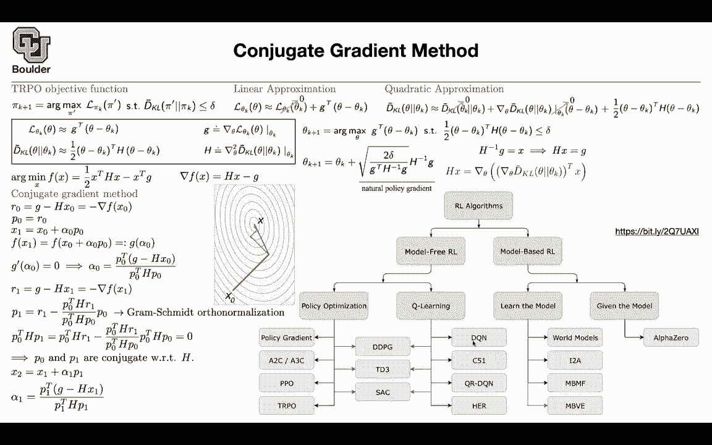

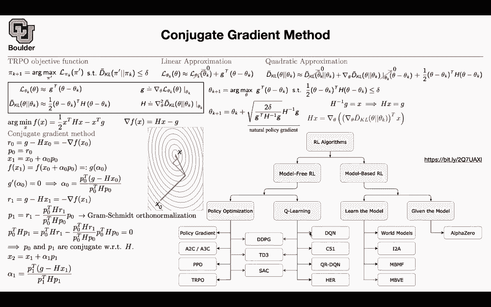

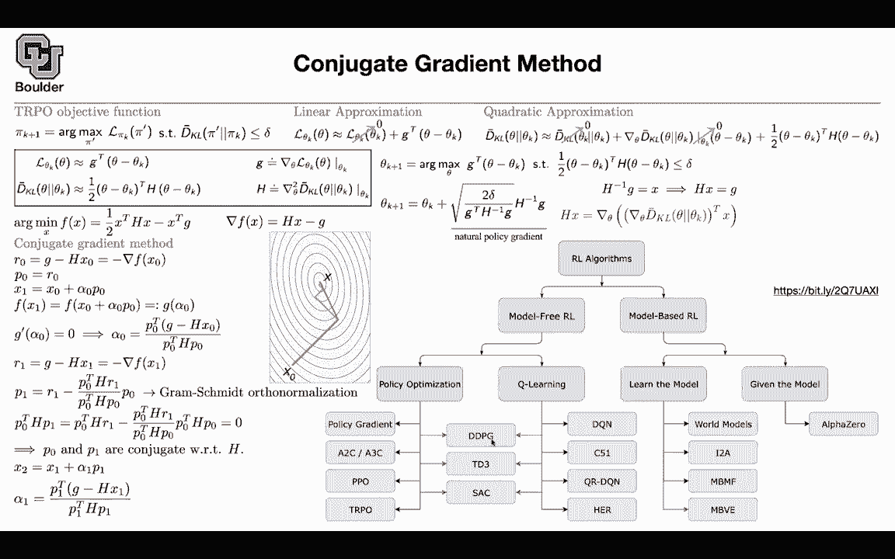

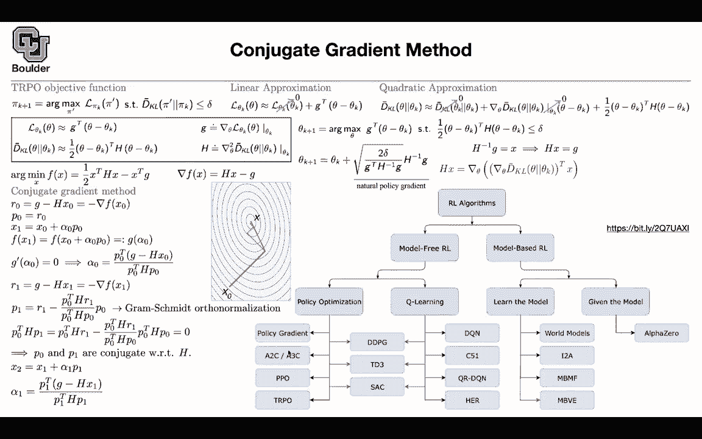

Region policy optimization so far we actually covered policy gradient last session and we are going to cover these two other methods this one we are going to cover today and this one later on next week but this is a land I don't want you to get lost or get confused of what we are doing okay。

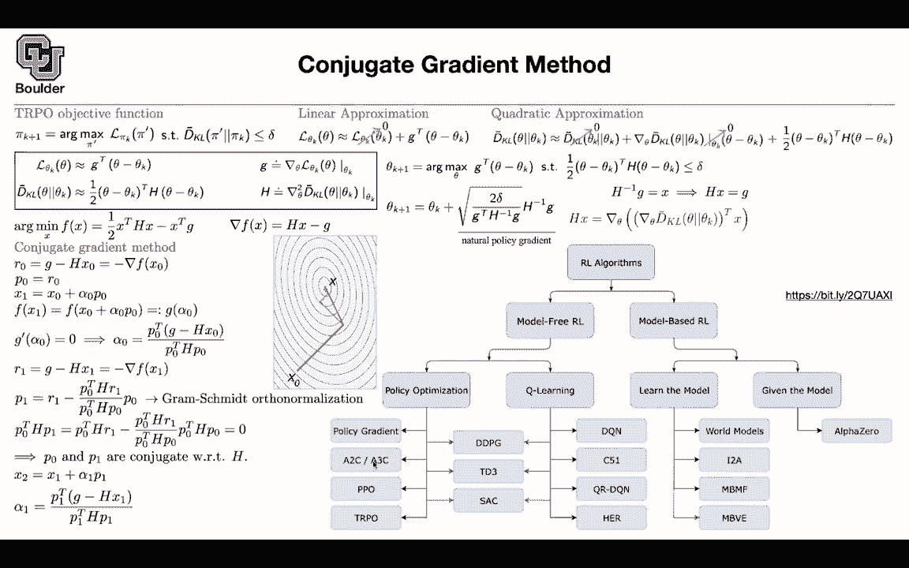

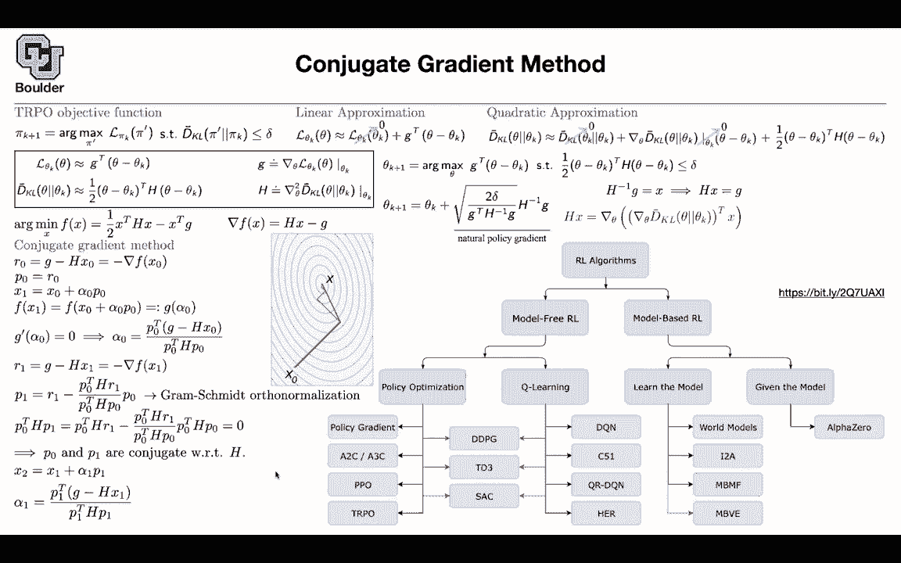