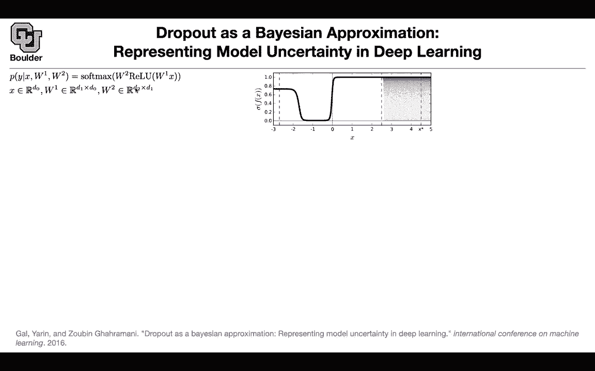
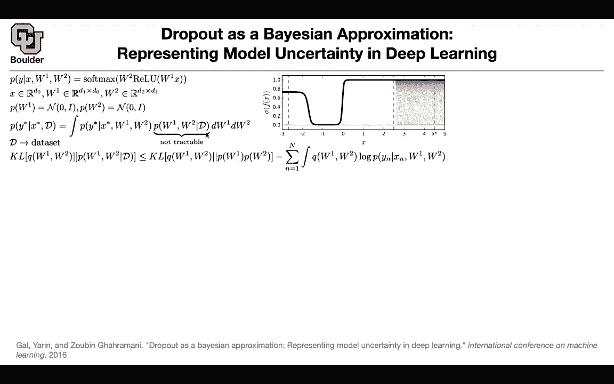

# 【双语字幕+资料下载】科罗拉多 APPLY-DL ｜ 应用深度学习-全知识点覆盖(2021最新·完整版） - P182：L80.4- 深度学习中的模型不确定性 - ShowMeAI - BV1Dg411F71G

In that case we can move on， usually we saw this behavior that if we want to explore our environment we are going to follow some noise or some noisy pattern you're going to add noise to a deterministic policy or to our policy to encourage exploration you can actually use dropout to do the same thing and do Thompson sampling and we're going to see why and how but this is also a good time to think about dropout and see what it is actually doing is there any theory behind it let's see why do we care about uncertainty I just gave you an example you want to explore your environment based on the uncertainty of your predictions so you want your policy to be not deterministic you want it to have some random behavior actually you can use uncertainty in different ways even when you are doing regression or when you' are doing classification the classification one is the most confusing one but it's going to be the most。

Reing of why you need uncertainty Some people confuse and say if my classifier is giving me a number that is 0。

7， it means that it is 0。7 uncertain about its prediction and the prediction let's assume it's either a0 or one and if it gives me0 it's not at all uncertain or if it gives me one it's not at all uncertain but actually you can have uncertain on top of the prediction of this neural network on top of those probabilities and when when does that come into place let's say you have training data from negative 3 to I don't know 2。

5 that's where you collected your training data you train your algorithm and let's say you have infinitely many training data your model is going be very certain about the predictions of the probabilities it's making but then it should be uncertain if you show it an image that it has never seen before this test data that is not in the regime where you。

can interpolate so you can have uncertainty on top of sigmas It's a little bit confusing it's more clear when you do regression。

 but it's less clear when you do classification but you actually need uncertainty on top of the probabilities that are coming out of a classifier to model these types of uncertainties when you haven't seen a data you say I haven't seen such a data before that's why I'm not sure what probability I need to assign to that prediction but how do we do it let's say your neural network is very simple you take x。

 you multiply it by a matrix， you do R you multiply it by another matrix you do softmax to give you the probabilitybilities at the end let's say you're initially in dimension D0 this is the number of features that you have W1 is going to take you from the number of features to some hidden layer D1 and W2 is going to take you from the hidden layer back to the output dimension D2 D0 D1 D2 if you were to train neural。

Works in the proper way in a Bayesian way you would put distributions on your variables。

 you would say I have a prior distribution for W1， I have another prior distribution for W2 and then you would drive to posterior you would compute your posterior why do you need to do that because if somebody gives us a new data point like here and we want to do prediction we need to condition on the data that we had before the data that we have in this regime and for that you need to marginalize W1 and W2 out you need to integrate them out according to your posterior distribution and this is where the conditioning on the data is coming in so this is a proper way of doing prediction in a Bayesian way this is our data set but then we know whenever you have something a posterior that is intractable you can do variational inference this result when we were doing variational autoenders we are going say okay I don't know。

But I know Q， I'm going to make some assumptions and Q， write down the kL divergence。

 use some inequality and transform the kL divergence between Q and the posterior to the kL divergence between Q and the prior Now everything in this term you know and you have full control over and this other term is going to give you your likelihood is this term here when you are replacing your P by a Q okay so far so good now you can start making assumptions about Q the first assumption that you make is perhaps they are gonna divide per layer so let's say this layer is independent from the other layer you can make another assumption on W1 and w2 that they are Gaussian mixture distributions so it's a mixture of two normal distributions one of them has a mean zero the other one has a mean M and then there are some probabilities here that's the Gaussian mixture distribution you can actually write down the kL divergence now the kL divergence between。

QW1 and P1 K divergence between Qw2 and Pw2 and this one I'm going to leave an as an exercise。

 these are just normal distributions。 your prior is normal。

 your Q is a Gaussian mixture distribution so computing this is not hard we can actually compute this term is going to depend on the dimensions of your hidden space your sigma your P and the norm of ws plus some constant terms that you can get rid of If you set sigma to be a very small number basically this term to be0 the log is going be negative 76 around that number So this term is just a constant and we can get rid of that term as well so we are going to assume sigma to be very very small machine precision What's gonna happen next if you keep sampling from this distribution you're gonna to see your mean So this is Ml has the same dimension as WL you can think of this as the mean of。

WL and then you have some Zs that youre you're sampling from benoulli distribution and if you remember this。

 this is basically dropout so you're dropping some of your outputs equivalently you can drop out some of the rows in your matrix M this is basically dropout and the objective function that you're solving for is the objective function of dropout this is your likelihood now you're doing Monte Carlo estimate here。

 youre sampling from Q and the way that you're sampling from it is using dropout whenever a new data goes in you drop some of the outputs and these two terms are just regularizing the parameters of your neural of your neural network so this is just dropout this term is just regularizing the L L2 regularizer or weight decayK that's for training you have the same loss as you would do for dropout for infer。

Usually you average out the predictions of your model。

 Don't do it just sample from that distribution as a new data point goes in sample from your dropout distribution is going to give you multiple predictions for the same x0 you can have multiple predictions and then you can report the mean and the variance of your distribution if you want and that's going to give you predictions。

 your uncertainty and then you're using Monte Carlo to obtain the mean and a variance of your predictions so that's the only change from dropout when you're doing inference keep your samples。

 don't average out， don't report just a mean report the variance as well and then you can do nice stuff your model is going to be able to encode uncertainty the uncertainty of this number here being a one is very low and it being a5 is also very low but then as you keep rotating that one。

Predictions are getting more and more uncertain for regression we can have uncertainty into the future for reinforcement learning。

 we can have this agent that has nine eyes you are rewarding it for going in a straight direction on a straight line you are punishing it if it touches any of these green circles and you're rewarding it if it touches any of those red circles and you're punishing it if it exits the boundaries you can do epsilon greedy type of algorithms like what we were doing before or you can keep sampling from the uncertainty the predictions of your model basically do Monteallo sampling from these distribution I think it's a good time to stop and ask questions for those of you who want to stay and ask and for those of you who want to leave you're more than welcome to leave How is the computational complexity of this campaign。

So this is going to be multiple evaluations of your neural network so you have to evaluate your neural network multiple times and you evaluate it multiple times with different realizations of your W matrices exactly okay so and in fact what's happening is you are doing multiple dropouts okay so you don't change your dropout algorithm at all it's just a prediction that you're changing dropout is just turned on inference yes so dropout is going to be turned on in inferencefer you don't do that trick that we were using to report the average weights so you you get to a trained network with parameters W and then you sample from it a bunch of different times with a bunch of different realizations of the what it was a Z variable here which is the dropout variable and then average and then average overdose you can average overdose and you can report the variance。

And your parameters you are mostly correct， except for the fact that you said your parameters are ws。

 no your parameters are Ms， it's the same。Your parameters are called Ms here。

 and then you're dropping some of the outputss and you're right about the cost。

 So you have to evaluate， evaluate your neural network multiple times。 This is your neural network。

 and then you're evaluating it multiple times。So the thought is like if a network gives the same predictions regardless of the dropout realization。

 then you have a high certainty and if it changes drastically because you turn off one row or the other。

 then you have a much lower certainty that makes sense。And there is actually a theory behind it。

 you know that you are doing variational inference， when you're doing dropout。

 when you're doing variational inference， you're sampling from a Gaussian mixture distribution when the variance of your Gaussians are very tiny any other questions。

