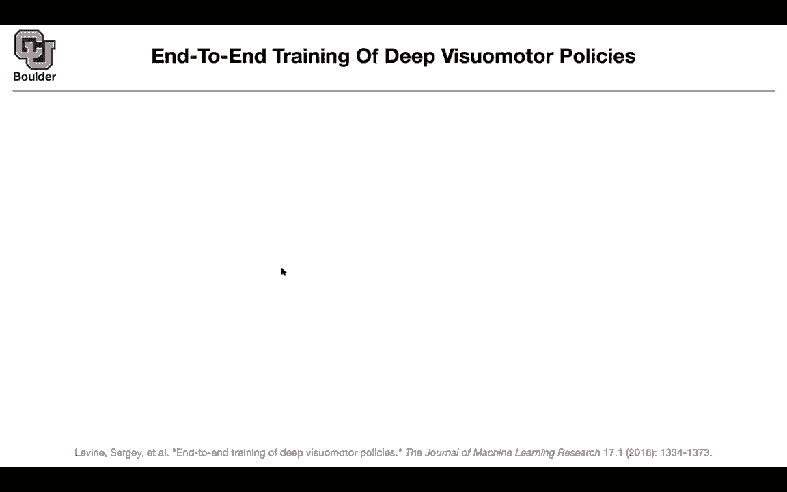
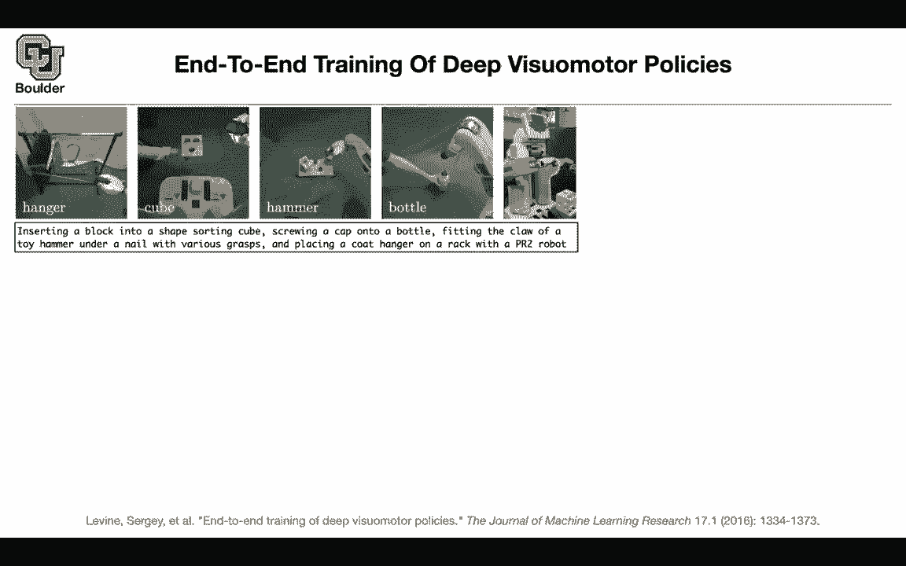
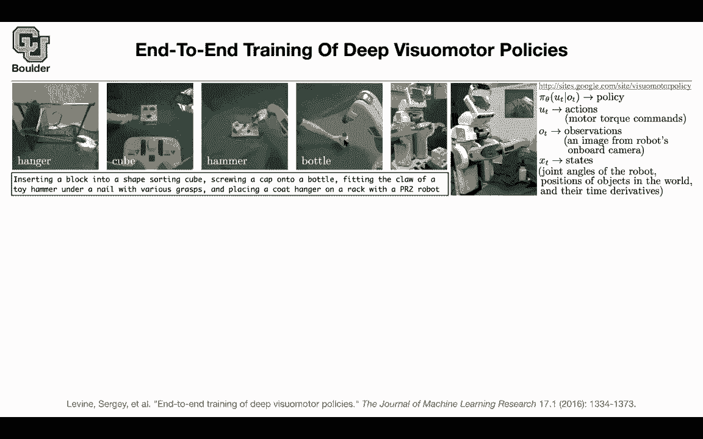

# 【双语字幕+资料下载】科罗拉多 APPLY-DL ｜ 应用深度学习-全知识点覆盖(2021最新·完整版） - P185：L81.3- 深层视觉运动策略 - ShowMeAI - BV1Dg411F71G

So this was for self driving cars and self driving cars are actually robots and their job is much simpler than the job of a robot because the job of a safe driving car is just to keep the lane press the pedal stop be careful with the pedestrians park not park so these are a finite set of。

Outcomes that could happen they are of higher risk because you're playing with the lives of human。

 the passengers and the pedestrians， but in terms of complications。

 it's much easier as a problem and dealing with actual robots so this is what you want to do now and what are the tasks for instance a task could be of a robot working at your home could be inserting a block into a shape sorting cube so take that block。

 put it in the shape sorting cube screwing a cap onto a bottle like what you see in this image fitting the claw of a toy hammer under a nail So this is what is happening here and placing a quote hanger on a rack like what you see here these are the images from the perspective of the robot so this is what the robot sees it sees its own arm it sees the hang it see this。

But what we actually see is this so this is the actual robot。

 this is a PR2 robot and if you put everything in one image。

 this is what we are seeing and this is what the robot is seeing so this is the field of view of the robot。

What do we want to do we want to do these so a diverse set of actions so what I want you to do is click on that link and watch it it's a visual it's a video explaining the same topic that I just explained so I want you to go through that but let's go through the math or the methodology behind this you want to have a policy and your policy should be based on your observations and the observations are these images red green blue images and your actions because these guys are coming from the control theory perspective you are not calling that a you're calling that you so this is just a different notation observation actions and this is where your neural network is going to be like any other reinforcement learning algorithm the question is how are' you going to train your policy what is your loss function but here because these are real robots you are collecting real data these are not simulated data so。

Have to work in your lab， work with this robot and then collect data from a physical robot so these are not simulations anymore so you have to be able to work with smaller size data so the size of the data matters you cannot play your like your Atari game forever so you have to be data efficient or sample efficient and the other one is you are not seeing your states you're only seeing observations so you want to work only with images。

As I mentioned UT is your action which could be in the form of motor torques these are the commands at the joints and then the observations are these images during training we have access to the state of the system but during inference you don't have access the only observations that you have are your images so the robot should be able to work with the images during training it's okay if you want to use your states and whether are your states these are the joint angle joint angles of the robot positions of the objects in your environment and if those objects are moving your robot should be able to work with those objects as well with those movements should be able to adjust itself what neuraln network are you going to use this is your policy neural network it's going to take as input a red green blue image it's going to do some convolutions the first convolution has a stride of to the rest of them has a。

Of one， there is no padding going on because there is no padding。

 The sizes of your images are going shrink slightly。

 Why are you shrinking the sizes slightly because you don't want to lose the information of the locations so you don't want to lose the information of where this sorting cube or shape sorting cube is located in your image because those locations are important。

 You want to take that object and insert it here So the locations matter that's why you are not doing any pulling and you are not shrinking the sizes of your images by string and that's exactly the reason that you're doing this step。

 This is step is different from any other convolution that we saw before。 What are you doing here。

 you put a softmax it's a spatial softmax per each channel So these are going be independent per channel So let's focus on only one channel。

 The same thing is going to happen for the other channel you are putting。

Softmax on the values that are coming out of your neural network at this stage and the softmax is gonna to focus on one point and it's gonna the other terms go to zero or be closer to zero and in the end if you add up these pixels or these pixel values they're going to add up to one so that's what your softmax is doing now you take that softmax and you need this because again you need to know the locations you don't want to lose the information that are really important to you the locations where are you going insert your stuff you take that softmax and you multiply it by the x coordinate and the y coordinate in your image so that's your x coordinate of these pixel that's the y coordinate of these pixel in the original image and that's why these 32 channels are going to end up being 64 because they have x coordinate they have Y coordinate。

D64 in addition to your robot configuration， I don't know the angles etc。

 because the robot is seeing its own hand so it has its own information you push them through a couple of fully connected and then in the end you get seven outputs and these are the motortors of what you want to do so that's your policy the question is how on earth or you're going to train that while being data efficient a little bit of the background。

 this is a finite horizon episodic problem， this is episodic because one episode two episode etc。

 there is some state dynamics that you are not assuming to be known given the state given the actions that you took you're going to go to the next state you have some observations given the state you have some image that the robot is going to see this one you don't assume to be known as well your policy as a function of Xt as a function of your state because your policy。

This is where your neuraln network is from the space of images to actions you have to integrate out those images so far so good so this is just notation and this is just a distinction that we have to make observations versus states this is where your neuraln network is and this guy we don't assume to be no and then there are some trajectories you' are in state one you took action one state two action two etc that's going to give you a trajectory and you can put a probability on that based on your policy and your transition and using the chain rule for probabilities and you also have a cost function you want to minimize the cost okay what do you want to do in the end this is our final objective you want to minimize your cost we respect the parameters of your neuraln network of your policy so there is this nice trick because you want to be data efficient you are making this trick and because you don't observe your state。

Your neural network doesn't observe the state it only needs to make decision based on the observations based on red green blue images you're going to do guided policy what is that you're going to say rather than doing my expectation with respect to the actual policy you are going to seek help from other policy or another distribution over trajectories rather than using this distribution over trajectories you're going to use this other distribution over trajectories under the condition that these other distribution should be equal to the distribution that is going to result from the policy from where you have your neural network so now you can divide your problem into two steps and by tau you call it guiding distribution you divide it into two steps first you optimize your loss we respect to this P and then you do a simple regression you say that my parameters of the neural network should match。

P the helper so you keep alternating so this is called alternating direction method of multipliers so you change these constrained optimization problem and you put a multiplier on that so far so good but what is this and why is it helpful because you can make very simple assumptions on that so this is a local policy it is able to look at your states it doesn't have to look at your observations so it's going to know during training it's going to know the state it's going to know XT and it's just a linear it's locally linear it's local because k is depending on time and then at the same time you can model your environment locally you can model this transition probability again a linear and some variance it turns out that this is very easy and data efficient to estimate P and you can because this is very similar to linear regression so it's nothing more than that so it's very easy to estimate K。

KCT FF FF and capital F so you first estimate those and during training you know your XD and you're fine。

 you are doing your training during inference network is trained the neural network can look at pure images it doesn't need to know your estate because your neural network is here and during inference while your robot is working in the environment by putting the cap on this bottle it's gonna to look at these images only I think I'm gonna stop here and let you guys ask questions for those of you who want to leave you can leave so to make sure you understand this during training we have access to the like physical location of the bottle and physical location of the hammer and the different objects and then we can use those as inputs for this guiding distribution and then our neural distribution is just trained to match whatever。

outputputs that guiding distribution generates using inputs as or using images as inputs instead yes exactly okay and why is it possible Because as soon as you know your Xt and you're in the physical environment youre going to know what image is going to correspond to that yeah so an image is going to come out and your neural network is going to take that image and is going to give you an action。

This part is a simple regression or you can minimize the kl divergence between these two because they are distributions and the other part is very easy to optimize because these are very easy models these are simple models we can actually know the analytical form for your K Okay so right away you get your K small K this is the bias and C there is no optimization going on there you just get it for free。

What is that script and notation for is that normal distribution or is that just saying like some network Yeah。

 so this is normal distribution with this mean and that variance。

So you can make the same assumption for your policy if an image goes in it's gonna to give you some mean and some variance because these are continuous action spaces you're changing the what torques Yeah that makes perfect sense the last question is what what are they use to these loss functions or I guess cost functions the little L so they are gonna be when these cube that depends on the problem so that's why I'm being a little bit weight there so for that you need to read the paper actually it's in the appendix of the paper but for instance for this problem it could be the distance between the pixels of this cube here and the pixels of this guy so's the distance between the two do they consider penalizing things like like sporadic motion and high speed motion and that kind of stuff or is it all just based on getting the cube into the hole It's based on getting the cube into the hole that's it cool yeah。

And the other cool thing is that yes， these are linear models but they are locally linear so they are really powerful if you think about them in that way because they are time dependent so it's it's not at all the bottleneck they can give you very good policies and model your environment pretty good question I think maybe I missed that part but I believe youre saying that we're not reducing the original size of the image because we want to keep the location but it seems like we're going from 24 by 24 to 117 by 117 Yes that's the only part that you're reducing and that's only for computational reasons and that's not bad it's just four pixels are going to collapse into one pixel not that makes sense but then I'm getting confused on the last part that will using the softm and multiplying by the x and y of the original image because if we're reducing it we should have two x's and 2 y's that makes sense Yeah so you' just kick this。

So you're right， four pixels here are going to correspond to one pixel in that image。

And then you take the center that coordinates of the center Okay that makes when I said you are not reducing the size of the image if you remember whenever you are doing convolutions and your task is classification you start with three channels and high resolution but then you keep shrinking the resolution and increasing the number of channels but here you are not doing that right yeah my only confusion was the the last part but the X and y because we had multiple of them Yes cool。

