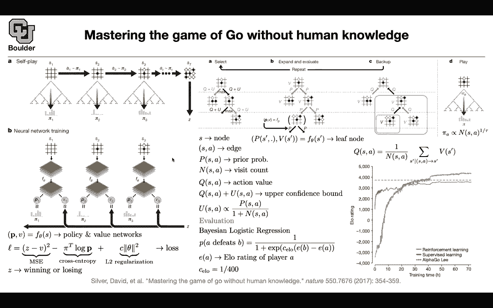
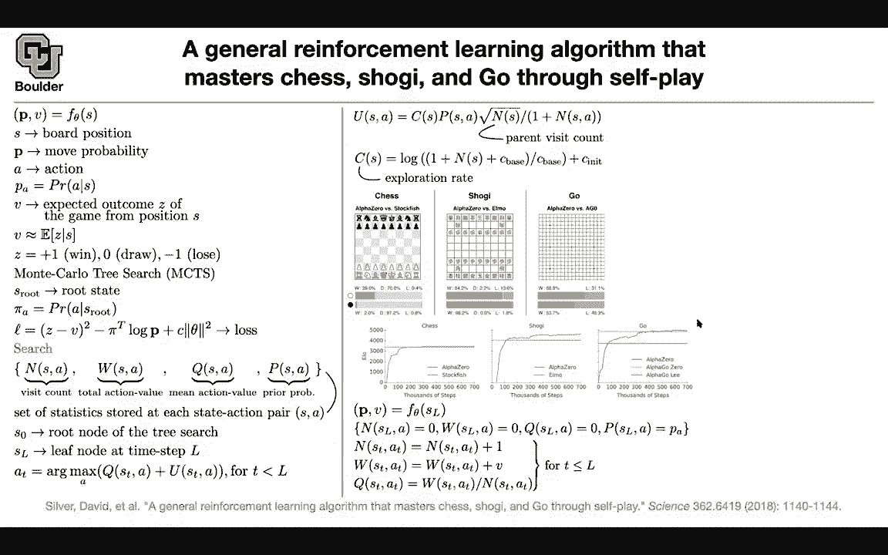

# 【双语字幕+资料下载】科罗拉多 APPLY-DL ｜ 应用深度学习-全知识点覆盖(2021最新·完整版） - P187：L82.2- AlphaZero - ShowMeAI - BV1Dg411F71G

So the next paper is very similar to what we just covered about go it's the same methodology。

 but then we're going to see whether the same methodology can help us solve different problems maybe shoggy and maybe chess same as before we are going to have a neural network that takes us input your state and it's going to out the probability of your actions and a value for that state as is your board position in the form of an image these are your move probabilities what action you're going to take next if a is your action PA one of the components of this P which is a vector is the probability of you taking that action in that state V is the expected outcome and in the end you want me to be the expected value of the outcome so that's how you're going to interpret this unlike go which was win or lose for something like chess you can have V draw or lose we're going to still do multicly research。

To give us the data necessary to train this neural network。You're going to start from a root state。

 you're going to associate some probability to the actions in the root state and this is coming from your Monte Carlo research and then that's our loss we just saw this Z is going to help us supervise V and pi is going to help us supervise P with some regularization for the search for each pair of state and action for each edge you're going keep a visitation count the total action value mean action value which is w divided by n and your prior which is going to come from your neural network and these are the statistics that you're restoring for this pair of state and action as0 is your node root actually root node of the tree S L is the leaf node at time step L and then you're choosing your actions based on your value your mean action value and then you want to explore as well so very similar to what we cover just now heres an。

Exact formula for your U most of these are constant like this term and this term here and you can just say that u is proportional to your prior probability divided by one plus n your visitation count and the higher the visitation count the lower is your incentive to explore that pair of state and action and then this doesn't really matter it's just a constant in terms of mathematics it doesn't matter but when you're actually implementing this these are all of the hyperparameters that you need to choose okay and that's one of the reasons why reinforcement learning is hard there is a lot of hyperparameters that you need to play around with now if you're at the leaf node the way that you're going to update your statistics so you're gonna have some statistics for your leaf node and some actions because some new edges are getting added to your graph to your tree the last guy we know but the rest of them we initialize with zero。

This one we are reading of from our neural network from here and the way you're going to update it。

 you are going to increase your visitation count， all of the edges that led to that node your visitation count is going to increase by one and their value is going to get increased by this V that you're reading of from your neural network and then Q is just w divided by n it's the average and the same framework is going to let you play chess Shogi and go Stockfish is a famous software for chess Elmo is for Shogi and alphapha go0 is for go and the method that we' are covering here is Al zero and given enough training time you can beat the previous state of the art and all of these stockfish beats human Elmo beats human and Alpha go0 also beats human and this alpha0 Al go zero is the previous paper and zero is because there is。

Zero supervision， so you're not using human data to train it Alpha go Li is the first alphapha go which had human supervision and it beat a human an expert playing the game of go and this is alpha zero So given enough training time it's going to come up with nice strategies let's。

Take a look at the board position and let's say you just took or your opponent just took queen F8 so they just moved their queen to F8 now you're considering you are white and you're considering your next move and in the end the algorithm is going to take B5 it's going to push this paw forward but what is the thought process behind it if you let it train if you let it think sorry for10 to the power two simulations and report the top nine options that it has that it's thinking about one of them is D5 but it's also thinking about other options like root H1 taking this route and putting it in H1 if you let it think more it's going to consider C5 and D5 so C sorry C6 is pushing this paw forward so it's thinking about that and then it is thinking about D5 and it's also thinking about what's going to happen next。

I push this pond forward， the black is going to take it。

So and then it's going to do more and more simulations it's going to keep thinking he's spanning the tree and then in the end it's pretty sure that this sequence of actions is going to happen but it's not that much sure about the next step and therefore it's going to take D5 so I included this paper because maybe more of us know about chess compared to go but any questions I have a question don' know if it's more。

Technical question but it seems like the moves change during the game so for example if we play go in 30 by 30 initially you have 900 possibilities but as you play you have less and less possibilities so I'm just wondering how do we actually I guess implement these very number of outputs or it just automatic so that's a great question what's going to happen is these are all of the actions that are possible that are allowed in that position so for instance not of not many of these actions are possible like taking your pawn and pushing it back moving it to D3 so these are going to be excluded from the set of possible actions and you're putting a probability on that on only the available set of actions so what we have here Al zero is a model based reinforcement learning method so you know。

The model for your environment and actually not only it's model base you know the model you know the rules of the game so if any of you have played chess before on a computer you know that it's gonna be able to show you the possible set of actions some of these software are going to let you choose the set of possible actions so yes you're gonna mask out the invalid set of actions that's correct any other questions does that answer your question so so the so one the environment has to tell you what is possible and then for each one of them you output a probability rather than separately output 900 initially just per sorry per action you output probability exactly yes。

Any other questions， the diagram that we're looking at here with 1001000 to 10，000 simulations。

They all are branching but all all we're viewing here is just the most likely 10 outcomes and that's why when we get farther and farther like the 10 to the sixth we're not seeing all of the initial branches because it's it's certain that the best move at least for like whatever eight steps in a row has to be white black white black doing definitive things Yes exactly so this tree is got to be a huge tree。

And what we are showing here is only the 10 or nine possible outcomes the most likely outcomes based on the value that you're associating so the more red it is。

 the more value you're associating with that so the higher is the expected value of your winning so yes。

 but this tree is going to be gigantic and I want to make sure I understand this like exploration stuff where it's randomly choosing things and it's trying to backproagate how valuable those next choices are and then it continues to try new moves and it happens to explore the more valuable ones more often and that's why they end up like we return just the visitation count at the end but we also know that we're gonna to visit the branches which are more valuable to win exactly because you're taking a look at your value and you're reading it up from。

Neurural network okay so the value matters and then in the end what you're going to take a look at is the visitation count but implicitly there is higher value if you've visited something more in that state and action Yes that's implicit that excellent thank you both because of this P and because of your V so your neural network has a direct effect of what you're going to see and vice versa your visitation count is going to have a direct effect on your policy and your value network so they are helping each other out any other questions care perfect。

