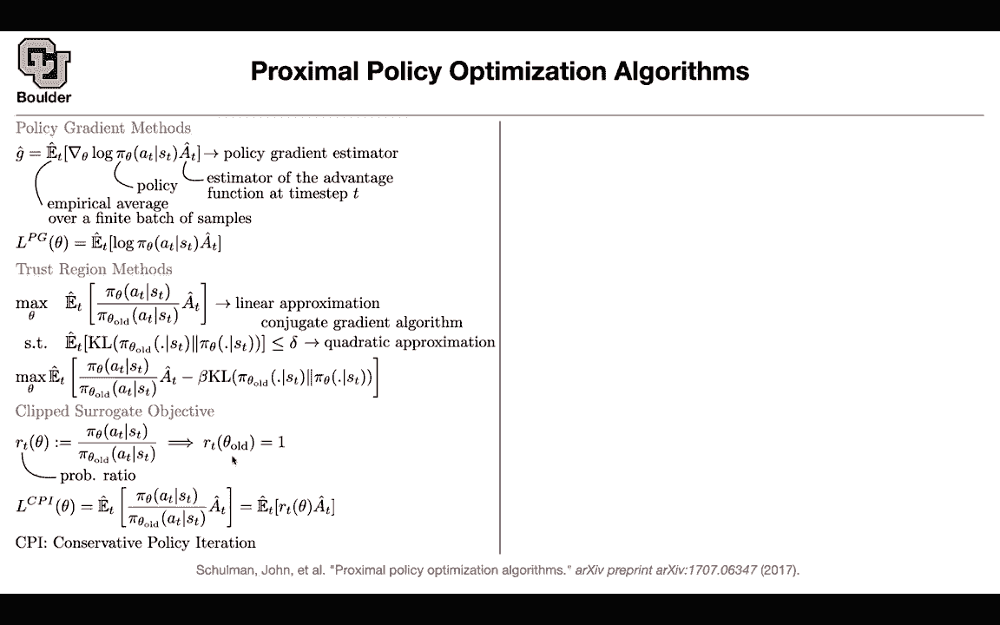
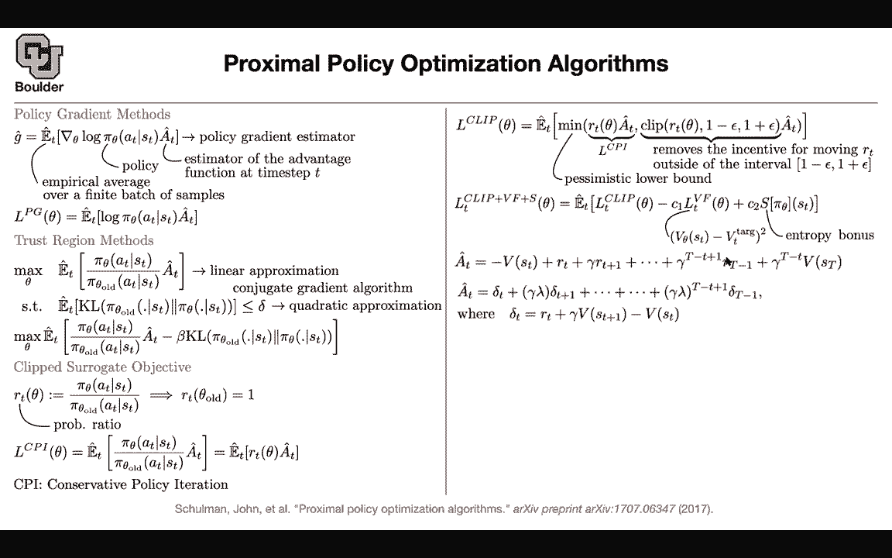

# P188：L82.3- 近端策略优化 - ShowMeAI - BV1Dg411F71G

Now we can move on to continuous domain we are still doing policy optimization for policy gradient methods。

 this is just a quick recap you have an advantage estimator then you're going to do policy gradient this is an upper estimationation to the gradient of your expected future rewards this is what this gradient is this termji hatt policy is where you're putting your policy network and then this guy you're going do Monte Carlo on a finite batch of samples and as soon as you know your gradient you're going to be able to update your policy。

But you are not going to encode up your gradients in modern softwares。

 modern frameworks like pi tors or Tensorflow what you're going to model is you're going to write down a loss and then then tensorflow is going to take the gradient for you so you are only going to write down your loss function and this is your loss function based on that gradient so this is our last function we covered PRPO trust region policy optimization the quick recap of that we know that there is theoretical reasons for the KL divergence to showing up but in the end if you look at the trust regiong method and if you ignore these kL divergence。

 what you have up there it's very similar to what you have if you take the gradient of this objective with this spec to theta you are going to get the gradient of this pi of theta divided by pi old and what is the gradient here。

 the gradient of the log is the gradient of pi。

ided by pi so the only difference is that you're putting a pi oldt here rather than the new pi so in terms of objective it's very similar to before as soon as you take gradients。

 these gradients are going to be very similar to each other assuming that you didn't change much you didn't change your pi old you didn't change too much compared to your pi old and that's why you have this kL divergs。

So that you don't change too much we respect to pile so is this point clear it's clear that the gradient is similar is it being done for some good reason for good reason the good reason is that we went through the trust region policy optimization algorithm and this is an objective that we came up with yeah okay why am I going through this because these two are actually very similar we came at them from two different perspectives but they are actually very similar to each other Okay so there is good reason for doing trust regiong policy optimization and we saw that there is theoretical reason for doing it we went through this paper and if you remember we did linear approximation to the objective quadratic approximation to the constraint and then we use conjugate gradient algorithm to optimize that so this we saw before you can rewrite that in terms of a penalty you take your constraint and put it as a penalty in your objective or we can actually get rid。

That and get rid of this beta and look at this term this is going to be called and then what we are going to do is go through clipped surrogate objective but let's reformulate the objective here if you rename that and let that to be our T of theta so I'm just renaming this guy it's new notation and this is just a probability ratio if you're located that theta old your ratio is going to be one so all we want to do is we don't want to deviate too much from pi old that's the whole objective here if you do only CPI and CPI stands for conservative policy iteration you're going to get rid of this beta and then you're going to optimize this objective but we know that there is no guarantee for R of T of theta to be close to one because that's what we want we want this guy to be close to one we want these guys to be similar to each other we don't want to deviate too much from the old policy this is going to deviate there is nothing stopping it the idea。

PPPO proximal policy optimization is to enforce this to be close to one and we're going to see how this is really smart whatever you're going to do if your R of T of theta during training falls above one plus epsilon or below one minus epsilon clip it just set it to be one plus epsilon or one minus epsilon this way you are removing the incentive for R to to be moving outside of the interval one minus delta and one plus delta because as soon as it moves out you're not going to see so your gradients are not going to get updated so you're going to kill this term and you're going to focus only on a but there is also another catch what you're going do why are you taking this minimum remember in the end you're solving a maximization problem whatever L clip is it's going to be bigger than or equal to the CPI loss。

That we just saw the CP objective it's going to be bigger than or equal to this guy and also bigger than or equal to this clip term times your80 so it's going to be bigger than or equal to one plus epsilon  A1 minus epsilon 8 all of those terms So it's just a pessimistic lower bound for that objective if you maximize this you're maximizing this term at the same time you're removing the incentive for your R to be far away from one so this is really smart your first clipping it and then putting a pessimistic lower bound and the actual objective function that you care about but not only you do that there could be multiple other parts of your objective the main one is this clip the other one is you have a value function that you want to match your target value Why do you need this because in your advantage this V of theta is going to show up so you are going to do a regression on that and the same time you want to encourage。

Exploration through entropy maximization and remember this term you are maximizing this term you are maximizing and because of this negative sign。

 you are minimizing the mean squared error between the actual target value and your neural network but what is your advantage this we saw before that because you're going receive rewards that are spars not only you can look at only one reward。

 but you can look at some other rewards into the future and this term minus this term is going to give you your advantage and this is exactly where V of theta is coming in you can make that estimate this estimate that you have here for your advantage because of these summations has a huge variance so it's gonna have a high variance but it's going to be of less bias it has very little bias but higher variance you can go to the extreme you can rewrite these formula using the telescope rule。

And write everything in terms of the deviation of our T plus gamma VfSD plus1 minus v you can write it in terms of your delta and you're just looking one step into the future so this I'm going to live as an exercise of how you can do it this is true when lambda is one as soon as lambda is one these to our equivalent but why are you introducing lambda here because if lambda is0。

 you're only taking a look at this guy， this is going to have this is going be a very bad estimate it's going to have high bias。

 it's going to be a biased estimate but then it's going to have lower variance by introducing this lambda here which could go from zero to one we can expand the entire spectrum and balance the trade of within bias and variance so this is going give you a better estimate for your advantage and in terms of your algorithm I just explain everything there is no reason to go into more details you run your old policy in your environment。

You compute your advantage estimates， and then as soon as you compute them。

 you can write down your loss function。 So the main contribution is here。

 the way that you remove the incentive for moving outside of the interval from1 minus delta 1 minus epsilon to one plus epsilon and the reason for doing this is because we want R to be close to1 and R。

 we want it to be close to one because we don't want to deviate too much from the old policy Any questions。

