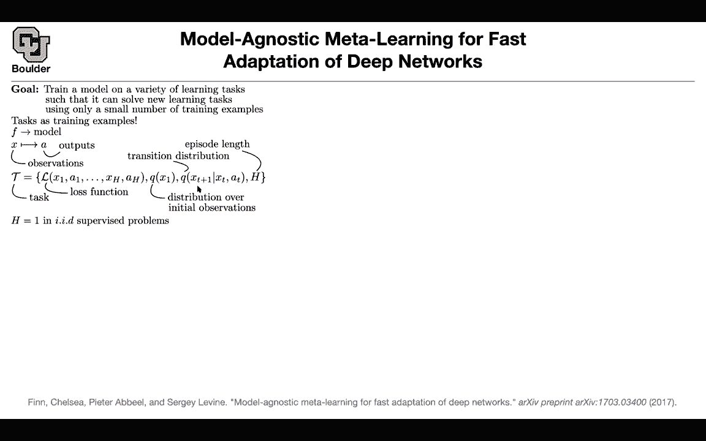
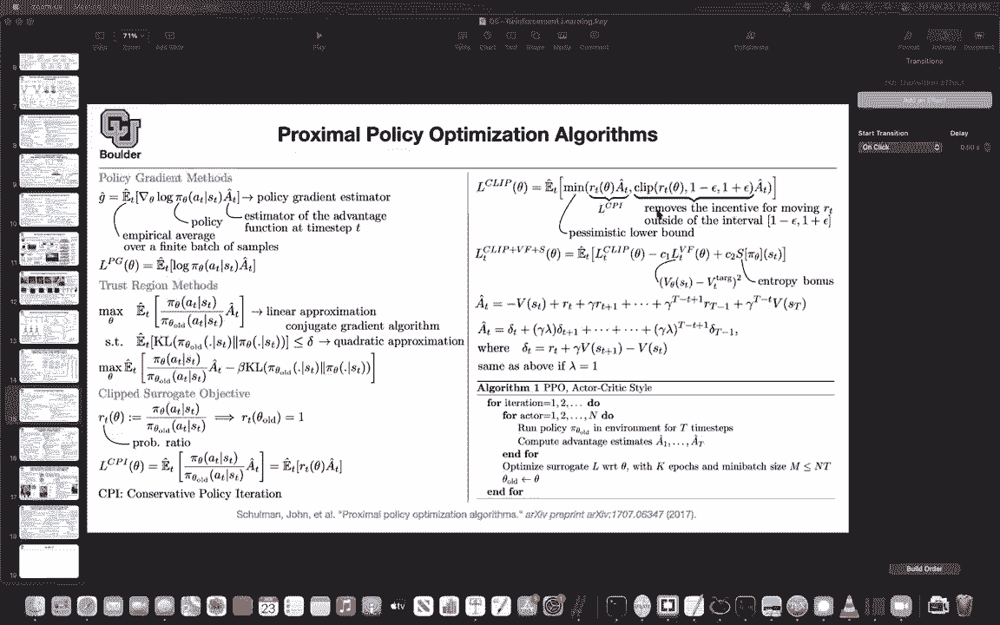
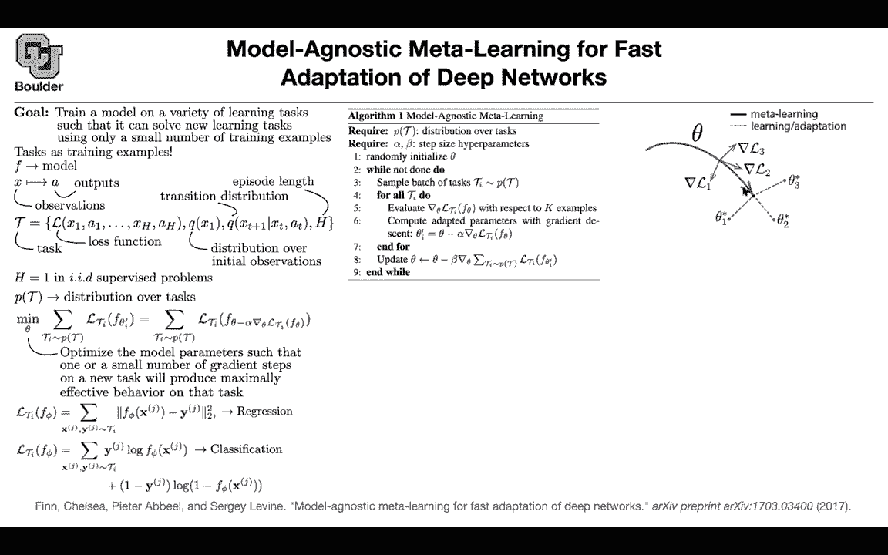

# 【双语字幕+资料下载】科罗拉多 APPLY-DL ｜ 应用深度学习-全知识点覆盖(2021最新·完整版） - P189：L83.1- Model-Agnostic Meta-Learning - ShowMeAI - BV1Dg411F71G

So far we were learning from only one task so our now we are moving towards general AI because if you think about a human。

 not only they can tie their shoes， they can read they can listen they can do multiple different tasks together so far we are focusing only one task and designing our intelligent agent for being able to do single tasks at a time now we want to move beyond that and there is also one other thing that a human can do very good is that they can transfer their learnings from one domain to the other domain using very few examples can we move towards that aim and this is the idea of meta learning you want to train a single model on a variety of different tasks and then as soon as a new task comes in you want your agent to be able to adapt really fast and learn from small data we can think of this also as a few shot learning approach。

To be able to learn from few examples few shots What is the big idea is that you can train your tasks as training examples we are going to have a single model that is going to take as input observations and it's going to do some output and we are going to consider not only supervised learning but reinforcement learning under one umbrella by defining what is a task what do you mean by a task to define a task you need to define a loss function or an objective function you need to put a distribution on your initial observations you're going have some transition distributions and you're going to have some episodes This is what you do for reinforcement learning X1。

 you take an action X2， you take take corresponding action until the end you write on the loss function you have some initial distribution you have some transition distribution and then you have some episodes of how many times you're going to be living in that environment if H is one。

You are doing supervised learning okay so under one umbrella you can do reinforcement learning and supervised learning I think it's a good time to stop and let you guys ask questions and for those of you want to leave we can leave so with h equal to one we're just saying that。

That we just do like one we have like an initial state and we make a decision and we know what the outcome is from there so our episode length is only one action Yes。

 for supervised problems， there is no sequential nature Okay。

 so you just decide what's going to be your。Because you know the reward yes。

 because you know your label and the other thing is that your actions don't affect your environment so there is no transition to the next state your data or IID but here your actions are going to have an impact on your state on what you're going see next when you do reinforcement learning yeah last session we covered proximal policy optimization which you can think of it as an extension of the trust region method it is still a policy optimization framework and then you wanted your new policy to be in a neighborhood of the old policy this you can do it using trust region which was a little bit more complicated because you had to do linear approximation can't you get gradient algorithm and then quadratic approximation to your constraint this one is much simpler you just define R to be this fraction here and then you want to enforce R。

To be around one and the way that you do it you're gonna remove the incentive for R moving outside the interval 1 minus epsilon and epsilon in your objective then we moved on to model agnostic metal learning Why am I including meta learning here because so far most of the reinforcement learning frameworks that we went through or even the supervised learning frameworks they required a lot of data and somebody might say we as human need much less data compared to what you're using to train your neural networks and then a counterarment is that we as humans or multitask learners we are very good at transferring whatever that we learned from one domain to another domain from one task to another task and the idea is can we mimic that behavior can we formalize it somehow and train our neural networks。

Do multipleultiple tasks so the objective is that you want to train a model a single model on a variety of different tasks and then as soon as a new task comes in。

 you should be able to adapt really fast using using very few training examples so you can think of this as a few shot learning framework the big idea is that you're gonna to treat your tasks as training examples So each task is going to be a training example of its own and each task is gonna to have a bunch of training examples in itself and the model that you're training let's call that F which is going to take some observations and it's going to output some outputs this could be actions and this could be your policy or this could be just what you do for your supervised learning where you have supervision supervision or label data on a so under one umbrella you can define what we mean by a task。

We can formalize it A task is just a set of these four objects。

 You need to know what is your last function or your objective function you're gonna look at observations take some actions go to the next state take some other actions etc and do that for age episodes you can have some initial distribution for your data or your initial state and then you have some transition distribution that takes you from one state to the next state and if you are doing reinforcement learning your actions are gonna have an effect on what you're going to see next so this is for reinforcement learning under the same umbrella if you set H to be one so you have only one episode that's going to give you supervised learning you have a loss which is a function of X and a you have some initial distribution for your data and then there is no next step so under one umbrella。

 you can define tasks supervised or。Enforcement learning this is neat and then you're gonna have a distribution over tasks that's what we mean by tasks being training examples so you can have multiple different tasks task one task two task three etc and each task is gonna have its own training data because you have an initial distribution and this transition distribution so let's go back to the objective first of all you want to train a single model and then you want to train it on a variety of different tasks so task one task two task three task four and what is your objective you want to be able to adapt really fast to new observations and new tasks so you want to generalize to new tasks if you have only one task you would parameterize your decision your model by let's say a run network you would take gradient of your last function and then you would take gradient step gradient decent but now you have multiple。

And the idea is that you want to put the parameters of this model in a sweet spot so that a couple of iterations of gradient descent on any new task is going to give you a good performance so the idea is that you want to put the parameters of F in a sweet spot and this is the way that you're going to do it you have some loss function for each task so each task is going to have its own loss function and then your entire metal learning objective is going to keep sampling from that distribution on the tasks so now you're sampling from different tasks and then adding them up and what do I mean by putting your parameters in a sweet spot these are your parameters of your model by sweet spot I mean if you take one step in the direction of the gradient or in the opposite of the direction of the gradient this is gradient descent it should give you a good loss function。

So we are anticipating what we want to do next from this task what do we expect we want one step of gradient descent to give us good performance to give us good loss so you're anticipating what you want to do with your task what you expect you want it to be able to adapt really fast but now you have an objective it's a meta learning objective that you are minimizing again so you're taking gradients twice one time here and then another time when you are minimizing this objective this meta learning objective and it's exactly this observation that you want to optimize the model parameters such that one or multiple steps of your gradient descent on a new task we produce maximally effective behavior on that task so basically your objective is to adapt really fast to new data to be able to learn from few examples this is going to be clear when I show you a figure but for now let's。

malalize this a little bit more and let's take a look at an example for regression your loss function of your model is going to be the mean squared error between the predictions of the model and your observations your labels for classification this is between two classes you can have multiple classes and then you're going to put a softmax but here this is gonna be your objective when you' are doing your classification The big picture of the algorithm is that you have a distribution over tasks you have two learning parameters or hyperparameters one is alpha the other one is beta when you're taking gradient steps or doing gradient descent on your meta objective how does it proceed。

 you sample a task so you're focusing on one task or multiple task this could be a batch of tasks that you're focusing on and then for each task you're going to go ahead and compute the gradients of your loss function and then let's say you have another。

You're sampling another mini batch from your data from your initial distribution。

 you compute a gradients， you create theta prime， which is what you're anticipating to happen after you perform your gradient decent and then another round of gradient descent with another learning theta on your meta objective visually speaking the objective of meta learning is not to be good at all of these tasks its objective is to put your parameters in a sweet spot so that as soon as some new data comes in a new task you can adapt really fast to that task so the objective of meta learning is to put your parameters in a good location and then you can do this for supervised learning these types of problems regression and classification or you can do it for reinforcement learning for regression what's gonna happen you pick a task you sample some data so this is for both regression and class。

You have input output data， you evaluate your loss on that data and then this loss。

 you're going use these two objectives so equation two is here the regression equation3 is the classification you compute your gradient and then you sample some new data set these are your test data for that particular task so you sample some test data and then based on that test data you' are going to look at the performance of each of those individual models for this particular task and then you do gradient decentcent over there that's for supervised learning for reinforcement learning it's very similar but now your data in the form of sequences x1 action x2 the corresponding action etc based on your policy and your environment you compute the gradient you adapt you anticipate what's going to happen if I take a gradient step and then you sample a new。

Trajectory based on this guy Theta prime you look at your performance this is as if you're testing your agent in the environment you compute the corresponding losses add them up for all of those different tasks and then update the parameters any questions and have a quick question sure I just want to verify something so the inner loop when we sample data points we only sample form one task at a time so well have that corresponding loss right we not sample form multiple tasks so it has you have two four loops here one is iterating over the tasks。

And then the other for loop is you focus on that task and then you sample data from it so I mean that second one the inner one only data that and use that particular loss yes so the inner loop corresponds to anticipating what's going to happen if you do gradient and decentcent for that particular task and then the outer loop is for you to actually update the parameters using the meta objective function so for the small inner learning rate alpha will get roughly the same result if we just optimize the model to do well on all tasks right if you focus on one task and if you use that alpha for this inner loop yes you would get the same performance if you do gradient and decent I'm not sure I'm understanding the question Well I was just thinking how much added benefit you get for having this sort of inner loop thing because like Prince。

If I just set alpha to 0， then this would be the same as training my model to get to a point where it is averaging the performance across all tasks and is doing gradient descent on that objective。

 So I guess I'm wondering if this added complexity of saying。

 I'll take a small gradient step as well is actually adding that much benefit。

Well yeah it's adding a lot of benefit this meta objective is not for you to be really good at all of the objectives。

 all of these tasks it is saying that if I apply great and decent on that task how much am I going learn so the objective here is to put your parameters in a good location in a sweet spot if you set alpha to be zero you are creating a model that is good at multiple different tasks so actually this is crucial having alpha to be non-zero we could have a model that was horrible at all tasks as long as it could quickly become good at a target task Yes。

 so that's a perfect way of putting it so this model could be really horrible at solving these tasks but then it's really quick it's a quick learner from very few examples it's going to adapt doesnt answer your question yes。

I had one other question as well which was this sort of general task framework I guess like down here we have these like this few shot supervised learning and then also for reinforcement learning but this general model seems like it could apply to like supervised learning and reinforcement learning that you could have your model be good at adapting to both but is that unreasonable given I don't know does that make sense No you're absolutely right for instance you can your agent this supervised learning problem if you want to think about it in terms of reinforcement learning that's gonna be imitation learning okay so you just have a policy that is imitating what a human would do and that's label data for that task so yes you're right this is very generic so you don't have to focus on supervised and then reinforcement learning you can focus on both of them in one framework Okay thanks yeah so one of your tasks could。

reinforcement learning the other task would be classification and that's perfectly fine。

 Any other questions and some one minor detail before we move on is that if you look at this youre taking the gradient of your objective So there is one gradient and then theta I prime there is also another gradient over there you have two options one is to apply the gradient on top of the gradient and that's going be costly it's doable but it's going to be more costly or you can just fix that you can put a detaach if you' are doing ptorch or you can just do stop gradients if youre doing tensorflow here so that the gradient you are not taking gradients on top of gradients and then that's going to be faster so that's just an implementation detail it's going to be faster you are not taking into account the second order effects so it's just the first order approximation for the sake of it being faster。

In that case we can move on and for the objective here I'm mentioning equation four equation four is basically your expected future return or expected future reward when you are doing reinforcement learning and then you are taking your actions based on a policy。

