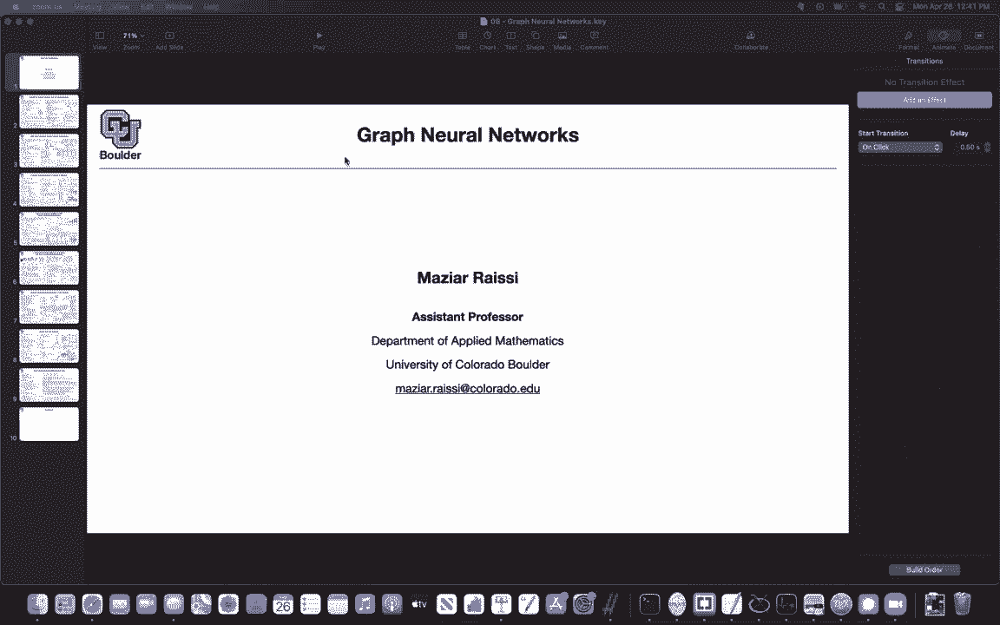
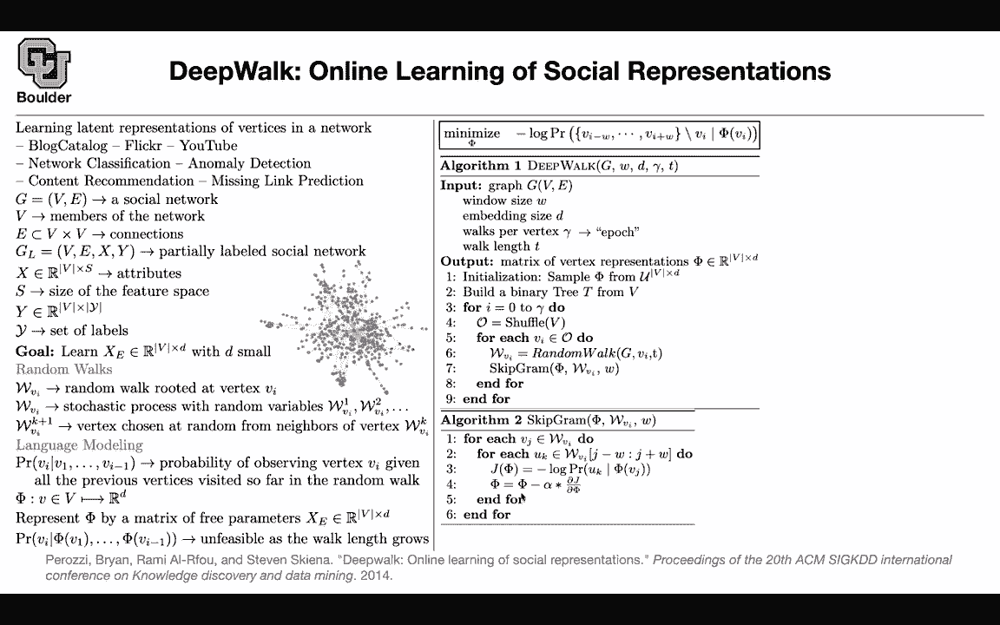

# P192：L84.1- DeepWalk算法 - ShowMeAI - BV1Dg411F71G

Let's get us started and the topic is about graph neural networks and it's unlike the type of data that we have seen so far so the type of data that we have seen so far you could put that or put them on a grid for instance if you had an image you could represent it by a tensor if you had text you could represent it by a sequence of integers if you had speech it would be a sequence of vectors but how about graphs graphs are going to be like this so it's very hard to put them on a regular grid but they have a lot of applications what we want to do is exactly similar to what we did for text we want to associate a vector to each one of these nodes so a graph is going to have a bunch of nodes it's gonna to have a bunch of connections and we are going to make very little assumptions about the graph for instance we are not going to make too much assumptions about。

Each one of these nodes we are going to assume that we only know their ID so these are a bunch of integers maybe this is the first node of the graph。

 the second node of the graph etc and then for instance node1 and node one or one are connected through a graph through an edge and we want to turn each one of these nodes into a vector similar to what we did for text and we are going to borrow a lot of ideas from textual data where do you see graphs you're going to see them for instance in block catalogs or Fler or YouTube or LinkedIn or Facebook or protein etc that's where you're gonna to find them so they are omnipresent and what type of tasks you can do with them you can do network classification where you have multiple of these networks and you want to classify each one of them as belonging to one category or you can do anomaly detection you can do content。

Recommendation or missing link prediction I guess this last one should be very easy to understand for those of us who are on social media。

 for instance on Facebook， we sometimes get these recommendations that go ahead and connect to this other person and these are missing link prediction It's saying that there should be a link between this node and the other node so how do you represent it how do you make it mathematical each graph you're gonna have a bunch of nodes or a set corresponding to the node and you're gonna have edges V is gonna to consist of members of the network These are your nodes and E are gonna be connections between the nodes so it's gonna to be a subset of V class B sometimes you could have extra features for each one of these nodes for instance if you're connecting to Facebook you might be connecting from a location in China and that location could be a feature for instance you're connecting from Beijing or this could be the age category of the person。

Who is connecting or the language of the browser that they are using or the browser that they' are using to connect or the app that they' are using to connect X could be features and y could be labels and the problem is that for some of these there might be missing labels so you might not know what is the corresponding label for that particular note so it's partially labeled so you might have S features like the type of features that I mentioned S is the size of the feature space it's the dimensionality of your feature space Y are the corresponding labels and you might have absolute value of the set y number of labels but for the sake of these topic we are going to ignore X and we are going to ignore y for y all you want to do is we want to assume that each one of these are just IDs they are just integer so we don't know much about their features so we are going assume these are just integer this is。

P， person two， person three。On Facebook， etc。 But then we want to encode the network structure or the way that you're connected to each other in a vector。

 So we want to turn each one of these nodes in a vector。 So in the end， you're going to get a matrix。

 It's like a word embedding matrix。 V could be the size of your vocabulary。

 So this is just analogy to text。 And this is a dimension of those vectors for each one of your nodes。

 And because there are a lot of analogies between graphs and text。

As I was going through it we need to somehow find a way to turn a graph into a sequence and one idea is to do random walks on the graph you started a node and then you randomly watch for a couple of steps on your graph based on the connections and based on your edges so a random watch you're going to start at a vertex let's say these vertex and then you're gonna randomly walk so this is gonna be a sequence so it's just a stochastic process of a bunch of random variables the first node that you visited the second node that you visited etc and what is W VK plus one it is the vertex that is chosen at random from neighbors of the previous vertex and VI is just your root node where you started now you get a sequence or you can get you can generate multiple sequences based on your graph you just randomly。

Pick one of these nodes as your roots， we create a sequence。

 It's gonna to be a sequence of integers and we know how to handle sequences of integers。

 These are like our text data。 These are like sentences So the idea is that you want to apply language modeling to these sequences given the previous vertices what is the probability of visiting the next vertex vertex these are all integers。

 we want to define a mapping that takes us from integers to the space of vectors in Rd and what you can do is you can represent p by that matrix that we just introduce up there because then you can read of the rows of these matrix and that's going to give you your representations for each of these vertices but this is not feasible we know that from our language modeling because as the length of your what grows you're gonna have a lot of sequences here and it's going to be hard to write a model for it but then we said what about。

Pickking a note。And then predicting the context around that word。

 this is doable and we did it for languages and it was the escapeG model given a word predict words in the context and this is exactly what you' are going to do here on your graph as well the algorithm is going to be called deepwa it needs to know what is your graph structure so it needs to know what is your vertices what are your edges you define your context size W you define your embedding size。

 these are your hyperparameters you define the sizes of the vectors that you want to end up with you need to have a concept of epoch and here because your data。

 your sequences are being generated on the fly you have full control over your epoch and this is going to correspond to the number of walks per vertices so epoC is the number of times that you see a data point in your training data while doing training how many times do you visit the same data so it's the same thing how many times you visit the same。

Thanks。And then you define the length of the w that you want to generate from your graph。

 you randomly initialize your fee matrix fee is exactly X。

 so it's just a another name for it you initialize it uniformly I'm going to tell you why you need to build a binary tree shortly so don't worry about step two but then you do it for Eta epo epoX。

 you generate these many w， you first you first shuffle your vertices。

 you pick your vertices from that shuffled list， you generate a random w for that vertex and then you apply a skipgram model from language modeling or word embedding and the escapegram just a quick recap so you want to predict given a word or given a vertex you want to predict vertices in the context so one of those you're gonna write a probability model for it that's going to be your maximum。

Likelihood or this is going to give you last function that you can use to optimize the parameters of your parameters。

 basically your word embedding or node embedding so there is an underlying assumption here this likelihood up there you are making an assumption that if you know your word the context is going to be independent so you' are making a strong assumption there and we were making the same assumption when we are doing word embeddings so this is fine and this is because then you can take a log and turn this product into a summation and things are going to be very easy to work with after this assumption so you are making two assumption one is here that given a word or given a vertex you are predicting the context and you're making the assumption that your context are independent from each other conditioned on the vertex that you chose but then I mentioned you need this binary tree and we know why we need it。

there could be the size of V could be huge this is actually the size of your dataset set so it's going to be huge it is going to be the size of the network so you're going to do hierarchical softmax because softmax is going to be expensive and what is the idea of hierarchical softmax just the quick recap rather than putting a softmax on your vertices which is going to involve a summation over all of the data points in your graph you're going to simplify it and say it's going to be a product of probabilitybabilities of going left and right probability of going left right left is going to give me the probability of V3 being in the context of psi of or phi of V1 and this is how you simplify your softmax you do hierarchical softmax now the cost is going to be log of the size of V rather than the size of V for evaluating this probabilitybabilities so you're evaluating this probability faster and this is。

Your root is going to be where you are now， is going be be0 and then as you traverse your tree and you reach a leaf node where your actual nodes are that's going to be your UK the last word that you're interested in or the last node that you're interested in This is a formula for a sigmoid these are a bunch of binary classification tasks and then for each node in this tree。

 you're associating a representation So these be covered when you are doing text So these are just quick recap and then you can also do half my coding to make things faster the nodes that are more frequent youre gonna to associate a shorter path to them so you associate a shorter path and what what do I mean by frequent you frequently visit them in your random walk and then your parameters are gonna be phi andsi size are for these nodes and fees the actual node representations is this matrix。

That you are interested in now that you have a matrix basically your data is now tabular this is going to be your input to your classifier Y is going to be the output of your classifier and then you can do a simple logistic regression and that so what's the question so is the。

The independence assumption essentially then that in the context of graphs that like each node。嗯。😊。

I guess would it be every like cluster is independent and it doesn't there's no global structure to this graph that we can learn it's just one node and its neighbors that we can learn from not really the independence assumption tells us that if you pick this node and conditioned on you know knowing the representation of that node visiting this guy is independent from visiting the elect guy okay sos that's way it means but independence in like the walk that we do Yes is conditional okay if you know where you are you have you can visit this node and that word note and this note independently with independent probabilities they don't have to be equal but they are going be independent yeah。

And one other thing you are actually encoding the network structure in this matrix that's what you're doing through this process Okay you are encoding the neighborhood structure of the nodes based on your edges because this node here there is no way for you to visit it in your random watch okay depending on the length of your T whether they are connected disconnected so you're actually encoding the structure of your graph in this matrix okay that's why this is a smart how big is the walk length that they generally use so that one I want you to that depends on the data okay so I cannot answer it these are the hyperparameter that you're gonna to control so what is the walk size what is the dimension of the embedding etc and they depend on the data okay so it's going to be different from one data set to the other one so I cannot answer it。

