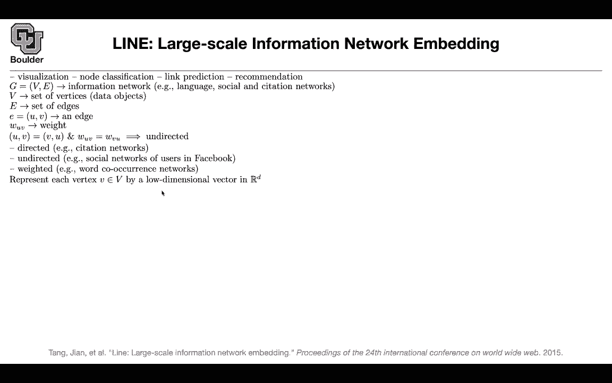

# P193：L84.2- LINE模型 - ShowMeAI - BV1Dg411F71G

Let's move on the previous one you can associate it to word vectors or the word vector paper word tobe this line method you can associate it with glove or you can draw analogies to G and we're going to see why because this is based on the global statistics of your graph so in terms of applications you can use graphs for visualization not classification link prediction recommendation etc these are usually information networks like language like social networks like citation networks this author is citing the other person or the other author is citing another author or these paper is citing another paper etc these are going to give you networks these your set of vertices edges you have your edge the previous paper it was about unweighted graphs now we want to move towards weighted graphs and the previous paper was。

Directed you can also work with directed graphs so undirected is when you switch the roles of your edges it doesn't matter they're going to have the same weight on your edge for instance a directed graph is the citation networks one author is citing the other author but the other author is not citing you back or one paper is citing another paper。

There is no reason for the other paper toste you back okay undirected like social networks of users in Facebook for Twitter you are following somebody there is no reason for them to follow you that's directed Facebook is undirected weighted could be how do you weight them like the number of times that two words are coocring in your sentences could be a weight actually it can treat your text as graphs through the word occurrence network and again your objective is to represent each vertex by low dimensionsional vector in RD and we are going to treat these as integers and you want to define that mapping that takes you from integers to RD to the space of vectors so these concept is very important for line you can have first order proximity in your graph like six and seven or first order close to each other because there is a direct edge between the two five and six our second order close？

Because they are not directly connected but they have shared neighbors they have multiple shared neighbors actually so as soon as you have at least one shared neighbor your second order close to each other so now you want to write an objective that's gonna encode code first order proximity and second order proximity so first order proximityities for undirected edges and second order could be for directed edges we're going see next let's speak to vertices and you want to write down the joint probability between vertex V and vertex Vj maybe vertex8 and vertex4 or vertex 6 and vertex 7 we can model that you can say I have a word vector for V or I have a vector for VI I have another vector for VJ that's called that UJ so you have UI and UJ you multiplied and together and then you push that through a sigite that's going to give you a probability and UI。

I going to be the word representation or the vector representation of your vertex NP P P1 is going to introduce a distribution over v times V。

 We know the global statistics of our graph that's going to give us an empirical counterpart to P1 and then you can minimize the kL divergence between p1 hat and p1 and optimize for these parameters but what is empirical counterpart of P1 you know the weight for instance the weight between six and7 is a stronger then the weight between7 and8 and these are the thickness of your line between the two or the thickness of your edges you take that weight and you divide it by the global weight of your graph so you add this weight plus this weight plus the other weight all of these weights you add them together that's going to give you capital W now this is your P1 hat the rest of it is kl divergence between the two once you write down the formula。

for kL divergence， get rid of the constants or ignore the constants because they don't impact your optimization you're going to end up with something that looks like crossantropy。

 these numbers you know these are the global statistics of your graph。

 you know what is the weight between vertex VI and vertex VJ and these P1 you model it and this is your model and then you are optimizing over UI and UJ or the corresponding matrix if you put those in a matrix。

That is going to encode first order proximity but we know that the structure of a graph。

 it's not only about the direct connection between edges。

 it's about indirect connections as well how do you encode that the idea is for each vertex you associate two identities or two representations so they can play two roles it could be the vertex itself like UI or it could be the context of other vectors for instance a person could be that person him or herself or it could be the brother or sister of somebody else so they can have two different roles they can play two different roles in the society it's the same thing here Why is it useful because now V is going to correspond to UI it's going to correspond to you yourself to the vertex itself and U bar J is going correspond to the context and we know that the context matters and then you can write a softmax。

Over all of the vertices showing up in your graph and that's going to give you a probability Now you model the probability of VJ like node1 showing up in the context of node 5 So you just model it now that you have a model you look at your global statistics and then you can minimize a distance between the Kl divergence or whatever other distance that you choose between the empirical and the actual model that your wrotes This is over all of your vertices and then you can associate importance to your vertices for instance。

 maybe some of the vertices in your graph or more important because they have more weights。

 more edges coming out of them For instance this could be the degree of your node so they have more connections in your network that could be the importance that you associate to vertex V but what is this D and actually what is this P had This is gonna be the weight between two nodes。

Divided by the out degree so the out degree of node6 you need to add these weight plus these other three weights that's going to give you the out degree and then you divide this number by that summation that's going to give you your empirical counterpart for P2 and this is exactly what I just mentioned you look at your neighbors and you add up the weights you look at your neighbors at this weight plus that weight。

 this other weight and this other weight that's going to give you your out degree Now again you write down your kl divergence ignore the constants you set your lambda I to the actual dis your out degrees and then you get a similar formula to what you have down here the only thing that changed is this P2 the model that you wrote down now you have more parameters you have UI and Ui bars we know that computing the softmax is going to be very expensive this softmax here is going to be very expensive because of this summation over the entire。

s and we have a quick trick for that we used it before。

 This is the negative sampling or noise contrastive estimation。

 You show it a positive example and you show it a couple of negative examples so theseks are gonna to be negative and these are your sampling your edges sometimes an edge exist and sometimes it doesn't exist for those of them that don't exist you are sampling from them these are the negative examples and your positive examples are the ones that have connections So your negative samples are actually your edges there is no edge here that's a negative examples these are positive examples and you show it a couple of negative examples like you show it eight9 and 10 because they are not connected to6 and this we also saw it when we were doing glove for word vectors or word to8 we had this weird three over four rule we are gonna to use that again here and these your degree of that。

So your sampling probability is going to be proportional to this ratio to this number and then there is a problem with this loss function if you use it in practice and if you apply it on weighted graphs。

 we know that for a weighted graph， this edge is more important than this other edge because it has a higher weight。

 but if you use usual stoastic gradient decent， you are going to sample this edge as many times as you are sampling this edge。

 you are seeing it as many at equal times during training。

That's not a good idea。 It's gonna to make things very slow to converge what you can do is you can change your sampling strategy when you are doing mini batchching in your mini batches include edges that according to their weight according to their importance so that's a minor detail for how to train these types of vectors but then if you want to actually apply it on a bunch of data sets you can have the Wikipedia data these are language networks you can have social networks like Fler and YouTube or you can have citation networks and these are the actual statistics you have these many vertices for the Wikipedia data set and these many edges and these is the average dec for each one of your vertices this is a seven way classification and you have very few label data these many of them are actually labeled out of 1900000 you have。

70000 of them labeled and then you can do word analogy like how would you test a language model you can test or word vectors you can test your node embeddings here as well Deepwalk skipgram and then line is this method here I think i'm going move on to the next one Are there any questions What does it mean by word analogy in this case it's very similar to what we did for text it's like the relationship between Paris two France is similar to Berlin to what and then it needs to give you Germany oh and you're just doing that on the the titles of the Wikipedia page and。

Using the graph embeddings to compute that that yes okay cool you you actually have some data sets for word analogy but the idea is that you can treat your text as graphs because of these coac network as soon as two words appear in the same sentence you the coaccur ones so you increment their coac by one okay these are the weights between your nodes and your words are actually your nodes and your coac weights or your edges are the coac these two words coaccur in the same text any other questions Okay perfect。

