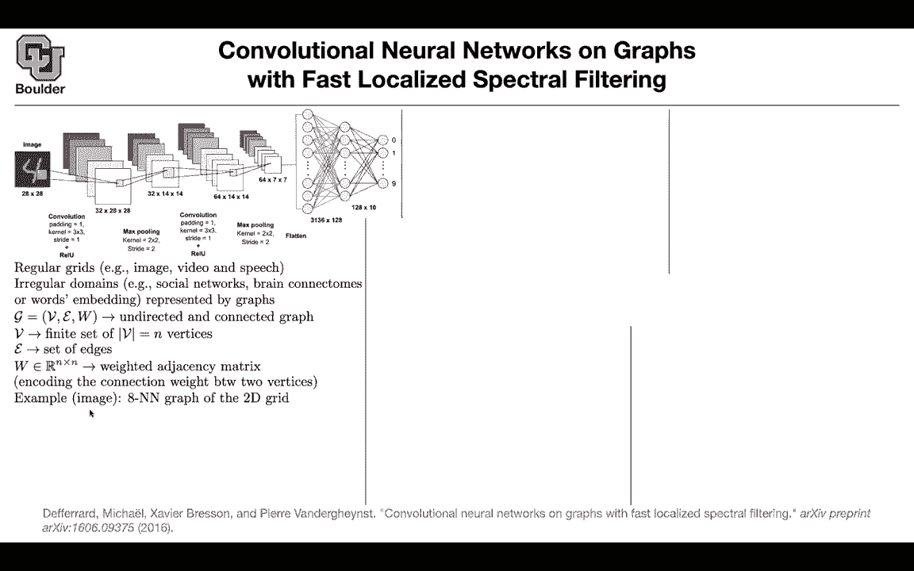

# 【双语字幕+资料下载】科罗拉多 APPLY-DL ｜ 应用深度学习-全知识点覆盖(2021最新·完整版） - P196：L85.2- 快速局部化光谱滤波 - ShowMeAI - BV1Dg411F71G

Now your task is very similar to what you do for images。

 you have an entire graph as your input and then you want to classify that graph and then your data are going to be multiple graphs and for each graph you have the ground truth you have the ground truth label so now you are operating at the graph level so far we have been operating on the node level you are classifying our nodes in a single graph now you're operating at the graph level。

Let's take an image actually an image you can turn it into a graph and I'm going to tell you how and it's going to give us some intuition of why we call this convolution something like an image or a video or a speech or text you can put that on a regular grid for the irregular domains like social networks brain connectums or word embeddings you can represent them by a graph or by multiple graphs you have your graph nodes edges and adjacency matrix this is your node you have n nodes you have edges and then you have your adjacency matrix and then you can I said that you can convert an image into a graph how let's say you want to do three by three convolution that's your kernel size so let's say the size of these guy is three by three so you have nine pixels in that window the pixel in the middle is looking at eight other pixels so it's connect it to eight other pixels so you can have。

8 nearest neighbor graph for your 2D images so you can turn an image into a graph。

 How many nodes are you going end up it you're going to end up with 28 square because each node is going to look at its edges its neighbors through edges through connections and then you have 28 by 28 pixels and then at the same time you need some fake nodes because as you do your convolution from one iteration to the next from one layer to the next and if you want to keep the same pixel size in the next layer you need to do zero padding and for those padded elements you're going to add some fake nodes in your graph and then you're gonna to have edges connecting them and this is going to be the number of edges that you're gonna to end up it each node is going to get connected to8 other nodes in terms of your adjacency matrix because in a convolution it matters the distance between this point and these other point it。

And then maybe the further you go from this point， the less weight you need to associate to that relationship。

 that edge， maybe it's a good idea to use a squared exponential kernel here。

 What does it say the distance between two points these are the actual coordinates If they are far apart from each other because of this exponential and that negative sign。

 the relationship is going to go to zero So the weight that you're the importance weight that you're putting on the edge between node I and node J is going to go to0。

 the further these two points are apart from each other。 and then for each pixel。

 you have a value So for each node you're gonna have the corresponding intensity of that pixel it's a number from0 to 255 whatever that you do you have a signal on a graph and for instance。

 this could be an image and your X， if you flatten it out it's gonna to be a vector in R。

NN is your the number of nodes that you have in your graph。

And the way that you interpret it each element of that vector is the value at that node so these are your pixel values now we want to do convolution this concept I introduced it in the in a framework that you know about you know about images and you know that you can turn your images into graphs but then you can extend this you can go beyond images you can go to social networks you can go to gene data and biological networks。

 telecommunication networks like 5G you can do text documents for word embeddings etc what we want to do is we want to introduce convolution and we just saw that it has to do something with laplaian let's see why we introduce the degree the degree matrix it's a diagonal matrix which is the summation of your weights。

 the rows of your adjacency matrix then the combinatorial definition of the graph lapplian is what we just saw it's d minus W you can have a normalized definition。

Wwhich is you're multiplying D from you're multiplying L from left and right by d minus1 half so this is going to be identity minus d minus1 half w times d minus1 half and this is a normalized definition now you're starting to see why in the previous paper we were working with D minus1 half w d minus1 half okay now it turns out that L is going to end up being a real value matrix it is symmetric and it's positive semidefinite and for such matrices you know that you have a complete set of orthoormal eigenvectors so we can take a look at your eigenvectors and they're going give you a basis and they're going to end up being orthoormal so this is a typo it has to be L equal to0 up until n minus1 so you have n of those vectorctors and you have n corresponding eigenvalues and the cool thing is that you can actually sort them these are non negative。

And you can sort them according to their importance U you're gonna to call it a Fourier basis and this is where those ideas of those names spectral are coming in you can take these vectors。

 put them in a matrix you can take the diagonal of your eigenvalues put that in another matrix and then you can diagonalize your L your lapplaceia your normalizedize your normalized not plaia so what is the Fourier transform of a signal here you take your x you take an image and if you multiply it by u transpose that's going to take you from the real domain into your Fourier domain so x hat is now in your Fourier domain and you can go backward by using U u transpose is going to take you from real to Fourier and U is going to take you from Fourier to real and how do you define convolution why did you go through this trouble because we know that convolutions in the real domain are going to correspond to simple multiplications in the Fourier。

omainSo it's very hard to draw to define convolutions and graphs in the real domain。

 but perhaps if you go to the Fourier domain things are going to be much easier and let's see why so this is going to give you convolution you first go to Fourier domain you have to signals X and Y you have a convolution over a graph this is a definition。

You take Y， you go to the Fourier domain， you take X。

 you go to the Fourier domain and then you multiply them together so it's a simple pointwise multiplication Now you're in the Fourier domain you need to go back with U and that's going to give you a convolution and now you start to see why people call this convolution on graphs and what is a spectral filtering because you want to apply- nonlinearar operations on your graph and some good examples of nonlinearar operations are polynomial let's say G theta is a polynomial and you' parameterizing it somehow and I'm going to tell you how if it's a polynomial you can apply it on your L on your normalized La plus m and because you diagonalize it and because these are orthonormal vectors you can take G and apply it on the diagonal term only this is cool because now you can parameterize these G tla G theta function how for instance one example could be。

You pick a vector this is vector of your parameters， you put it in a matrix。

 you diagonalize it actually you put that vector on the diagonals of a matrix。

 and then that's going to give you some parameterized convolution now what you have here is just the diagonal of a vector of parameters there is a problem with this method this is nonlocalized in the space because what you have here。

 what you're going to end up here is going to be local in the Fourier domain。

 but as you go back to the real domain， this is going to end up being nonlocal basically any pixel is going to pay attention to everybody else on the image which is not good which is not what we want we want things to be local we want to have a small window。

And there is another bigger problem you have as many parameters as you have data points basically n is the size of your data so we want to be more efficient。

 we want to be more parameter efficient so one idea is to use polynomials and a good choice is chbyche polynomials the way that the chbyche polynomial work is that you start from1 x and then in an iterative fashion you're going to create your higher order polynomials the second order is just going to be two x squared minus1 and now you keep doing that in an iterative fashion these are going to give you your polynomials now rather than defining your convolution that way and parameterize your convolution that way you can parameterize it in terms of coefficients of these chbyche polynomials now you can have much less parameters you can have K terms in your polynomial so you can go up until polynomials of order K and now you have k parameter。

Okay we fix this problem the learning complexity is now K and what is this gamma tilda it's your original gamma it's your eigenvalues is this matrix here divided by the maximum eigenvalue so this is how you are going to define it and this is just a normalization constant we don't worry about it too much we solve this problem and we actually solve the first problem as a byproduct this is going to end up being localized in a space and there is actually a theorem in the paper that proves that so these spectral filters are provably strictly localized in a ball of radius k so it's very similar to what you do for your image we can think of k as your window size as your filter size in terms of graph it's gonna to be k hubs the first neighbor the second neighbor the third neighbor if k is3 and then you have much less parameters k is a hyperparameter that you choose it's very similar to your filter size。

or your convolutions on images and then Y chbyche polynomial because it's going to be very efficient when you this could be any polynomial but y chby Che because they're going be faster to evaluate X is your image and then you want to push it through a convolution you take your chbysha polynomials you multiply it by X and then these are the parameters of your convolution on a graph L tilda is very similar to yamma tilde so it has the same definition you're just replacing your eigenvalues by L now you can define this guy to be xk and this bar here doesn't mean you are taking a mean is's just the name of your variable it's going to give you xk you use the definition of your chbysha polynomials down here and replace everything by Xk wherever you have Tk you're going to replace it by Xk bar now you start iteratively you start with your image。

That's going to give you your x0 bar。 You apply your L tilder。

 This is just a matrix vector multiplication on your x that's going to give you your x1 and it's very similar to what you do for your chbyf and then the rest of it is just iterations of this guy It turns out that the computational complexity is very similar to what you do for images and convolution on an image the number of edges is going to come in and case because you are doing an iterative process This is the number of operations that you need to do not only you need to do convolutions you need to do max pullinging。

If you want to do convolutions on a graph， convolutional neural network。

 it turns out that it's actually not that trivial to do pooling operations on a graph。

 It's an NPR problem if you want to solve it， It means that you cannot solve it in polynomial time。

 but there are some greedy algorithms in the paper that tells you how you can do with the pooling operations。

Okay in the end let's apply this on the image dataset you can apply a classical CNN this is the best CNN available it's going to give you 99。

33 in terms of accuracy it's very high for you can treat your images as graphs and then apply convolutional neural networks on graphs and then that's going to give you this framework that we saw here and that's going to give you 99。

14 perfect in the previous paper I mentioned these words it's the first order approximation of a localized spectral filter on a graph we saw what is an a spectral filter we just sawte this is your spectral filter and what is the localized or localized here it means you're using these chbysha polynomials so that you end up with a K neighbors so we covered those what is what is first order approximation first order。

Approrximation is when you only keep the first two polynomials so when you set your k to be one and that's what it means by first order so you're looking at your first order neighbors so this paper and the next one are related if you keep the first order you're going to end up with a simple averaging okay so far so good。

