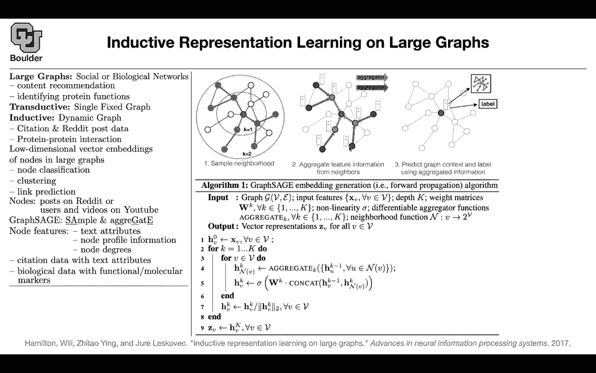

# P197：L85.3- GraphsAGE - ShowMeAI - BV1Dg411F71G

Let's move on， we are gonna still work with large networks。

 you can do content recommendation identifying protein functions etc。

 you can have two types of networks so now that we learned how to handle multiple graphs we are going to go back to working with a single graph and now our task is again classifying our nodes or link prediction those sorts of tasks so you have a single graph and then there could be a problem your problem is that your graph could be dynamic so it could grow dynamically like what you have on Facebook usually new users are going to get added to your network to your graph if that's the case it is going to be called inductive and the previous types of methods that we covered was for transductive where you have a single fixed graph and that graph is assumed not to be changing so you want to dev methods that are capable of handling both of these cases。

For instance， citation and rateit post data could be transductive and the pro interaction could be inductive。

Again you want to create low dimensional vector embeddings for your nodes for the tasks of node classification clustering link prediction your nodes could be posts on a social media un Reddit or your users and videos on YouTube the algorithm of these paper is going to be called graph s as sage is standing for sample and aggregate you're gonna to have node features which could be in the form of text attributes even node degree could be your features or ID1 hot vectors you're gonna have some node features anyways and then these are some other applications like citation data and biological data but what is the math why do you call it sample and aggregate your first sample K neighbors of this node this is the first step the second step is aggregating so you want to end up with a single vector for this node and then the next step is labeling or trying to。

erve the structure of your graph so this is in terms of the big picture don't worry about the image I'm going to go back and refer to it again What is graphage doing you have a graph you have a bunch of nodes and for each node you have a bunch of features maybe one hot vectors you set your K you say I want to take a look at my neighbors that are two steps away from me for instance or k steps away you have some weight matrices because without weight matrices there is not going to be any learning happening you have some nonlinear operations because your neural network needs to be nonlinear maybe value here and then you need to define some differentiable aggregator these operation here and then you need to know what are your neighbors and then in the end the outcome of these algorithm is going to be vector representations for your vectors for your notes。

You start the algorithm by your initial features， you do k iterations。

 you pick a node like the node here， actually we are in this step and then you aggregate its neighbors。

 you aggregate this guy， this guy and the other guy somehow and I'm going to tell you what are your options for aggregate so you have a step you're aggregateating Perhaps you're adding your vectors together you're taking the mean whatever it is that you're doing you aggregate your vectors and you put it here and then you apply your non nonlinearity and then you introduce your weights which are which are going help you learn and then you normalize your features and then you keep repeating so if your k was two these guy is going to get aggregated。

 this guy is going to get aggregated then this guy is going to get aggregated and then you aggregate these three neighbors these three vectors to give you the vector representation for this red node we saw an example of this before and we saw it when we are doing graph convolutional run leverage。

Take a look at yourself and your neighbors， this is yourself。

 your neighbors and then you average out your vector representations you multiply by a matrix and then you put you apply the nonlinearity did where did we see it beside it here this operation here is just a simple averaging this is your nonlinearity multiply by a matrix and then average out you have exactly the same operation here so this we saw the graph s is going to introduce a new aggregate operation so what is the aggregate operation it's called pulling aggregator you take a look at your neighbors you first multiply by a matrix and add a bias so you first multiply then you apply your nonlinearity and then you do max pulling。

And this is gonna to be elementwise maximum so you first multiply this vector by a matrix。

 this vector by the same matrix， this vector by the same matrix。

 you push them through your value and then take the maximum element of these vectors and you put it for the representation of this guy here and then you're going to have a classification task which you're going to do that part is easy。

 we know how to write down a crossantropy loss but how do you encode the structure of your graph this one we also saw you do negative sampling the features that are positively connected to yourself。

 you increase their probability and the ones that are not connected to you。

 you just decrease their probability， these are positive examples。

 these are negative examples and by the way in this way you are encouraging nearby node to have similar representations and the ones that are far away from each other to have these parrot representations these your note PN is your negative sampling distribution。

And Q is a number of negative samples， and then you can do these sorts of tasks like classifying academic papers into different subjects。

 classifying reddit posts as belong to different communities classifying protein functions across different biological protein protein interaction graphs。

 but this is the idea aggregate and then come up with a representation for your notes。

