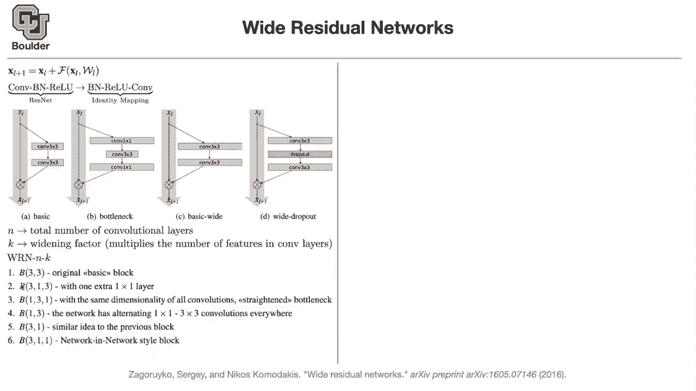
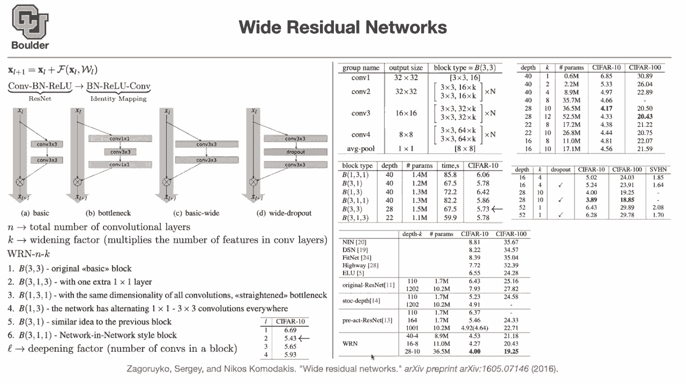

# 【双语字幕+资料下载】科罗拉多 APPLY-DL ｜ 应用深度学习-全知识点覆盖(2021最新·完整版） - P19：L9.2- 宽残差网络 - ShowMeAI - BV1Dg411F71G

okay then let's move to the next topic，so far we were trying to make our，networks。

as deep as possible what if you try to，make them wider，and this is called wide residual。

networks because you still have the，residual connections，that's the idea of the paper this we。

know this is our residual connection，and we just saw that it's better to do，batch number。

u conv rather than conv batch node value，we just saw that this was resnet that's。

the identity mapping。

paper and let's just remove all of the，batch norms and values。

not actually remove them remove them in，the plotting they still exist in your，code。

and in the mathematical formulation but，for visualization purposes。

let's just not visualize them let's hide，them，this is the basic one and if you。

remember in that paper，in the resnet paper when they wanted to，go very deep。

it was getting computationally expensive，that's why，they have these one by one convolutions。

to act as their bottleneck they reduce，the dimensions，basically the number of channels and。

then they apply，three by three convolutions so that's，the bottom neck layer。

the idea is that you can make these，three by three convolutions wider。

basically have more channels there are，still three by three convolutions。

you still have two of them per block but，then，these have more channels this paper also，says that。

it's a good idea to have a dropout，basically don't have a dropout on the，shortcut have a drop out。

on the non-linear part of the network so，that you are forcing actually the，network to go through the。

linear one if possible to go through the，linear route，but still these networks are white so，does the。

figure make sense basically the length，of this，rectangle is specifying you have more，channels。

visually speaking so let n be，the total number of convolution layers。

that you're gonna have in your network，you can specify a wide ending factor。

which is taking for instance one of，these convolutions，and multiply the number of features。

basically the number of channels，in the convolution layer by this factor，to make it。

wider because we want things to be，systematic so you're，specifying a parameter for your widening。

factor，and then wrn is going to stand for，wide residual network n。

is the total number of convolutions in，your network，and k is the widening factor so we just。

explain that，we just need a notation because now we，want to，compare different networks together and。

try to come up with the best。

configuration you can have these，standing for your block and there are，six different configurations。

that the paper tries the three by three，one，is the original basic block so in your。

block you have two three by three，convolutions，and that's your basic one w-r-n-n-k。

was explaining the entire，network basically the macro structure，of your neural network b is。

explaining the microstructure basically，your blocks，the residual plugs you can have b。

three one three you have a three by，three convolution then a，one by one convolution in between and a。

three by three convolution you can have，one，three one which is this figure that you，are seeing here。

with the bottleneck but the only catch，is that，these rectangles have the same length。

so that's the only change b one three，one，is the same figure where this guy is。

as wide as the other two that's why，it's called straightened you can have，b13。

which is gonna have one by one and then，three by three convolutions。

it's just the same as before but then，you have a three by three then one by，one。

and if you remember the networking，network style，you can have a three by three。

convolution and then two one by one，convolutions，so we are gonna study all of these we。

are gonna change n we are gonna change k，and we're going to study which one of。

these microstructures，is going to perform better you can also，define a depending factor。

k was a wide ending factor l，is a depending factor and it's basically，the number of。

convolutions in a plot this one has，l being equal to two this one is l being。

equal to three because you have three，convolutions and so on，so first thing first what should our l。

be，this is what one this is a question of，one of you guys last session，block。

should it be one convolution should it，be two convolutions three convolutions。

and or four convolutions，if you do that the error rate is gonna，tell you。

l being equal to two is performing the，best l，being equal to one is the worst three。

is the second worst and four，actually four is the second worst and，three is the。

next one in terms of being bad so，any question so far does the notation。

make sense as we introduce a little bit，of notation，so i want it to be clear so we haven't，yet used。

n k or any of these，we just studied l because we wanted to，get rid of that。

and we wanted to know how many，convolutions should we have per block。

and it turns out that 2 is good so for，the rest of。

this study we are going to start with l，being equal to 2。change。

between data sets that's an excellent，question so blake is saying。

yes you did your analysis but you did it，on c4 temp。

what happens if you change your data set，the thing is，the problem is these neural networks。

are really expensive to train，and they are not cheap so usually the，framework the way things work。

is that you test your ideas on c410，or c101 c4 100 you specify you come up，with。

the best structure for your neural，network on this particular data set，with l you are choosing the。

microstructure，and n is going to specify，how deep your neural network is going to。

be and k is going to say，how wide your neural network is going to，be so these are macro structures。

you determine them on c410 and then you，apply it on imagenet，why because training on imagenet takes。

depending on your gpu，it might take a week or two so any of，these。

studies are gonna take you a week or two，so these are not cheap and if you see，many of the research。

in deep learning is happening by these，big companies，like google like microsoft like facebook。

why because they have the resources they，have the computational resources and，time to do that。

i have a question along those lines um，has this，has any study been done about um。

like you were saying you you pick these，structural parameters for a small data，set。

my question is how often do the，best hyper parameters or structural。

parameters from the small data set，correspond with the best outcomes on the。

large scale or do they always just，assume it's going to be，if if setup 3 is the best then setup3 is。

still the best later on in imagenet，for the imagenet things are very easy。

you design your network on c410，you apply it on imagenet then there is a，validation data set。

you validate that your ideas are working，on the validation data set then you。

submit your network to the challenge，website or the imagenet challenge，website。

and then there's a test data they're，gonna test it but for the test data。

they're not gonna give you the labels，they're just gonna tell you that your，network did this good。

so and then you're gonna get ranked your，network is gonna get tracked。

and these networks that i'm presenting，all of them，at some point broke the record the，record。

like they ended up being one two or，third place for instance in 2016。

this paper was doing excellent on，imagenet data，so the cool thing is that with these。

deep neural networks，things tend to generalize，you come up with your ideas you test it，on c410。

and then you apply it on imagenet and，but for images and in particular image，classification。

you start with c410 basically you have，them，and these are low resolution but the，ultimate。

study is going to be an image net the，other thing is that whatever that we are。

learning here for instance，if you are if you are learning about，residual connections。

residuals residual connections are going，to be helpful，for different structures so these are，ideas。

that i'm presenting them in the concept，of images，but these are really general ideas like。

batch normalization is general，dropout doesn't depend on convolutions，uh value your activation。

it's not convolution dependent any other，questions，yeah so this um didn't they have to pick。

a structure to test that l，on and would that l change based on your。

your micro or macro structure that's a，great question，so the question is what n and k did they，pick。

to test l because now you have three，degrees of freedom you have。

l k and n yes they pick a particular，n and k so you fix n and k and then you，study it。

you fix your macro structure and then，you study what is the，best l but couldn't that l change based。

on different，macro structures like you could get，different results。

definitely it could change so you are，doing the best that you can。

at coming up with the best l because，this is a three-dimensional。

optimization that's really expensive to，optimize over，each one of these training because you。

have to train your network，wait，a couple of days for the results to come。

out you wait one or two days，to get a number of 6。69，then you wait another two days to get a。

number of 5。43，so you're absolutely right maybe if you，change your。

n and k l is going to change but then，that's the best that you can do with the。

limited resources that you have。

okay does that answer your question yeah，okay let's go through the macro。

structure now that's why we are gonna，stick to，b3 by three and then what happens。

is that we are gonna play around with k，k is gonna make our network。

wider so you have a three by three，convolution，another three by three convolution and。

then you are making it wider so you're，going from your basic setup to basic，white setup。

and as you can see we fixed l l is two。

okay we are chained we are studying one，and you can have different blocks you。

can have blocks of one three one，or you can have one three and so on。

different blocked up big different block，types，and different depths so now you're。

studying two different，and it turns out that b。

3 by 3 and then 28，to be your depth has the best error rate，on c510 and in terms of parameters they。

have similar parameters，or order of one point something millions。

and as you can see these are，tough questions to answer this is not a。

single objective optimization now，you want to optimize your error rate but。

at the same time you want your network，to be fast。

so we are gonna choose b three by three，based on this study we had six options。

and we're gonna get stuck。

stick to b3 by three and now。

we can compare the method on c410 and c4，100。

to other existing networks like，networking network，highway network original resnet。

stochastic depth is the one that's，putting a drop out。

here pre-activation resnet which is the，identity map。

and then wide residual network and now，here is where，depth。

this is the number of convolution layers，that you。

k is the widening factor and it turns，out that 28。

and 10 for your widening factor is，giving you the best result。

and you can study depth and k also，that's basically n and k and as you can。

see this is a cross data set this has to，go，this has to do with one of your。

questions what happens across data sets，on c4 10 depth of。

28 basically 28。

layer 28 convolutional layers，and a widening factor of 10 is doing the。

best but then on c4 100，the other configuration where k is 12 is，doing the best。

you can also study the effect of dropout。

what happens as you add this dropout，layer，in between it turns out that dropout。

helps because it is sort of forcing your，network to go through the shortcut path。

and it's helping you get more accurate，can i ask you a quick question sure。

so in the bottom table on the left。

for the wide residual network row。

we see that with uh 2810。

we get a four like a four percent error。

and a 19。25 percent error，but if we look at the same row 2810，on the next table in the top right。

we get a 4。17 and a 20。5。

and so it seems like the error for，our error if that makes sense。

so you're right the thing is uh。

that depends on the configuration when，you're competing。

with the rest of the awesome papers out，there，you usually use an ensemble of your，networks。

so this is an ensemble okay this one is，just a single network。

but whenever you are comparing yourself，to yourself，these guys are comparing now the network。

that they have to itself with different，variations。

this is called application studies so a，good paper is gonna have those studies。

because it's showing the reader that，they went through a lot of pain。

to write that paper basically。

studies，on his on his or her own so exactly an。

excellent paper if you think about it，each one of these numbers，to come up with so they suffered to。

and so the the wide residual network on，the left is like multiple of the same，networks。

that were trained and then taking sort，of the best，yeah okay thanks or there is usually。

some other，data augmentation or some other tricks，that they are using。

to get the best out of their network so，whenever you're comparing against others。

you want to report the best，but this one you're comparing to，yourself so it's okay。

if you don't try your best but you want，to be fair。

so it turns out that dropout also helps，and in terms of speed，actually the thin ones are。

the resnet networks that are just deep，these are wide residual networks。

this is 4d layers deep and the，widening factor is four so it's four，times wider。

and it turns out that it's running much，faster it's 68，milliseconds per image and the accuracy。

is actually lower you can see the same，pattern so you're sort of。

speeding up your networks at the same，time，you get comparable or better accuracy or，error rates。

so this one is comparable to this one，actually 4d and 4 is comparable to，a 1004 layers deep network。

so the error rates are comparable but，it's much faster，compare this to 512 milliseconds。

i think we are out of time for those of，you who have questions you are more than，welcome to stay。

and ask for those of you want to leave，are more than welcome to leave i had a，question。

um just going back to the identity，mapping，um because，it seems like you still have the。

the problem where your input shape，may not match the output shape and is，that just。

something that they like is it just，impossible to have a completely。

yes so whenever there is a dimension，change，whenever，the dimensions are the same see these。

networks that you're designing，you are designing them yourself and，these are the building blocks。

think of lego puzzles and then you're，putting these lego pieces together，nets。

residual uh blocks okay，and then you take this block and then，put it in your network。

and if you have a place if you have a，place where your shape is going to。

change then you just wouldn't use a，block that has a shortcut。

yes so it turns out that there are very，few of them，okay，and because there are very few of them。

we had this study another time also，if there are only three weights。

that are being multiplied together，basically three times that your input。

and output don't have the same，dimensions，because three is not a big number。

compared to one thousand and one，so you're multiplying only three numbers，together that's not gonna。

pamper the training so they don't have，they don't help much and if they help。

you can just keep them and it's not，going to hurt so it's just negligible at，that point。

yeah it's negligible okay okay thanks，sure there is a question is the speed，difference。

it because it is easier to parallelize，execution on white network compared to，thin ones。

yes whenever you are making things deep，things are gonna be，sequential the next layer has to wait。

for the current layer，to finish still，sequential it's because it's just 104。

sequences but then as you make it wider，you can easily parallelize it。

