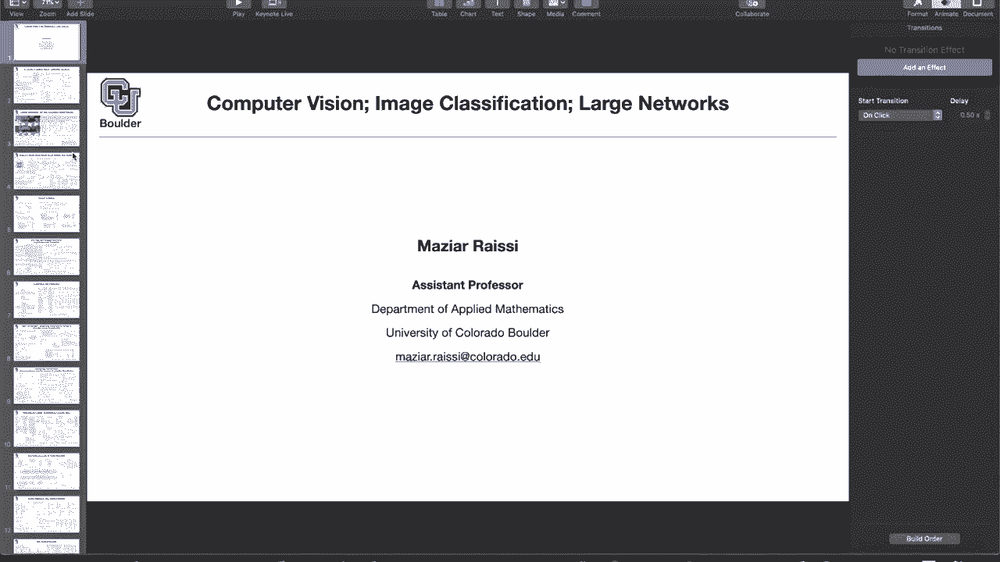
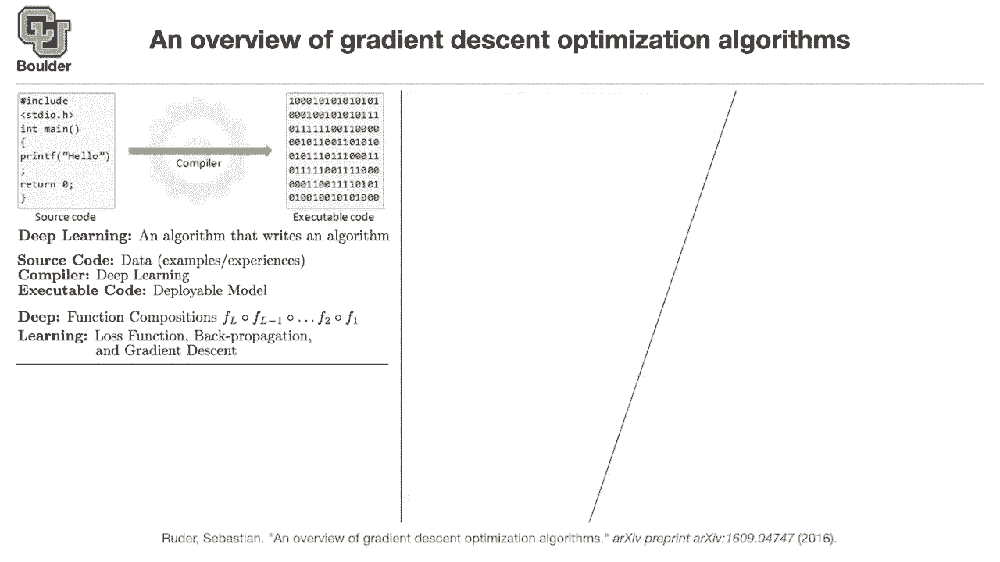

# 【双语字幕+资料下载】科罗拉多 APPLY-DL ｜ 应用深度学习-全知识点覆盖(2021最新·完整版） - P1：L1.1- 深度学习概述 - ShowMeAI - BV1Dg411F71G

so let's start with large networks。

an overview of deep learning，and especially gradient decent，algorithms。

there are a couple of ways to think，about deep learning，and this comes from the perspective of。

different people，if you are a statistician you think of，deep learning，as uh feature extractors。

you have an image you want to featurize，you have a text you want to。

come up with a bunch of features so，that's how a statistician thinks。

an applied mathematician is gonna look，at the deep learning，deep neural networks and say。

this these are just universal function，approximators，i have a function i want to approximate。

it so they think of it in terms of basis，if you ask a computer scientist。

and especially the people who work in，silicon valley，they're gonna tell you that uh。

is an is the mother of all algorithms，but what is an algorithm how do you，write an algorithm。

from a computer science perspective，let's say you have a c，code and you usually write a source code。

you say i want my source code for，instance to print，then you give that source code to a，compiler。

the compiler is going to compile that，source code for you，and it's going to output an executable。

file，for instance a dot exa file，output then you can just，that's going to give you an algorithm。

that's going to give you a software，that you can sell to your customers。

and that's how people think about，deep learning it's an algorithm，so it's a mother algorithm and an。

algorithm，yes perfect so deep learning is just a，what is the source code then。

source code is going to be your data，you have input output data in the form，of examples。

now you don't write the source code，yourself anymore，it's just the data。

or your data could be in the form of，experiences，if you are doing reinforcement learning。

you have an agent that's interacting，with the environment，collecting experiences over time and。

so you don't write your source code，but what you have to do is write your，compiler。

how i want to compile how i want to，compile that model，and then in the end you get a deployable。

model，for instance let's say you want to have，a spam detector。

is this email and a spam or not that's a，classification，task you're gonna say。

my source code is a bunch of data，is，spam this is another email the。

corresponding label is not a spam，and you collect millions of data points。

input output pairs those are your，examples and as you can see that's a，hard task。

to write a code for it how are you going，to identify，whether something is on spam because。

uh what type of words if you see in an，email，that's gonna be on spam or not on spam。

so that that's a tough task that's why，classical，computer science techniques are not，applicable here。

then you compile it using your deep，learning techniques，and in the end you get a model。

you get an executable code that you can，then you add that model as another。

for instance gmail account so that's，going to be，either in your spam folder or not a spam。

folder but now you're，using that model in production that，model it's a statistical model it's。

but given the，difficulty of the task there is no other，chores other than，so there is this parallel。

between source codes compilers and，executable codes and deep learning so。

deep learning think of it as your，so let's break down the words deep，learning，what does deep mean。

deep means you have a bunch of function，compositions，so you're composing functions you have x，that。

f2 of x and so on and，you keep doing that up until you get l。

and if you think about it we do the same，thing when we write our codes。

our source codes we write a function，we break down our source code into，the input goes in we do some。

transformations on it，that's going to be f1 using some，function that we write。

then we take the output of that pipeline，and put it inside another function and，keep doing that。

until the end we just i don't know print，the results or do something nice。

in our source code but now the cool，thing about，deep learning is that these functions。

f1 you just give it a，of the family of the functions that，could happen。

and then it's the role of training to，find out，what is f1 what is f2 so you don't write。

your own source code，and what is learning in deep learning，for learning you have to define a loss。

basically how much error your，predictions or your model，your examples。

deep learning without propagation，wouldn't exist，and back propagation is a way of taking，derivatives。

of your loss functions with respect to，the parameters，and once you have the gradients you can。

do gradient descent，to optimize your loss function，and once you optimize your loss function。

you're gonna end up with an executable，code，but whenever you end up with an，executable code。

you cannot just take it and put it into，production，because then your customers are gonna be。

really unhappy if，and you're gonna lose customers that's，you first test your algorithm。

and make sure it is working correctly，this test data you don't see it。

when you are doing the training algorith，the algorithm，but once you are happy with your。

algorithm it's doing a good job，on your test data it's ready to be put，into production。

so first you need to test your，algorithms make sure there are no bugs。

as i said the source code for deep，learning is your data，if your algorithm is doing something not。

you have to go back to your data and see，maybe there are some outliers in your。

data maybe you have to clean your data，maybe you have to add some new，observations to your data set。

so the source code is our data we have，what's driving deep learning so our，compiler。

the rest of it is gonna be written on，and that's the only algorithmic。

way of thinking and this is the only，slide，in the rest of the course。

where we are actually writing an，for the rest of the class except for，this slide。

