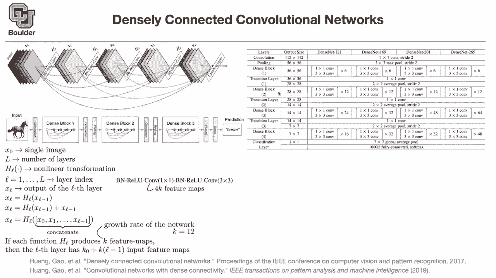
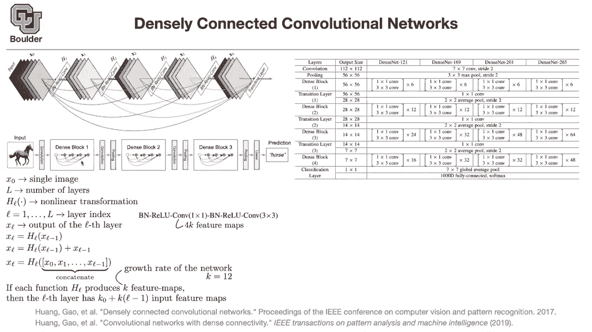

# 【双语字幕+资料下载】科罗拉多 APPLY-DL ｜ 应用深度学习-全知识点覆盖(2021最新·完整版） - P21：L10.2- DenseNet - ShowMeAI - BV1Dg411F71G

Let's move on the let's move to dense nets。 these are densely connected convolutional networks How do they work visually speaking we are going to go through the math。

 but for now visually speaking you take your input， you do your convolution。

 in addition to batch normal value， the linearity that's going to give you a filter。

Basically your feature maps now from this layer to the next one， not only you take x1。

 but also you take x0 as an input， and then you do your batch convolution that's going to give you x2 from x2 to x3 not only you take x2。

 but also you take x1。And x0 as inputs from x2 to x3 actually from x3 to x4。

 not only you take x3 as an input， you take x2 x1 and x0 as inputs and again from x4 to the next layer you take all of the previous ones as inputs and what you do is just concatenate the output of you take x1 concatennate it with x0 and then you push it through convolution here you take x2 x1 and x0。

 you concatenate and push it through your convolution and you do the same thing。

 but then as you see the dimension is sort of exploding from one layer to the other one the dimension of the first one is I don't know 1。

2，3，4，5，6 once you concatenate it's gonna be 7，8，9。

1011121314 and then the output of this guy the dimensions are exploding that's why every once's in the wide。

You add a transition layer。Which is basically a one by one convolution to project your dimension back。

Into a low dimensional one。 So that's visually speaking。 what's happening。 And as you can see。

 because you want to concatenate。

Different channels。Those channels need to have the same resolution。

That's why you usually have blocks of dense operations， what I just explained up there is a block。

That's dense block1， and I guess the numbers match。 This is x0， x1， x2， x3 and x4。

 and then you have your transition layers which are one by one convolutions and pullinging operations because now you want to change your resolution from one block to the next block within block you have the same resolution。

 The reason is that you want to concatenate your feature maps。

 We have the same behavior withdress nets。 You wanted to add two feature maps together。

 You needed to have the same dimensions。That's why you。We're working with blocks。 addressnet blocks。

 Let's go into a little， let's go a little bit more into details。And let's say x0 is a single image。

W has three channels， red， green， blue， and earliest is the number of layers。

 these are just notations I'm introducing some notations HL is your nonlinear transformation。

And L is going to be your layer index， layer1 up until layer L。

 Let's say X L is the output of the L layer。Basically x1 is the output of H1 x2 is the output of H2 and so on this is a usual network without any residual connections or dense connections it's basically this main path without any of these shortcuts what Resnet does is taking the input and adding it to the output of the nonlinearity and then that's going be the output of the residual block what ResNe does is concatenate sorry what densenet does is concatenate all of the past features from xn up until Xl minus1 so it's very similar to what you is seeing with。

Residual connections by taking it one step further and then there is linearity for dense net there is another hyperparameter that we're going to introduce it turns out that the number of features don't need to be too big they actually they cannot be too big because you're concatenating a bunch of channels together and that's going to explode after a few of these concatenations this one is going to have a huge dimension and the cost is going to be unbearable that's why you keep these number of channels to be small and that's going to be called your growth rate of the network so what we are doing is that each hL is producing only k features and k is a small number12 for instance and then at the e layer once you concatenate everything together this is the dimension of your input K0 plus。

K times L minus-1。 you have L minus one of these。That you're concatenating and each one has a dimension of K。

 So that's going to be the output dimension after the dense。Dancenet。Densnet block。

 So K is usually kept to be a small number like 12。 Any questions so far。

 I K 0 just the dimensions of the input。 Yes， so K0 is a dimension of the input。

 it could be the input image or it could be whatever the dimension that youre passing it into densenet block So it's either here or it's here or here。

 Does that answer your question。 Yeah， thank you。 any other questions。

 So if you read the delving deep into delve deep into deep learning。

 the textbook that I'm putting on the syllabus It says that densenets are costly but it's actually not true。

 you can keep the cost to be reasonable by this trick。

 one is keep the number of your feature maps to be a small number。

 and the other one is in your transition。

You use a convolution， a one by one convolution。And the output of that one by one one by one convolution is low dimensional it's 4K。

 Yeah， this one is going to have a huge dimension right before the one by one convolution。

 but the one by one convolution is going to project things down to a low dimension and then you you are ready for the next dense block So k not is going to be 4K for instance。

 in this case， K not for the first image is 3 k not for from this layer to the other one is 4K and k is the growth rate of the network and then you have a bunch of。

Different structures。 You have dense net 1 to 21， which is  one to 21。

Layers D 169201 and 265。 These are the dense blocks which are one by one convolutions and then three by3 and you have six of them。

 Then there are these transition blocks that are going to help you reduce the dimension and you have these average pooling layers。

 they have a stride of two。 theyre going to help you reduce the resolution So from 56 you reduce the resolution to 28 wherever you have these transition blocks。

 you are reducing the resolution but within dense blocks， the resolution is the same。

 It's just 228 by 28。 Can k be different between dense blocks or is k consistent across the network Yes。

 definitely so you can have different K within dense block 1 dense block tube and dense block 3。

But they are actually using the same k everywhere。 No， definitely they can be different。

 These blocks are independent from each other and are they actually expensive。

 Not really if you compare them to resnet So what I'm ploting here is on the X axises you have the number of parameters on the Y axises you have validation error。

 you can see that dense nets actually have less parameters and they have better validation errors similarly for number of flops。

 the number of operations， they are more accurate and they consume less flops So no dense nets are not expensive。

 that's the message from this light。 I have a question about the the actual weights themselves though are the weights themselves and in a dense net possibly sparse No okay。

 so even though the connections are dense， the matrices themselves applying the weights are dense as well。

Yes， so the matrices are are dense even for net resnets。 Okay， interesting。 Thank you。 Yeah。

 the word dense is coming from going from one layer to the other one， for instance。

 a resnet is not dense because you're only taking account。The previous。

 the output of the previous layer。 But now a dense net is dense in terms of layers because you are taking into account everything prior to that operation prior to this layer。

 So that's what where the word dense net is coming， not because of the weights。 Yeah。

 I know it could be confusing， but dense nets are dense because they are taking into account all of the previous layers。

Yes， the graph is dense， exactly， thanks。From one layer to the other one。

But the matrices are dense for all of the networks that we covered so far Do you ever end up with naturally sparse waste weight matrices without enforcing it to regularization there are some ways to quantize your networks and next topic once I go through the large networks the next chapter is going be a small networks and over there we are going to see some dense matrices Okay thank you I'm sorry some sparse matrices Oh yeah yeah that's right Thank you。

So I need to make some corrections here。 You can think of a convolution as a sparse matrix if you concatenate all of your pixels in one long vector and then going from one layer to the next layer from the pixels of one layer to the pixels of the other layer convolutions are actually sparse they are I don't know if you have three by three convolutions。

 you have a tridiagonal matrix you are doing a weight sharing。

 it's the same weight that you are applying on this window of your input and then you are sliding your window and you have the same three by39 numbers that are being multiplied per channel Okay does that make sense but here we are not playing around with our matrices It's just same convolutions。

 So it's the same operation that you had in resonancesnet You have it for denseness It's the same convolutions What is changing is per layer that was a great question。

Any other questions？