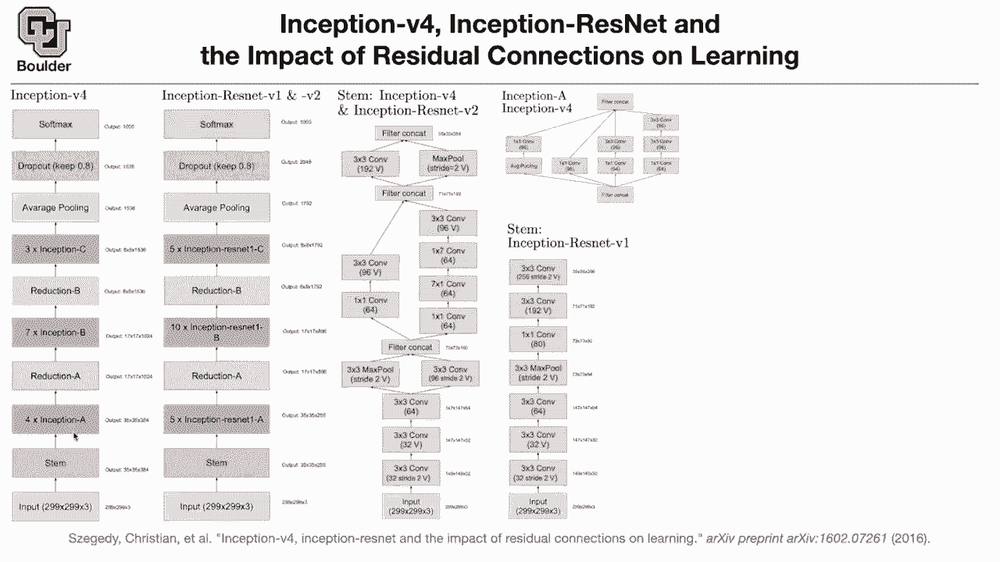

# 【双语字幕+资料下载】科罗拉多 APPLY-DL ｜ 应用深度学习-全知识点覆盖(2021最新·完整版） - P22：L10.3- Inception-V4 - ShowMeAI - BV1Dg411F71G

okay let's go back to inception this is，the fourth inception paper。

we had google net that was inception one，then we have batch normalization，inception two。

we had inception three now we have，inception v4，which are some more modifications to the，version 3。

and then after the resnet paper，inception also tried to adapt。

they get，improvements and they actually got，improvements，this is the macro structure of an，inception。

version 4 network our，inputs are i'm here it's 299 by 299，that's the resolution you have three。

channels it goes through，a stem which is gonna take this 299 by，299。

image and then it's outputting 35 by 35，by 384 channels，then you have four inception a i'm gonna。

tell you what is inception a，then you do reduction a seven inception，b's。

reduction so whenever you have reduction，the dimensions are gonna，go down basically from 35。

you're going to 17 after the reduction，from 17 you're going to eight after the，reduction。

there are three inception c and average，pulling，a global average cooling which is gonna。

take an average of these，64 numbers per channel that's going to，give you this output。

1536 then you have a dropout，you are keeping 80 percent of your rates。

sorry your connections and then you do a，soft max，so there are a bunch of things that i，owe you。

i need to tell you what is inception，what is reduction。

and what is stem before we do that let's，take a look at，2。there is a stem there are 5 inception。

resonant 1a，so resnet is coming in here so i need to。

tell you what this is，reduction is the same i need to tell you。

what is inception resonant 1b is，and the rest of it is the same so，resnets are coming in。

these blocks let's start with the stem。

stem is the same for inception，and inception resnet v2 there is the。

input，there is 32 three by three convolutions。

they have a stride of two，and v is for valid padding then there is。

three by three convolution the dimension，is now gonna change to 64。

when you have a max pooling and a three，by three convolution you concatenate the，filters。

you lower the dimension you go to 64，using one by one convolutions。

and you remember these slides these type，of operations。

from inception you still have them here，seven by one，one by seven in total it has a receptive。

field of seven by seven，and then you do a three by three。

convolution you concatenate them，there is max pooling stride you have，different strides。

and then in the end you concatenate and，that's how you get your。

35 by 35 by 380，4。 so the number here is 256。

that's for inception resnet version one，for inception，resonant version two this number is。

384 for this stem it's the same as in，section v4。

for v1 that's the stem，a bunch of three by three convolutions。

seven，and then in the end the dimension is。

256。 so that's the stem，for inception a what i owed you here。

you do average pulling one by one，convolution one by one convolution and，so on。

inception a for the resnet there is a，resnet connection。

after the relu activation you just add，it to。

the output of your inception module，and for resnet v2 that's the，architecture。

the only changes here 384 compared to，256。

the rest of it this is also 64。 this is，32。do you guys see any other change so。

these are the only two changes，in version one and version two but the。

key idea is these residual connections，and for inception b and inception c。

blocks，there wasn't enough room for me to plot，stuff on this single slide。

so i'm referring you to the paper if，you're interested，and what changes is in terms of error。

top one error inception v4，is the green one inception resnet v2。

is the red one so it's doing the best，inception v3，is the previous paper the previous。

version of inception，and this is an inception v1 so inception，v1 is very similar to inception v3。

and you're adding the residual，connections and as you can see it's，training better。

training faster in the end they are，gonna end up being，very similar but during the course of a。

training，things are behaving better you're，converging much faster to this level。

you're converging to that level of error，i don't know around，is a。

resnet version of v4 so v4 is better，than v3，and v2 in resnet connections actually。

help v4 to train better，we are one minute over time for those of，you who have a question。

you are more than welcome to ask for and，for those of you who want to leave。

you can't leave any questions i have a，question but it's not really related to，lecture today。

sure um i was wondering what hyper，parameter optimization，looks like in these networks in state of。

the art versions i guess of hyper，parameter optimization，so there is this field called automl。

and if you refer to the syllabus we are，going to cover that，after going through small networks we。

are going to do，automatic machine learning and that one，is about hyper parameter optimization。

