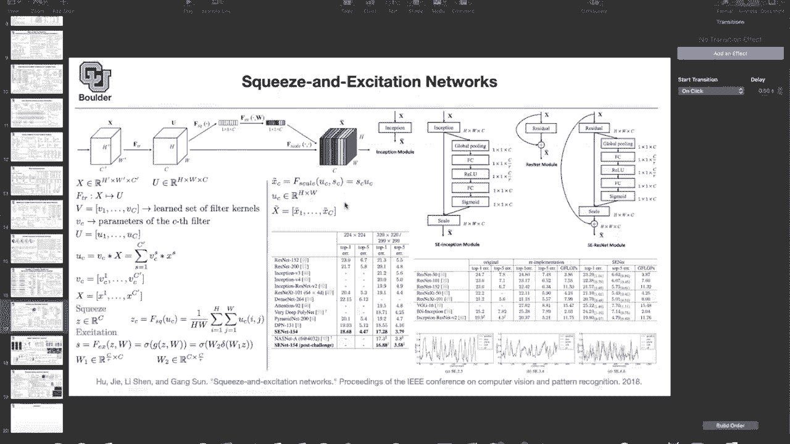
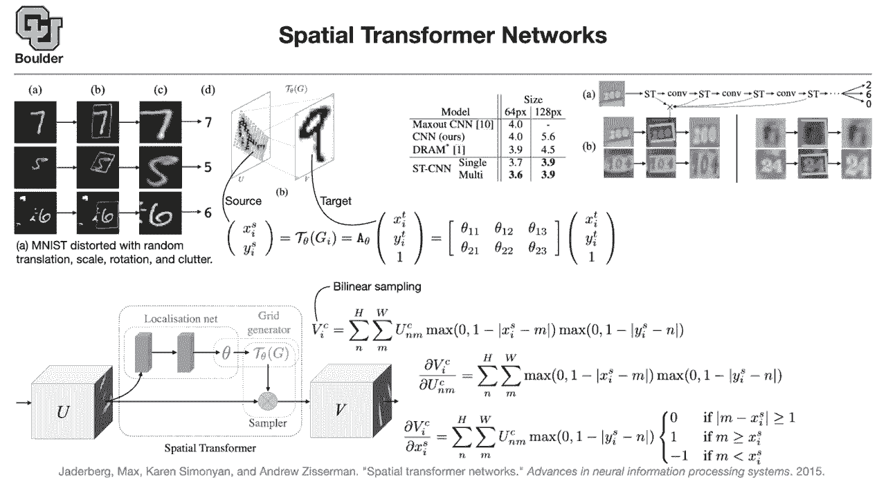

# 【双语字幕+资料下载】科罗拉多 APPLY-DL ｜ 应用深度学习-全知识点覆盖(2021最新·完整版） - P24：L12- Spatial Transformer Networks - ShowMeAI - BV1Dg411F71G

uh so far what we were learning about，in terms of neural networks was mostly，based on convolutions。

basically convolution operations and，different，variants of it and how to combine them，together。

using different methodology whether it's，let it be，inception let it be resnets。

let it be vgg type networks etc，now i'm gonna change the focus a little，bit。

and look at new ways of thinking，about computer vision and the idea of，computer vision。

is to make computers see，like human do the idea of convolution，was around since i would say。

1980 and now after the，abundance of data and，computing power we are seeing them shine。

so now they're taking the field of，computer vision and you can find them，all over the place。

so they are now the mainstream what are，there different ways，to think about how humans see and are。

there any ways to improve，upon convolutions so these ideas are，beginning are actually emerging。

in our era so maybe 20 years from now or，even more you're gonna see these types，of ideas。

start to shine so i'm gonna start with，two papers。

and then i'm sure we're gonna see a lot，of cool stuff，coming out of these the first one is。

spatial transformer networks，and what is the general idea the general。

idea is that if you look at column a，number 7 for instance could be appearing。

anywhere in the image could be up there，could be to the top right and could have。

any scale it could be very smaller it，could be very big，or it could be rotated for us as human。

it's very easy，we look at column a and we know that，that's a seven。

we look at this five here and we know，that that's a five，despite the fact that it's rotated and。

the scale is，smaller than seven we look at this six，it is，scaled it's rotated and then it's。

cluttered，with some random stuff but our mind sort，of knows，how to get rid of the clutter focus on。

number six and say，okay this image is representing a six，convolutions so far。

were good they were translation，invariant and they were，look actually they are locally。

translation invariant，because of the max pooling operations，that you put inside your convolutional。

neural networks，but these are local it means that，these are not sensitive to small。

translations but if the translation is，too big，then convolutions are going to get。

confused and they're going to make，mistakes，so it would be great to have a method。

that's able to focus basically put a box，around the object of interest the box，could be rotated。

it could be of different scales and，sizes and it，could ignore the clutter。

once you do that then it's easy to，translate it，you translate and focus on number seven。

you focus on number five and you focus，just，a simple convolution because we know。

that convolutions are gonna do a good，job here，this is not only about digits this could。

happen with human，and self-driving cars your self-driving，car，down，for some reason or while driving。

it could see a truck that is upside down，because of an accident and if the，computer ignores that。

then there is going to be a huge，disaster there is a question，how does this relate to image。

segmentation we are going to cover image，segmentation，it's not related this is about。

classification so you want to see a，number seven and then classify it。

as a seven segmentation is when you have，pixel wise predictions so for。

segmentation you are translating an，image，basically your input design image the，output is。

still an image but then at each pixel，you are predicting a probability well。

i so i guess i didn't know the the，definition of image，segmentation i've seen classification，image。

has a whole bunch of regions and it says，okay over here we have a cat and over。

here we have a car and over here we have，a tree，and it would seem like that would be a。

precursor or a necessary step，in here to even just be able to，recognize like。

there's one digit in this image or，two digits in this image or a digit and。

yeah whatever in its image yeah what you，are talking about，is not actually segmentation that's。

object detection，and we are going to cover object，around，objects in your screen so that's what。

you are talking about，but if you look at that the bounding，boxes over there。

are just rectangular objects so they are，not rotated，now you see the rotation here so it's a。

different way of thinking，does it answer your question yeah we are。

going to cover all of them we are going，to cover，segmentation we are going to cover，object detection。

etc but for now for a while we are going，to stay with，classification because it's going to。

help us understand，why deep learning works in the first，place and what type of architectures。

we can come up with and then we are，going to transfer our learning。

whatever that we learned here and we are，going to apply to different problems。

in computer vision so is the problem set，up clear，now how do we do this how do we learn to，focus。

there is this that's the network，architecture，that's the idea of a spatial transformer。

it would be good to take the input，which could be image in terms of red，green blue or it could be。

a layer inside your convolutions this，could be the output of the convolution。

which is a tensor it would be good to，take that image，or that tensor push it through a network。

which could be fully connected and，predict some parameters，these parameters could be the。

transformation，that you want to do on your image so，your parameter parameterizing。

exactly what you want to see happening，with some parameters theta i'm gonna。

specify examples of theta，then you're gonna create a grid on the，output。

which is parameterized by the parameters，that you just predicted。

you're gonna use that grid to sample，your initial image basically you want to，sample this area。

and then that's going to be your output，that's going to be your。

7 that is a scale that's uncentered and，rotated，so what do we actually want to do we。

want to have a translation and a scale，and a rotation，for this localization net and does。

anybody know，how that happens what type of operation，gives us that。

gives us a translation scaling rotation，so that's called an affine。

transformation so this is an affine，transformation，this localization network is predicting。

some thetas，and these are our thetas which are，basically the entries，1。

3 the first matrix is gonna get，multiplied by，your target t stands for target。

x is the location x and y are the，locations，of pixel i so you take pixel i。

and that's going to give you the，location of pixel i now you do an affine，transformation，you。

rotate this matrix here it's going to，help you scale，and these two ones are going to help you。

translate，because they are being multiplied by，this one here so you are shifting your。

locations that's how your transformer，transformation or grid，is getting parametrized by theta g i。

is a point here gi is basically，x i t y i t and one，coming from your target point and what。

you're doing is mapping these points，back into your source and your source is，this image。

and if you are within your network one，of your layers，your source is somewhere here so is that。

transformation clear，that's how you're generating a grid，that's going to be your grid。

and these are the locations of your grid，x i t，y i t and this could be anywhere。

inside your output so we are putting a，grid，and this grid is gonna get associated，with the original。

with the source grid through a，transformation，to run a fine transformation is this，clear。

does this make sense okay perfect so，just to be clear this，this um a matrix maps from the target。

space back to the source space，yes because the objective is to know。

what is the value of the pixel here，what is the value of the pixel here and。

then you want to read it off with，from the correct location from source。

what is the value of these those themes，it still seems backwards to me like we，want to learn the。

mapping which straightens out and，centers these，digits uh so the network is not gonna go。

through that，the network is going to go through the，get，v the inputs basically the output。

is going to go through this route，through the sampler，this is just to help you put a grid on。

your locations，because what do we want to do what is，the size of this i think it's going to。

get more clear if i，tell you a little bit more and then，you're going to see how。

the network is going to do the，transformation how do you get the。

take the input and output v how do you，get v，that's your question yes and there is。

another question from plague，do we have to apply some interpolation，after the affine transformation。

perfect so now you are thinking ahead，and that's exactly what i just，unraveled in this slide you do。

an interpolation you do it by linear，interpolation，and it's called bilinear sampling does。

that answer your question blake，okay let's see how you get the value。

at a particular channel and at a，particular location，on that channel at a particular pixel。

that pixel you want to copy and paste it，from your input you want to take it from。

you so you do a summation，over u for that particular channel of，pixel。

and an m so you take a pixel in a，particular channel，you put it here the rest of stuff here。

is for linear or bilinear，interpolation let's take a look at it，more carefully。

if x i s is equal to m，this term is going to end up being 1 if，y is。

is equal to n that term is going to be，equal to one，and you are just copying u n m。

on that particular channel to your，current pixel，so you're just copying so this is when，you're lucky。

and your transform maybe this point just，transforms on a point here。

and then you're lucky and why did i，ignore the summation，the answer is this function these。

maximum ones，are most of the times zero except near，the neighborhood of。

x i s and y i s most of the time these，terms are zero that's why this summation。

goes away and you're just copying，your input to the output so that's like。

a convolution with some kind of like，pyramid，function the i pixel is the u。

and m pixel convolved with or the u，matrix convolved with that like。

downward opening pyramid function yes so，that's a pyramid，you're right and that's your that's how。

you do for those of you who know finite，elements，that could be basically one of your。

elements so you have a pyramid，and then you're just multiplying by that，and it's linear。

so if you look you look at it in one，dimension most of the times it's zero。

then there is a peak it goes down and，then it's zero again，so these points these functions are like。

that，you're doing linear interpolation but，locally it's local linear interpolation。

but why is it bi-linear because you have，two of them，it's in two dimensions okay is that，clear。

now what if you are unlucky and this is，not exactly equal to m，and this is not exactly equal to m so。

you're just doing a linear interpolation，if you're unlucky and that's how you get，your v values。

see that's your transformation now now，you see，why you need that operation to be，backward。

because you want to know the value of x，i s and what is y i，s okay is that clear any questions。

that's your chance to ask questions i'm，a little confused，um so if we're using x i。

s and y i s and we've we've，learned essentially the the a theta，matrix。

but we need our sort of our i mean where，are we getting this x i t。

and y i t from because we need the，rotated and translated，is x。

i t x i t you know it for instance it's，one and one，for the first pixel you know your target，x i's。

but you want to know what is the value，at that location，x i and y i you know them it's one one。

one two pixel one two pixel one three or，pixel i don't know 256 and，uh one so these values you know。

okay what you don't know is uh，the corresponding value at that location。

the locations you know these are your，pixels you don't know the value that you，want to put there。

and the value is gonna come from the，input，which is u and a linear interpolation。

or a bi-linear interpolation that's why，v i s is a function of，u and the source pixels。

okay and we learn this transformation，from our output space，to our input space so that we can grab。

the，the right pixel value exactly，so you need to know this uh mapping from。

your pixels because these pixels you，know to the input，so that you can copy and paste alright。

that makes a lot of sense thanks，defined，and thank you service for answering。

these are the height and the width，these two terms u and v have the same h，and w。

the height and the width of your inputs，and i，have，actually，put everything in one large column and。

count them with a single index does that，answer your questions。

so i think now everything is clear how，the setup works，at least when you go forward in your。

neural network，when you want to go backward what，happens so now the confusion is about。

tau theta what is that that is how，you are corresponding the pixels in your，target。

to the pixels in your source tau，is just exactly this matrix，tau is equal to a of theta is equal to。

this matrix here what it does，it does the rotation the，translation and the scaling so it's。

gonna help you focus on the，region of interest does it answer your。

question yeah it's just a translation，operation transformation operation。

it's gonna generate a grid for us and，the grid is parametrized。

by thetas and gi is notation for the i，grid point in target space exactly so，the ith grid point。

gi is just x i t and y i t，and that one here is just to save you，things。

nicely so rouge has another question but，is it，what is that on all of the input or a，subset of it。

it's on all of these pixels how you map，a pixel in your target。

to your source so it's on all of these，points，this transformation is transforming the。

x's so far i'm i know you，were used to seeing convolutions and，they were always up。

being applied on the values of tensors，now what we are doing is looking，are looking。

at the indices these transformations are，on the indices，and this function could be everywhere。

but then when you map it，it's just going to focus on some，particular part of your。

image exactly so that's the correct way，to think about it，the output v is the same as the same。

size as u，exactly but have come from a subset of，points，else，get the same idea awesome so we are on。

the same page，now the question is how do you，backpropagate through this operation。

that's how you do it you want to take，the derivative of，that's what you need the derivative of。

vic with respect to a，particular point in your input with，respect to that。

the summation stays the summation stays，because of，these terms depending on m and n but。

then the derivative is gonna，cancel that's to give you a 1。 the。

derivative with respect to this term is，just a 1。okay how do you take the derivative with。

respect to xis，because that's what we need how does the，network back propagate through this。

translation，you get a let's say you want to do with，respect to x i。

s with respect to y i s is similar，if you do with respect to x i s that's，the only part of your。

function that depends on x i s and the，derivative of that function。

is either zero because your function is，zero your function is like this。

it's z linear with a negative slope，and then zeros again then if you're on，the upward。

part of your linear transformation the，derivative is one，if you're on the downward slope that's。

gonna be a negative one，and that's gonna give you a derivative。

and how derivatives are gonna get back，propagated，through a spatial transformer why is it。

useful after，incorporating single and multiple，transformers for single what happens。

you just have a transformation on the，input on the pixels，for multiple of them you do the same。

thing for，uh different layers and then you can，reduce，gain，from 4 to 3。6 that's a huge gain，the。

size of your image but what is the data，set the data sets，are street view house numbers so the。

question from math is max out cnn just，the cnn with the original max out。

or something different you can take a，look at that paper，and look at citation 10。 go inside this。

paper，spatial transformer network citation 10，and that's going to give you。

the source yes it's this paper but by，good fellow，during his phd and there is just one max，out layer。

towards the end and as i said you can，have，this is these are street view house。

numbers and the objective is to，read these numbers 260 and output 260。

there are a bunch of transformers or tr，yeah transformer，operations that's the first one that's。

the second one the third one，in，four consecutive layers one right after，the input。

another one right after the first，convolution another one after the second。

convolution another one after the third，convolution，and you can combine those operations and。

that's going to give you a box，around the actual number，after the transformation you get a。

nice rectangular image that you can，easily classify，but the classification here is slightly。

different to what you're used to，you're gonna have three actually five。

different softmax for five digits，one two three four five digits and，usually these numbers are from。

zero to 9 and you can have a blank，or a space also so now you're predicting，11 objects。

0 1 2 up until 9 this is 10 digits，and a blank and then you have 5，different of them。

five different softmax and in the end，the multiplication because these。

objects are independent independent the，digits，you just multiply those probabilities，together。

to get the probability a single，probability out of your，network and if the network decides that。

it has，to put a bunch of blanks it's going to，put the blanks。

it's going to predict the first one as a，blank，it's going to predict a 2 a 6 a 0 and。

perhaps another blank，and then that's gonna be read as two six，zero is that clear。

any questions about the loss function i，just have a question about um。

sort of the structure with multiple，spatial transformers，um it seems kind of surprising to me，that。

you would want multiple sort of embedded，deeper in your network，it would seem like you would want to。

transform your image，and then do your processing kind of in，separate parts is there a reasoning for。

having multiple transformers，spread throughout yeah that's the，reasoning if they used。

a single transformer that's their error，rate，3。7 if they use multiple of them，that's 3。

6 so just empirically yep，do you know if anyone's tried putting。

all of the spatial transformations first，and then all of the the convolution the，rest of like the。

network instead of having this sort of，like hop between，this alternation you mean four st's on。

top of each other，yeah yeah but that's gonna end up being，a single st。

these are linear operations so then why，not just have a single。

i guess it just works better in practice，yeah so that's the single，and they have done it okay。

yeah that's a valid point if you do a，bunch of，affine transformations in a row it's the。

same as one big，affine transformation but if you put，non-linearities after each account。

transformation，it has a different effect it's no longer，just one big afine。

transformation applied to those，convolutions or，or non-linearities yes that's a fair，point。

so after your affine transformation do a，non-linearity，and then do your second affine maybe。

that's a good idea to explore，the idea is simple to implement maybe。

implementation wise that's a very nice，that could be a very nice exercise any，other questions。

about the loss function that we are，writing the idea is that you have five。

soft max getting multiplied together to，give you to give you your probability。

and then once you know your probability，you know your likelihood you can，maximize the likelihood or。

minimize the negative of the log of the，likelihood any questions，so that's one way to have multiple。

transformers can you guys think of a，different way，to put multiple transformers in your，network。

this is sequential is there another way，of doing it，so if you have like a wider network with。

like multiple paths，i think you're close what if you had，a seven and a five as your input。

in a single image you could segment the，image and then do affine transformations。

over the segmented portions of the image，that's what surosh is also saying split，know。

how to split it the idea is that the，network has to learn how to split。

where to focus because these two numbers，could appear，anywhere in your image and they could be。

cluttered we still want to use this，spatial transformer but we want to use，multiple of them。

if we know beforehand that there are，going to be，two numbers per image what can we do。

can you use two networks and link them，together，in some way so we want to have two。

spatial transformers，what you can do is you can have this is，your first spatial transformer you can。

have another one，perhaps down here and then you can take，u and push it through that spatial。

transformer，so now you have two of them and you have，two of them in parallel。

and one of them can focus on a number，another one can focus，another on another digit and then。

everything is going to happen on the fly，through training how can you guaranteed。

they don't select the same region，you cannot guarantee the way that you。

guarantee is through training，everything here is a is example based。

and the network can make mistakes so you，just show it enough，examples and then hope the best it's。

gonna happen there is no guarantee，does that answer your question yes no。

yep，okay perfect and that's exactly what，these guys do，you can have two a blue box and a red，box。

and then you can try to classify the，birds，different types of birds and that's，tough because。

these are fine-grained details you are，not just saying that that's a bird。

you're saying what type of bird that is，even for human that's tough。

you need to do a phd in that field and，the way that these two，for instance if you have two spatial。

transformers，the network is gonna learn to focus on，different parts。

for instance the red one is focusing on，the head，except for this and this goes back to，that。

they are not focusing on the same thing，the red one the intuition is that it's，focusing on the head。

for most of the images except for one，and the blue box is focusing on the body。

each one has a different type of a body，and that's an outlier。

same thing here is the learnable region，or the the region that is amplified from。

these affine transforms，then dependent on every single，image that goes in like if you gave it，left。

like a 7 but it was somewhere else in，the image would it still，with the same training be able to。

identify，like that that hot zone where the seven，is or is it always just going to learn。

that the seven goes in the top left and，it'll look in the top left。

that's an awesome question i was waiting，for it，that's a great question these thetas。

depend on the image these are functions，of you，these are functions of the input image。

that goes in these are not fixed，for your entire data set these change。

per input image that's really clever so，like when the，seven comes in in a different spot the。

image is different so the affine，transformation is different and it。

figures out then how to find where the，seven is，yes exactly that's amazing it is amazing。

yes because that's what it's learning in，the localization network is how to。

is that function exactly so it's，learning this function，and the point is that this is a function。

it's a function of your input，for a different u for a different set of，mini patch。

this is gonna be different this is not，fixed for your entire data set。

and look at the improvement and the more，of these boxes you have，the more accurate your network is。

getting i think we are one minute over，time，for those of you who have questions and。

want to stay and ask，you're more than welcome and for those，of you who want to leave。

you can leave my only question is about，um in the top right，diagram where it's got the。

the st is going to a convolution going，to an st and a convolution and so on。

what what are those back links then down，to like the x，the x like the four s ts all point back。

down to an x which points down，to the the box with the 260 in it。

the first one is obvious yes because，you're taking your pixels and mapping it，back to your inputs。

so that's gonna give you this box the，second one，is gonna take the output of the second。

layer map it to a box，then you take that box and map it back，to your initial。

image this one you know the pixels the，key，observation is that you know these x i，t's y i t's。

so is it just inverting back through，whatever three or four，or five layers of spatial transformation。

or is it，is it because the arrows make it seem，like they just，go once to one pixel uh。

no it's just the way of combining them，but always if it was like the nth。

spatial transformation you'd go back，through the n minus first。

and back through the n minus second all，the way back to the first，exam to the original pixel yes。

okay there is another observation，in one particular layer h and w are，going to remain the same。

they return the height but then when you，go to the other，layer there is usually a down sampling。

happening，because of the convolution yeah because，of max pooling or whatever。

yeah then you need to up sample first，and then take that and go back。

so it's likely the case that one one，pixel，at like the fourth layer down is going，to back。

propagate to like four pixels which，break back propagate to 16 and so on it，grows。

yes to the size of the image that's，interesting that's really cool。

yeah and that's how you get this box，yeah，very cool the question is can we swap。

the bilinear sampling，with another interpolation of course so，this is just the easiest way。

out of the method copy and paste and do，by linear there is another one that you。

can just copy the nearby pixels。