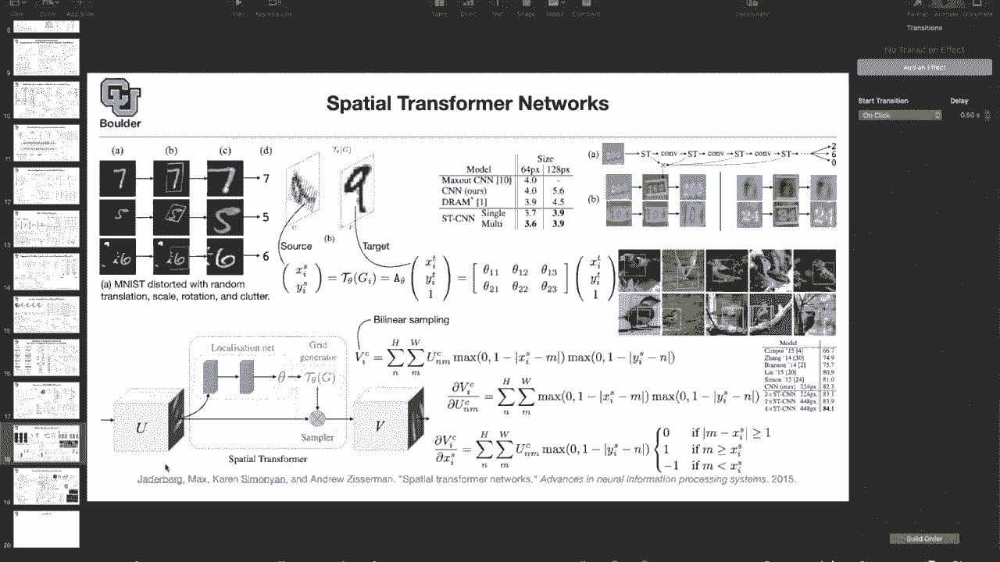
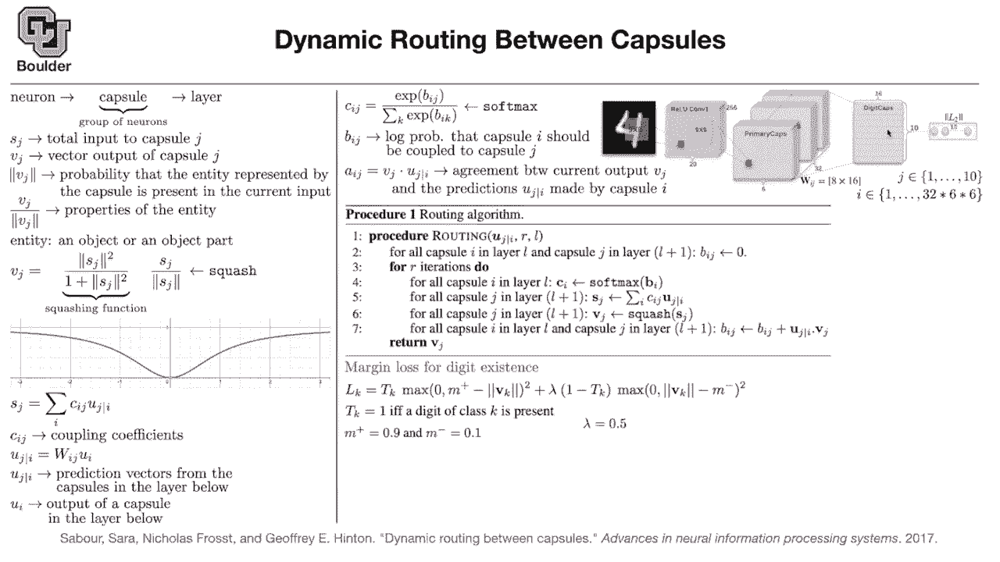

# P25：L13- 胶囊网络 - ShowMeAI - BV1Dg411F71G

The last net that we are gonna cover in this class is gonna look to you a little bit weird because it's gonna be a little bit different from what we have seen so far。

 The paper is by Jeffrey Hinton， the father of modern deep learning。

 these types of ideas have a bright future， maybe not now maybe in 20 years and with some modification。

 they might actually be an alternative to the current state of the art because if you think about it。

 there are many people around the world both in academia and industry that are pushing deep learning。

 especially computer vision and they have been doing it ever since 2012。

 So there is a huge literature and a bulk of knowledge that is being generated even in a single year and convolutions are now getting really mature。

 you can see them everywhere The trend is something like hidden markov models which was the dominant choice when you were doing speech recognition。

 Now after a while things that。

changing and now neural networks are competing and even doing better than hidden Markov models。

 but hidden Markov models was an old idea。 So the type of ideas that we are going to see in the next paper are gonna probably end up there is hard to predict the future but they have the potential and we are going to see why they have the potential because even these days they are doing something that typical neural networks cannot do so what is the topic it's dynamic routing between capsule The idea is that you want to mimic how humans see and for a while we are thinking that convolutions are the choice because you have neurons you have layers of multiple layers in your eye and in your brain that are processing than image layer by layer and getting more abstract as you go from a single layer to the other one So there is the idea of neurons there is the idea of layer and now we are going to introduce the idea of capsules I'm going to borrow this figure for our reference I'm going to introduce some notation so you have to be patient with me because the paper is technical。

It's different from what we are used to thinking， so it might take us a away to get a hang of all of the details but by the end of today's session hopefully we are gonna to understand most of it so we are going to borrow this figure this is called digit caps and that's going to be the capsule we want to design our network actually the last layer in such a way that the norm the L2 norm of every single one of these 10 vectors is should denote a probability basically if you take the norm of the first vector and put it here that should denote a probability if you take the norm of the second vector that should be another probability and so on and then you have 10 probabilitybabil So the norm is going to give us the probabilitybil So first you have to design your capsules in such a way that the norm of these vectors have a value between zero and1 for them to be probabilities so far were using submac or we are using sigmoid to squash things from0 and1 now we are going try to design。

norm such that it's a value between0 and1。 So immediately you're gonna to see the difference between this type of thinking and the type of thinking that we are used to in our last layer。

 usually our last layer is a long vector of 10 numbers if you are doing 10 digits So that's going be a long vector now you have a matrix as your last layer and that matrix。

 for instance， in this case has 16 is the size is 16 by 10 okay that's what comes out of the capsule。

 what goes in the previous parts are just you take a number， you do your convolution for instance。

 and then you get your value activation etc。 but then you're going end up with 32 blocks and each one is gonna be6 by6。

 So our index I is going to count a pixel here。 but across 32 of them So you have 32 of these blocks and each block is going have a dimension of a if I pick a point here for instance that's going be our I if that's your point that's going have a length。

And the length of that is going to be8 so that's going to be a vector of length8。

 but then you can choose that pixel to be anywhere inside these 32 blocks so it could be here。

 it could be there， it could be here And as you can see are 32 of them times 6 times 6 in the end there is a vector that is8 dimensional and from an eight dimensional vector you want to go to a 16 dimensional vector by a matrix multiplication that has the size of 8 by 16。

So is this clear， at least a figure because I'm gonna refer back to it multiple times。 Any questions。

 So there's two convolutional blocks before we get to these primary capsules。

 There is that correct before the primary capsule。 Yes， so there is9 by19 by9 filter。

 that is a sliding over your input image。 And there are actually 256 of those filters。

 that's the first convolution。 then you really activated。

 and then you do another 9 by9 convolution on that。 And if you know M digits have a single channel。

 So it's not red green blue。 It just has a single channel。 But then this one has multiple channels。

 It has256。 So there is another convolution here。 that's gonna give you a block。

 and you have a channels in that block。 But then you repeat that 32 times。 So is that clear。

 the thing is how you go from here to here to here。 That's a contribution of the paper。

 before this is what we saw's just a bunch of convolutions。 The interesting part is from。

Here today and what we are doing here is just picking a pixel in one of these blocks and every single in one of these every single pixel in each of these blocks is gonna be eight dimensional is a vector in R8 and then you have multiplemate these matrices are actually of size 8 by 16 perfect any other questions So let's see how those capsules work we know about a neuron we know what a neuron is we actually learned a very good definition of neuron in think it was in res next paper where we were taking a look at the neuron which is just you have a vector of weights you multipplied by your input dot product and then that's going be a neuron okay we know what a layer is now we want to define a capsule which is gonna be a group of neurons if you look here that's a group of neurons previously you had only a single vector now you have a matrix So it's a group of neurons same thing here it's a group of neurons that have dimension 8 for instance okay what is the input to a capsule what is the。

Input to this layer。 the total input to capsule J。 let's deote it by Sj。

 So I'm going to put a lot of math here and basically defining the notations。

 So you have to be patient with me。 That's the total input to capsule J Vj is the vector output of capsule J。

 And what I just told you is that we want the norm of Vj to denote a probability。

 That's our objective。 We also have another objective that the direction of this vector should give us some features。

 So the direction is going give us features。 The norm is going to give us a probability。

 And Vj is one of these。 This is V1。 This is v2 v3 v etc。

 So that's what I just you want the norm to be the probability that an entity represented by the capsule is present in the current input。

 For instance， the entity here could be a4 and the problem that we are trying to solve is that you have multiple objects inside your image maybe you have a four。

 you have another6 and then4 and6。lyying on top of each other in an indisguishable manner for a computer maybe a human can notice that but a computer is gonna to have difficulty at least convolutions So an entity is going to be represented by the direction of VJ and the probability that that entity is present you are going to dennoted by the norm of VJ and Vj divided by its norm is going to give you the direction that's going to be the properties of the entity for instance what are the properties of a four in an abstract manner what are the properties of a6 etc because if one of these each one of these is going to give us a probability and each vector is going to denote some properties of that entity and what's an entity is's an object or an object part that's a definition so the object in the figure on the right is just four but then you can also have object parts like if you have an airplane the wings could be object parts or if you have a table the legs are gonna be object parts。

How do you achieve the objective that you want the norm to be a probability。

 You are gonna use a squashing function， Let's how it looks like this function here。

 basically the function x is squared divided by one plus x is squared is going to look like this。

 It's gonna have a value from0 to1。 Now let's go ahead and take a norm of Vj the norm of Vj。

 that's just a constant This comes out of the norm。

 is gonna be the norm of Sj divided by the norm of Sj。 that one cancels。

 So the norm of Vj is actually a number between 0 and1。 That's why it's a probability So far so good。

 Yes， no， any other I have a question about when you're dividediding the like direction of the vector a magnitude。

 wouldn't that sort of downwe things with highest probability it's okay。

 because we are already capturing that information in our norm that's a value question。

 but then we want this term here to have a norm of one regardless of the vector but we are not losing any information。

 We are capturing that information。Geting it aside and then we are getting the direction see just the unit direction in some direction it's pointing and these are usually high dimensional。

 for instance，16 dimensional so it's a unit vector in 16 dimensions cool thanks。

But you are not losing that information。 The information is here perfect。 Now。

 what's the total input to a capsule， It's gonna be a linear combination of whatever that you have from the previous layer。

 So capsule J， for instance， this capsule It's gonna be a linear combination of these inputs。

 And the cool thing about this paper is that yes， they use back propagation。

 but they also introduce another idea。 And that's called dynamic routing。

 So far we were using back propagation for our learning objectives。

 that was our only tool to learn in a deep learning framework。 This is another alternative。

 I don't know whether it's an alternative or no， But for this particular setup。

 it turns out to be really efficient。 So that's the total input that's why it's called total because you are doing a summation over Js over I。

 So we are doing a summation over all of these numbers。 actually over all of these vectors。

 Now I need to tell you what is U J given an I and what is CJ。

 We know what is SJ It's a summation of some stuff。 But what are these two。

CJ is a coupling coefficient。 We are gonna see the exact formulation。

 We need to introduce some weights somewhere。 Otherwise there is not going be any learning。 Okay。

 so you take Ui， which is one of these vectors。 it is gonna have dimension8 you are gonna multiplied by a matrix which is 8 by 16。

 And in the end you're going get Uji， which is a 16 dimension vector。 So if you remove this。

 there is not going be any learning。 So the weights are being introduced here。

 So far we introduced no weights。 So that's the only place that we are introducing weights。

 and what is the intuition。 It is Uji is the prediction vector from the capsules in the layer below So these are the prediction vectors from these capsule。

 So primary capsules。 and UI is the output of a capsule in the layer below these vectors are the output of a capsule in the layer below。

 but the layer below we are just assuming it's a convolution。 So this doesn't apply here。

 So these are just our vector。 It's not the output of anything。

 It's the output of a convolution for that。example but you get the idea you can stack these on top of each other and go deeper for now。

 we didn't need that for that problem And what is CJ You can think of it as an attention mechanism and you are saying how much attention you are paying to each one of those prediction vectors they are going to sum up to one because of the softmax and you are basically telling which one of these inputs have the higher level of importance but what is BJ now we introduced a new notation。

 What is BJ It's a lot probability that capsule I should be coupled to capsule J the probability that this vector here should be coupled with this vector here maybe they are not coupled maybe they should not be coupled。

 maybe they should be coupled maybe a single j should be coupled with multiple inputs but that's a lot probability of the capsules being coupled and what we are going to do is learn that B using the dynamic routing technique and I'm going to tell you what dynamic routing technique and we are going to learn these weight through。

Proropagation so it's a combination of back propagation and dynamic routing So I owe you a couple of topics One is what is dynamic routing What is the exact formula for BJ and what is your loss function and then that's going to put the pieces of the puzzle together and we're going to define AIJ as the agreement between the current output basically one of these vectors and the prediction your input being multiplied by that matrix and we' are going to use that agreement coefficient to do the dynamic route what is your routing algorithm you take your input which is Uji that is coming from multiplying your input by matrix so that's the input to the routing algorithm。

 the number of iterations and in which layer we are if you take capsule I in layer L basically you take this capsule and then capsule J in the next layer one of these so you take one of those js one of these inputs I and then you initialize your BJ to be zero and if they are zero what's going to happen to CJ。

Can somebody tell me initially what are CJs just from theyre like uniform basically exactly so it's gonna be uniform。

 You're putting a uniform weight on your inputs and then what we are going to do is just compute C which is a softm of B and B is just we set everything to be zero and B is a vector when youre concatenating along the J axis so you put B1 B2 B3 up until B the last one you put it in long vector and then you apply softm on it and then it's going to turn those numbers to numbers between0 and1 that's sum up to1 same thing for CJ you take the CJs and you put it in long vector so that's just these formula up here in the algorithm SJ we are using these formula we are doing a summation over our inputs and that's where the weights are going go in So your weights are here in the term UJ conditioned and I and then you compute your VJ which is this formula here everything the squash thing all of it。

That's how you compute VJ and this is the cool part to get the prediction out you do a couple of iterations in the paper for this setup for M。

 they're doing three iterations they're gonna be three iterations of this for loop and that's how you obtain your BJs and it's coming from the agreement how much your output is agreeing with your input and that's your agreement coefficient So I could have put AIJ here but that's your agreement the more they agree。

 the higher this value is going to get the more they disagree the lower this number is going to get So if a number gets bigger and the other ones get the smaller you're paying more attention to that particular input so that's why it's called the dynamic routing and that's how you do the dynamic dynamics because you're doing it for a couple of iterations for our iterations in this case So I told you what is BJ I said what is the dynamic routing algorithm So what am I missing Can somebody tell me I promise to give you something。

The loss。 we need the loss to do the back propagation and train these weights。

 Your loss depends on the problem that you're trying to solve if your problem is answering this question。

 whether you see a number4 in the image Do you see a number 6 in the image。

 Do you see both number4 and in the image do you see number 45 and 6 in the image。

 Now you see it's different from our classification network。

 we need a different loss for classification， you need those numbers to add up to one because they were mutually exclusive。

 There is either of4 in your image or a5， but both of them cannot happen at the same time。

 So now we are dealing with a different problem。 Let's take a look at our margin loss and let's break it down M plus is gonna be 0。

9 a minus is gonna be 0。1 and youre doing sort of the square error whenever this is violated。

 Let's see if number 4 basically if digit4 or digit of class K is present Tk is one otherwise it's0。

 So if it is0。This loss is gonna go away and the other one is gonna become a one。

 We' are gonna pay attention to the right term。 So our loss is either this maximum or the other maximum。

 And as I said n plus is 0。9 and minus is 0。1 and what are we doing we are trying to if something is present if Tk is1 the other term is 0 we want to make Vk closer to 0。

9 we want to increase the probability if it's not present if Tk is 0。

 we want to decrease the probability and these norms mean probability because of our design。

 these norms mean the probability So if an object is present increase the probability if an object is absent decrease the probability and we want to down weight the term on the right can somebody tell me why why is not lambda equal to1 why are we not giving equal weights to this part of the loss and the other part of the loss maybe because there's a much more that won't be in an image and that will be So you're not trying to you just trying to balance the loss a little bit。

ly so that's smart。 The idea is to balance the loss because now our loss is imbalance because there are many numbers that may not exist in an image。

 but there are only a few numbers that exist。 So you want to give more weight to the ones that are present and that's called margin loss。

 And so it was the reason for09 and 。1 rather than just 10 sort of you're doing label smoothing but you don't want this to be equal to one and this being equal to 0 because you want to smooth your label and it's actually good enough if you are close to 0。

9。 It's already a very big number compared to 0。1。 It's a very high probability。

 I hope it answers your question。 there is also another to this loss。

 we are gonna to add another penalty and what is that penalty。

 what we just did is we interpreted these norms as probability。

 and we wanted something else also from these vectors we wanted them to represent the properties of the entities。

 we want them to be featured。You want them to be meaningful So what you're gonna to do is add a reconstruction loss and for those of you that know about encoder decoders。

 it's a method of dimensionality reduction so you want to reduce a dimension of your image which in our case is 32 by 32 so that's big now we want to reduce a dimension to 10 actually to 16 So how are we going to do that you want every single one of these to have a meaning。

 you can add a reconstruction basically you have an encoder you can add a decoder and then you add a reconstruction loss。

 you want to take for in and the outputs you want it to be as close as possible to4 that's a reconstruction loss you want to reconstruction for and that's going to encourage these bottleneck layers to represent something meaningful about our data to represent some meaningful feature and I'm going to tell you what meaningful means So what you are going to do is add a bunch of layers on top of these 10 by 16 matrix These are a bunch of fully connected radio activated layers in the end you are going get 784 which I guess is。

32 by 32 So you want to reconstruct your pixels and you just do a regression loss on that this term minus the other term squared I mean you do a summation over your date and then you put in addition to this loss you add a penalty with a very small penalty times the reconstruction loss This is to encourage these features to have a meaning but then there is a catch you don't want to use all of these features when you are doing your reconstruction you want to use only the ones that matter if there is a four in your image the fourth entry is going to be learned the other ones you don't want to learn them because you want to encode the meaning of a four or other types of meanings in this long vector So you mask out the rest of it and then you only three up one of so our objective was that each one of these vectors should have a meaning should represent some property of the entity should represent some properties of four should represent some properties of6 etc。

 That's why you mask out the ones that are not present in your。

Image and you know that you have that information during training。

 You know that that's a four and you know that there is a present in your image So you know that for the ones that are present。

 you keep them for the ones that are not present， you mask them out you basically multiply them by zero before pushing them through your neural network and then recon reconstructioncon the image so is everything clear perfect So let's study the effect of routing if you have one routing versus three routing if you put the reconstruction or if you don't and report our error rates for a single mist which is just there is only a single number in your image and multi mist where you have multiple numbers in your image and these are the improvements that you're getting over the baseline where you have three routing iterations is3 you're gonna do the iteration three times So the more iterations you do the better it is but then it's gonna to be more costly and putting the reconstruction loss as a penalty is helping us reduce the error rate So what does。

What do those features mean now some of the features correspond to scale and thickness as you play around with that feature。

 the scale and thickness of your number changes another one is about localized parts the other one is about stroke thickness I mean how thick is your stroke The other one is about how it cute your handwriting is the other one is about width and translation and these are about again localized part I said even this paper is doing something that a regular convolution cannot do and this is the impressive part of the paper it can identify a six and an8 lying on top of each other says that's an eighth that's a six or two numbers it can identify a7 and a1 and this is the multiams this is crazy this can do a nine and a4 and an8 these are even hard for human to distinguish and we have one minute for questions So they like the main application areas that they showed in this paper were like multiclass and then like you said。

Really last like impressive multimist data does it make sense to try to expand this to like your regression problem It might it can also help you with learning the features meaningful features of your image and sometimes our image are cluttered if you think about it there might be multiple people in your image and there are occlu each other all over the place does it answer your question thank you any other questions So for those of you want to leave you are more than going to leave and those of you want to stay and asked questions I'm going be so where is the reconstruction loss factoring the reconstruction loss is going to be added as a penalty similar to this you are going to add with another lambda which is going be your penalty times a regression loss and that penalty is going be a very small number so it's very simple you plus a number multiplied by a regression similar to what you're doing plus a penalty times this is not a regression loss replaced with a regression Does it answer your question。

And that loss a pixel because we're like trying to reconstruct it。

 is it just a pixel wise like loss function exactly So it's gonna be a summation over your pixels and the summation over your entire there is gonna be a summation on this loss as well over the entire data set and this TJ is data dependent sometimes it's one sometimes it's zero depending on the data depending the input image that's。

 I never seen that like a reconstruction being introduced to like force the features to be make sense it's the for the routing algorithm So this is run every time some input is passing through your network。

 I that correct Yes， that's correct And then when you're back propagating does how does this affect the back propagation。

 I guess my the back propagation is going be this summation three times So you're gonna back propagate through this But then if you expand this out you have then you need to put some indices on these numbers and then you can expand this out it's gonna be the summation of three numbers and then you can。

agate through that and the back propagation is going to happen here。

 This is where you have your weights。Because these these B J are essentially being learned every time you pass an input through exactly。

 So they're being learned on the fly。 So with the dynamic routing algorithm。

 Okay and I said one other question for the U J given I equals that weight matrix times U I but that weight matrix is8 by 16 So and if you is just like an8 by one vector that seems that match seems off why is that this is an eight dimensional vector and maybe you are multiplying it from right8 an8 match。

 and then the vector that you're gonna get out is gonna be 16 dimensional So have9 from right multiplying the weight matrix on the right by that eight dimensional vector。

 then it doesn't。 So it doesn't you are right， the notation here doesn't match with what you see in the figure but sometimes there is a mismatch between the figures and the math but you get the idea's yeah。

 it's just a projecting it and you are right， It has to be 16 by 8。Okay， any other questions？

