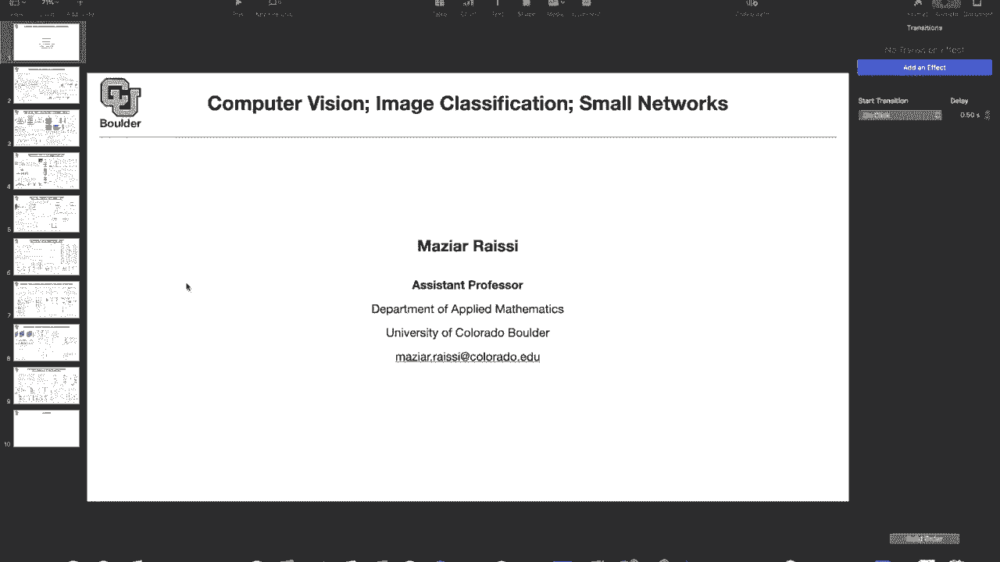
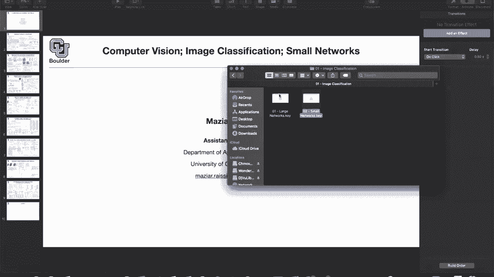
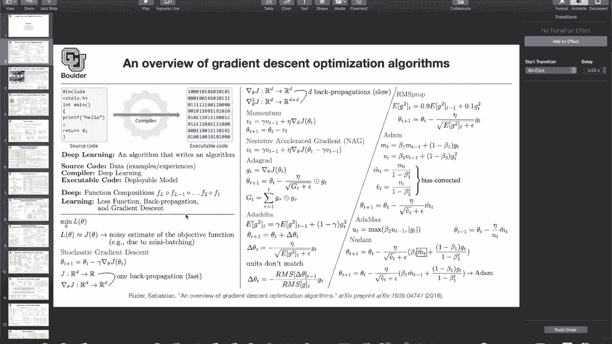
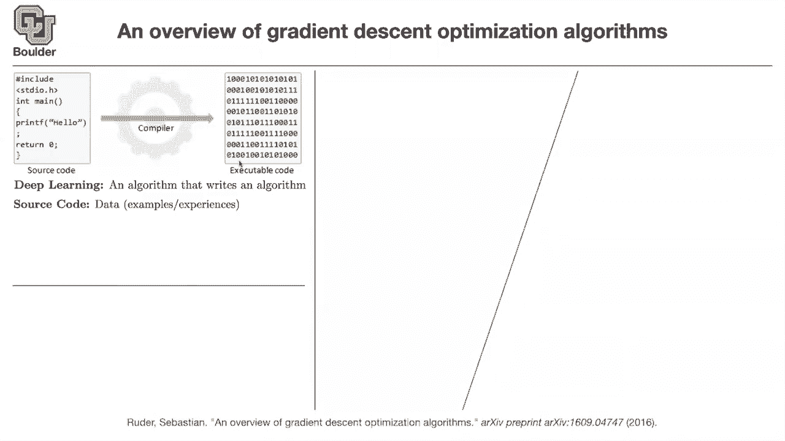
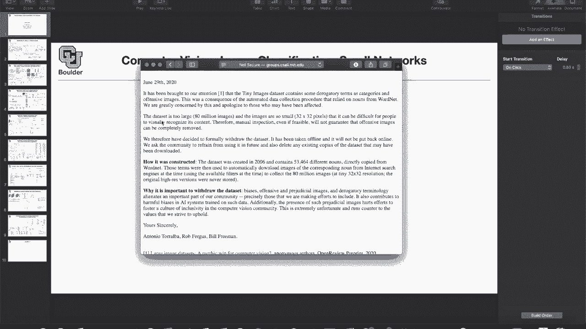
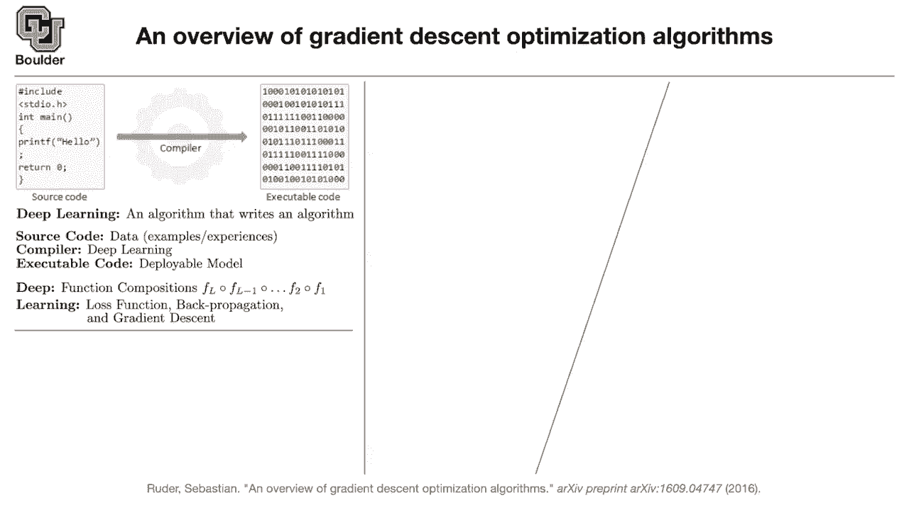
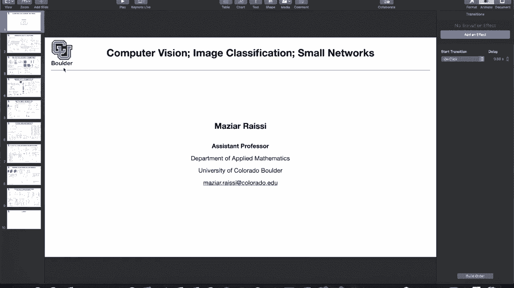

# 【双语字幕+资料下载】科罗拉多 APPLY-DL ｜ 应用深度学习-全知识点覆盖(2021最新·完整版） - P26：L14.1- 小型神经网络 - ShowMeAI - BV1Dg411F71G

uh before we get started i want to go，back to this。

slide the first slide that we covered in，our class。

and try to remember what i said about，deep learning in general。

so deep learning is mostly being pushed，forward by computer scientists。

and there is a reason for that the way a，computer scientist，think is that there is a source code you。

compile your source code，and then you get an executable code in，the end so you get a program。

or a plugin that they can actually maybe，put it on your browser and then，you。

for instance or is translating from one，language to the other，where is converting speech to text etc。

but then for deep learning，and for some of the problems writing the，hand design。

code is very complicated like what i，just explained，take a speech and convert it to text or。

take a look at an，image and say what's inside that image，so these are really complicated tasks。

for uh，for anybody to write a source code of，that task，so the source code is going to be your。

data and deep learning is just an，algorithm that writes an，algorithm so it's a compiler so i want。

to emphasize this the source code，is your data so any bugs that are in，your data。

are going to get carried over to your，executable code in the end。

if your source code basically your data，is racist，there is biased there is bias towards a。

particular gender，like there are more images of male，compared to female。

in your data then through the compiler，it's going to get translate to your，executable code。

so your executable code is gonna have，the same bias，the same bug basically so last night。

i was reading a very nice report and i。

got really excited about it because it's，gonna help me prove a point。

so you know about c510 and c4100，so these are the authors of tiny images，and c410 and c4 100。

are subsets of that data and that data，is taken down on，june 29th because the data apparently。

had some，varigotory terms as their categories and，on，to say that they had an automated data。

collection procedure，so they were just downloading data from，wordnet。

actually for their labels for their，categories and the other problem with，that data。

is that it's 30 by 32 pixels so it's，very hard for human，to see with naked eyes what is actually。

that image，representing but what's the take-home，message here if your data is sexist。

your algorithm is going to end up being，sexist if your data，has any other bias your algorithm is。

going to have that bias，that comes out of deep learning if your，algorithm if your data is racist。

then your deep learning algorithm is，going to be racist as well。

and any other sort of bias is going to，get carried over to your data。

to your algorithm so this is something，to keep in mind，yes we cover algorithms they are。

exciting we have fun，doing algorithmic designs but in the end，the data matters。

any questions and there is actually a，nice field，these days that that is coming up and，that's about。

bias in deep learning and how to avoid，it and how to mitigate it。

any questions any comments any feedback，i'm not sure about actual。

c510 and c4 100 to have problems or no。

but it's probably the case that they，might be，contaminated as well okay there is，another。

lesson from the first slide and the，lesson is，in the end you want to end up with an，executable code。

and that executable code is the model，that you actually want to deploy you，want to put it on your。

home page you want to put it on your，website have you guys，do you guys know about amazon go no i。

think they have a branch，in uh in san francisco and the other，branch。

might be in new york and once you enter，the，there，you take whatever you want and then you。

go out and then your cell phone，and your bank account is going to get。

charged accordingly so that's one，application of，computer vision so they have to detect。

you they have to detect the object，once they detect the object they know。

the price and the rest of it，is nice algorithms and putting it into，practice。

okay so in the end you're gonna have a，deployable model，that you want to actually deploy in。

practice that deployable model，needs to run fast if you have a，real-time video。

then that image classifier or，object detector and basically your，convolutional neural networks。

they have to act really fast they have，to act in real time because。

the final aim is that you want to have a，model，on your cell phone you want to deploy。

that model on a drone，you want to deploy your algorithm，whatever that comes out of the deep。

learning framework，on a robot and they have to be able to，act fast yes you are gonna train them on。

powerful gpus but in the end these，models need to be deployed on，i don't know an fpga or a cpu。

or even a smaller size gpus，and now that we are on the same page you，know why small networks。

matter by small perhaps a better word，would have been efficient，but then there is a paper called。

efficient math i didn't want you to，confuse，that everything is about that efficient，net。

so it's about networks being small for，you to be able to deploy them on。

less powerful computing resources are，there any other advantages of small。

networks can you say better things about，their their properties in general。

there are two things by a small what do，i mean by small，one is computational wise so。

they need to be fast and agile so they，need to，be efficient in terms of floating point。

operations the other aspect is that they，need to have，reasonable memory footprint they，shouldn't be。

giant models too much parameters etc，okay but there are there aren't better，uh。

convergence properties or anything like，that i'm not sure about convergent，properties。

and you need to take this into account，now we are，doing a multi-objective optimization one。

of our objective，is to get our networks to be as accurate，as possible。

the other objective is now we want them，to be efficient，whenever you have a multi-objective。

optimization，you are going to have a pareto frontier，so there is no unique solution but there。

is actually a curve of possible solution，and there is a trade-off between how。

accurate you want your model to be，and how computationally expensive you，want it to be so you。

we need to balance that trade-off so，does that answer your question。

uh a little bit yeah i think so in terms，of convergence，i think that was your question are they。

better at converging，there are multiple ways to design，smaller networks。

and i'm gonna tell you representative，papers of doing that，one of them is that you have a large。

model and you try to distill the，knowledge in your large model in a，smaller one。

there are some model pruning weight，pruning etc，the other trend is to start with a small。

network and train it，so i guess your question might be，relevant to that type of。

networks yeah i think so but that's not，the only way of doing it okay the。

message that i want you to take home，from this series of lectures i guess in。

the next couple of weeks，is that there are multiple ways of doing，it but the final aim。

is to deploy your neural network model，and try to actually use it，so how many of you know about iot。

internet of things，so yes the idea is that you're gonna，have a lot of things。

and those things whatever that's moving，or even is static like controlling the。

temperature at your home，or motion detectors at your home all of，them are gonna be。

smart in the future and i guess the，future is very close，and most of these are gonna be small。

objects，and they're gonna be connected to an，internet and then our internet is gonna，explode。

in terms of the size etc it's not only，human，that are connected to the internet but。

our cars are going to be connected to，the internet，our motion detectors at home are going。

to be connected to the internet，and all of it is about these small，devices。

being smart and by smart there is a，neural network，behind the scene and those networks need。

to be small so in academia，this is one thing that people usually。

neglect about deep learning is that in，deploy。

