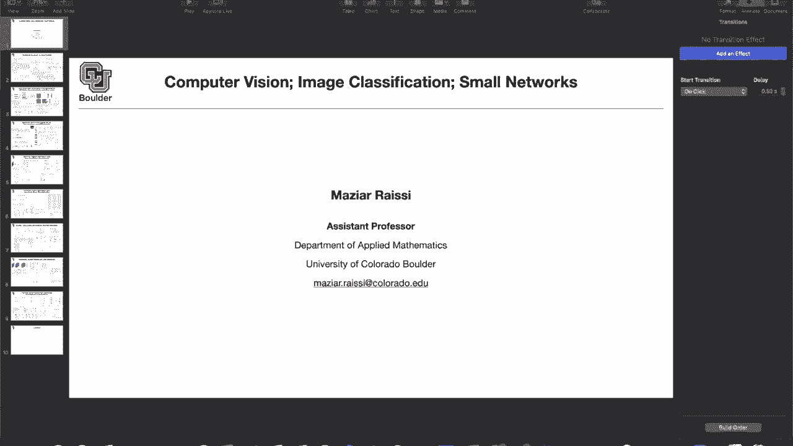
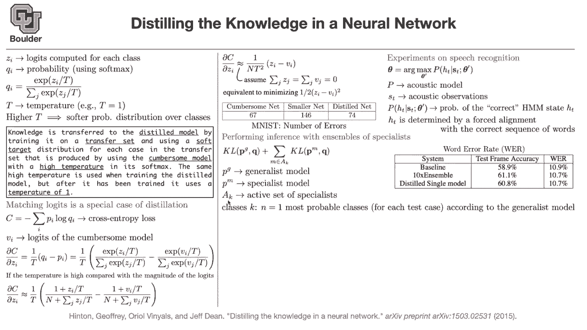

# P28：L15.1- 知识蒸馏 [续] - ShowMeAI - BV1Dg411F71G

to make the class a little bit more，interactive can，somebody explain to me why we care about。

small networks，in layman's terms if we're trying to run，something。

real time we want to keep the network，small so that，prediction is fast yeah perfect and what。

are some of the applications，um jack blake said iot or any sort of，robotics。

uh needs real-time neural networks，robotics self-driving cars etc，your。

cell phone you want to translate from，one language to the other one。

i think right now the technology is that，we are sending out data，done。

on a neural network on the server and，the data are being sent back to us i，think if 5g。

happens at some point and i think it's，happening already，that could actually be a viable option。

for many of the，problems but still when you want to do，medical applications。

some patients are not willing to share，their data over the internet。

maybe for simple applications like doing，a translation that's acceptable。

you're willing to share your data but，your medical records，i'm not sure if you wanted over the。

internet okay does that make sense，for those sorts of uh applications we。

are gonna need small networks and the，objective of small networks。

is putting neural networks and deep，learning into production it's not going。

to solve all of the problems，it's going to solve a particular aspect。

of the technology that you want to build，it's just going to be a small component。

if you want to use neural networks in，production，there is a lot of effort that you still。

need to put in place there is a lot，of software engineering and hardware，engineering that goes into。

making these tools applicable maybe as，an application，when you want to do self-driving cars。

one part of it is that you want your car，to be able to see to identify objects。

and to say that's a pedestrian that's a，stop sign that's the line，just。

a single component there are some teams，in big companies，that are working on the security of。

their systems，they want to reduce the failure rate and，usually in production it's not only。

one network and one methodology that，you're going to use you're going to use。

multiple of them if you have a line，detector，in the case of a self-driving car you're，gonna have。

multiple different neural networks，collaborating to reduce the error rate，because the risk is huge。

now you're playing with the lives of，human and you want to avoid accidents。

that's a little bit about the。

application of deep learning in general，do you have any questions perfect so。

what did we what did we cover，we said that one way to create small，networks。

is to try to distill the knowledge in a，larger network，in a smaller one and then we said we can。

start with logics find，the profits introduce a temperature，the higher the temperature the software。

is going to be your probability，distribution，you generate artificial data from your，giant model，from。

your cumbersome model to train the，distilled model，using the same temperature once you're。

done in production，you set the temperature to be one and，use that for your predictions。

and we said knowledge distillation is a，general case for matching logics you can。

actually go ahead and try to match the，logics，of the distilled model and the，cumbersome model。

using regression and that's going to be，just a special，case why is that a special case because。

you are making some assumptions，you are making an assumption here that，if the temperature is high。

then you can do taylor expansion and the，first two terms is going to be a good。

approximation for exponential that's the，first assumption that we made。

the second assumption is that we try to，make our，data，under these two assumptions matching。

logics is a special case of knowledge，distillation and we see that。

the formula up there is coming from mean，squared error this one half here is to。

get rid of these two when you take a，here，cancel out and you're going to get z。

minus v so these are equivalent，procedures，and we said it's actually useful because，you can train。

a smaller model using the cumbersome，model and achieve，lower errors lower number of errors。

compared to training that a smaller，network from scratch，on real data so that's a useful，paper。

for what is the best temperature they，compare them，i don't remember the actual number but。

it's a number bigger than one and then，we said this is not only for。

images and image classification you can，actually apply to different fields like。

speech recognition natural language，processing etc，i will talk about speech recognition in。

more details，in its own appropriate time either this，semester or next semester depending on。

how fast we are moving，but for now the take-home message from，this slide is that。

this framework is general and it's also，applicable，to a speech recognition and other。

applications in a speech you have a，state，you have an acoustic model you have your。

acoustic observations，which could be in the form of melee，spectrograms then you have。

a hidden markov model and you are，predicting the probability of the，current the correct date。

h so that's what h is representing there，are nowadays some other techniques。

to try to train these models but at that，time they were using a forced alignment。

technique to align the sequence of words，to the，sequence of sounds in the data or。

acoustic observations，because these have to be aligned a big，problem in speech recognition is that。

these are not aligned unlike natural，language processing，and specifically translation that one。

sequence is going to come after the，other one，we don't know where to cut speech and。

how to collect our，acoustic observations and how to align，them with the。

sequence of words and there are some，techniques to take care of that。

and once you do that there is the word，error rate that you're gonna report。

and when you do a distilled single model，it's actually doing as good as。

10 ensemble models in terms of word，error rates，there is another technique that i want。

you guys to learn about it's not about，distilling，the knowledge in a smaller network but。

it's another technique for，creating ensemble models it's not，relevant to。

knowledge distillation but it's a，technique that people actually use，you。

took a look at imagenet have you，downloaded it anyone so，ceruse downloaded it and what was the。

size of the data so it's huge，it's gonna take a lot of space on your，computer。

but that's nothing compared to what，actually people use，in practice in giant companies like，nothing。

in terms of size there are only 1 000，labels，so it's 150 gigabytes thank you sir。

so these are huge data sets but that's，nothing，in scale compared to what people。

actually use in practice when it comes，to production，uh，memory wise um for like a huge。

production network，from like a company like google it's big，enough that it's not gonna。

reside on a single computer that's big，data it's gonna reside on multiple，the。

that's one problem and that's why people，uh try to work with big data sets。

using tools like spark apaches part etc，even taking a mean on that type of a，data。

is not easy what is the mean of that，data what is the summation of that data。

but there is also another catch，mathematically，is that you have in imagenet you have，1000。

labels you might have 15 000 labels or，even more，when we go to face recognition it's a。

classification problem，over there you are associating faces to，names。

in the wild so you're gonna end up with，a lot of labels，or a lot of categories the question is。

how are we gonna train a，deep learning model on that and that，type of data there is。

one nice technique in this paper and，they introduce a specialist。

and a generalist the generalist model，is going to use pg for，the probabilities associated with。

categories so for instance this guy，could be，15 000 dimensional and there are some，specialists。

what's gonna happen is that the，generalist is gonna confuse，a bunch of the labels for instance。

different breeds of dogs，the generalist might be able to say that。

the image in this picture is a dark but，it might not know what breeded what，breed that is。

or it might understand that there is a，mushroom in the image，but it might not be able to understand。

the fine-grained details，of what type of a mushroom that is so，the generalist is gonna confuse。

a bunch of categories and at each，particular，instance there are some specialist，models。

that their role is to take care of those，fine-grained，categories so they're going to。

specialize in the category of dog one of，them is going to get，specialized in the category of cats or。

model，you have a specialist model and you have，an active set of specialists。

because not all of them are active you，push a bunch of data sets through your，neural networks。

now you have multiple neural networks，some of them are generalists some of。

them are specialists you push a，bunch of images through your neural，network you feed it forward。

and then at each particular instance，some set of those specialists are going。

to be active for instance the ones，responsible for dogs are going to be。

active and there could be that multiple，of them are responsible for dogs。

that's okay or multiple of them are，responsible for chats mushrooms。

etc different types of cars and what is，this k。

denoting we are gonna say that k's are，the classes，for instance only one of them or n of，them that。

are most probable classes according to，what the general list model thinks。

so the generalist is going to think that，these n，classes are most probable because you。

can look at this probability and see，which one is the maximum。

these are your classes k and what is a k，so there is a set of confusable classes。

that the generalist model is going to，confuse for instance docs they are going。

to be associated with a bunch of models，maybe a couple of models and we are，going to。

take care of the ones that have a，non-empty intersection，with k so this is how you determine。

which ones are active so is this clear，and as i said the confusable subset of，classes。

for instance could be different breeds，of ducks or，different types of mushrooms or。

different types of cars and i was saying，there is this，giant data set it's internal so we don't。

have access to that，that google uses it's very similar to，imagenet，in imagenet you have 5。1 million。

labeled images here you have 100 million，labeled images，in imagenet you have 1000 labels here。

you have 15 000 labels and how do you，get the set of，confusable classes you do k-means it's a。

clustering algorithm，it's a classical machine learning，algorithm you do k-means you cluster。

the confusion matrix of the general list，model so this general this model is。

going to have a confusion matrix you，cluster that，and these are the type of clusters that。

you're going to get this is one cluster，tea party easter bridal shower。

baby shower easter bunny so the，generalist model is confusing these。

there is a question to build the data，i'm gonna show you some papers that，actually walk us through。

how to build data in an automatic，fashion and with the help of。

human labelers i'm going to show you an，example of that，because this is really important as i。

said data is the source code when it，comes to deep learning and that's a。

great comment that blake is making how，many of you know，about amazon twerks i think that's a，series。

that you can use to do different sort of，things like，labeling the data or evaluating your。

maybe you have a generative adversarial，network your network is generating some，images。

there are very few good metrics to say，is this a good image or no。

then you can actually show it to human，subjects and they're gonna say oh。

this looks real no that doesn't look，real etc perfect so，yes so you can outsource your small。

tasks like labeling images drawing，bounding boxes etc，to amazon torx but these big companies。

hire their own labelers when i was at，nvidia，there were some people in in india who。

are actually responsible for，labeling the data and there is actually。

a huge mechanism for doing that there is，a huge infrastructure，for how to label the data efficiently。

and there is actually a loop，you label the data your model is，confusing some of them you take those。

that the model confuses you gave them，back to human labelers，and there is a loop and that loop is。

always evolving basically that's how you，make money from your data but let's go，back to the。

technique that's what we can actually，work on，we don't have access to massive data。

sets we don't have，in academia we don't have access to，powerful。

computers as powerful as the ones that，you find in these companies。

but for now let's just see how the，methods work there are three components。

for deep learning to shine that's giant，data sets，of high quality of course computing and。

the other one is method algorithms i can，teach you the algorithms and i can，comment on，of。

confusions that this network is making，it's confusing bridge cable state bridge。

suspension bridge viaduct chimney etc，it's confusing those it's also confusing，toyota corolla。

opel signum astra mazda etc so the giant，model is confusing those。

i mean the generalist model actually，mention，is that these specialist models are。

initialized with the same set of，parameters that the generalist model was，trained on。

what do you get in the end after all of，these，techniques your baseline with 61。

specialists is gonna give you this，improvement，conditional test accuracy is when you're。

conditioning on the labels and test，accuracy is，test accuracy in general for all of your。

data for all of your labels and that's，the improvement that you get。

and the cool thing is that these uh，specialists，can actually sit next to the data it。

means that they are going to have quick，quick access to the data that they need。

so is this cool i just want to make sure，that i understand this the the，generalist model is trained。

first and then you do some kind of，clustering on the prediction errors that。

it makes and group them like it makes a，bunch of errors about bridge looking。

things and it makes a bunch of areas，about car looking things，it makes a bunch of errors about uh。

bridal shower and baby shower type，images and then for each of those，clusters you。

initialize in a different model with，that narrow data set from like the set，one or two or three。

train that specialist model and then use，them to to boost the accuracy。

exactly so and why are you confused you，got it perfect all right。

just making sure thank you no you got it，than，i did so there is a generalist model。

it's trained it's gonna be confused，on a bunch of uh fine grains details。

like tea party easter et cetera it's，gonna confuse on them，and you have a bunch of specialist。

models one，specialist model responsible for tea，party，for，jft2 another one for jft3 and you have i。

don't know many of them，and at each point in time a specialist，is gonna。

try to distinguish these from each other，forgot，there is a dustbin class you have maybe。

1 000 entries here you're gonna add，another one it's the rest it's where you，put the rest of the。

observations in do you know about one，versus rest classification。

it's going to be 10 versus rest so there，is a dust pin，where you're actually putting these。

toyota corollas etc，on that dustbin the number of，specialists is a hyperparameter。

yes you're going to set the number of，specialists and that's，that depends on the capacity because。

even these models are gonna have，parameters and they need to be able to，fit on your。

computer so depending on the amount of，resources that you have。

you're gonna come up with i don't know，10 specialist models or，100 specialist models there is also。

another catch that i forgot and that's，because these models are specializing，and they have。

the same power as your generalist model，they are prone to overfitting how do we。

take care of that do you have any ideas，dropout is one option。

any other options do you remember label，smoothing for regularization，we introduced it in inception。

architectures，and the idea was that sometimes you fake，it and。

say that a random label is a true label，you try to cheat the model with a small。

weighting factor so you can use label，smoothing there is another technique for。

label smoothing and that's just，what we saw here you are asking me why，this is 0。9 and why this is，0。

1 that's another way of doing label，smoothing rather than this，actually。

smooth your labels that's another way of，topic，i have a question so can we chain。

the specialist models with say a super，specialist，in case we have some categorization，problem that's。

still difficult there's still another，layer of categorization，layer。

is that possible absolutely i think and，what would be the，difference between the generalist and。

super specialist，rank，compared to a specialist i think the，super specialist be a specialist。

and specialist to be like a generalist，to the super specialist。

i see so i i don't see any reason why we，couldn't do that，based on our um our formula here。

yeah you can absolutely we just have，another layer another，layer of summation within the summation。

of our specialists，over ak no you can't do that actually，you might have different types of tea。

parties，what you're saying no definitely it，seems you could run into issues with。

just the model getting gigantic then，because you'd basically be。

training an entire neural network to to，look for toilet toyota corollas。

versus everything else and you have an，entirely different，huge model to look for suspension。

bridges versus everything else，if that makes sense yeah i think，argument yeah complexity would be a。

problem but i'm thinking like，mathematically is it possible yes but i。

i included this topic because i wanted，you to know that，how people are actually using deep。

learning and what type of data that they，have etc，in practice and you might say why are。

these big companies，investing in super computers etc usually，super computers were for。

national labs but these days you're，gonna find them in these giant companies。

why is that because they have massive，data and massive compute。

for the endeavors that they are engaging，in like safe driving cars they have a，massive。

infrastructure just for collecting data，and sometimes，data coming from data to train these。

neural networks，are not real data you can have，simulators to simulate。

how a car sees the world yes that data，is of a lower fidelity but it's still。

usable you can learn on that and，transfer your knowledge to real settings，so many people think that。

actually there is a hype around deep，learning but no，deep learning is there because it's。

working it's solving real problems and，it's causing new problems that are。

constantly constantly being solved so，that's an exciting field to be in。

these days it's not just a high any，other questions，and what i'm trying to do during this。

course is to tell you what the，difficulties are，actually yes they can do cool stuff but。

if you go into the details，there is mathematics there is computer，science issues。

how to scale things up etc okay let's，switch gears a little bit so distilling，knowledge。

is a way to transfer the knowledge from，a giant neural network and distill it，into a。

smaller network once you have a smaller，network you can use it in production and，actually。

knowledge distillation is a way to，defend against adversarial attacks we。

are going to talk about adversarial，attacks later on and why are adversarial。

attacks important because，now you want to use deep learning put it，on your car。

and there are going to be attacks on，that there is going to be malware etc。

and if there is any mistake or if there，is any attack that you are not able to。

defend against it then you are in，trouble so，no there is a minor catch there is a。

minor difference between，transfer learning and knowledge，distillation we are going to talk。

about transfer learning for a couple of，sessions and there you're going to，understand。

the difference but for now in general，whatever that we learned from，classification networks。

knowledge，to different problems like object，detection or segmentation so that's。

called transfer learning this is，knowledge distillation and things are，happening through the loss。

there is actually a training going on，there is the，the difference is minor but you are。

going to see why this is minor with，transfer learning you usually。

fine-tune your network here we are not，fine-tuning a network we are creating a。

network from scratch it's，smaller but then we are training that，smaller network。

using the knowledge in a giant network。