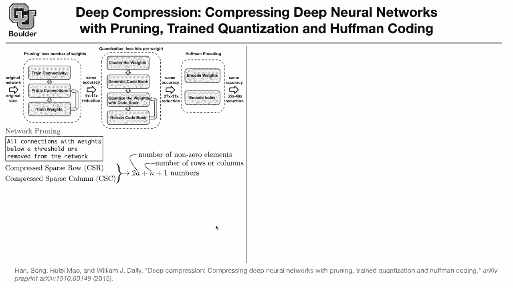

# 【双语字幕+资料下载】科罗拉多 APPLY-DL ｜ 应用深度学习-全知识点覆盖(2021最新·完整版） - P29：L15.2- 深度压缩 - ShowMeAI - BV1Dg411F71G

Let's move on。 Now somebody gives us a trained neural network， And the question is。

 can you compress it， That's an alternative way。 The network is trained。 Now we want to compress。

 You can compress it using three methods pruning quantization and halfmanco and we are gonna see the effect of each one of them when it comes to network compression。

 The first step。 you start with an original network。

 It's a big network like AlexNe let's assume that's Alexnet。 It has its own original size。

 We prune it。 I'm going tell you what is pruning。 it's not that complicated。

 and after pruning you reduced the amount of computations and parameters actually by nine times or 13 times you're making your model smaller。

 The next step is to quantize the weights。 I'm going to tell you what that means in more details later on and then there is halfmanco in the end。

 So after quantization your network is going be 27 until。

31 times smaller。 And after halfmanco， you can reduce the size by up to approximately 50 times。

 So what is network pruning。 It's very simple。 All of the connections with weights below a threshold are going to be removed from the network。

 if it's already close to0， let's assume it's zero and remove it and the way after you remove it。

 your weights are going to become sparse now So far our weights where not a sparse Now our weights are going to become sparse and when they are sparse。

 there are two ways to represent sparse data， one is CSR and CSC， no matter which one you use。

 you' are gonna to reduce the required bits to this number。

 only thing that matters is the number of non-zero elements and the number of rows。

 if you are using CSR and if youre using CSC N is going to be the number of columns and that one here is just to be accurate。

 It doesn't matter。 So that's how you reduced from dense matrix to a sparse matrix。

And that's the number of that's basically the amount of numbers that you need to store rather than the entire metrics Can I ask your a question about that is it feasible to implement sparse matrices and something like a microcontroller if you're using your network in an application like that definitely there is actually a paper a followup paper by the first author that they are actually designing a hardware to use this setup is it very like specifically designed hardware or is it something that you can implement on an arbitrary like any arbitrary hardware think they are designing a specialized hardware but the cool thing is that you can actually start with the fPGAs and try to use FPGs because FPG you can design them on the fly These are some rules that you have to encode in an FPG and then the FPG is going do the tasks that you want Okay which networks in particular are they talking about here with these reductions because it seems to mean like。

Convolutional networkss are already in a sense like optimally sparse that's the reason why we used these convolutional filters and then there wouldn't be an ability to prune as much as as a dense network so I'm going answer your question shortly but we are one minute over time for those of you who want to leave you are more than welcome to leave and those of you want to stay and ask questions I'm going be around even for convolutions Yes there are sparse in a space but there are still dense in the number of channels still when you go from one layer to the other one you are doing a huge matrix multiplication on the number of channels so the idea is that to make that sparse and it's gonna save you space does it answer your question it does so I guess like if there's if there's now 100 channels it might end up being the case that only 10 or 20 of them have large weights and the rest of them through randomness in the training have very small values and then you can just。

out that channel or is it or is entries within each channel get zeroed out entries within each channel。

 Okay， so it's gonna be the neurons that are gonna be zeroed out and then dropped out but the entire channel。

 is it still necessary we are gonna keep the number of channels fixed So that helps in terms of storage。

 but it wouldn't necessarily make it any faster for evaluating these are great questions that depends on how you're gonna do your matrix multiplication using sparse linear algebra That's right Yeah。

 because if you think about it now you need less for loops。

 This is the number of for loops that you're gonna need Yeah that depends on how you implement any other questions thank you I had a quick question So from these sort of this figure you have at the top here it seems like these compression techniques are at least partly carried out during training like in tandem training I that is that always the case or do sometimes sometimes people only do this compression sort。

On a prebuilt model That's a great question。 Actually you start with a pretrained model。

 So your model is pretrained。 It could be Alexnet。 it could be a Google net。

 it could be whatever type of methods or neural networks that we learned in the previous section of these course about large networks you start with that but then for pruning you do the pruning。

 you drop the weights that are very small， but then you do another round of training。

 very modest round of training， maybe one gradient descent or two gradient descent to adjust whatever weights that are left to still maintain the same level of accuracy from the model So there is a slight fine tuning going on here you first drop the weights you prune them and then you train but you are starting with a pretrained network Does it answer your question Yeah I guess I've usually thought of them as these like compression methods is like two distinct like either you do it while you're training like while you're doing an original training。

You do it posttrain and you don't retrain again， you just like alter the network in ways to make it smaller but I guess this work you start with a network that's pretrained you prune it and they retrain it Do you know if you can get I don't know if you can have more success if during your if you train if your original training is with the goal of a compressed network in mind that we are going do later on but you're absolutely right So part is saying pruning is sounding like loss compression actually no for this for neural network there are a lot of weights and biases the network is overweighted over parameterized and it turns out that most of them don't matter once the training is done So what you're doing with pruning is you're dropping that weights if you overdo it yes you're going end up with a loss compression but if you do it moderately if your objective is to reduce a number of weights by nine times。

going be Okay and the other catch is exactly what we are discussing with Cooper once a network is trained once it is pruned。

 you retrain it to maintain the same level of accuracy and this paper is actually reporting a network with 49 times reduction in the number of computations and storage and as accurate as Alexnet So our metric is the behavior of the model and not the structure of the model Yes so in the end it matters how accurate I see and Omar is saying is this last step of training after pruning if you remove the neurons How do you do gradients to sparse matrices I it the same thing but zeros field in place of the remove neurons So yes that's how you're going do it during training you can simply zero out the neurons do your training and then drop make your network sparse when you want to actually use it in production。

And put it， I don't know on a mobile device doesnt answer your question， any other questions？

