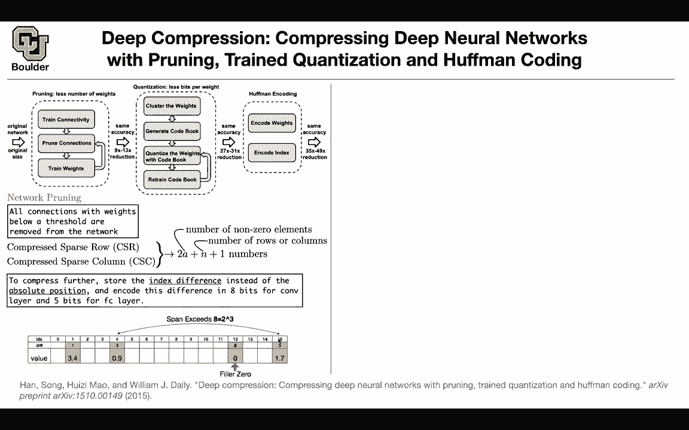
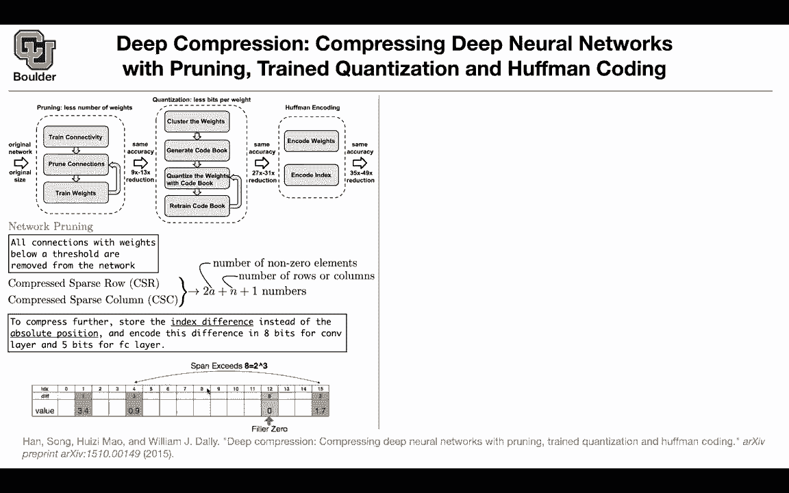

# P30：L16- 深度压缩 [续] - ShowMeAI - BV1Dg411F71G

last session we started with compression， deep compression。

 which is about compressing neural networks with three methods。

 pruning quantization and halfmancoing pruning was very simple basically the idea is that these neuraln networks are usually over parameterized and one observation is that many of them are close to zeros if that's the observation many of the weights have values close to zero if that's the observation then probably we can actually set them to be equal to zero force them to be zero and that's called pruning and once you force them to be zero your matrices are going to end up being sparse and for sparse matrices。

 we can do sparse linear algebra and they are efficient ways to do arithmetics and those types of matrices as well as efficient ways to store them for instance you can have compressed sparse row CSR and CSC these are two types of methods and as you can see the number of numbers that you're going to need to store。

IDly related to the number of nonzero elements so rather than storing n square terms if your matrices if you have a square matrix with size n you're going to need n squared numbers now you're going to need much fewer numbers to store so this is what we cover class session actually to further is there is one problem you need to still store the indices because you're going to tell at this index I have this number these floating or this value but then because these are sparsrs you need to store the indices the idea is that rather than storeing the indices you can actually store the index difference rather than the absolute position and for convolutions we are going to use eight bits and for fully connected layers we are going use five bit to store the weights but what does it mean visually to store the index difference these are the absolute values of the or the absolute positions0。

1，2，3，4，5 etc。

And storying for instance 15 you can store three so how does it work let's say at the first index。

 you have a value of 3。4 then the next nonze entry in your array because matrices you can actually represent them as an array that's how they are represented in memory So you have an array of consecutive numbers The next none that you have a nonzero element it's at position 4 you need to store4 because four is less than8 so you're still allowed to store that number but then the next nonzero element is appearing at 15 and what's the difference1234567891011 So the difference is bigger than 8 you're gonna put a dummy value here at the eighth position you fill it to zeros and then the next one is easy because we can store the difference as a number three rather than number 15 So this way you are making more efficient use of the memory by story in indice is difference I that clear。

More efficient is this how much more efficient is this in memory complexity I guess actually that depends on how unlucky you are if youre really so usually the way that these types of analysis are done there are there going do worst case scenario or best case scenario and then there is gonna be an average memory consumption when things are random you take the expected value and what are we taking into a cow you might be really unlucky and each time our indices are by one number bigger than the index difference where you have the nonzero element first you have a nonzero element here then you're unlucky and the next nonze element is at night then you need to store an extra zero here okay then the next time you're going be again unlucky and this one is going be I don't know at position difference9 then youre again storing a fielder0 and then that's going be really bad but on the other spectrum on the other end of the spectrum you might be really lucky each time and all of these values are。

Less than8 I'm not actually sure if that's the best day scenario there is also another case that these numbers are randomly treated and then you have to take expected value so I don't know the exact answer to to your question what is the exact efficiency that you're going get out of it but is more efficient than the storing these numbers 15 and then you have to store I don't know 1001 and then I guess sort of different questions when you actually multiply one of these structures in hardware do you have to turn it into a regular sparse matrix first but no this is just for storing the indices Okay so the way the algorithm works is that whenever it see as filler zero because we know that in our matrix we are not gonna see zero because these are sparse we got rid of the zero by pruning so whenever you see a0 you know that the index is the addition of8 plus this current value so you can just read it just one more operation see you any other question so that's for pruning how do quant。

Your weights So pruning is going to save you nine times or 13 times less in terms of the parameter。

 The next one is really interesting。 It's giving us a boost in terms of reduction that's actually very good reduction So how are they achieving this The idea is weight sharing and if you think about it weight sharing is at the core of convolution on neural network and it's actually at the core of deep learning in general we were sharing weight when you were doing convolution and we were sharing them by sliding a window over our pixels over the entire image and the parameters of those small windows were sharing among all of the windows that you're gonna slide over an image for the current neural networks。

 you're going to do weight sharing and you are doing weight sharing over time you use the same weight and biases from one time step to the next one now you can use the idea of weight sharing to quantize your network How is that going to happen You have a bunch of weight the blue ones if you look at them。

Theyre really close to 22。092。121。921。8 steps。 So these are closer to2。

 The green ones are close to negative one。 The orange ones are closer to 0 and these ones are close to 1。

5 what you're going do is you're going to do a clustering algorithm on these values and you're gonna end up with four centroids for your cluster and the clustering algorithm is actually for this example is going to give you two1。

50 and negative one you still need to store the cluster indices to know where your rates are actually residing for instance three is corresponding to this location。

 that location， this location and this case and negative one corresponds to these zero location and the idea is that all of these blue values you're going assume that they are two all of these orange values you're going assume that they are 0 and all of the green ones you're going assume they are negative one So what's the difference initially you have to。

Store 1，2，3，4，5，6，7，8，9，10111213141516 and each one of them mark floats。

 they're gonna take up 32 bit of your memory now what you're gonna need to store is a2 bit on integer for the indices and for floating number So that's what you're gonna need to store and we are gonna treat convolutions and fully connected layers differently for convolutions。

 we are gonna use 8 bit which is gonna give you 256 cents and5 bit is gonna give you 32 cents for your fully connected layers and before I go into more detail Can somebody tell us why we treating convolutions different from fully connected Why do we need less bit do we need fewer number of convolutions are already smaller in data so we can get away with using more bits because it all processes1 say it again my volume was low the fully connected layers are larger generally than the。

and so it is more costly to store them with high accuracy。 That's one reason。

 and there is also another reason Parker is saying Rcn and parameters is more sensitive that I'm not sure but I'm looking for another answer if you think about it quantization is similar to pruning pruning we were setting the values that are close to0 to be0 quantization you are setting the values that are close to two to be exactly to so you are somehow sparseifying your matrices you're making them sparse so knowing that what's the difference between the convolution and the fully connected like convolutions less unique values to store youre sort of close the fully connected layers more tense exactly so fully connected layers are more tense to begin with compared to convolution convolutions are at least sparse in space maybe in channels they are not sparse in terms of a number of filters they are not sparse but but in space theyre already sparse enough and if we go back to parker's answer it means that。

Those parameters are actually if you think about it more sensitive。

 they are carrying more information with them。 So I think we are all on the same page。

 but let's see how much we are saving and what is our compression rate。

 we want to see how much we are compressing if we go from this setup to storing only the cluster indices and the centroid how much are we saving if k is the number of your clusters in this case four of them and log 2k is going be the required bit to encode the index because we are using a2 bit and this two here for the log is coming from that that's the required bit and then we are storing n numbers。

 these are the numbers that we are rest storing， for instance we are rest storing 16 numbers here we need to store 16 indices so this guy is going be 16 this guy is going to be 16 log 2k is for representing these numbers012 and 3 K is the number of centroids and the number of clusters that you have in this case is four and B is a number of bit if you are using flow 32 that's going to be 32 bit and for that particular example。

So you have 16 numbers。 Each one of them is 32。 This is the amount of memory that you're gonna need to store this weight matrix。

 you still need to store 16 numbers， but they are going cost you less because these are two bit actually these two is coming from taking the log of4 with base2 that's going give you2 and then you are gonna need to actually store four centroid each one is going take up 32 bit and this is the comparison rate precisely for these particular exam。

 So doing that you are saving 3。2 but we know that we are going use 8 bit and we are going to use five bit and we have much larger way in our network in the end the reduction is going be of these 27 times until31 as the comparison rate that's how much smaller your network is going end up it How do you find the centers and the cent you do kmin let's see a high overview of k means last string algorithm you start with n original weight in this case you had 16 these are these W1 until W 16 we want to have only four cents or we。

K clusters K is much less than N and we don't know the values of c1 up until C What is the objective function now if you want to write an objective function you want to minimize this objective function which is basically within clusters some of the square some of square differences between your clusters and your weight and the way that you typically solve this problem is using expectation maximization there is one expectation which is basically taking the mean of the cluster and there is a maximization step so that's E algorithm and that's going to give you four cent so is everything clear we knew that these are close to two but we need an automatic fashion of figuring that and that's how K means is going to come to rescue us are there any questions so far is this very sensitive for the clustering algorithm you use not really what's the diagram Well I guess my first question is these centroids that we calculated here just so just so happened to be like multiples of 0。

5 but in general they'll be as precise as whatever。

or 32 bit or 64 bit or whatever you you're using for your floating point numbers Ex so yes。

 these are gonna be values that you're gonna represent case say werere just kind of cooked up by hand to have a really clean average of 2 and 1。

5 and0 Yes so this is a toy example do we lac the concept but yes you are right usually this K is gonna be off the order of 256 not four of them and and is gonna be usually huge the number of gals in your weight and do we learn this per channel or do we learn this for the entire set of weight matrices you learn it layer wise and then last question is this fine tuneed centroid diagram like what is what is the stuff at the bottom with the 0。

4 and 0。2 and 。04 negative 。03 Yeah great question that's where I'm going next if you stop here with the centroid yes you compress your network and we had a comment last session that this is gonna be lay which which is a very valid comment before I。

Forward there is a question on the chat do we pick the number of central and if so how yes so we pickk and we pick it to be for convolutions to be 256 and for fully connected we pick it to be 32 K is 256 for a convolution and it is equal to 32 for a fully connected does that answer your question I would imagine one driving factor is the target network size like we're trying to cram this network onto a certain piece of hardware that only has like so much memory and whatnot then you can pick your clustering to fit it on that target that's a valid comment the idea is that in the end you want to put this network on a mobile device and there is only so much memory that's available on that device it means that you're going have different compression rate and the compression rate is gonna specify K but for now we are going do 256 and 32 and that's how youre actually reporting this reduction in space。

The paper has another objective。 They don't want to just reduce the amount of computation and storage at the same time you want to maintain the same level of accuracy Once you do this step。

 you're gonna lose accuracy now were going to retain the retain the accuracy it means that we are going to do a little bit of retrained Now the question is how are you going to retrain how are you're going to back I get your errors through the network and here are the details you have your loss function you're taking the derivative respect to the centroid and let's say you have K of them so you're doing the derivative of your loss function with respect to this centroid and that's exactly these values that you have here which is going to help you fine tune your centroid but how are you're going to end up with these values you use change you take the derivative of your loss we respect to the weights of the original network which are these numbers these are gonna be the gradients and then you're gonna read up from these index and say all of these blue ones should be group grouped together all of these orange ones should be grouped together。

All of these green ones should be grouped together。

 That's what these one here means that's an indicator function it's gonna pick up the corresponding color in our example and then there is a summation here that summation is the reduction to give you these gradient once you have the gradients you can update the centroid and do your training So that's how you train your quantized network and the objective is to maintain the same level of accuracy so does answer your question now we know what are these numbers start to pile on the questions does this also reduce you can you move to a lower precision number as well for the centroids and the gradients and stuff Probably for the gradients you could do that because these are usually small numbers and probably there is a way to reduce it even further but in the end we don't care about the gradients Why is that Because we don't store them in the end on the target machine you're just going to store the forward pass of your network Even here it's okay to store the actual gradient during training and it's actually what the paper is doing what the algorithm。

Doing you you' are free to store this while training but once you're doing inference you're restoring the centralroid and the cluster indices Does that answer your question Yeah does but I guess I'm wondering if you know maybe even forward past time can do this on FP16 instead of 32 that itself is like some kind of quantization right yes。

 there is this feature that you can train your network with mixed precision So the word that I want you to search in Google is automatic mixed precision it's a technique for training your around network and modern GPus found but it doesn't have to do it doesn't have anything to do with this paper the idea of this paper is about Baych and that's what they mean by quantization is that you are sharing your weight。

 they don't mean that you store rather than storing 32 floats you're going store 6016 did float any other question because these modern GPUus have another feature and that's called tensor core and tensor。

Cos are mostly 16 bit and for that you're gonna to need automatic mixed precision Okay you can even save more by doing halfmanco What is halfmanco halfmanco means it's very simple you do a histogram of your weight in the end some of them are going to end up being more frequent than the other ones the ones that are more frequent you can store them with fewer bit and this way you're saving in terms of story and in the end after all of these operations you're going to be able to reduce by 35 times up until 49 times so halfmanco is not I have a question about that So Hmanco makes sense to me if you're doing like if you're like using like an alpha bit and you you're using fewer bits that represent more common letters but wouldn't the number of bits in this scenario be dependent on the value of the weight the weight requires all 32 bits and how do you reduce that So all you need to store are your centroid you're going to make a histogram of the centroid and。

Some of these centralroids are going be more frequent than other The ones that are more frequent。

 You can store them in fewer bit。 It's not necessary that all of them are 32 bit。

 All you need your computer to know is that this piece of memory corresponds to I don't know number two which is the most frequent one and for that you can actually use2 bit as I ask your question Well what if the most common the most common centroid is some number that that takes up I mean like all 32 bit I guess it doesn't have to be answered right now I can just look into it on my own I think you're saying that I'm stuck with 32 bit because I want to represent this number as accurate as accurate as possible in 32 bit Yeah and all you need to have is a mapping from your memory to that number and that mapping you can actually assign it in an efficient way because all you need is just reading of those numbers Okay this piece of memory is actually represent two。

00，0，7，8，9 Okay it's just a representation。 Okay I think so is it the same concept of pointers。

 the same concept as pointers。 So yes， when I was mentioning mapping the way that you represent them is you use pointer to represent。

 So the input symbols for halfman coding or the centroid indice we are using for parameters。 So yes。

 the way that you're using halfman codinging is for the centroid。

 you do a histogram of your centroid and they represent the ones that are more frequent with lower bit it's across the whole network right you are encoding each rate using a master dictionary。

 Yes， the way that you do it is you have again， you create a histogram of all of your rates。

 all of the numbers that you need to represent and then you represent the most frequent ones with less bit Yes it's gonna be one dictionary for the entire any other question So would it be something like if the most common number is 32 in our data we would have a dictionary with 32。

Being0 and represented with a single bit then just keep going for all the numbers in order of how often they occur。

 That's perfect That's the perfect way of putting it。 You don't need to represent 32。

 you need to represent zero and for that you're going need very few bit and that number 32 could be a pi which you can actually represent with a if that's the most frequent number in your dictionary in your data So it seems like this works this gives you more reduction in storage。

 the larger your network Probably and at the same time you need to look at the distribution of your weight if all of your weights because of your training data are of the same order。

 they appear they have the same histogram I mean your histogram is uniformly distributed then half myco is not going save you much So these are complicated stuff because now some information from your training data is being transferred to your weights now we are looking at the weights and looking at the histogram of the weight。

 as that ask your question Yeah does I think there is some confusion here you might say that。

Re a number like pi you are going to need a lot of loads not necessarily This is relative to the distribution of the other number in your data set in your rate then you're gonna to find an efficient way of representing it's just a representation any other questions we are going see this softmancoding idea when we do national language processing later okay what did you actually save sorry the figure is a small D you can do singular value decomposition of your rate and that's going to give you some saving but at the same time you're losing accuracy this is how much accuracy you're losing for instance let's read off this number you're losing a little bit less than1% in terms of accuracy if you do quantization only depending on the amount that you're compressing this is the compression rate initially you are not going to lose much accuracy but then it's going drop more and more so anything more than if the size of your resulting network is I don't know is this number 6。

With around 6% of the one that you started with， you're losing a lot of accuracy。

 but if it's 8% or 14% or even 16%， you are not losing money with pruning only this is how much you're losing in terms of accuracy but when you do pruning and quantization and these techniques and do your retraining you can keep only 4% of your network or 30% of your network and it still be as accurate as the original Alexnet So this is in terms of saving Any question it seems like this compression accuracy relationship could could vary greatly between architectures and training data。

 has this been studied， you are right， it could vary a lot between architectures and training data and has this been studied I know that the paper that we are going through studies it for Alexnet I don't know about other network actually that could be a very good project if somebody wants to spend some time on it。

 you can I don't know Resnet or Alexnet or Google。Ne or one or VGG16 and see if you follow this process Can you make a similar plot and try to study that and you don't need to worry about the technicalities of how to store sparse matrices。

 you just assume that they are zero don't worry about it just worry about the accuracy don't worry about the index difference and don't worry about storing these efficiently the centroids and the cluster indices but just try to test the idea that do you lose accuracy or no and how is it dependent on the architect and training data I think we are out of time for these session or those of you who have questions you are more than welcome to stay for those of you who want to leave。

 you are more than welcome I have a comment let's see we went over I asked if this was lossy last time I think and I understand now we're controlling for the behavior of the networks and that is what we are seeking the preserve when we compress but now I'm wondering if this changes if this compression changes the way they class。

Is incorrectly so maybe I give my original network a soccer ball and it incorrectly classifies it as a cactus I wonder if after compression it may incorrectly classify it as something else so yes that now you're talking about a single example in your data right because but because it was incorrect we don't necessarily care about care about the how that was classified and you're saying that accuracy is not giving you that information isn't the accuracy the percentage of images that we classify correctly Yes。

 but you said my original network was classifiedifying ball incorrectly and now my new network is classifying it to something still incorrect but not above the cactus correct but that thing is not going to show up in your accuracyies for accuracy you're counting the number of correct basically true positives divided by the entire size of your data that your're accuracy but yes you're right maybe accuracy is not。

Coect metric to look at it here maybe you're actually losing some information which is not showing up in your accuracy for that one I don't think the paper has done it。

 but you can look at the confusion matrix before and after compression that's gonna give you more information you can even look at a heat map of the difference between the confusion matrices and it would highlight exactly what effects that cause exactly which differences have been exposed Yes exactly so I think these are really good exercises the network is trained pruning it shouldn't be that hard that sounds interesting thank you and you can actually look at the heat map the difference between confusion I was just thinking of if you built a matrix whose weights were the difference between the exact weights and the quants and then see what that thing knows you could like measure the the information loss but that's not quite true because of all the nonlinear building building a matrix with all of the small little differences as weights is not the same thing as feeding forward through。

Both networks， the quantize and the full network and then looking at the difference after No。

 because if you look at the way's it hard to interpret them so I had an unrelated question it seems like the pruning and the quantization are both loss C compression in that like it says same accuracy on this diagram but technically it should be like like one minus epsilon accuracy where you get to control that but then Huffman encoding is lost list right so that's is that why there is this range like 9 to 13 and 27 to 31 because different networks are going require like a different epsilon or a different amount of compression just like this graphic that you see on the bottom right those curves are going to depend on data sets exactly youre right but one key observation here is that not only you are doing quantization of pruning and Huffman encoding but the same time you are retraining your network we shouldnt miss that part of the paper which is not yeah that's definitely not on these slides that seems。

Then mess up all of the quantization that you've done because when you retrain you're going shuffle things around and they're no longer going be discretized the way you've done it So once you prune it you retrain slightly and yes your weight are going be different from the original one and once you do quantization and weight sharing now all you care about or the centralroid and you can update the central this way was that different than dropout it seems like drop out one training is setting things to zero and training again and iterating on that process I guess here it's non random there's a pattern or like a structure to how you prune versus dropout which is still cast Yes and dropout you're dropping the activations you drop the whole node instead of just one connection from it now you're dropping only one connection one of your weight okay thank you very much sure any other questions。

