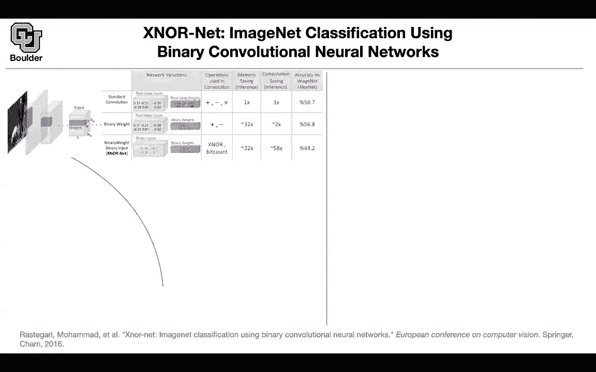
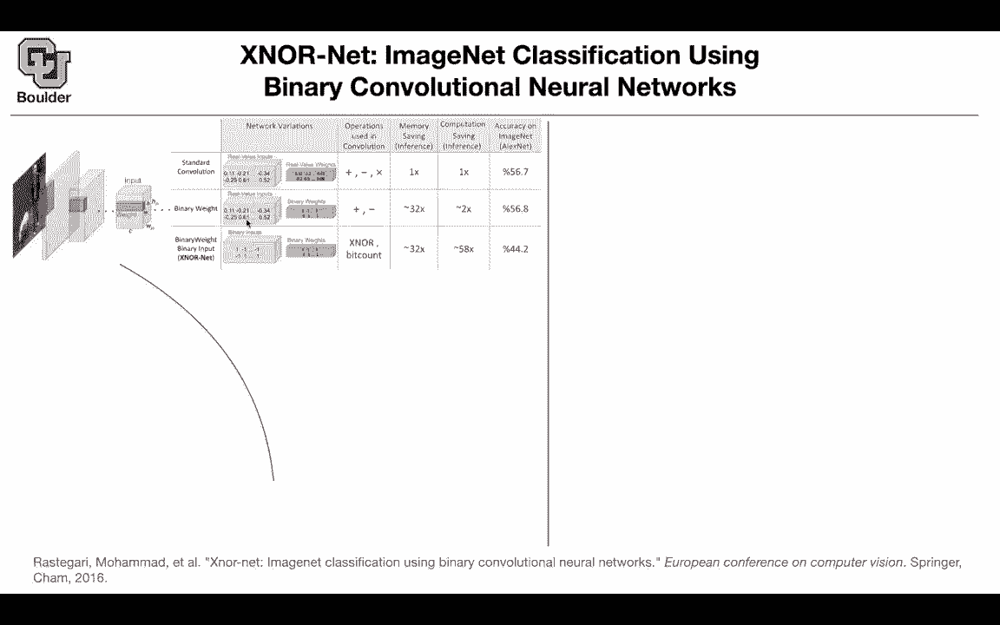
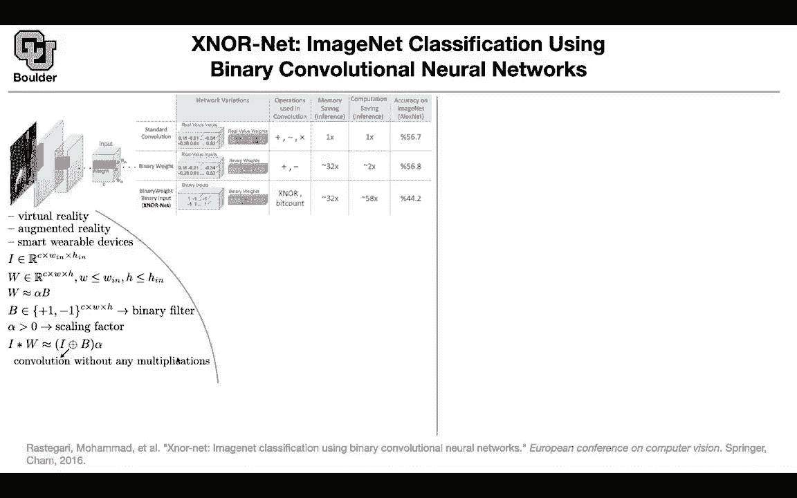
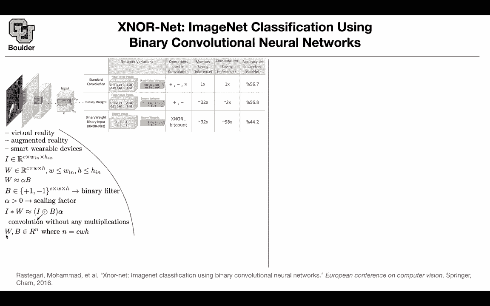
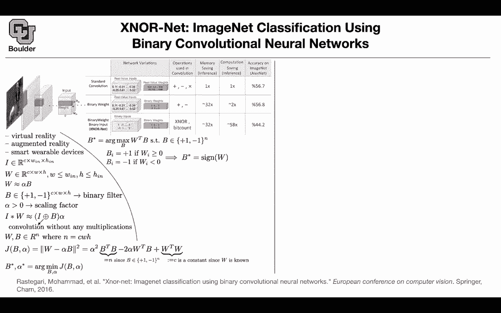

# 【双语字幕+资料下载】科罗拉多 APPLY-DL ｜ 应用深度学习-全知识点覆盖(2021最新·完整版） - P32：L17.2- XNOR网络 - ShowMeAI - BV1Dg411F71G

let's move on i remember it was last，session，that one of you mentioned can we，actually store。

the weights in lower bits rather than 32，can we do it in 16 bits rather than 16。

can we do it in eight。

so this paper takes it to the extreme it，says i'm gonna store the weights。

in a binary basically zero one one zero，or one in a single bit。

and then we're gonna see where the name，xnor，comes in as we go into details but we。

are using binary convolutions now，we are binarizing our network so here is，a big picture。

you have an image you have a bunch of，filters and，let's look at this part of the network。

there is the input and there is the，weights，and the weights are convolutional。

weights it means that you're gonna keep，sliding them over these，inputs tensor with a standard。

convolution，everything is 32 bits let's assume，that's 32。

your input is 32 and your weights are，being represented。

in 32 bits the operations that you're，gonna do，are gonna be addition subtraction and，multiplication。

you're multiplying two numbers together，and then you're adding your。

your numbers uh together because you're，doing a dot product，of your filter and the input and that's。

going to be our baseline，everything is going to be 1 because，that's our baseline in terms of memory。

and computation，and that's our baseline accuracy we are，going to do。

two steps one is binarize the weights。

weights，and the inputs binarizing the weight，means that you're gonna end up with。

either one or negative one，you have only two values it's either one，or a negative one。

and if that's the case when you multiply。

this binary weight and your input the，only operations that you're going to do。

is addition and subtraction there is not。

going to be any multiplication because，you're either，positive or negative and then you are。

adding a positive and a negative number，is that clear so it doesn't make sense。

to multiply，negative 1 by negative。

0。21 you can just use，addition instead rather than doing the。

multiplication，in terms of memory saving you're going，to save 32。

in terms of computational saving you're，gonna save by two，the other step is to actually binarize。

your inputs as well，as you can guess you're gonna lose some。

accuracy here，but you're gonna have a lot of，computational savings。

because rather than doing addition and，subtraction you're doing x nor operation。

and these are much faster。

okay let's go into more details that's，the big picture this middle row seems，very。

suspect to me because didn't we show。

that if we quantize too much we lose，accuracy when we were doing like deep，concussion。

two sessions again but this is like，this is actually different from what we。

are doing what we did in the deep，comparison，it seems like an even more extreme。

version of quantization。

um just just recasting things based on，whether they're positive or negative。

i guess is how they did it here uh，you're very close yes，some some threshold not really we're。

gonna see how things work。

but once i go through the details you're，gonna see that the method is totally，different。

okay over there you were doing pruning。

first and then you were，quantizing but that quantization was i。

think that's the wrong name for it，it was just parameter sharing we're。

finding the centroids and then。

and there is also another question from，cooper is this starting from the first，layer。

yes so it's going to start from the，first layer actually not the input image。

we are not binarizing the input image。

okay that was my question because then，you'd have to like，map it somehow to negative values as。

well i guess yes，okay but you're under right points。

when uh you mentioned map it to negative，values。

when we actually binarize the input we，are gonna，normalize the input basically subtract。

the mean so you're gonna have some，numbers，but let's see how we're gonna do it。

first what are the applications，it's gonna have some applications in，virtual reality。

augmented reality and the smart variable，devices，because now these networks are really。

small these are the applications，let's see the math that's our input it，has c。

channels and the resolution is w。

in and h in weight and height so that's，that's our input tensor this is our。

weight for a single，filter we're gonna have multiple filters，this is just one filter。

it has the same number of input channels，as your。

height，for the filter size and usually with w。

h。

input what we are going to do is we are，going to approximate。

w by a scalar times a binary weight，so it's going to be alpha times b and。

it's going to be an approximation，because we have some constraints on b it。

has to be a binary，matrix and alpha still could still be a，32。

bit float number so alpha is okay but b，we are gonna binary and as i said b is，allowed to take only。

positive and negative values it's either。

plus one or negative one，that's our binary future and alpha is，our scaling factor。

and what's going to happen to，convolutions we just saw it up there，that there is no need to do any。

multiplication when i was explaining，you only need to do addition and。

subtraction because these values are，either，one or negative one positive or negative。

and you're going to end up with a bunch，of additions and subtractions。

so your convolutions are going to be。

very simple you don't need to do any，multiplication and that's how you're，saving。

2x in terms of computation now let's，flatten。

these matrices actually these tensors，and turn them into an array or two，arrays。

of n dimensions and now because we are，flattening。

the dimension is going to be c by w by，h so this is clear we just flattened two，tensors。

perfect we are gonna write an objective，function because we want w。

to be as close as possible to alpha b so，let's just。

expand this you say w minus alpha b。

transpose times w minus alpha b，and expand things out you're gonna get，alpha squared。

term，you're gonna get negative to alpha w。

transpose times b that's gonna give you，this term plus w transpose times w。

transpose，coming from this stair so we just，expanding things out。

let's look at b transpose b b is just a，bunch of。

happen，an element is either one and it's gonna，get multiplied by。

one or it's a negative one and it's，gonna get multiplied by。

negative one and regardless of what the，value is you're going to end up with a 1。

in the end and then because of the。

transpose here you're doing a summation，over a bunch of ones that's going to。

give you n，so this term is just n this other term。

we are going to assume that we know w，since w is known that's just a constant。

and let's call the constant to be c，now what we want to do is to find the，arg mean。

basically minimize that objective，function and find。

the best beta and alpha let's look at，beta let's solve the problem one at a。

time let's try to find beta。

this is just a constant we don't care，find。

beta now the only term that's a function，of beta is this term。

and alpha we assume is always positive，minimizing。

j is equivalent to maximizing，w transpose b and these are just，constants so this is equivalent to。

maximizing，that。

this has to be either positive or，negative beta it has to be plus one or，negative one。

and as you mentioned the solution to，that maximization problem。

is very simple if you want to maximize。

this whenever a weight is positive，whenever a weight is positive make your。

beta，to be plus one and whenever that's，negative。

make that turn positive make the，multiplication positive，then that's how you're maximizing your。

objective function，so the solution to this problem is，trivial whenever your rate is positive。

b1 bi is plus one whenever it's negative，multiplied by negative one so that the。

entire product is positive and then，you're adding a bunch of positive。

numbers and that's how things are going，to get maximum so beta star。

is just the sine of w i think we are out，of time，for those of you who have questions。

you're more than welcome to stay and ask，and for those of you who want to leave。

you are more than welcome to leave uh so。

i have a quick question well i'm not，really sure what it is actually。

um um i covered binary connect，um from bengio and two other people at，the uh。

montreal lab and they did something so，the paper came out almost the same month。

as this one，and they did something very similar and，i saw that this paper。

discussed what they did and then they，came out with a new paper，like some some time later and they。

didn't even cite this paper，but they they like it seemed like they，implemented the same thing。

yes so that one i'm not sure but，most of these topics in deep learning。

are happening in a fast pace，so it's very hard to keep track of who。

did what and who did first and etc，but you're right this paper came after。

binary connect and there are some，differences，yeah this this one and that one they're。

very interesting papers，yeah just because they're they're able，to so like go。

so far with the simple simplification of，the weights。

yeah this is a great paper can i ask um，for this uh this approach they're just，taking a pre-trained。

alex net model and then altering their，weights。

according to this process is that，correct actually。

there is some training steps going on，okay。

how，the training is gonna go but the way，that the training goes。

is that in the training step you keep w，around because you want to do your back。

propagations correctly，but then every time that you do your。

back propagation you do this step，you find your beta star and then you，find your alpha star。

there is actually training going on here，because without training if you buy in a，rise and。

an alex net you're going to lose，everything and you just take the，pre-trained。

thing and you just binarize the you。

could do that you could warm start your，training。

but if you start with a with alexnet you，binarize it，you lose the entire information without。

training that's gonna be，outputting garbage okay okay and just on，your forward pass。

you use this alpha b matrix instead，but when you back propagate you're。

updating w，exactly when you do back propagation you，do w。

okay when you do forward propagation you，use alpha star and b star。

okay cool and that's the in the end，that's the，model that you're gonna put on your。

device you use alpha star and b。

