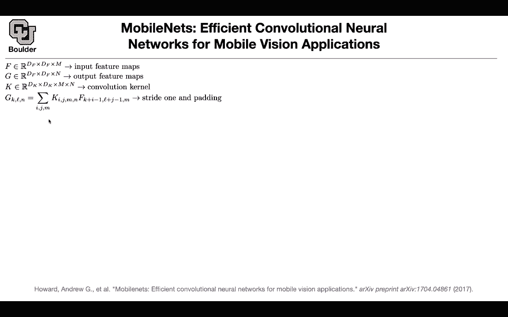

# 【双语字幕+资料下载】科罗拉多 APPLY-DL ｜ 应用深度学习-全知识点覆盖(2021最新·完整版） - P34：L18.2- MobileNets - ShowMeAI - BV1Dg411F71G

let's go to mobile nets so far what，methods did we cover，we covered uh knowledge distillation。

where you have a large network and，you're distilling the knowledge in a，smaller network。

we covered pruning and quantization we，covered quantization to the extreme。

to zeros and ones we learned about，squeeze nets，which were similar to inception the idea。

was to use，one by one convolutions now we are going，to see another nice。

idea we haven't seen this before let's，take a look at the details。

of the computational cost of a，convolution，let's say that's your input features you，have。

a feature map of size df times df times。

m these are the resolution the first two，and the last one is the。

number of channels the output let's，assume your，striding is one and you're doing padding。

appropriately so that the resolution，doesn't change。

you're still having the same resolution，but then the number of，channels is going to be different the。

number of feature maps。

that's your input that's your output and，what is the convolution。

you're gonna need this much this many，numbers。

that's the size of your filter dk by dk，and then your need you're going to need。

to go from dimension m。

to dimension n so that's the total，need。

dk by dk by m by n that's the total，number of，elements that you need to store in terms。

of computation，if you do striding and padding correctly。

and you ignore that，that's the formula for a convolution，you want to know the entry k l。

n of your output entry k。

l n of the output it's gonna be a dot，product。

of your kernel and your input on a，sliding window。

on your input and the sliding window is，going to be，determined by i and j。

okay so i and j are going to be the，first two entries。

of your windows and then you're sliding，it you're just adding it to。

your input locations so you take your，input at location k。

plus i minus 1 l plus j minus 1，and you take the m feature map。

and then you are just multiplying it，like that that's a detailed。

explanation of the convolution so is，everything clear，and why is it sliding because you're。

starting at point。

k and l and then you're sliding it you，change k，and l each time to give you the next。

output now let's see what is the，computational cost，you need a for loop on i you need a for。

loop on j，you need a for loop on m so it's going，to be dk。

by dk by m that's the total number of，operations for this summation。

and then you need another for loop to，give you the outputs，actually you need three other for loops。

you need to fold upon k，l。

which is going to give you bf and you're，cost。

dk by dk by m by n，by df by df that's the total，computational cost of a convolution。

okay how can we make that cheaper and，that's the。

that's where the idea is going to come，in rather than。

having a different n and doing a matrix，multiplication over there。

to go from dimension m to dimension n，you do your convolutions。

channel wise or depth wise it means that，you're going to keep，m fixed it's for the same m m。

and m so there is no for loop on m and，there is going to be a for loop on i。

and j and k l and n now your，depth wise convolutional kernel is gonna。

have，this dimension it's going to be b k by b，k by m。

rather than being b k by b k by m by，m so we already say sum in terms of。

storage，you only need to store d k by d k by m，numbers。

and then we are storing we are saving，one for loop，you don't need to do your for loop on n。

wise，so that's going to give you dk by dk by。

m by df by df，so we got rid of n by that trick by，doing the channel wise。

but then we still need to combine things，together and how are we going to do that。

that's the idea that we saw before it's，the one by one convolution。

but what is the cost of a depth-wise，separable。

convolutional channel convolutional，combinational。

is，exactly what you have up there plus we。

are going to do some other operations，and we are going to do one by one。

convolutions there to go from dimension，m to dimension n and because it is one，by one convolution。

end up with。

m times n by d f by d f that's the cost，of a one by one convolution so we are，getting rid of v k。

by bk so any question so far visually，speaking。

ignore this part for now visually，speaking this is a standard convolution。

you have n filters of size d k by d，k by m that's exactly what i wrote here。

for depth-wise，convolutions m is one and n is。

m and we are doing things channel wise，we are multiplying。

each filter by its corresponding channel，so we do not mix，stuff during convolution but then we。

need to go，and mix the channels together and that's，how you're going to do it。

with one by one convolutions because，because in the end we want to go from，dimension m。

that，and another operation of one by one。

convolution to replace，a three by three convolution you have a，three by three convolution rational。

value，and then you can replace that by a three，by three depth。

depth wise convolution patch norm value。

and then another one by one convolution，batch number value，so these are gonna in the end give you。

the same dimensionality for your input，and output，the dimensionality is gonna be exactly。

what you have here any questions，wise。

convolution on kernels are really，powerful。

to save computation now we are going to，introduce two multipliers。

one is your width multiplier because we。

want to have a，parameter to tune the capacity of our of，our network。

device，so we are going to introduce two。

parameters a bit multiplier，which is going to control the number of。

channels m and n，and we're gonna have a resolution，multiplier which is gonna control the，resolution。

the size of the resolution i think we，are over time。

for those of you who have questions and，would like to stay and ask。

i would be happy to say an answer for。

those of you who want to leave，you're more than welcome to be i have a，question。

um about the xnor network。

um and specifically just about that uh，those figures at the end um with sort of，the。

efficiency i guess or like the speed up，um so，when you're looking at um like the。

number of channels for example，are they just measuring that as like if，they just look at。

one point in the network where there，happens to be an input，of some input with 32 channels。

and then they just measure the speed up，there versus the，the basic network like the is what i'm。

making，saying making sense uh i think，because like you're not gonna have an，image that has like uh。

32 channels oh no these are the，uh intermediate operations yeah so that。

just like in your network you just look，at certain layers that have，certain uh different varying uh。

varying inputs with varying uh chain，number of channels，and then you just measure the speed up。

at that layer so，if you look at for instance vgg it has a，particular structure。

okay it has inputs and then it has a，convolution，it has multiple convolutional layers and。

then in the end，you get yourself max and probabilities，each one of those convolutions。

you can do these operations on you can，compress them so whenever you have a。

convolution this is these are the，operations that you do on them。

and in the end for your entire network，you are gonna save uh some amount of。

computation and some amount of storage，for instance for vgg for that particular。

structure from one gigabit，you're gonna go to 16 megabytes okay。

does that make sense yeah it's not only，the input，sorry to jump in is this similar to with，um。

when we were looking at quantization uh，maybe one or two sessions ago we。

had explicit formulas for how much you，can save given，yeah that r compression ratio so we had。

like a given formula there and we knew，exactly if these are the。

parameters this is how much will save，it's probably similar，here like given unknown hardware and。

given that unknown，filter size channel size the different，parameters you can say that。

that hardware will be able to to run it，41 times，faster now yeah you can just do it。

analytically instead of，sort of like experimentally yeah so i'm，guessing that those，not。

experimentally generation actually it's，more straightforward，for binary networks to store a single。

floating number，you're gonna need 32 bits okay，to store a binary number you're gonna，need one bit。

so it's very simple you go from 1 to 32，that's the amount of memory you're。

saving and then it's not going to change，whatever else that you do，stuff。

so from 32 bits you're going to one bit，and that's where 32 is coming in。

and that's your competition rate yeah，haven't，seen before the speed ups for like one。

um x naught or operation versus one flop，whether it's addition or subtraction so，i'm i'm。

i'm puzzled by the or just don't know，the details of，the going from two times computational。

savings to 58 times，computational savings oh so you're，talking about this。

storage because the storage is very，clear yeah and same thing same thing in。

the diagram down on the right that，that's talking about speed up。

and not memory but this uh compression，create，that you are referring to in your。

question that is for memory，yes these are the math that you know for，the memory yes。

even these numbers here are for the，right，how do you go from 2 to 58 it's because，of the way that。

x0 can be implemented very efficiently i，guess you can，implement them with shift operations you。

just shift your bits left and right，and then you get x now and so then go。

back to the original question that's，that's something that given，knowledge of like computer hardware。

systems you could，write down an explicit formula for the，amount of computational savings，sense。

for computational setting you can，exactly because you know，an addition in the end is going to have。

to trans，translate into a bunch of bitwise，operations，and xnor is one of those bitwise。

operations so yeah for that one we have，to sit down and，take the。

papers words on it and say okay it's 58，times thank you，that helps a lot any other questions so。

there is a question from omar，for mobile net why don't we just do the，same thing。

we did in the inception module with，dimension reduction，i mean what is the advantage of doing。

this compared to doing the same thing，but having the one by one convolution be。

first to reduce the dimensions，so it's a slightly different paradigm。

when you when you are doing dimension，reduction，you were saving computations uh。

channel wise but now what we are doing，here we are saving computations uh。

in a different time in a different，fashion if i want to show you the，details。

with one by one convolutions you still，have to do matrix multiplications。

and that's going to be the cost m the。

size of m and，n still are gonna come into play but，with channel wise。

or depth-wise convolutions you're，getting rid of n，so it's a slightly different paradigm。

and you can see the difference here，this is a depth-wise uh convolution。

and that's what you get from 1b one by，one convolutions。

