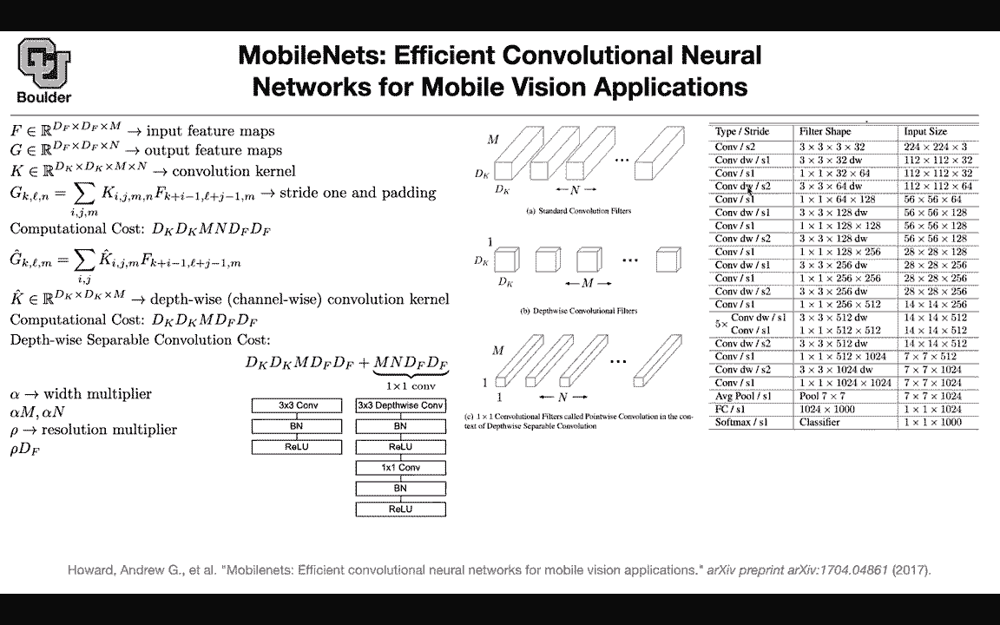
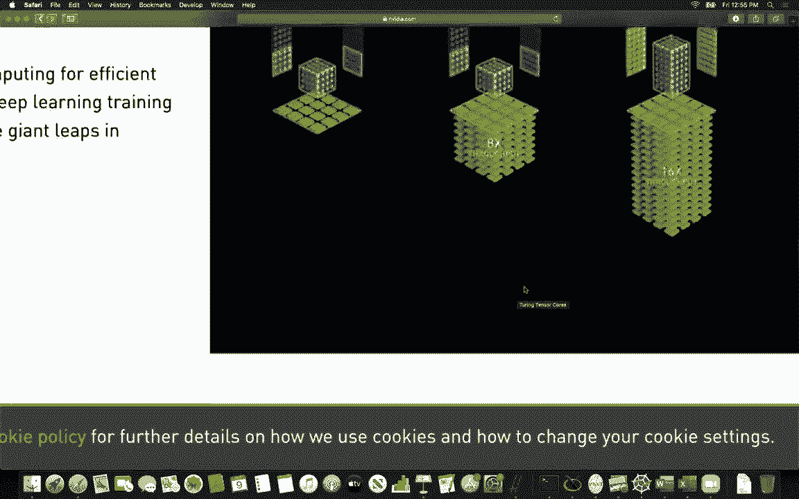
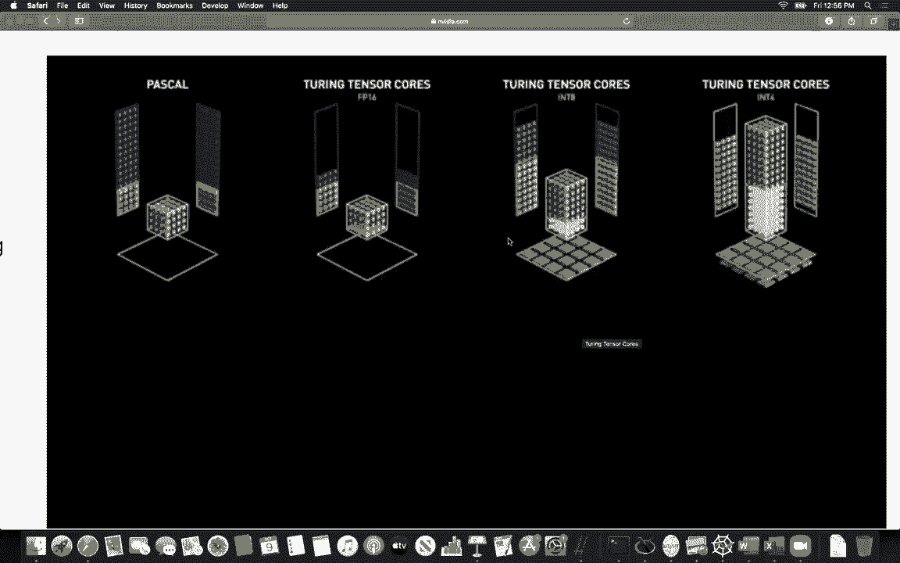
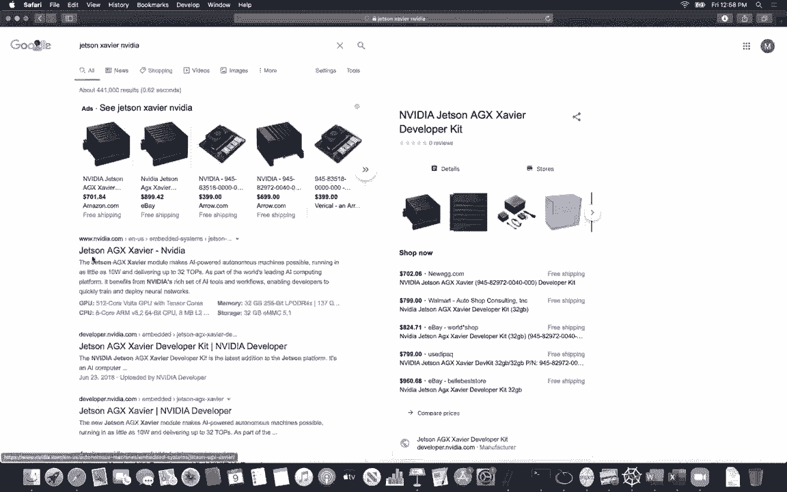

# 【双语字幕+资料下载】科罗拉多 APPLY-DL ｜ 应用深度学习-全知识点覆盖(2021最新·完整版） - P35：L19.1- MobileNets [续] - ShowMeAI - BV1Dg411F71G

last session we finished up our，discussion about xnor net and then we，started mobile nets。

and here we introduced the computational，cost，of a regular convolution and as you can，see these are。

not cheap these are not cheap operations，and that's why，we need to look for ways to parallelize。

stuff，for instance one way to parallelize is，to run these for loops on k。

l and n in parallel because these，operations are，independent from each other and then you。

can run that in power，which is gonna help you get rid of k，which is df。

by df by n operations because now you，are doing them in parallel，so you can get rid of this part and。

that's why gpus are，really useful here and also tpus，google's internal hardware for。

deep learning because these operations，are not cheap and you have to，parallelize them。

so that's the message and most of it is，independent，these are simple algebra operations so。

it's not hard，to parallelize stuff and write the code，for it even if you start。

from cuda you can simply implement this，it's going to be more lines of code to。

what you're used to in python，and tensorflow and pytorch but it's，still doable。

so that's the computational cost of a，convolution and the idea。

is to reduce the computational cost and，one idea is to get rid of this n。

with one by one convolutions we were，reducing this and we had a question last，session about。

why not just use one by one convolutions，you can reduce，n but now we are taking it to the。

extreme we want this n to be one，and that's where the idea of depth wise。

or channel wise convolutions，come in so you are going to do your。

convolutions channel wise per channel，it means that you are getting rid of n，but then。

later on in the next step you're gonna，mix up the channels you're gonna do a。

weighted combination of the channels，using a one by one convolution。

and the computational cost of this，operation is this，we got rid of n but then you need to do。

one by one convolution after it but one，by one convolutions are cheap。

or cheaper than a regular convolution，for instance if your kernels are three。

by three it's nine times cheaper，to do a one by one versus three by three，and then we introduce。

a couple of parameters because we want，to have some control，over the capacity of our model depending。

on the，target device the computational capacity，and memory capacity of the target device。

is going to help us，determine what's the best alpha and row，for us alpha，are。

basically how many channels or how many，uh filter，or feature maps we're gonna have and rho。

is the input resolution，which is gonna control this part of the，computational cost。

and here is a visual inspection，of what i just explained and the。

difference between a regular convolution，and a depth by is convolution。

and a one by one convolution so a one by，one convolution is about，doing things pixel-wise doing your。

operations pixel-wise，and depth-wise convolution is about，doing your。

operations channel-wise and wherever you，have a three-by-three convolution。

patch normal value you're gonna replace，it by，three by three depth wise convolution。

passionate value and a one by one，convolution after that was the，microstructure。

of our network the macro structure is，what you see on the right，and as you see after the networking。

network paper，most of the work in computer region，for classification uses average pulling。

global average pooling that is what is，enabling us to，input images of any resolution。

during trending and testing but wherever，you see dw in this，structure is where you have these uh。

depth-wise a variable convolution。

so there is one here there is another，one here another one here etc。

and what does it save us when you have，mobile net，and this one here corresponds to alpha。

and draw being one，so it corresponds to this structure，these are the accuracy that you get and。

this is the number of multiplication and，additions，that you have to do and this is the。

number of parameters，in terms of million and actually the，accuracy is。

comparable to google net and vg60 with，fewer parameters and，less multiplication addition now you can。

play around with，alpha or with multiplier to，balance the trade-off between what level。

of accuracy and what level of，computational and memory wise efficiency。

you expect from your mobile net so by，varying alpha，yes you're gonna lose accuracy but at。

the same time，you're gaining speed and memory you're，saving memory。

so there is this trade-off now these are，multi-objective optimization if you，think about it。

and multi-objective optimization is hard，there is always this trade-off。

you need to balance the trade-off，between these three speed，memory and accuracy and if you change。

the resolution parameter，row in our case uh the number of，parameters is not going to change。

because you still need to change save，the same number of parameters。

but this speed is going to vary the，computational cost is going to vary。

any questions before i move to the next，topic i had a，more general question um they're coming，units。

and chips with dedicated you know tensor，processing i'm wondering what that does。

to to speed up you know compared to like，a gpu or is it just a，gpu but smaller no actually if。

you google tensor cores，actually modern gpus have tensor，processing units。

so these are dedicated units for，operations，on tensors and the type of operations，that you find in。

convolutions and uh recurrent neural，networks and，attention models so yeah maybe we can。

and maybe this is a good visualization，of what's happening behind the scene。

yeah you can have i think it was after，touring，that they introduced this and that's the。

difference between，a pre-touring architecture where things，have to be done。

sort of sequentially but now you can do，the operations in one shot。

for float 16 and if you have integer，of，uh memory that you can process at once，if you do。

n4 you can process a bigger block okay，so does this make。

using something like mobilenet almost，like obsolete，not really not really and what is the。

reason for that，is because not all of the devices are，gonna have gpus on them。

so there is a difference between，training and inference，it means that you need to find a。

dedicated uh，processing unit for your target machine，in this mobile net can still benefit。

from tensor cores，or gpus even if it's like embedded on，something like a。

like a jetson or something that has that，capability on a smaller scale right。

yes so that's a good point you got like，double speed up almost。

and they just released a new one the i，think the jetson nano，which is super small but super powerful。

yes these are for your robots and，embedded devices so the idea there even。

you have zavier chips that's for。

self-driving cars okay but there are，also other companies that have that。

these are not for training you can，actually do training on them also，but these are these small gpus。

for mostly inference okay any other，questions，while we're on a on a hardware kick is，there。

there are all these extra yeah extra，but um different standards for uh。

number representations there's fp16 but，then there's you can read this blog post。

it's a very good one，you can do automatic mix precision so，you store，your baits in fb32。

and you do your operations on fb16，that's a different paradigm，and these are usually automatically。

done in pytorch and tensorflow and mxnet，et cetera does it answer your question。

well i guess my question is how，something like this might decide when to，use what。

as i said you're gonna save your，variables，in float 32 and then you're gonna do，your operations。

on float 16。 it turns out these neural，networks are not that sensitive。

to the exact value of the parameters，about the loss，you need to save that last component of。

your operations，on of your computational graph in flow，32 and do the operational 3d。

plot 32 also and then you have to，normalize your loss，for it not to take crazy values you also。

have to，be careful about your gradients okay，thank you，any other questions these are great。

questions these are yes so there is a，huge competition，in terms of hardware for deep learning。

and there is this，it's ml curve that these companies，compete on these tasks in vision in。

language and，recommendations systems and，reinforcement learning。

you can take a look at the results so，there is amd，intel nvidia huawei google tpus。

and with different frameworks mxnet，tensorflow，pytorch so in your spare time take a，look at this。

and there are these smaller companies，startups that，as you said are trying to come up with。

deep learning hardware。

