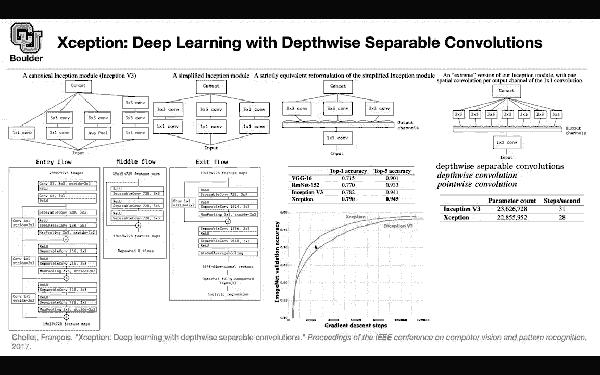

# P36：L19.2- Xception - ShowMeAI - BV1Dg411F71G

let's move on to the next this is also。

going to be about depth wise separable，convolutions，i think this is the first paper that。

introduced that i'm not sure，but uh it gives us a new perspective。

on depth-wise separable convolutions，let's see what the perspective is。

we know about the inception we covered，it in class for google net，the paper says let's simplify that。

architecture，i don't like the fact that you do one by。

one by one by one convolution average，pulling，three by three convolutions five by five。

convolution seven by seven，i don't like that let's simplify stuff，let's use only one by one。

and three by three convolutions so it's，a simplified inception module。

and now let's just uh rewrite the same，thing in terms of group convolutions。

we saw group convolutions in res next so，next，you do a single one by one convolution。

and then pick up a bunch of channels。

let's say ten of your channels，and then you do three by three，convolutions on that ten channels。

and in the end you just concatenated so，this is group convolution。

if you take this idea to the extreme，rather than having 10 channels。

you can have a single channel these are，your，3d by 3 convolutions channel wise so。

this is a new perspective，that you start from inception you，simplify it。

you do group convolutions this is where，your address next。

and then you take it to the extreme to，give you depth twice separable，convolutions。

actually this is just depth wise。

convolution it is going to become depth，wise separable，when you add a point wise convolution on。

top of that and point wise convolution，is just one by one，convolution so it's the same idea as。

before from a new perspective，and this is the macro structure。

of the network there is some in entry，flow the middle flow is very simple。

it's always these separable convolutions，same dimensionality。

same kernel size uh shortcut connection，and then you repeat that eight times so。

the dimensionality doesn't change here，but the entry flow and the exit flow are。

responsible for，changing the dimensions using strides。

you have a stride of two by two，stride of two by two another stride of。

two by two and then they have different。

number of channels thirty two 64。

128 etc 256 728，once the entry flow is done processing，the image。

it's gonna give the output to the middle，flow。

the middle flow is gonna do its job and，then the exit flow is going to take the。

output of the middle flow。

and in the end give us the probabilities，for our logistic regression。

this is how exception an exception。

stands for extreme inception this is how，exception compares to inception v3。

resnet and vgg，when you give it the same amount of，capacity。

when they have the same capacity or，similar capacity in terms of。

better，in terms of accuracy both top one and。

top five it actually trains better，what you're seeing is the validation，accuracy。

during training an exception。

is above inception b3 and in the，previous paper mobile net，we saw that there is an activation。

activation function，between the three by three convolution，and the point-wise one。

it turns out you don't really need that，you can put，a relu you can put an ilu and then you。

put you can put nothing，no activation no non-linearity and，actually that one is being the best。

so you can get rid of the non-linearity，between your depth-wise convolution and，the point-wise。

convolution any questions here so the，the depth-wise convolution is。

this image right above where you're just，taking，portions of your input and passing it to。

separate three by three convolutions，or portions of your one by one output，but what is the。

point wise i'm a little confused where，that comes in，well the point wise is just the one by。

one convolution，just this first one by one after the，input，no it's like this structure here so you。

have your three by three，and then there is okay other one by one，convolution right after。

it okay i see that one is depth wise and，then you do，because depth wise it's gonna do things。

channel wise，so your channels are now independent now，you want to mix and match。

the information in your channel that's，why you add a one by one convolution。

okay any other questions the idea is the，same as before，but we are taking a look at the same，concept。

from a different perspective how does it，fit how does it compare。

with whatever that we learned so far in，terms of inception，res next etc that's how it compares okay。

and there's also one other contribution，that you don't actually need。

