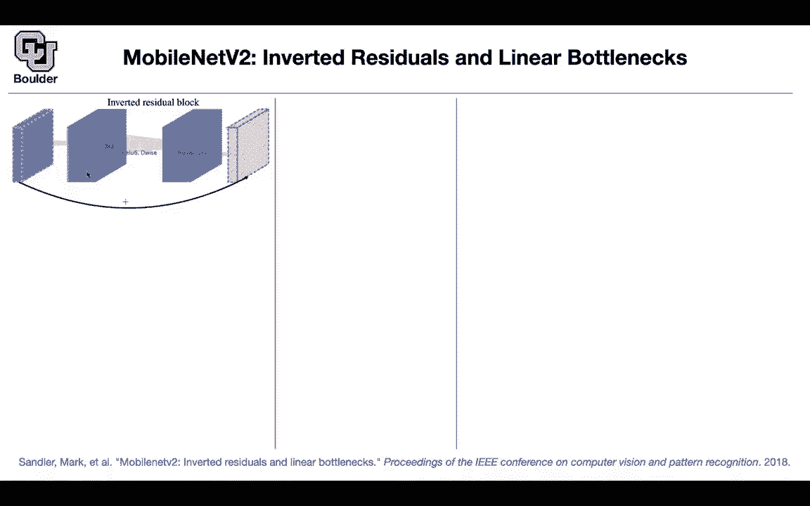
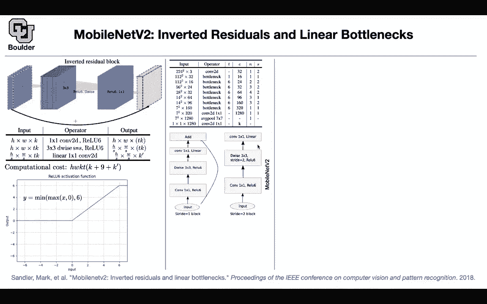

# P37：L19.3- MobileNetV2 - ShowMeAI - BV1Dg411F71G

okay let's move on to the version two of，mobile labs。

so these are tiny improvements on the，structure of mobile lens，the idea is that you want to have。

residual connections okay，and then the question is where are you。

gonna put the residual connection are，you gonna take，the output of this block and then put a。

residual connection from this，big block to the next big block these，are your expansion layers。

or are you gonna go from where you had a。

smaller number of channels，there。

and it turns out comparing different，structures it's better to go from。

the narrow or your bottleneck to。

the other bottleneck using a residual，connection，so previously it was going from the，bigger channel。

to the bigger channel and that's why，they are calling it inverted。

so what are we doing there is a one by，one convolution that's gonna help you。

change the dimensionality from small，dimensions to a larger dimension。

then you do a channel wise or depth wise，convolution here 3x3 to give you。

the other one this is the output after，this convolution，now you do another one by one。

convolution to reduce the dimension，now this block and that block have the。

same dimensionality you can add them，together to put your shortcuts。

and this is exactly the operations that。

are happening you start with a。

tensor that has h times w times k，as its size then you do a one by one，convolution。

you do a relu non-linearity with a，little catch。

i'm gonna tell you what israeli 6 then，you expand it，by a factor of t that's the output it。

has more channels，now that's going to be the input to the。

next operation the depth-wise，s。

you do another value so whenever you do，a stride，your resolution is going to drop and the。

number of channels is still the same as，before，now we are here you take that as input。

you do a linear，2d convolution and then that's what you，get in the end。

and k prime and k are the same they have，the same size，and what is the computational cost if。

you write it down，that's going to be your computational，cost it's a function of your expansion。

factor，t the size of your input，to the block which is h times w times k。

so it makes sense and these are coming。

from the operations that you're doing，there is k nine is coming because you。

have three by three，convolutions that's going to give you a，9 and then k。

prime is the output that's the。

computational cost and this is value 6。basically the idea is that you want to。

cap your activation，at a particular value for your，activations。

not to become too big so you are killing，your activation at that point and that's。

the exact，formula for railw6 the macro structure。

of mobilenet another look at mobilenet，but with different strides。

this is exactly what we have up there，the stride is one，but if the strike is two you don't put。

the residual connection，so that's the only difference you still。

have that linear operation，you have your depth wise convolution，with a stride of two。

rather than a stride of one and then you，still have that one by one convolution。

you don't have the residual connection，so kevin is asking why not some other，number。

ten or five you could that's a valid，question。

why value 6 why not value 5 why not，value 10。it doesn't really matter that's a great。

question i don't have an answer to you。

have to，write the code and see does it answer，your question sorry if i missed this but。

going back to the dimensions，i thought the the initial input and the，final output。

should match to be able to add them yes，so sometimes they match。

and then you can add them sometimes they，don't match，and then you're not gonna add so it。

depends on your choice of s and，uh t it depends on the choice of s and k。

prime to be exact because t we are，taking care of it。

yeah，it depends on k prime and s you're right，that's why here。

there is no residual connection because，if you want to add the residual，connection then you need to。

uh make the resolution higher or，actually lower。

net，this is how it occurs for mobilenet you，have the depth-wise。

adding。

a one-by-one convolution here and you，are adding the residual connection。

basically you are doing uh i think it。

was omar last session，we'll ask this question why don't you。

just do a one by one convolution first，and then you do depth twice a variable。

convolution and then another one but on，convolution。

that's exactly what they're doing in，mobile net version two，but in mobile net version one this is。

what they were doing so you，the。

low dimensional one to add a residual，connection now what is the landscape。

of different small networks i'm gonna，tell you about shuffle net and nas net。

later on but now mobile net version one，are these blue，circles the x axis is multiply at。

in terms of millions the y axis is a，is the accuracy now you're starting to，see a pareto。

frontier so that's a parallel frontier，whenever you have，multi-objective optimization you're。

going to end up with a pareto frontier，that's the part of frontier for，mobilenet。

version one and these are all version 2，with different resolutions。

and i'm going to tell you what is nas，net and，shuffle net next and the timing。

on cpu is 75 milliseconds，for processing the input image and，the accuracy is actually pretty good if。

you look at it，it's comparable to the rest of the，landscape，now here is the question should we put a。

shortcut，between bottom next the smaller ones or，should we put a bottleneck between the。

expansion layers，here and the next one or should we，forget about residual connections all，together。

the residual connections are gonna give，you this red curve in terms of top，accuracy。

and this is during training steps in，millions，this is the if you put the shortcut，between expansions。

this is the accuracy that you get and if，you put shortcut between bottlenecks。

the network behaves better so not only，it's cheaper，but also it's doing better in terms of。

accuracy and conversions，any questions these papers have small，ideas。

like rail u6 was a small idea and the。