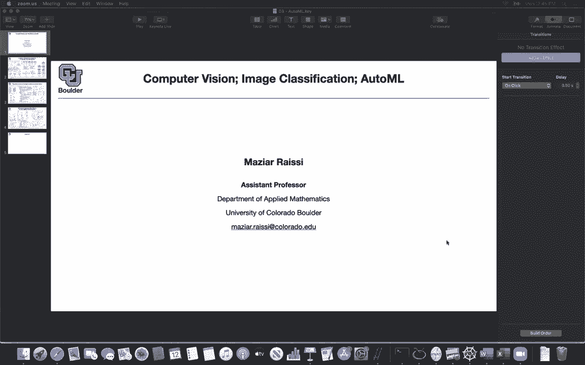
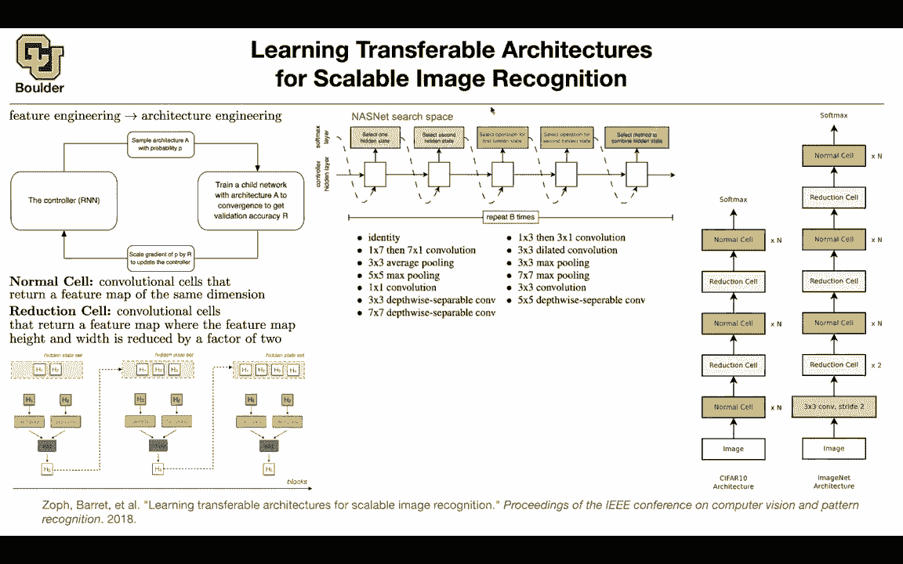

# P39：L20.1- NASNet - ShowMeAI - BV1Dg411F71G

let's get started i think by now，you guys should be tired，or at least overwhelmed by the number of。

architectures that we have seen when it，comes to deep learning，and we covered a lot of them some of。

as，much accuracy as possible the other ones，were，also trying to be efficient in terms of。

both computation and memory storage，now there's a natural question can we，somehow。

automate that can we somehow let the，computer do the hard work，it's basically machine learning and a。

machine should be able to find，a good architecture for us so that's the，idea of automl。

and that's what we're going to cover，today i guess。

and let's get this started and i'm going，to start with this paper。

it's a very good paper and it's going to，help us understand the state of the art。

when it comes to autonomous，so prior to d player names for instance，when it came to computer vision。

or even natural language processing or，speech we have to do a lot of feature，engineering。

for instance for natural language，processing，people would come up with a bag of words。

and some of ideas were also applied to，computer vision，you could have bag of visual words or。

you could take a look at histogram，of oriented gradient hog features or，learning。

prior to deep learning when it came to，computer vision，national language processing and speech。

was about feature engineering so you，would spend a lot，of time doing feature engineering and in。

the end，apply a logistic regression or a support，vector machine，you use classical machine learning。

techniques on whatever features，that you manage to engineer and then，that was giving you。

okay results deep learning came and，changed that，paradigm the idea was that now you can。

actually learn the features，you don't need to spend time featurizing，your。

images or your text you can actually let，the neural network learn the features。

on its own and give it enough data and，we saw a lot of success with that。

up until now but there seems to be a，saturation point where there are a lot。

of architectures being engineered，these days by people so it seems that，the state of the art。

is changing from feature engineering to，architecture，engineering and that raises a natural，way。

that we automated feature engineering，can we automate，human，would approach this problem they come up。

with an idea，for an architecture they train it and，then they，tweak the hyper parameters on the。

validation data set，and then take whatever that's the result，of that exercise and apply to test data。

then once everything is tested they take，it to real world，but to do architecture engineering we。

saw a couple of examples before when，humans were doing it，you usually start with a smaller data。

set you usually，start for instance with c410 you come up，with an architecture。

and once you come up with the，architecture you apply that to。

a bigger dataset like imagenet so we are，going to do a similar exercise。

and we are going to let the machine do，the work for us so we are going to have，a controller。

which could be a recurrent neural，network that recurrent neural network。

is gonna sample an architecture，with probability p and that p is，parameterized。

by the recurrent neural network so we're，gonna sample on an，architecture we take the architecture we。

train it，on the training data we validate it on，the validation data，and we are gonna come up with a。

validation accuracy it's gonna give you，a number r，that r is now a feedback that you're。

getting from your system，now you need to scale the gradients of，your。

recard neural network that's proposing，your p that's controlling p。

you're gonna scale it by the feedback，that you got，and you're gonna update your controller，your。

required run network and this you can do，with reinforcement learning。

so i think reinforcement learning we are，going to go into more details。

either in the end of this semester or，the next semester，but for now that's the big big picture。

every car neural network，is gonna propose an architecture you，take the architecture you train it。

you test it on the validation data you，get the validation accuracy and you。

the validation accuracy is gonna act as，uh，feedback that you're going to use to。

update your controller so what's the，catch here，you're going to have to train and we。

know that training a single neural，network takes a lot of time，let alone training 1000 of them or。

100 000 of them so that's the cost that，you're paying，but because it is repetitive we can uh。

dedicate that task to a machine and a，machine should be able to do it given，enough resources。

by the end of this process a good，architecture is going to come out。

now the question is how are we going to，parameterize the space of architecture。

and this paper has a smart way of doing，that and we're going to see。

how things are going to work but first，let's define what is a normal cell a，normal cell。

is a cell consisting of a bunch of，convolutions，and some other operations but whatever。

the input resolution，whatever the resolution of your inputs，to the normal cell is。

you're going to keep the same resolution，as the output so there is no striding。

operation it means that you're not going，to lose resolution after the normal cell。

whatever your input resolution is you，have you're going to have the same。

output resolution that's a normal cell，and a reduction cell it's actually gonna，reduce。

the height and the width of your input，by a factor of two so we're gonna have，two types of。

cells a normal cell and a reduction cell，and we're gonna train a neural network。

consisting of a bunch of normal cells，and reduction cells，on c510 an image goes in you have。

n normal cells then you reduce，the resolution you have n other normal。

cells you reduce the resolution，and then another normal cell and then。

you do your soft mag so that's the macro，structure，of our c410 architecture and our task。

is to come up with good cells so the，task of this rnn，is to come up with the structure of this。

normal cell and the reductions，but let's assume that this problem is，solved and our algorithm is。

going to work then whatever normal cell，and reduction cell，that comes out of this algorithm you're。

going to take that and put it in a，bigger，architecture it's going to be deeper and。

it's going to have some，other operations in it it's bigger，because now you have。

two reduction cells here you have one，more reduction cell here，and you have n more normal cells。

so it's a larger neural network and，that's the one that we're going to use。

on imagenet so whatever the outcome of，our，architecture search is we're going to，take that。

enlarge it and train only once an，imagenet and report the results so，that's the big picture。

for searching for architecture now the，question is how are we going to come up。

with normal cell and reductions，professor yes doesn't this limit。

the structure to like this alternating，like isn't there way more possibilities。

of how to organize the normal reduction，cells or does it not，matter um like how you do that it。

definitely matters，but uh we are now making a sacrifice and，the sacrifices。

that we are making is because，you have to train each time that your，controller。

is going to recommend an architecture，you have to do，a full round of training and training on。

imagenet i think these days it's faster，it takes around one day。

but at that time it was taking around a，week now，imagine you have to do that for。

1000 or 100 000 iterations it's gonna be，100，000 days even today with our computing，capacities。

it's not feasible basically you have to，wait two years before your paper is。

published does that make sense，yeah thanks yes you're absolutely right，in theory it's possible。

but in practice in theory it is possible，to train it on imagenet。

and come up with the best architecture，and image but in practice it's not。

feasible that's why people go，to c510 and then they come up with a，normal cell and the reduction。

but what is our rmn doing what is our，search space for the normal cell。

we are going to start with two hidden，states，and these are from the previous layers。

so these are from，this layer prior to entering the normal，cell，or even here it's going to come for。

instance from reduction cell，and the normal cell so that's going to，give you h1 and h2。

these are the inputs so what choices do，we have for the first。

operation in the normal cell we can take，h1，and for instance you can do three by，three pooling。

that's one operation that you can do or，you can do three by three convolution，on。

h2 you have a bunch of options you can，do convolution you can do。

seven by seven convolution etc that's，one choice，that the rnn has to make the other，choice is。

how we're gonna combine the outcome of，these two operations，are you going to add them are you going。

to concatenate them，what are you going to do but whatever，that you do is going to give you。

h3 you take h3 you put it in a list，h1 h2 and a3 now you have a choice，these。

so you have a three out of two or two，out of three choices，that you can make you can take h1 and h2。

you can take h2 and a3，here，then the rest of it is similar to before。

these operations you have a choice to，make you're gonna do identity or you're。

gonna do one by one convolution，or are you gonna do addition rather than，concatenation。

and then you keep doing that for a，five，blocks and those five blocks are gonna。

be inside your normal cell，so what are we doing now we are opening，the black box。

of normal cell so we want to see how，this guy is，defined we want to parameterize that and。

as you can see these are，discrete choices that you have to make，that，and that's why a method like。

reinforcement learning is going to help，us here，because there are no gradients with。

respect to these parameters these are，discrete choices okay so far so good，going to be。

what our regard neural network gonna do，we need to put a probability，select。

so which of these are we going to select，and all of them you can。

parameterize with a softmax because the，softmax is going to give you。

give you the probability of state 1，state 2 or state 3。 so there is going to，be a soft max here。

outputting the probability of these，states being chosen，and this is the p that we defined here。

you can do the same thing for the second，choice，still you have let's say three states。

and which one are，which one are we going to choose and，that's going to give you the second，choice。

the probability of making the second，choice and then you're going to have a。

you can put a soft max on that and then，that's going to give you the。

probabilities of selecting each of those，operations，and i'm going to give you a list of what。

operations you can choose from，you can do the same thing for the second，method。

to combine the hidden state how we're，going to combine this are we going to，concatenate。

add them together etc and then we are，going to repeat this b，times and b you can say it's five we're。

gonna repeat this operation five times，and as you can see each time this，selection，for this。

step you have two output sizes for this，one you have three，choices to make for the next one you。

have four choices to make etc，so the softmax is going to change。

dimensionality here but that's not a big，deal it's just going to give you a。

probability of choosing them，so what are our choices for the。

operations that's where you're gonna put，this off max，you can either choose from identity you。

can choose from a one，seven and then a seven one convolution，you can choose from three by three five。

by five，actually it's five by five max pulling，three by three，depth-wise separable convolutions and。

cite，last session you can have dilated，convolutions，i'm gonna talk about dilated。

convolutions later on，when we're gonna talk about uh semantic，segmentation。

we're gonna go into more details of what，is a dilated convolution。

you can do three by three max pooling，and five by five，depth wise separable composition so。

these are your choices。

for the yellow box here and in the end，once the recurrent run network is，trained。

it's going to propose an architecture，for your normal cell，and it's going to propose an。

architecture for your reduction cell，so these are the optimal outcomes once，the training is done。

actually i'm gonna call this hyper，training once，you came up with your best architecture。

this is the best architecture，that you're gonna see the first two，hidden states hi minus one and h。

i are coming from the previous layers，which are gonna be h1 and h2 these do we。

know and the next ones are gonna be，chosen，automatically so all of these are chosen。

automatically and you can，see the choice of depth-wise separable，convolutions。

which is nice so there is a variable，convolution here，and by the way the network is not。

trained for efficiency，but somehow it is choosing these three，by three convolutions than separable。

ones，the identity separable five by five，average identity average pooling。

it's interesting it's not using max，pooling a bunch of addition and the。

concatenation in the end and the，concatenation at the end is not chosen。

it's what we do before going to the next，step once，all of these five blocks are determined。

we're just gonna concatenate them and go，to the next step，so i know you're gonna have a lot of。

questions you can ask them now，so is this image showing the like result。

of what like this is what was chosen as，the best architecture i guess，yes and this is like a。

if you repeated this process many times，would you get the same，final architecture or would it change。

every time like if you repeat the the，hyper training，or uh yeah over and over it will come up。

with another one it's not gonna give you，the same i don't even think the。

solution to that problem is unique so，each time you train it。

i'm sure it's gonna come up with another，architecture and you can actually see it。

you can take these two and just reorder，them that's gonna be a different。

architecture but what is nice is that，in the normal cell you are not seeing。

concatenation of this operation，in the depth but you are seeing it here，so now this iteration。

the input to the separable convolution，this is just，what choices did we have at this point。

for this connection this connection，could be，here it could be here it could be here。

or it could be one of these two inputs，but now it's adding on the depth if this。

connection was coming from the input，you will get an architecture like the。

one on the left and so the，the h i minus 1 input is coming from the，previous。

architecture whereas the h i is coming，from this architecture。

no let's take a look at this normal cell，h i minus one is coming from this。

sorry h i is coming from this step and h，here，okay so that's like the residual，connection。

between blocks i guess yes yes exactly，so these are the residual connection but。

what's it what is interesting to me is，the choice of separable convolutions。

in both of the normal cell and，reductions so any other questions。

yeah so where in this process um is it，like where's the difference between the。

normal cell and the reduction cell，like how do you enforce that is there a。

different choice of operations，uh it's just when you are reducing，the height and the width with the。

striding of two，and i guess it's happening here at h i，and h minus one h i minus one。

you just reduce the resolution before，doing the rest，oh i see so each kind of each operation。

you're offering it，to choose from has a stride of two no，it's just the first one。

the first two ones we force it it's just，reduce the dimension first and then。

do the rest oh i see i see okay，thanks use the resolution first and then。

do that and this was actually what we，were doing in other networks as well。

we reduced the resolution at the input，to the cell，and then i'm guessing do you have like。

numerical results and，kind of the result of this whole thing，is that next。

yes that one i'm gonna explain in，another paper because i want to compare，the big picture。

you mean in terms of accuracy on the，image now yeah，like like how much better it does than a。

standard network，yes i'm gonna explain about that in the，next slide。

so any other questions i saw i heard，somebody ask a question。

yeah so certain things like aren't being，chosen in the network like sort of，smaller parameters。

or like batch normalization um，is some of that just like sort of baked，into the。

layers that you can choose from the，operations that you can choose from。

after every convolution there is gonna，be a batch normalization。

okay i guess you're right you can either，put it or not with it。

i have a i have a quick question yes is，is b five here repeat b times is that。

how we get five of these core blocks，or that block is the right word core。

building blocks each normal and，reduction cell exactly，okay we have five of them and if you。

look here you have five，this is one that's two that's three，four and five here and there are also。

five of them here，okay that makes sense and yes b is five，and the network is making 25 choices。

the rna the search space seems so small，is there a reason to believe that you，need an rnn。

to fit it is it small i mean you have，five times five it's 25 choices，but that's not the actual。

design space the dimension of the design，space，are these you can choose identity you。

can choose one seven and then seven one，three by three five by five you have，these many choices。

pair the output of the softmax here，there's gonna be another one here。

you have two only two choices here，addition and concatenation，and here you have two three。

four five choices or six choices to make，so that's the actual design space we are。

parameterizing the probability，with an rna but then we are sampling，from that probability。

the sample space is huge it's big and，it's combinatorically built big。

it's a huge combinatorial problem it，could be identity，and then any one of these two or any one。

of these two，do you see what i'm saying i see what，you're saying yeah like there's。

you know 13 operations for hidden state，one there's another 13 for hitting say，two and then you know。

multiplying those together then this，starts getting big quick，in in that sense but i guess like is。

there a reason to believe that you need，something as，as complex as a universal function，approximator。

as opposed to like you know a linear，function，uh i think uh with the rnn。

you can actually take a look at the，depth of it and it's not gonna have that，many parameters。

oh okay so the rnn itself is small that，makes sense to me though that makes，shallow。

but this is smart the way that uh the，predictions are being made。

this is a combinatorially hard problem，to solve，but if you approach it in a smart way。

like what this paper is doing，then you are simplifying the problem，question。

is this the only architecture that's，going to come out no because there is，randomness。

each time you are sampling according to，the probability that the rnn，is outputting so there is some。

randomness in training。