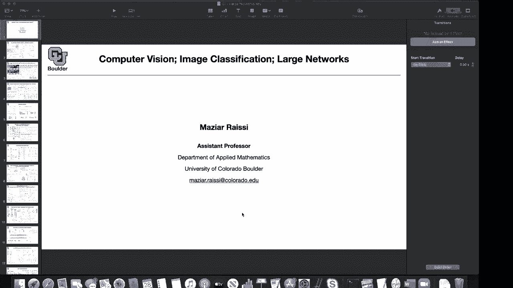
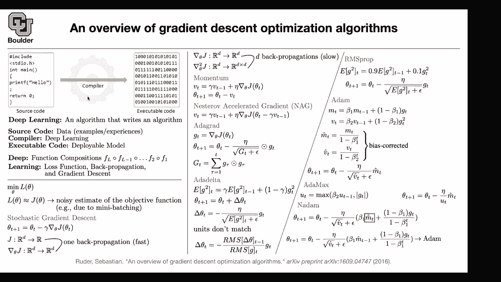

# 【双语字幕+资料下载】科罗拉多 APPLY-DL ｜ 应用深度学习-全知识点覆盖(2021最新·完整版） - P3：L2.1- 梯度下降算法 [续] - ShowMeAI - BV1Dg411F71G

so，last time we talked a little bit about，deep learning，then we talked about stochastic gradient。

descent，we mentioned that we cannot use second，order methods because，it's slow to compute。

basically to back propagate d times，through deep neural networks because，that's not cheap。

that's why we have to live with，then we talked a little bit about，momentum。

then we said how can we accelerate，momentum，then we said the learning rates could be，adaptive。

and there is a way of making them，adaptive by looking at the gradient。

the past summation over the gradients，and that was at a grad and the problem，with adegrad was that。

it keeps growing we keep adding more and，more terms，that are positive that's why。

towards the end of the training the，algorithm is going to stop prematurely。

before it reaches the actual minimum，how about we take an average of the most，recent history。

the average you could store the，gradients，for let's say a window of。

size i don't know 10 10 past gradients，there is a smarter way of doing that。

because that one you have to store huge，numbers，and you have to store i don't know 50 of。

them or 10 of them，to compute your averages a better way is，to，store only one number or one set of。

numbers a vector and keep updating that，it's called exponential moving average。

and we are keeping a moving average this，is just a notation，of the expected value or the mean at。

which is perhaps 90 percent of，that you're computing in this iteration，using your mini batch。

there are two cool things that are，happening，the gradients are gonna be noisy this is。

gonna help you denoise your gradients，and at the same time it's gonna help you。

make your learning rate adaptive，and we said now we can just define delta，t。

and explain everything in terms of delta，t，even add a grad we could have written it。

in terms of delta t delta t is equal to，negative eta divided by square root of，gt plus。

epsilon so now you can write your，algorithms in terms of delta t，to save some notation。

one option you could use that and that's，a perfectly valid way of。

taking steps in the direction of your，average gradients，or gradients but there is a problem here。

the dimension or the units of，delta theta t，let's say theta t is in terms of meters。

delta theta t is going to be in terms of，meters per second，the gradient is going to be meters per。

second，the square root of the averages that，you're doing is going to be meters per，second。

if you divide meters by per second by，meters per second，the dimension of the left side and the。

right side，don't match they don't have the same，units one of them is a unit。

but as the algorithm adapts，it's learning great it's going to keep。

changing its learning rate and finding，now since the units don't match。

the people who wrote the paper of other，delta，they said we can keep。

a running average of delta t as well，from the previous iteration the current。

delta t you don't know it，but the previous one you know，and you can have a running average of。

delta t minus one the same way that you，have a running average here。

you can have a running average of delta，t's here you have a running average of，your gradients。

but you can also have a running average，of your，and another thing to note is that this，is just。

square root of the mean of the gradient，squares，so it's just root mean square。

the same way you have you can have root，mean，squares of your delta t's。

but at previous times this is just an，estimate，for delta t this way you can actually，get rid of your。

eta so the cool thing about add a delta，is that you don't even need to specify，your。

learning rate so that's an，advantage so it was around the same time。

that jeffrey hinton the father of，modern deep learning，was advocating for a similar method。

for optimizing for training neural，networks，but he never got to publish it he just，put a video。

online on coursera and now the video is，on youtube and you're more than welcome，to watch that video。

so jeffrey intern is really good at，explaining things，much better than what i'm doing here。

and he was calling the algorithm rms，prop，prop is for proportion and rms is root。

as you can see it's very similar you，just have a running average，now these are the numbers that you。

choose and this is actually a good，number to choose from，0。9 90 percent of your。

previous gradients is actually a good，if you look at it it's very similar to，other delta。

but without taking their，running average of their leds，so these are a couple of adaptive。

methods that were，introduced before adam，looks like rms prop is just，at a delta with 0。9 filled in。

for gamma that's one change actually for，gamma you can put it to be 0。9。

and actually in other delta you put it，to be 0。9，the other change is，eta for。

the delta eta is just a root mean，squared error，so for other delta you don't have to。

specify your eta but，here for rms prop you have to specify it，you got it okay。

but you're right these two methods are，very similar and the idea is，generalizing at a grad and。

taking care of the problems with，adequate perfect，and now let's continue then people said。

the same way，that you are keeping a running average，you can keep a running average of your，gradients。

and that's going to give you some，basically these are momentum less at a，grad at a delta。

and rms prop there is no momentum，they just have adaptive learning rates。

adam is going to introduce momentum as，so you take a running average，of your gradients。

and another running average of your，gradient squares，these are the hyper parameters that you。

i think one of them is 0。99 the other，one is 0。999，so very numbers that are really close to。

one advantage is that now your gradients，are going to become noiseless。

you are taking variance away from your，data，from your gradients，the other advantage is introducing。

momentum，and vt is gonna help you make things，adaptive the problem with mt and vt is。

that they are gonna start with zero，from zero so initially during training。

you're ignoring your gradients there is，because if this guy is zero then there。

is a huge bias these numbers are huge，they are close to one and you are，basically。

ignoring your gradients，when you start your training that's why，you have to。

take away your bias so this number 1，minus beta 1，to the power t，if t is uh huge。

towards the end of the training this is，a，number less than one to the power of a。

number that's big so that one is going，to go to zero，and towards the end of the training m t。

hat is just，empty same thing for vt，because beta2 is a number less than one。

so vt hat is just vt but initially，these numbers are gonna be close to one。

and they're gonna help you，so it's gonna unbias，so there is a bias towards zero you're。

unbiasing that，and once you do that the rest of it is，very similar to add a grad and add a。

delta and rms prop，instead of the gradients you just put，the moving average of your gradients。

and this term is to get rid of，is actually to make your method adaptive。

usually a good number for eta is 10 to，the power negative three。

but depending on the neural network that，you have you might change。

those options so in the same paper，in the same add-on paper this add-on，paper。

is a paper on archive and i want you to，check the number of citations，that it's getting because。

many people are using it，that's the first method of choice for，optimizing deep neural networks。

currently the same paper introduced at，the max，this is，you can put the l infinity norm。

so this term ut is very similar to，then you have whatever that's left from，before。

and you're taking the max of whatever，that you had previously，now。

then the rest of it is similar to what，you had here，the cool thing is that now we don't have。

because you're always having a number，that's bigger than zero，either this number is bigger than zero。

or this number is bigger than zero，and you're taking the maximum of the two。

so you don't need to add the epsilon，here，let's be clear so beta 2 ut minus 1 is a，vector。

so is this point wise maximization，or alpha yes so this is，a vector ut minus one，you take。

the the maximum and the position of，either and the maximum the i plus first，position and so on。

exactly so in the first position of the，outcome，you're gonna put the maximum of these，two terms。

of that entry then the second entry you，take the maximum，that's gonna give you the second and。

whenever you have your activation，function that's going to，act point wise so most of your。

so your default thought should be that，it's point wise，it's element wise unless。

the paper or the method or the code，so the idea of madame is，n stands for nestrof。

the thing is that you want to introduce，nest trough，ideas and the idea of looking forward。

before making，so adam is like momentum，nest trove you need to find a way to，introduce looking ahead。

is this way so as you can see，up until this point you have eta square，root of vt。

plus epsilon but now this term is trying，to look ahead，so if you write down the math and if you。

take a look at the paper，you see the exact details of what is，going on here。

but the idea is you want to take a look，and then take a step so there is a，question from jacob。

how important is our choice of gradient，descent，algorithms for instance we'll add a max。

give substantially different results，why am i introducing all of these，methods to you。

because first whenever you read a paper，that，why is there another consensus of。

which method to use is because deep，learning，deep neural networks are totally。

different from each other，one of them are some of them are rnn，some of them are，[Music]。

convolutional neural networks some of，them are fully connected，and each one is going to behave。

python frameworks that you're gonna deal，with for instance in tensorflow you have。

all of these options that you can choose，from，or in pytorch you can choose from one of，these。

so there is no consensus on which one is，going to work better，than the other one。

and the answer is yes sometimes at the，max behaves totally different。

from rms prop are there any excellent，accelerated stochastic methods，so yes this nadam and adam。

that you see they are accelerated，why because you have a momentum there。

but if but if by accelerated you mean，unless you find some efficient way of，doing back propagation。

yes so these are momentum，the first summation the first running，average。

in adam is going to give you the，momentum the second one is for，making your learning rates adaptive。

the cool thing about adam is that this，eta that you choose is the maximum step。

that your algorithm is going to take so，it's not going to overshoot。

beyond eta and all of these methods are，stochastic because of。

the batching the mini batching that you，were talking about at the。

start with stochastic gradient descent，yes all of them are stochastic。

so it's a stochastic momentum a，stochastic nestor of a stochastic，delta。

and so on all of them are stochastic，so yeah if you compare nadam to adam。

this is what you get the only difference，is that in adam you are putting mt hat。

here in adam it's mt minus one，so the formula here is just a，empty hat inside your term here and。

that's what you get down here，so the only difference between adam and，nada。

is that you're looking ahead before，making a decision，will we cover examples of when it is。

appropriate to use each algorithm，yes so，[Music]，gradient decent optimization algorithms。

out of our way and the rest of the，course is going to be，basically examples and it's going to be。

application oriented as the title of the，course says，so it's applied deep learning but i had。

to introduce these methods，because you're gonna see them in papers，you're gonna read。

about them in papers and i want you to，and it's gonna give you a big picture of，what algorithms。

what is the underlying algorithm and，there is a he，this field is a huge field if you want。

to do research，and as you can see it's very fundamental，it's the compiler of deep learning。

that's the only place that you're，actually designing an algorithm。

and the algorithmic way of thinking of，an applied mathematician or a。

statistician is going to be helpful here，the rest of it is。

deep learning writing and algorithms，itself，basically data is going to write。

